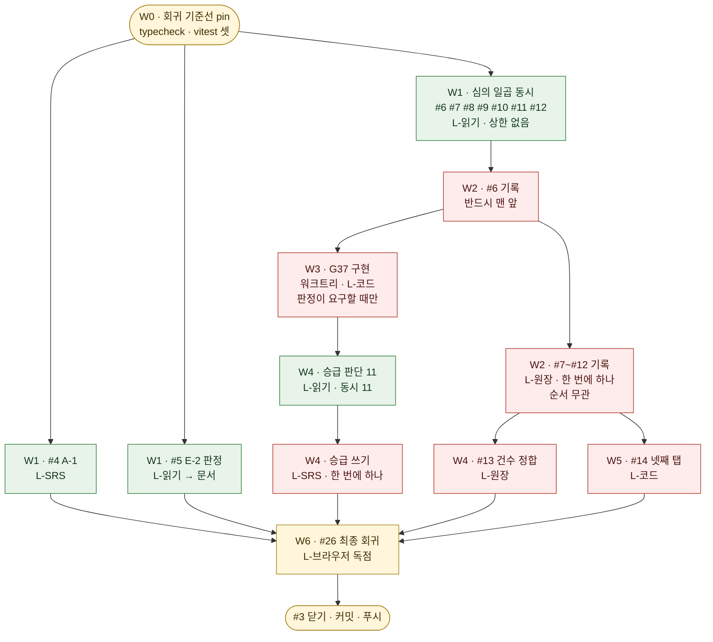

# 이슈 #3 완주 오케스트레이션 계획

> 작성 2026-09-02 · 대상 `github.com/ice3x2/DocuLight` 이슈 **#3 「2.0 Phase 1」** 과 그 하위 스물셋(#4~#26)
> 이 문서는 **무엇을 하는가**가 아니라 **무엇을 무엇과 동시에 할 수 있는가**를 정한다. 각 이슈가 도달해야 할 상태는 그 이슈 본문에 있고 여기서 되풀이하지 않는다.

## 0. 이 문서가 답하는 것

에픽 #3 §3~§5 가 **작업 사이의 선후**를 이미 정했다. 이 문서가 더하는 것은 그 위에서 **실행기가 실제로 무엇을 몇 개나 동시에 띄울 수 있는가**이다. 둘은 다르다 — 선후가 없어도 같은 자원을 다투면 동시에 돌 수 없고, 반대로 선후가 있어도 자원이 갈리면 앞 작업의 *일부*와 뒤 작업의 *일부*가 겹칠 수 있다.

## 1. 실행 자원 — 무엇이 동시 실행을 막는가

에픽 §4 가 직렬화 자원 다섯을 셌다. 오케스트레이션 관점에서 그것을 **레인(lane)** 으로 다시 그리면 이렇게 된다. 한 레인 안은 직렬이고, 레인끼리는 병렬이다.

| 레인 | 배타 자원 | 동시 실행 상한 | 이 레인에 드는 작업 |
|---|---|---|---|
| **L-원장** | `docs/spec/00.decision-log.md` 단일 파일 | **1** | 판정 기록 #6~#12 · 건수 정합 #13 |
| **L-SRS** | SpecKiwi MCP 의 SRS 변경 락 | **1** | #4 의 Implementation Notes · 승급 쓰기 #15~#25 |
| **L-코드** | 소스 트리 (뮤테이션 탐침이 일시 독점) | **1** | `G37` 구현(#6 조건부) · `AclAuditPanel`(#14 조건부) |
| **L-브라우저** | 포트 3399·3400 과 로그인 15분 10회 예산 | **1** | 최종 회귀 게이트 #26 |
| **L-읽기** | 없음 | **제한 없음** | 판정 심의 · 승급 판단 · 사실 확인 · 검증 |

**L-읽기가 이 계획의 지렛대다.** 스물셋 가운데 실제로 배타 자원을 쓰는 것은 *쓰는 순간* 뿐이고, 그 앞의 심의·판단·대조는 전부 읽기다. 판정 열넷을 하나씩 심의하면 위원회 열넷을 차례로 기다리지만, 심의를 전부 L-읽기에 몰고 결론만 L-원장에 줄 세우면 기다림이 한 번으로 준다.

### 1.1 워크트리를 어디에 두는가 — 그리고 어디에 두지 않는가

**워크트리는 L-코드 레인에만 할당한다.** SRS·원장 작업은 메인 저장소(`C:\Work\git\DocuLight2.0`)에서 한다.

근거는 SpecKiwi 서버의 root 해석이다. MCP 서버는 자기 **프로세스의 작업 디렉터리**에서 root 를 잡고 그 자리의 `docs/spec/` 만 읽고 쓴다(`mcp_workspace_info` 의 `rootSource` 가 `server-cwd-discovery` 로 그것을 확인해 준다). 서브에이전트를 워크트리에서 돌려도 그 서브에이전트가 부르는 MCP 는 여전히 메인 저장소를 고친다. 그러면 **코드는 워크트리에 있고 요구는 메인에 있는** 상태가 되어, 두 곳의 이력이 갈린 채 어느 쪽도 온전하지 않게 된다.

그래서 이렇게 나눈다.

- **워크트리 `.wt/code`** — `G37` 구현과 `AclAuditPanel` 구현. 순수 코드·시험 변경만 담고 `docs/spec/` 을 건드리지 않는다. 끝나면 메인 브랜치로 병합한다.
- **메인 저장소** — SRS 변경(MCP 경유) · 원장 편집 · 문서 정합. 이것들은 애초에 직렬이므로 격리가 주는 이득이 없다.

읽기 전용 서브에이전트는 어느 쪽에서 돌아도 무방하므로 메인에서 돌린다 — 워크트리를 만드는 비용(디스크·설정)이 격리 이득보다 크다.

### 1.2 kiwi 파이프라인을 어디에 적용하는가

사용자가 지시한 순서 `/kiwi-srs` → `/kiwi-srs-feasibility` → `/kiwi-planner` → `/kiwi-pm` → `/kiwi-review-fix-loop` 는 **새 요구를 저작해 코드로 옮기는 사이클**이다. 이번 에픽의 스물셋 가운데 그 사이클에 해당하는 것은 **코드 변경이 실제로 발생하는 둘**뿐이다.

| 작업 유형 | 해당 이슈 | 적용 |
|---|---|---|
| 코드 변경 | #6 의 `G37` 구현(판정이 요구할 때) · #14 의 넷째 탭(판정이 구현으로 갈릴 때) | **kiwi 사이클 전체를 돈다.** 다만 요구가 이미 서 있으므로 `/kiwi-srs` 는 요구 저작이 아니라 **개정 필요 여부 판정**으로 진입한다 |
| 요구 상태 변경 | #4 · #15~#25 | `/kiwi-planner`·`/kiwi-pm` 는 **요구를 Task 로 분해하는** 스킬이라 상태 전이에는 대상이 없다. 전용 서브에이전트가 AC 를 대조하고 MCP 로 승급하며, **`/kiwi-review-fix-loop` 로 그 결과를 검증**한다 |
| 문서 판정 | #5 · #7~#13 | 같음. 심의 서브에이전트 → 기록 → 독립 검증 |

**모든 유형이 `/kiwi-review-fix-loop` 로 끝난다.** 그것이 사용자가 지정한 순서의 마지막이고, 검증을 별도 서브에이전트에 맡기라는 규약(`CLAUDE.md` §5)과도 같은 방향이다.

## 2. Wave 분해



**W3 의 `G37` 구현이 W4 승급 앞에 서는 이유**는 뮤테이션 탐침이 `packages/server` 소스를 일시적으로 망가뜨리기 때문이다. 그 사이에 STORAGE·AUDIT·AUTH scope 의 승급 판단이 같은 패키지의 vitest 를 돌리면, 나온 실패가 누구 것인지 갈리지 않는다.

**W4 안에서 승급 판단 열하나는 동시에 돈다.** 각 scope 의 AC 와 증거는 그 scope 안에서 닫히므로 서로의 결론을 입력으로 쓰지 않는다. 다만 `update_status` 호출만은 L-SRS 를 지나므로 판단이 끝난 것부터 차례로 쓴다 — 열하나가 모두 끝나기를 기다리지 않는다.

**#13 과 #14 가 W4 와 겹치는 이유**는 레인이 다르기 때문이다. #13 은 원장(L-원장)이고 승급은 SRS(L-SRS)이며, 원장은 SpecKiwi 가 관리하는 요구 파일이 아니라 직접 편집 대상이다.

## 3. Wave 별 진입·종료 조건

| Wave | 진입 조건 | 종료 조건 (이것이 참이면 다음 Wave) |
|---|---|---|
| **W0** | 없음 | `npm run typecheck` 오류 수와 세 패키지 vitest 실패 목록이 `.orch/baseline.txt` 에 기록됐다 |
| **W1** | W0 종료 | 심의 일곱이 각각 결론 초안과 근거를 반환했다 · #4 의 Implementation Notes 가 갱신됐다 · #5 의 판정이 저장소에 기록됐다 |
| **W2** | #6 심의 종료 | 원장 `G37`·`G33`·`G32`·`G15`·`G16`·`G14`·`G23`·`G29`·`G39`·`G40`·`G30`·`G34`·`G35`·`G36` 각 행에 판정 문단이 섰다 |
| **W3** | #6 기록 종료 | `G37` 판정이 코드를 요구하지 않으면 **즉시 종료**. 요구하면 red → green → 뮤테이션 탐침 → `cd packages/server && npx vitest run` 전건 통과 |
| **W4** | W3 종료 | 승급 가능한 요구가 전부 `verified` 이고, 승급하지 못한 것은 사유가 Implementation Notes 에 적혔다 · 원장 9행 건수가 §3.2 표와 맞다 |
| **W5** | #9 기록 종료 | `G15` 가 구현이면 탭이 서고 시험이 그것을 재며, 이관이면 `AclAuditPanel.tsx:20` 주석이 이관을 가리킨다 |
| **W6** | W1~W5 전부 종료 | typecheck 0 · vitest 셋 전건 · 브라우저 열다섯 전건 |

## 4. 서브에이전트 배치

| 역할 | 수 | 레인 | 입력에 넣지 않는 것 |
|---|---|---|---|
| 심의자 | 7 (동시) | L-읽기 | 다른 심의자의 결론 — 서로의 판단을 입력으로 쓰면 독립성이 사라진다 |
| 기록자 | 1 (직렬) | L-원장 | — |
| 승급 판단자 | 11 (동시) | L-읽기 | 오케스트레이터의 기대치. 「이 scope 는 전건 승급될 것」 같은 문장을 주면 그 방향으로 대조가 기운다 |
| 구현자 | 1 | L-코드 (워크트리) | — |
| 검증자 | 회차마다 독립 | L-읽기 | **구현자·기록자의 정당화 텍스트.** 원본 요구와 diff 와 사실 데이터만 준다 (`CLAUDE.md` §5) |

## 5. 검증 규약

각 Wave 가 끝나면 **그 Wave 를 수행하지 않은 서브에이전트**가 결과를 검증한다. 검증자가 계획·결정·설계와 다른 점을 찾으면 **또 다른 독립 서브에이전트**가 고친다 — 검증자가 직접 고치면 자기가 지적한 것을 자기가 판정하게 된다.

검증에 쓰는 분모는 **바깥에서 고정한다**. 승급이면 `list_requirements` 가 반환한 AC 집합이고, 판정이면 그 이슈 본문이 적은 갈래의 수다. 검증자가 스스로 「이 정도면 됐다」고 정하는 순간 분모가 결론을 따라 움직인다.

## 6. 멈추고 물어야 하는 것

에픽 §7 이 셋을 든다. 그 밖의 게이트는 권장안을 골라 진행하고 기록만 남긴다(`CLAUDE.md` 「Gate decisions」).

1. 저장소 밖으로 나가는 되돌리기 어려운 동작 — 1.0 브랜치 편집 · 외부 서비스 정지 · force-push
2. 기존 시험을 약화하거나 지워서 게이트를 통과하는 것 · 기존 public 계약을 깨는 것
3. 저장소에 없는 사실 — 수용 기준 1 의 실제 볼트 경로와 수용 기준 7 의 한글 IME 수동 체크리스트

## 7. 보고

이슈 하나가 닫힐 때마다 텔레그램으로 `#3 (23/n)` 을 제목으로 보고한다. 본문은 무엇이 닫혔고 무엇이 남았는지 두 줄이면 족하다.

## 8. 실행 중 내린 결정

### 8.1 승급 판단을 W1 로 앞당겼다 (2026-09-02)

에픽 §5 는 승급 열하나의 선행을 「C 축 판정 완료」로 두었다. 그 근거는 §4 다섯째 자원 — **뮤테이션 탐침이 소스 트리를 일시 독점**하므로 `G37` 구현이 도는 동안 같은 패키지의 vitest 를 쓰는 승급 판단이 함께 돌 수 없다는 것이다.

**그 제약은 판단자가 시험을 돌릴 때만 성립한다.** W0 이 이미 전 패키지 전건 통과를 확정했으므로(typecheck 0 · server 1385 · web 620 · editor 253+1skip), 판단자가 확인할 것은 「시험이 통과하는가」가 아니라 **「증거가 가리키는 시험이 실제로 존재하는가」**로 좁아진다. 그것은 `grep` 이고 읽기다.

그래서 판단자 열하나에게 **시험 실행을 금지**하고 W1 에 함께 띄웠다. 소스 트리를 아무도 잡지 않으므로 `G37` 구현과 시간이 겹쳐도 무방하다.

**승급 쓰기는 여전히 W4 다.** 판단이 앞당겨진 것이지 쓰기가 앞당겨진 것이 아니며, `G33` 판정이 「PAT 도 무효화한다」로 나오면 AUTH scope 의 일부 증거가 바뀌므로 쓰기는 그 판정 뒤에 서야 한다.

### 8.2 기준선에 간헐 실패가 하나 있다

`packages/server` vitest 첫 실행에서 1건이 실패하고 재실행 두 번은 1385 전건이 통과했다. 실패한 시험의 이름은 잡지 못했다 — `tail` 로만 기록해 유실됐다.

**이것은 #26 의 위험이다.** 최종 게이트가 「전건 통과」를 요구하는데 간헐 실패는 그 판정을 흔든다. #26 을 돌릴 때 재현되면 그 자리에서 특정하고, 새 이슈로 세워 이 에픽에 함께 묶는다.

### 8.3 워크트리는 만들었으나 아직 쓰지 않는다

`.wt/code` (브랜치 `orch/code`) 를 세웠다. `G37` 판정과 `G15` 판정이 코드를 요구할 때 쓴다. 두 판정이 모두 「불필요」로 나오면 쓰지 않고 정리한다.

### 8.4 `FR-PRINCIPAL-001` 중복 정의 의심은 실측으로 풀렸다 (2026-09-02)

`FR-PRINCIPAL-001` 이 두 파일에서 잡혀 중복 정의가 의심됐으나 **중복이 아니다.**

- 요구를 세우는 헤딩(`### FR-PRINCIPAL-001`)은 `docs/spec/16.principal.srs.md:232` **하나뿐**이다.
- `docs/spec/09.auth.srs.md:1059` 는 `SEC-AUTH-010` 의 `Verification Evidence` 표에서 VE-3 의 비고 칸이 *"FR-PRINCIPAL-001 이 그 화면을 세우면 이 시험이 먼저 깨진다"* 로 **언급만 한 자리**이며 요구를 정의하지 않는다.
- `mcp__speckiwi__validate_spec` 이 중복 Requirement ID 진단(`SRS-E002`)을 **0건**으로 낸다. 같은 실행의 유일한 진단은 알려진 예외인 `SRS-W072` 경고 1건이다.

**적어 두는 이유** — `grep FR-PRINCIPAL-001 docs/spec/*.srs.md` 는 앞으로도 두 파일을 계속 낸다. 그 결과만 보면 같은 의심이 다시 서므로, 정의와 언급을 가르는 질의를 함께 남긴다. 이 질의는 위의 한 줄만 낸다.

```
grep -n "^### FR-PRINCIPAL-001" docs/spec/*.srs.md
```

### 8.5 워크트리를 점으로 시작하는 이름에 두면 시험 하나가 깨진다 (2026-09-02 실측)

코드 레인을 `.wt/code` 에 두었더니 `packages/server/test/http/install-assembly.test.ts` 의
「AC-1: 설치 화면 경로가 셸을 준다」가 **그 워크트리에서만 결정적으로 실패**했다.

원인은 `res.sendFile` 이 쓰는 `send` 의 기본값 **`dotfiles: 'ignore'`** 다. 그것이 경로의
`.wt` 구간을 점으로 시작하는 이름으로 보고 404 를 낸다. 같은 파일을 점 없는 자리에
복사하면 200 이고, 메인 저장소에서는 나지 않는다.

**시험의 결함도 코드의 결함도 아니고 워크트리 이름을 고른 판단의 결과다.** 병합하면
해소되지만, 그동안 그 워크트리에서 도는 모든 회귀가 실패 하나를 안고 돌아 「전건 통과」를
판정 근거로 쓸 수 없었다.

**다음에 워크트리를 만들 때는 점으로 시작하지 않는 이름을 쓴다.** `.gitignore` 등재는
`wt/` 로도 똑같이 되므로 점을 붙일 이유가 없었다.

### 8.6 같은 워크트리에 두 작업을 넣어 한쪽이 다른 쪽의 측정을 오염시켰다 (2026-09-02 실측)

간헐 실패를 고치던 회차 하나가 **고친 코드가 아니라 낡은 코드를 실행했다.** 실패
메시지에 실린 `999` 는 다른 에이전트가 대조 실험에 쓰고 되돌린 표식이었고, 소요도
고치기 전 형태만 낼 수 있는 값이었다. **실행 직전·직후의 디스크는 올바른 상태였다.**

**처음에 이 문서는 원인을 「부모의 변환 캐시 공유」로 적었다. 그것은 틀렸다.**
검증자가 두 가지를 실측해 반증했다.

- `vitest` **모듈**은 부모의 `node_modules` 에서 풀리지만 **캐시는 vite 프로젝트 루트
  기준**이라 워크트리 안에 격리된다. 워크트리 것만 지우자 워크트리에 다시 생기고
  부모는 불변이었다.
- 그 캐시에 든 것은 `results.json` 하나이고 **코드가 아니다.** vitest 4 는 변환
  산출물을 디스크에 두지 않으므로 「캐시에 남은 낡은 코드」라는 기제 자체가 성립하지
  않는다.

**진짜 원인은 같은 워크트리를 두 작업이 함께 쓴 것이다.** 검증자가 대조 실험을 하느라
약 95초 동안 시험 파일을 고치기 전 판으로 바꿔 두었고, **그 창에 시작된 다른 에이전트의
실행이 디스크에서 곧장 그 낡은 코드를 읽었다.** 창이 좁고 앞뒤로 복원돼 있어서
「실행 직전·직후의 디스크는 올바랐다」는 관측과도 맞는다.

**그것을 만든 것은 이 오케스트레이션의 판단이다** — `#28` 과 `#30` 을 한 워크트리에
넣었고, 그 위에서 검증까지 돌렸다. 뮤테이션 탐침은 **소스를 일시적으로 망가뜨리는
절차**이므로 그런 작업이 도는 트리에서는 다른 측정이 성립하지 않는다.

**다음에는 뮤테이션 탐침을 쓰는 작업 하나에 워크트리 하나를 준다.** 캐시를 나누는
것으로는 풀리지 않는다 — 문제는 캐시가 아니라 **디스크의 파일 자체**였다.

### 8.7 상대 경로로 읽으면 다른 레인의 워크트리를 읽는다 (2026-09-02)

이 저장소는 워크트리 셋(`.` · `wt/auth` · `wt/code`)을 함께 쓰는데, **에이전트 셸의
작업 디렉터리가 도구 호출 사이에 초기화된다.** 그래서 상대 경로로 `docs/spec/...` 를
읽으면 **의도한 곳이 아닌 레인을 읽을 수 있다.**

`cd` 한 결과가 다음 호출까지 남지 않는 것이 원인이고, 그 사실 자체는 이 환경의
정상 동작이다. 문제는 워크트리를 여럿 두었을 때만 드러난다 — 하나뿐이면 어느
경로로 읽어도 같은 파일이기 때문이다.

**서브에이전트에게 경로를 줄 때 절대 경로로 준다.** 그리고 서브에이전트에게도
절대 경로로 읽으라고 명시한다. 이 회차에는 그 지시를 넣은 프롬프트와 넣지 않은
프롬프트가 섞여 있었다.

## 9. 진행 기록

실행 중 갱신한다. 각 행은 그 이슈가 **닫힌** 시점에 선다.

| 이슈 | 상태 | 닫은 근거 |
|---|---|---|
| (착수 전) | | |
