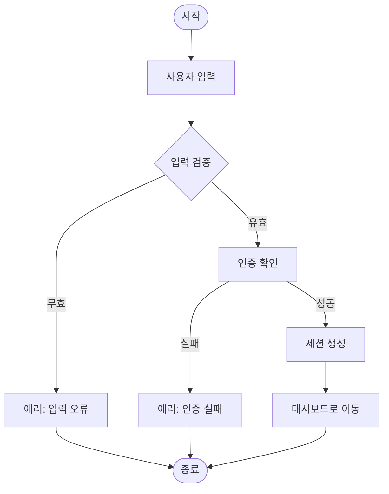
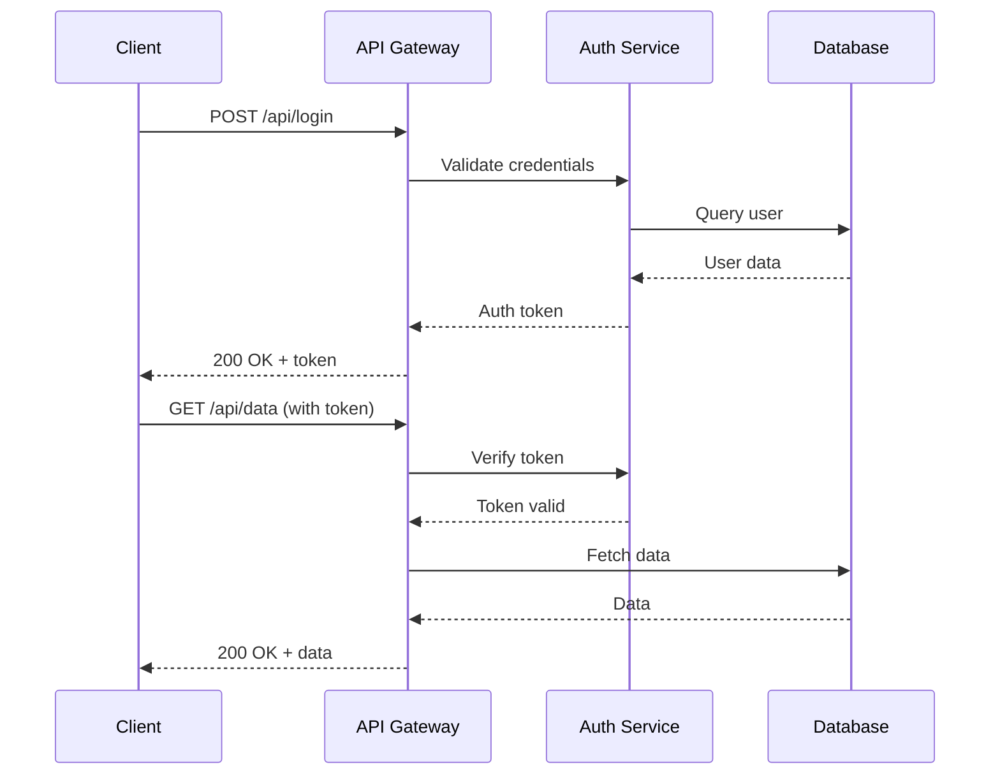
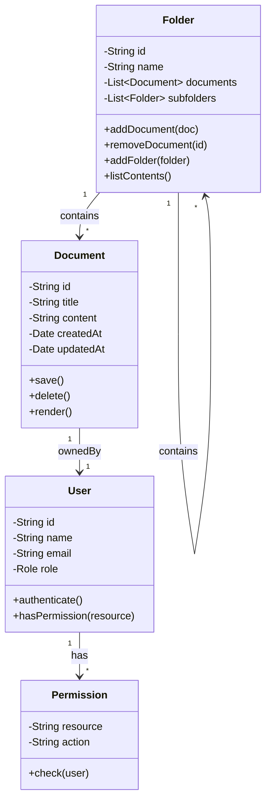
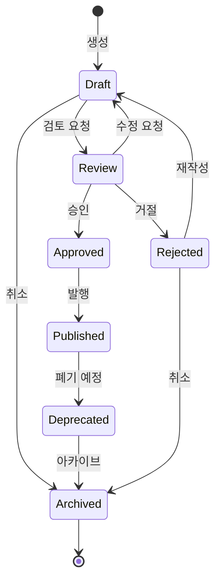
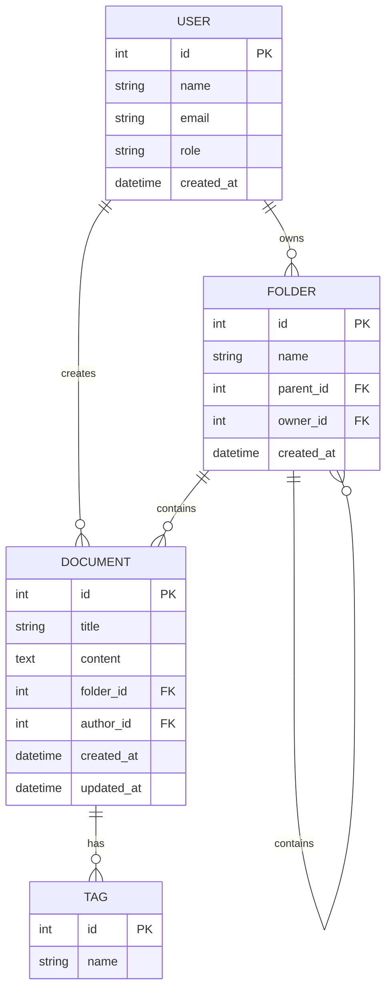
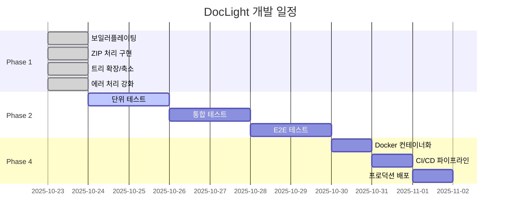
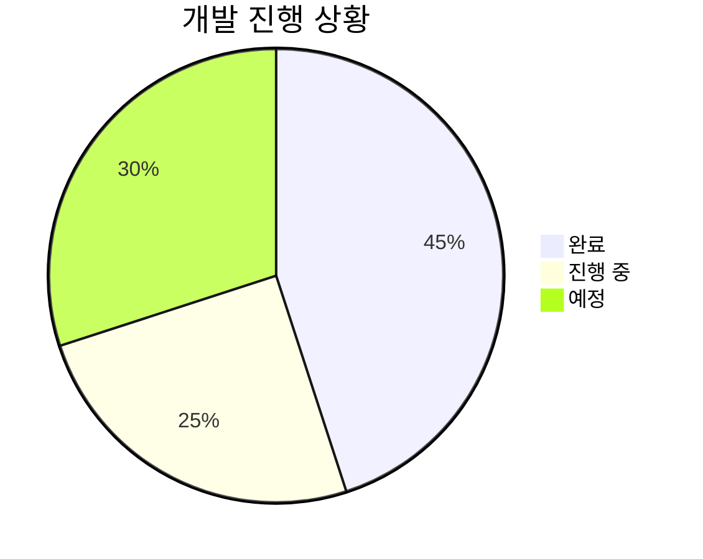
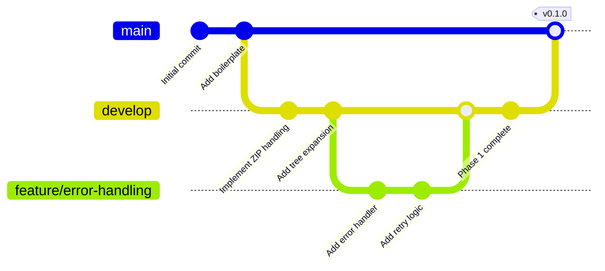
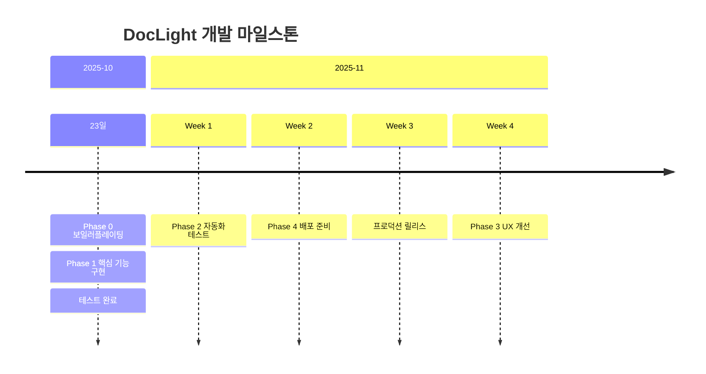

# Mermaid Diagrams

Mermaid를 이용한 다양한 다이어그램 예제입니다.

## 플로우차트 (Flowchart)

사용자 로그인 프로세스:

## 시퀀스 다이어그램 (Sequence Diagram)

API 호출 흐름:

## 클래스 다이어그램 (Class Diagram)

문서 관리 시스템:

## 상태 다이어그램 (State Diagram)

문서 라이프사이클:

## ER 다이어그램 (Entity Relationship)

데이터베이스 스키마:

## 간트 차트 (Gantt Chart)

프로젝트 일정:

## 파이 차트 (Pie Chart)

프로젝트 진행률:

## Git 그래프 (Git Graph)

브랜치 전략:

## 타임라인 (Timeline)

