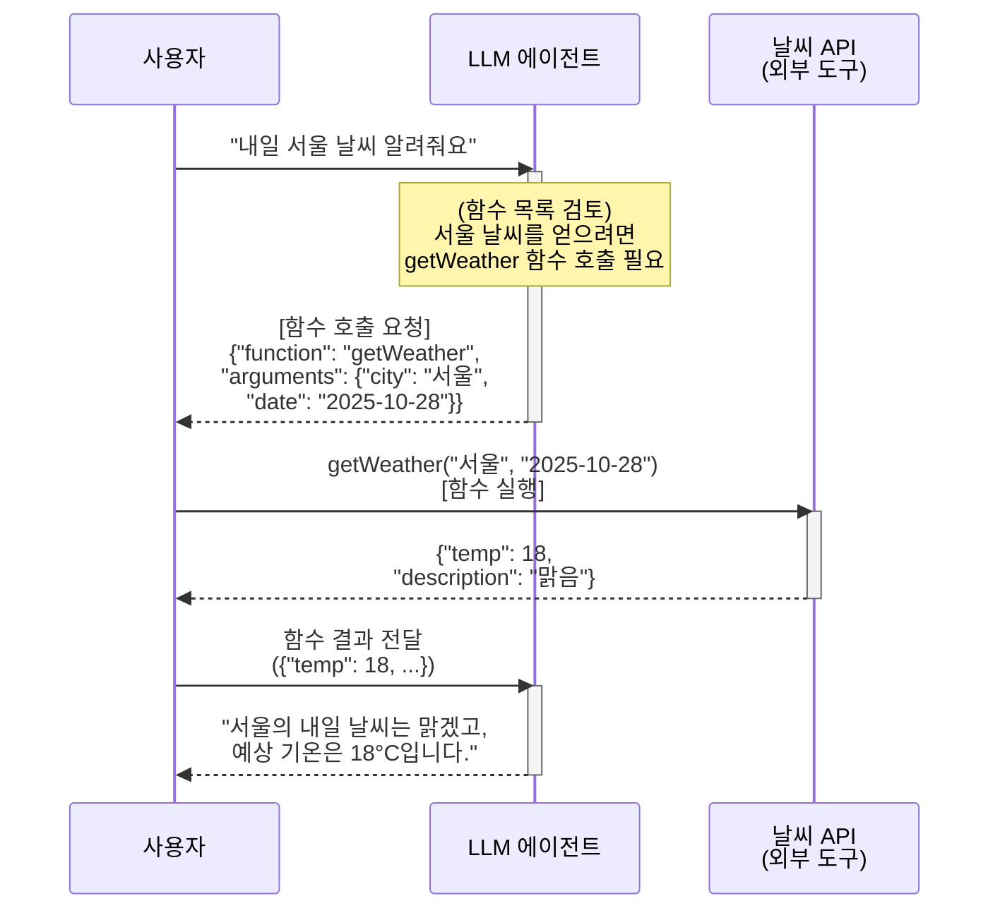
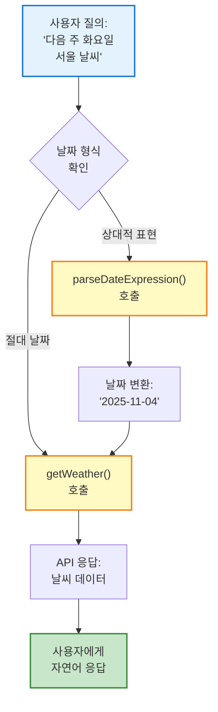
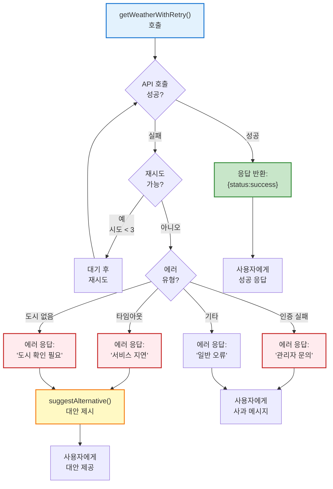

## 목표와 개요

프롬프트 엔지니어링의 첫 걸음은 **프롬프트 구조**를 정확히 이해하고, 필요한 경우 모델이 **외부 도구(함수)**를 호출하게 하는 방법을 익히는 것입니다. 이번 강의에서는 프롬프트를 구성하는 핵심 요소(지시문, 컨텍스트, 제약, 출력 형식 지침)를 살펴보고, OpenAI의 **Function Calling** 기능 등 **모델 도구 호출** 개념을 소개합니다. 이를 통해 단순 질의응답을 넘어, **LangChain4j**와 같은 프레임워크에서 에이전트를 구축하고 실무에 적용할 수 있는 기반을 다지겠습니다.

예를 들어, 여러분이 **날씨 정보를 제공하는 챗봇 에이전트**를 만든다고 가정해 봅시다. 이 에이전트는 사용자의 질문을 받고, 필요하면 실시간 날씨 API를 호출해 답변해야 합니다. 어떻게 하면 모델이 그런 **동작**을 하도록 프롬프트를 구성할 수 있을까요? 이번 장에서 그 해답을 찾게 될 것입니다.

---

## 1.1 프롬프트의 구성 요소

프롬프트는 단순한 문장이 아니라, 모델에게 **역할과 과제**를 정확히 전달하기 위한 **구조화된 입력**입니다. 일반적으로 프롬프트는 다음 요소들로 이루어집니다.

### 프롬프트 구조의 이론적 배경

프롬프트 엔지니어링은 자연어 처리(NLP) 연구에서 발전한 개념입니다. 대형 언어 모델(LLM)은 **트랜스포머 아키텍처**를 기반으로 하며, 입력 텍스트(프롬프트)의 구조와 내용에 따라 출력이 크게 달라집니다. 효과적인 프롬프트 설계는 다음 원리들을 기반으로 합니다:

**1. In-Context Learning (문맥 내 학습)**

- 모델은 프롬프트 내에서 제공된 예시와 패턴을 학습하여 유사한 작업을 수행할 수 있습니다.
- 추가 학습 없이도 프롬프트만으로 모델의 행동을 조정할 수 있는 강력한 특성입니다.

**2. Few-Shot Learning (소량 샘플 학습)**

- 몇 가지 예시만으로도 모델이 작업 패턴을 이해하고 일반화할 수 있습니다.
- 예: "Q: 서울의 수도는? A: 대한민국" 같은 예시를 2-3개 제공하면 모델이 형식을 따릅니다.

**3. Chain-of-Thought (사고 과정 연쇄)**

- 복잡한 추론 작업에서 중간 단계를 명시하면 정확도가 크게 향상됩니다.
- 예: "단계별로 생각해봅시다"라는 지시만으로도 수학 문제 해결 능력이 개선됩니다.

### 시스템 지시문 (System Instruction)

모델에게 부여하는 기본 **역할**이나 **규칙**을 정의합니다. 예를 들어 "당신은 전문가 AI 어시스턴트입니다. 모든 답변은 간결하고 정확하게 한국어로 작성하세요." 같은 문장이 시스템 지시문입니다. 이 지시문은 OpenAI API에서 `system` 메시지로 전달되며, 모델의 전반적 **태도와 어조**를 결정합니다. 또한 사용해서는 안 되는 금지어, 스타일 가이드 등 **전역 제약**도 시스템 지시문에 포함됩니다.

**시스템 지시문의 주요 역할:**

- **페르소나(Persona) 설정**: 모델이 수행할 역할 정의 (예: 전문가, 교사, 친구)
- **행동 규칙**: 응답 스타일, 길이, 형식에 대한 지침
- **제약 조건**: 금지 사항, 윤리적 가이드라인
- **도메인 전문성**: 특정 분야의 지식 활용 방법

### 컨텍스트 (Context)

모델이 현재 **참조해야 할 추가 정보나 대화 내역**입니다. 예를 들어, 이전 질의응답 역사, 사용자 프로필, 또는 외부 지식(문서 요약본 등)이 컨텍스트로 주어질 수 있습니다. 컨텍스트를 제공하면 모델이 그 정보를 기억하고 활용하여 더 정확하고 일관된 답변을 생성합니다.

**컨텍스트 윈도우와 토큰 관리:**

- 대부분의 LLM은 제한된 컨텍스트 윈도우를 가집니다.
- GPT-4의 경우 128K 토큰, Claude 3의 경우 200K 토큰까지 처리 가능합니다.
- 토큰은 대략 영어 단어 0.75개, 한글 음절 0.5개에 해당합니다.
- 컨텍스트가 너무 길면 **중요한 정보가 희석**되거나 **처리 비용이 증가**할 수 있습니다.

실무에서 **LangChain**류 프레임워크는 이 부분을 자동으로 관리해 주기도 합니다(예: 대화 메모리, 혹은 RAG에서 검색된 문서 등).

### 사용자 입력 (User Prompt)

사용자가 실제로 묻는 **질문**이나 **요청**입니다. 예컨대 "내일 서울 날씨 어때?"라는 질문이 여기에 해당합니다. 이 부분은 모델이 최종적으로 해결해야 할 **문제 진술**이며, 시스템 지시문이나 컨텍스트와 결합되어 모델의 **최종 입력**으로 들어갑니다.

**효과적인 사용자 프롬프트 작성 원칙:**

- **명확성**: 모호한 표현 대신 구체적인 요청
- **완결성**: 필요한 모든 정보 포함
- **구조화**: 복잡한 요청은 단계별로 분해

### 추가 제약 및 출력 형식 요구 (Constraints & Format)

경우에 따라 모델 응답에 대한 **추가 제약**이나 **형식 지정 요구사항**을 프롬프트에 명시합니다. 예를 들어 "답변은 JSON 형식으로 제공해 줘" 혹은 "세 가지 항목으로 목록을 만들어 답해 줘"와 같은 지시를 추가하는 것입니다.

이를 통해 모델 출력이 개발자가 처리하기 쉽게 **구조화**되거나, 사용자 기대에 맞는 **스타일**을 따르도록 유도할 수 있습니다. OpenAI API의 함수 호출 기능을 사용하지 않더라도, 이런 출력 형식 지시는 일반 프롬프트 내에 포함시켜 모델이 **형식을 준수하도록** 할 수 있습니다.

### 프롬프트 구성 예시

이러한 요소들은 꼭 순서대로 한 블록에 들어가는 것은 아니지만, **"시스템 지시문 → (컨텍스트) → 사용자 질문 → (추가 지시)"**의 형태로 조합됩니다. 프롬프트를 작성할 때는 **모델에게 필요한 모든 정보와 규칙을 맥락에 맞게 제공**하는 것이 중요합니다. 아래는 간단한 예시입니다.

> **시스템:** 당신은 날씨 정보를 알려주는 비서입니다. 사용자에게 정중하고 간결하게 답변하세요.  
> **사용자:** 내일 서울의 날씨가 어떨까?

위 프롬프트에서 시스템 지시문은 모델을 "날씨 비서"로 규정하고 어조를 설정하며, 사용자의 질문이 뒤따릅니다. 만약 여기서 "온도를 섭씨로 알려줘"나 "JSON으로 답변해줘" 같은 추가 요구가 있다면 사용자 질문에 포함하거나 별도 문장으로 명시하면 됩니다.

### 💡 실무 팁: 프롬프트 요소 분리하기

프롬프트 설계 시 혼동을 막기 위해, 지시문과 실제 질문을 **분리**하여 작성하는 습관을 들이세요. 예를 들어 LangChain4j에서도 **PromptTemplate** 등을 활용해 시스템 지시문과 사용자 입력을 템플릿에 채워넣을 수 있습니다. 이렇게 하면 프롬프트의 각 요소가 명확히 드러나고, 수정이나 재활용이 용이해집니다.

```java
// LangChain4j PromptTemplate 예시
String systemMessage = """
    당신은 {{role}}입니다.
    모든 답변은 {{language}}로 작성하세요.
    """;

PromptTemplate template = PromptTemplate.from(systemMessage);
Map<String, Object> variables = Map.of(
    "role", "전문 날씨 예보관",
    "language", "한국어"
);
String prompt = template.apply(variables).text();
```

---

## 1.2 모델 도구 호출 (Function Calling) 이해하기

대형 언어 모델(LLM)이 기본적으로 할 수 있는 것은 **텍스트 생성**입니다. 하지만 프롬프트를 적절히 구성하면 **모델이 외부 도구**(예: API 함수, 데이터베이스 질의, 계산기 등)를 **스스로 호출하도록 유도**할 수 있습니다. OpenAI의 **Function Calling** API가 대표적인 예인데, 이를 통해 모델이 답변 중간에 구조화된 함수를 호출할 수 있고, 그 결과를 활용하여 최종 답을 구성하게 할 수 있습니다.

### Function Calling의 기술적 배경

**Function Calling은 어떻게 작동하는가?**

1. **파인튜닝된 모델**: OpenAI GPT-3.5/4 모델은 함수 호출 패턴을 인식하도록 특별히 학습되었습니다.
2. **JSON Schema 이해**: 모델은 제공된 함수의 JSON Schema를 분석하여 적절한 파라미터를 추출할 수 있습니다.
3. **의도 분류**: 사용자 질의를 분석하여 어떤 함수를 호출해야 할지 자동으로 판단합니다.
4. **구조화된 출력**: 함수 이름과 파라미터를 JSON 형식으로 반환합니다.

모델의 도구 호출을 이해하기 위해, 앞서 든 **날씨 챗봇** 예제를 조금 확장해 보겠습니다. 사용자가 "내일 서울 날씨 알려줘"라고 물으면, 모델은 자신의 **지식 한계**로 인해 정확한 내일 날씨를 모릅니다. 하지만 우리가 **"getWeather"**라는 함수를 가르쳐주면(예: `getWeather(city, date)` 형태로, 도시와 날짜를 받아 날씨 정보를 반환하는 API 호출), 모델은 이 함수를 사용해야겠다고 **판단**할 수 있습니다.

### 1.2.1 함수 호출 프로세스

OpenAI API에서는 함수 목록과 각 함수의 **매개변수 JSON 스키마**를 시스템 메시지로 모델에 제공할 수 있습니다. 그러면 모델은 답변이 필요할 때 해당 함수를 **호출 요청**하는 형태로 응답하게 됩니다. 구체적인 흐름은 다음과 같습니다:



위 시퀀스 다이어그램은 OpenAI **함수 호출(Function Calling)** 기능을 활용한 에이전트의 동작 예시입니다. 요약하면:

1. **개발자**는 `getWeather`와 같은 함수의 **사양(Schema)**을 미리 정의하여 모델에 제공합니다(예: 함수 이름, 설명, 입력 파라미터들). 이는 시스템 메시지나 별도 인자로 모델에게 주어집니다.
    
2. **모델**은 사용자의 질문에 답하기 위해, 사전에 알려준 함수를 사용할지 말지를 **결정**합니다. 만약 사용자가 요청한 정보가 함수 사용을 요한다면, 모델은 답변 대신 위 예시처럼 **함수 호출에 필요한 JSON**을 응답으로 내놓습니다. 이때 함수 이름과 인자들이 포함됩니다.
    
3. **LangChain4j**와 같은 프레임워크를 사용하고 있다면, 이러한 모델의 "함수 호출 응답"을 자동으로 감지하여 해당 함수를 실행하는 로직을 넣을 수 있습니다. 또는 직접 API 호출 코드를 작성해서 `getWeather("서울", "2025-10-28")`을 실행합니다.
    
4. **외부 도구/함수**(여기선 날씨 API)가 실제 데이터를 반환하면, 이를 다시 모델에게 전달합니다. OpenAI API에서는 이 단계를 _함수 실행 결과_를 모델에게 피드백하는 `function` 메시지로 취급합니다.
    
5. **모델**은 함수 결과를 받아 최종 사용자에게 줄 답변을 완성하여 반환합니다. 이제 "내일 서울은 맑고 온도는 18°C" 같은 최종 응답이 사용자에게 전달됩니다.
    

이렇듯 **모델+도구** 체계가 만들어지면, LLM은 자체 지식으로 대답할 수 없는 질문도 **도구를 사용한 후** 답변할 수 있게 됩니다.

### 프레임워크와의 통합

LangChain4j를 포함한 여러 에이전트 개발 프레임워크들은 이러한 과정을 보다 쉽게 구현할 수 있게 해주는데, LangChain 표준에서는 `Tool`이라는 개념으로 함수(액션)을 추상화하고, `Agent`가 언제 어떤 Tool을 쓸지 결정하도록 합니다.

예컨대 LangChain(Python 버전)에서는 `chatModel.bind_tools([tool목록])` 형태로 LLM에 툴을 묶어서 사용합니다. **LangChain4j**도 유사하게 Java에서 함수 객체를 정의하고 agent에게 등록하는 방식을 제공합니다.

**LangChain4j 실무 코드 예시:**

```java
import dev.langchain4j.agent.tool.Tool;
import dev.langchain4j.memory.chat.MessageWindowChatMemory;
import dev.langchain4j.model.openai.OpenAiChatModel;
import dev.langchain4j.service.AiServices;

public class WeatherAgent {
    
    // 날씨 조회 도구 정의
    static class WeatherTools {
        @Tool("지정한 도시의 현재 날씨를 조회합니다. city는 도시명, date는 YYYY-MM-DD 형식입니다.")
        String getWeather(String city, String date) {
            // 실제로는 외부 API 호출
            // 여기서는 시뮬레이션
            return String.format(
                "{\"city\":\"%s\", \"date\":\"%s\", \"temp\":18, \"description\":\"맑음\"}",
                city, date
            );
        }
    }
    
    // AI 서비스 인터페이스
    interface WeatherAssistant {
        String chat(String userMessage);
    }
    
    public static void main(String[] args) {
        // OpenAI 모델 설정
        OpenAiChatModel model = OpenAiChatModel.builder()
            .apiKey(System.getenv("OPENAI_API_KEY"))
            .modelName("gpt-4")
            .temperature(0.7)
            .build();
        
        // 도구와 메모리를 포함한 에이전트 생성
        WeatherAssistant assistant = AiServices.builder(WeatherAssistant.class)
            .chatLanguageModel(model)
            .tools(new WeatherTools())
            .chatMemory(MessageWindowChatMemory.withMaxMessages(10))
            .build();
        
        // 사용자 질의
        String response = assistant.chat("내일 서울 날씨 알려줘");
        System.out.println(response);
        // 출력 예: "서울의 내일 날씨는 맑겠고, 예상 기온은 18°C입니다."
    }
}
```

n8n 같은 워크플로우 자동화 도구를 쓸 경우, LLM이 생성한 특정 **구조화 출력**을 트리거로 삼아 n8n의 다음 액션(예: DB 조회, 이메일 전송 등)을 수행하도록 연결할 수도 있습니다. 핵심은 모델이 **정해진 포맷**으로 의도를 표시하면, 우리의 애플리케이션이 그것을 해석해 실제 동작을 한다는 것입니다.

### 1.2.2 프롬프트에 함수 정의 포함하기

모델이 함수를 호출하도록 하려면, **프롬프트(혹은 호출 파라미터)**에 사전에 함수 정보를 제공해야 합니다. OpenAI API에서는 함수들의 목록(이름, 설명, 매개변수 스키마)을 API 호출 시 함께 보내는데, 시스템 메시지 차원에서 모델에게 "당신은 다음의 함수들을 사용할 수 있다"라고 알려주는 셈입니다.

이를테면 시스템 메시지에 다음과 같은 내용을 포함합니다:

```
사용 가능한 함수 목록:
1. getWeather(city: string, date: string) - 지정한 도시의 해당 날짜 날씨를 반환합니다.
   응답 형식: {"temp": number, "description": string}
   
모델 사용 방법: 함수가 필요하면, 함수 이름과 인수를 JSON으로 응답하세요.
```

이러한 지시와 함수 스펙을 보면, 모델은 "아, 나에게 쓸 수 있는 도구가 있구나"를 인지하고 적절한 상황에 그것을 활용하려고 합니다.

### 💡 실무 팁: 함수 설명 작성하기

**함수 설명을 충분히 직관적이고 구체적으로 작성**해야 모델이 언제 함수를 써야 할지 잘 판단합니다. 또한 함수 입력값의 제약이나 단위 등을 명시해두면 더 정확한 호출을 기대할 수 있습니다.

**좋은 함수 설명 예시:**

```json
{
  "name": "getWeather",
  "description": "실시간 날씨 정보를 조회합니다. 사용자가 특정 도시의 날씨를 물어보면 이 함수를 호출하세요. 과거 날씨는 조회할 수 없으며, 최대 7일 후까지만 예보를 제공합니다.",
  "parameters": {
    "type": "object",
    "properties": {
      "city": {
        "type": "string",
        "description": "도시 이름 (예: 서울, 부산, 제주)"
      },
      "date": {
        "type": "string",
        "description": "날짜 (YYYY-MM-DD 형식, 오늘부터 7일 이내)"
      }
    },
    "required": ["city", "date"]
  }
}
```

### 1.2.3 구조화된 출력과 함수 호출

도구를 활용하는 또 다른 이점은 **출력의 구조화**입니다. 예를 들어 응답을 JSON 형태로 돌려주도록 요구할 때, 단순히 "JSON으로 답해"라고 프롬프트에 쓰는 것보다, **함수 호출**을 통해 JSON 결과를 얻도록 하는 편이 모델이 형식을 정확히 지키는 경향이 있습니다.

사실 OpenAI 함수 호출 자체가 모델이 JSON 스키마에 맞게 인자를 내놓는 것이기 때문에, 결과적으로 **정해진 스키마를 만족하는 출력**을 확보하는 용도로 활용할 수도 있습니다.

**예시: 문서 요약 함수**

**"문서 요약 함수"**를 하나 정의하고, 매개변수로 `{"title": string, "summary": string}` 같은 스키마를 주면, 모델이 어떤 텍스트를 요약할 때 이 함수를 호출하도록 유도할 수 있습니다. 그러면 요약 결과가 `summary` 필드에 담긴 JSON으로 나올 테니, 파싱이 쉽겠지요. 이런 식으로 함수 호출 기능은 **LLM을 API화**해서 쓰는 강력한 수단이 됩니다.

### ⚠️ 주의사항: 모델 지원 범위

물론 모든 LLM이 함수 호출을 지원하는 것은 아닙니다. OpenAI의 GPT-4, GPT-3.5-turbo 등은 이 기능이 있지만, 다른 오픈소스 모델들은 기본 지원이 없어서 별도 프롬프트 기법(예: JSON format 지시 + Output Parser)이 필요할 수 있습니다. LangChain4j 같은 라이브러리는 이러한 차이를 추상화해주지만, **모델의 한계**는 항상 염두에 두고 프롬프트를 설계해야 합니다.

**주요 LLM의 함수 호출 지원 현황 (2025년 1월 기준):**

|모델|함수 호출 지원|비고|
|:-:|:-:|---|
|GPT-4 Turbo|✅ 지원|네이티브 Function Calling|
|GPT-3.5 Turbo|✅ 지원|네이티브 Function Calling|
|Claude 3|✅ 지원|Tool Use 기능|
|Gemini Pro|✅ 지원|Function Calling API|
|Llama 2/3|⚠️ 부분 지원|프롬프트 엔지니어링 필요|
|Mistral|⚠️ 부분 지원|JSON 모드 활용 가능|

---

## 1.3 이미지 프롬프트의 구조 (번외)

프롬프트 구조와 관련하여, **텍스트 응답**뿐만 아니라 **이미지 생성** 또는 **비전 모델**을 다룰 때의 프롬프트도 잠시 짚고 넘어가겠습니다. 최근 GPT-4와 같은 멀티모달 모델, 혹은 DALL-E와 같은 이미지 생성 모델이 등장하면서, 프롬프트 엔지니어링의 개념이 **이미지** 분야에도 확장되었습니다.

### 이미지 생성 프롬프트의 핵심 원칙

이미지 생성 프롬프트의 구성은 텍스트보다 단순하지만, **설명하는 방식**에 따라 결과물의 품질이 크게 달라집니다. 이미지 프롬프트 작성의 핵심 원칙은 **"명확하고 상세하게"**입니다.

텍스트 기반 모델과 달리 이미지 생성 모델은 시각적 장면을 구성해야 하므로, 다음 요소들을 구체적으로 언급하는 것이 좋습니다:

- **주제(무엇)**: 주인공이나 주요 객체
- **행동(어떤 동작)**: 동적인 요소
- **환경(배경)**: 장면의 배경
- **스타일**: 예술적 스타일, 분위기
- **조명과 색감**: 빛의 방향, 색상 팔레트
- **구도와 시점**: 카메라 앵글, 프레이밍

**예시 비교:**

- ❌ 단순한 프롬프트: "스케이트보드를 타는 코끼리"
- ✅ 개선된 프롬프트: "피카소 스타일로 그린 스케이트보드를 타는 코끼리, 도시 배경, 석양의 따뜻한 조명"
- ✅ 최적화된 프롬프트: "큐비즘 스타일의 추상적인 코끼리가 도심 스케이트파크에서 스케이트보드를 타고 있다. 석양의 황금빛과 보라빛이 어우러진 극적인 조명. 낮은 앵글에서 올려다본 역동적인 구도. 파블로 피카소 화풍, 기하학적 형태 강조"

세부 요소를 풍부하게 기술하면 모델이 의도한 이미지를 만들 확률이 높아집니다. 반면 지나치게 많은 요구 사항을 한 문장에 넣으면 모순되거나 혼란스러운 결과가 나올 수 있으니, **디테일과 간결함의 균형**이 필요합니다.

### 이미지 편집 프롬프트

**이미지 편집** 프롬프트(GPT-4의 Vision 또는 Photoshop의 Generative Fill 등)를 사용할 때는, 현재 이미지 상태와 원하는 변화를 정확히 서술해야 합니다.

**예시:** "사진 속 인물의 배경을 없애고 투명하게 만들어줘"

이런 편집 지시를 하면, 모델이 대상과 배경을 구분해 동작할 수 있도록 맥락을 제공합니다.

### 구조화 정리

요약하면, 텍스트 기반 프롬프트의 **구조**가 지시문/맥락/질문으로 이루어지듯, 이미지 프롬프트는 **묘사/스타일/조건** 등으로 구조화할 수 있습니다. 이 강의의 주된 초점은 아니지만, 현업에서 멀티모달 AI를 다룰 경우 프롬프트 작성 방식도 상황에 맞게 조정해야 한다는 점을 기억해두세요.

> **참고:** OpenAI의 이미지 가이드에서는 이러한 모범 사례를 자세히 다루고 있으니 참고하면 도움이 됩니다.

---

## 1.4 실무 문제 상황과 해결 예제

지금까지 프롬프트의 구성 요소와 모델 도구 호출 방법을 살펴보았습니다. 정리해보면, **좋은 프롬프트**란 모델에게 **필요한 맥락과 명확한 지침**을 주어 원하는 행동을 이끌어내는 것입니다. 이제 실무에서 자주 마주치는 문제 상황들과 그 해결 방법을 구체적인 예제로 살펴보겠습니다.

### 문제 상황 1: 함수 호출이 실행되지 않는 경우

**시나리오:** 날씨 정보 에이전트를 만들었는데, 사용자가 "내일 날씨 어때?"라고 물어도 모델이 함수를 호출하지 않고 "죄송하지만 실시간 날씨 정보는 제공할 수 없습니다"라고 답변합니다.

**원인 분석:**

1. 함수 설명이 불명확하거나 너무 제한적
2. 시스템 프롬프트에 함수 사용 지침이 없음
3. 모델이 자체 지식으로 답변할 수 있다고 판단

**해결 방법:**

```java
// ❌ 문제가 있는 함수 정의
@Tool("날씨 조회")
String getWeather(String city) {
    // ...
}

// ✅ 개선된 함수 정의
@Tool("""
    실시간 날씨 정보를 조회하는 필수 함수입니다.
    사용자가 현재, 오늘, 내일, 또는 특정 날짜의 날씨를 물어보면
    반드시 이 함수를 호출해야 합니다.
    
    매개변수:
    - city: 도시명 (예: 서울, 부산, 제주)
    - date: 날짜 (YYYY-MM-DD 형식, 생략 시 오늘)
    
    중요: 이 함수 없이는 정확한 날씨 정보를 제공할 수 없습니다.
    """)
String getWeather(String city, String date) {
    // ...
}
```

**시스템 프롬프트 개선:**

```java
String systemPrompt = """
    당신은 날씨 정보 제공 전문 에이전트입니다.
    
    중요 규칙:
    1. 사용자가 날씨에 대해 질문하면 ALWAYS getWeather 함수를 호출하세요.
    2. 날짜가 명시되지 않으면 오늘 날짜를 기본값으로 사용하세요.
    3. "모르겠다" 또는 "제공할 수 없다"고 답하지 마세요.
    4. 함수 호출 결과를 바탕으로 친절하게 답변하세요.
    
    함수를 호출하기 전에는 절대 날씨 정보를 추측하지 마세요.
    """;
```

**검증 코드:**

```java
// 함수 호출 여부를 로깅하여 디버깅
public class DebugWeatherTools {
    @Tool("실시간 날씨 정보 조회")
    String getWeather(String city, String date) {
        System.out.println("✅ getWeather 함수 호출됨: " + city + ", " + date);
        // 실제 API 호출
        return callWeatherAPI(city, date);
    }
}
```

### 문제 상황 2: 복잡한 파라미터 추출 실패

**시나리오:** 사용자가 "다음 주 화요일 서울 날씨 알려줘"라고 물으면, 모델이 날짜 계산을 정확히 못하거나 잘못된 형식으로 함수를 호출합니다.

**원인 분석:**

1. 상대적 날짜 표현 처리 미흡
2. 날짜 형식 변환 로직 부재
3. 파라미터 검증 없음

**해결 방법 - 헬퍼 함수 추가:**

```java
public class SmartWeatherTools {
    
    @Tool("""
        상대적 날짜 표현을 절대 날짜로 변환합니다.
        입력 예: "내일", "다음 주 화요일", "3일 후"
        출력: YYYY-MM-DD 형식의 날짜
        """)
    String parseDateExpression(String dateExpression) {
        LocalDate today = LocalDate.now();
        LocalDate targetDate;
        
        // 상대적 날짜 파싱 로직
        if (dateExpression.contains("내일")) {
            targetDate = today.plusDays(1);
        } else if (dateExpression.contains("모레")) {
            targetDate = today.plusDays(2);
        } else if (dateExpression.matches("\\d+일\\s*후")) {
            int days = Integer.parseInt(
                dateExpression.replaceAll("[^0-9]", "")
            );
            targetDate = today.plusDays(days);
        } else if (dateExpression.contains("다음 주")) {
            targetDate = today.plusWeeks(1);
            // 요일 파싱 로직 추가
            if (dateExpression.contains("월요일")) {
                targetDate = targetDate.with(DayOfWeek.MONDAY);
            } else if (dateExpression.contains("화요일")) {
                targetDate = targetDate.with(DayOfWeek.TUESDAY);
            }
            // ... 다른 요일들
        } else {
            targetDate = today;
        }
        
        return targetDate.format(DateTimeFormatter.ISO_LOCAL_DATE);
    }
    
    @Tool("""
        실시간 날씨 정보를 조회합니다.
        date는 반드시 YYYY-MM-DD 형식이어야 합니다.
        상대적 날짜 표현이 들어오면 먼저 parseDateExpression을 호출하세요.
        """)
    String getWeather(String city, String date) {
        // 날짜 형식 검증
        if (!date.matches("\\d{4}-\\d{2}-\\d{2}")) {
            return "오류: 날짜 형식이 올바르지 않습니다. YYYY-MM-DD 형식을 사용해주세요.";
        }
        
        // API 호출
        return callWeatherAPI(city, date);
    }
}
```

**시스템 프롬프트 개선:**

```java
String systemPrompt = """
    날씨 정보 제공 에이전트 가이드:
    
    날짜 처리 프로세스:
    1. 사용자가 "내일", "다음 주 화요일" 같은 상대적 표현을 사용하면
       먼저 parseDateExpression 함수를 호출하여 절대 날짜로 변환하세요.
    
    2. 변환된 날짜(YYYY-MM-DD)를 사용하여 getWeather 함수를 호출하세요.
    
    3. 두 함수를 순차적으로 호출해야 합니다:
       parseDateExpression("다음 주 화요일") → "2025-11-04"
       getWeather("서울", "2025-11-04") → 날씨 정보
    
    현재 날짜: """ + LocalDate.now() + """
    """;
```

**실행 흐름 다이어그램:**



### 문제 상황 3: 다중 함수 체이닝

**시나리오:** "서울과 부산의 내일 날씨를 비교해줘"라는 요청에 모델이 하나의 도시만 조회하거나, 비교 없이 단순 나열합니다.

**원인 분석:**

1. 여러 함수를 순차적으로 호출하는 로직 부재
2. 결과 집계 및 비교 기능 없음
3. 모델이 복잡한 워크플로우를 이해하지 못함

**해결 방법 - 전용 비교 함수 추가:**

```java
public class AdvancedWeatherTools {
    
    @Tool("단일 도시의 날씨 조회")
    String getWeather(String city, String date) {
        return callWeatherAPI(city, date);
    }
    
    @Tool("""
        여러 도시의 날씨를 비교합니다.
        
        사용 시점:
        - 사용자가 "비교", "차이", "어디가 더" 같은 표현을 사용할 때
        - 2개 이상의 도시에 대한 날씨를 동시에 물어볼 때
        
        프로세스:
        1. 각 도시에 대해 getWeather를 호출
        2. 결과를 비교하여 요약
        3. 사용자가 이해하기 쉽게 설명
        
        매개변수:
        - cities: 쉼표로 구분된 도시 목록 (예: "서울,부산,제주")
        - date: YYYY-MM-DD 형식
        """)
    String compareWeather(String cities, String date) {
        String[] cityList = cities.split(",");
        List<WeatherData> results = new ArrayList<>();
        
        // 각 도시의 날씨 조회
        for (String city : cityList) {
            String weatherJson = getWeather(city.trim(), date);
            results.add(parseWeatherData(weatherJson));
        }
        
        // 비교 분석
        StringBuilder comparison = new StringBuilder();
        comparison.append("날씨 비교 결과 (").append(date).append("):\n\n");
        
        // 온도 비교
        WeatherData warmest = results.stream()
            .max(Comparator.comparing(WeatherData::getTemp))
            .orElse(null);
        WeatherData coldest = results.stream()
            .min(Comparator.comparing(WeatherData::getTemp))
            .orElse(null);
        
        comparison.append("🌡️ 온도:\n");
        for (WeatherData data : results) {
            comparison.append(String.format("  - %s: %d°C %s\n", 
                data.getCity(), 
                data.getTemp(),
                data == warmest ? "👑 가장 따뜻" : 
                data == coldest ? "❄️ 가장 추움" : ""
            ));
        }
        
        comparison.append("\n☁️ 날씨 상태:\n");
        for (WeatherData data : results) {
            comparison.append(String.format("  - %s: %s\n", 
                data.getCity(), 
                data.getDescription()
            ));
        }
        
        // 추천 제공
        comparison.append("\n💡 추천:\n");
        if (warmest != null && coldest != null) {
            int tempDiff = warmest.getTemp() - coldest.getTemp();
            if (tempDiff > 5) {
                comparison.append(String.format(
                    "  %s가 %s보다 %d도 더 따뜻합니다. ",
                    warmest.getCity(), coldest.getCity(), tempDiff
                ));
            }
        }
        
        return comparison.toString();
    }
    
    // 헬퍼 클래스
    static class WeatherData {
        private String city;
        private int temp;
        private String description;
        
        // getters and constructors
    }
}
```

**시스템 프롬프트 - 체이닝 가이드:**

```java
String systemPrompt = """
    고급 날씨 비교 에이전트 가이드:
    
    단일 도시 질의:
    - "서울 날씨" → getWeather("서울", today)
    
    복수 도시 비교 질의:
    - "서울과 부산 날씨 비교" → compareWeather("서울,부산", today)
    - "어디가 더 따뜻해?" → compareWeather(cities, date)
    
    복잡한 질의 처리:
    1. 질의를 분석하여 비교 의도 파악
    2. compareWeather 함수가 있으면 우선 사용
    3. 함수 결과를 바탕으로 자연스러운 대화체로 답변
    
    중요: compareWeather는 내부적으로 여러 번 getWeather를 호출하므로,
    비교 질의에는 compareWeather를 직접 사용하세요.
    """;
```

### 문제 상황 4: 에러 핸들링과 재시도

**시나리오:** 외부 API 호출이 실패하거나 타임아웃이 발생할 때, 모델이 적절히 대응하지 못하고 부정확한 정보를 제공합니다.

**원인 분석:**

1. 에러 처리 로직 부재
2. 모델에게 에러 상황 전달 방법 없음
3. 재시도 메커니즘 미구현

**해결 방법 - 견고한 에러 핸들링:**

```java
public class RobustWeatherTools {
    
    private static final int MAX_RETRIES = 3;
    private static final long RETRY_DELAY_MS = 1000;
    
    @Tool("""
        실시간 날씨 정보를 조회합니다.
        
        반환 형식:
        - 성공: {"status":"success", "data":{...}}
        - 실패: {"status":"error", "message":"상세 에러 메시지"}
        
        에러 발생 시:
        1. 에러 메시지를 사용자에게 친절하게 설명
        2. 가능한 대안 제시 (예: 인근 도시, 과거 데이터)
        3. 재시도 제안
        """)
    String getWeatherWithRetry(String city, String date) {
        for (int attempt = 1; attempt <= MAX_RETRIES; attempt++) {
            try {
                // API 호출 시도
                String result = callWeatherAPI(city, date);
                
                // 성공 시 즉시 반환
                return wrapSuccess(result);
                
            } catch (ApiTimeoutException e) {
                // 타임아웃 - 재시도
                if (attempt < MAX_RETRIES) {
                    try {
                        Thread.sleep(RETRY_DELAY_MS * attempt);
                    } catch (InterruptedException ie) {
                        Thread.currentThread().interrupt();
                    }
                    continue;
                }
                return wrapError(String.format(
                    "날씨 서비스가 응답하지 않습니다 (%d회 시도). " +
                    "잠시 후 다시 시도해주세요.",
                    MAX_RETRIES
                ));
                
            } catch (CityNotFoundException e) {
                // 도시를 찾을 수 없음 - 재시도 불필요
                return wrapError(String.format(
                    "'%s'를 찾을 수 없습니다. " +
                    "도시 이름을 확인하거나 다른 도시를 시도해주세요. " +
                    "예: 서울, 부산, 제주",
                    city
                ));
                
            } catch (ApiKeyInvalidException e) {
                // API 키 문제 - 재시도 불필요
                return wrapError(
                    "서비스 인증에 문제가 있습니다. " +
                    "관리자에게 문의해주세요."
                );
                
            } catch (Exception e) {
                // 기타 예외
                if (attempt < MAX_RETRIES) {
                    continue;
                }
                return wrapError(
                    "날씨 정보를 가져오는 중 오류가 발생했습니다: " +
                    e.getMessage()
                );
            }
        }
        
        return wrapError("알 수 없는 오류가 발생했습니다.");
    }
    
    private String wrapSuccess(String data) {
        return String.format(
            "{\"status\":\"success\", \"data\":%s}",
            data
        );
    }
    
    private String wrapError(String message) {
        return String.format(
            "{\"status\":\"error\", \"message\":\"%s\"}",
            message.replace("\"", "\\\"")
        );
    }
    
    @Tool("""
        날씨 조회 실패 시 대안을 제공합니다.
        
        대안 전략:
        4. 인근 주요 도시 날씨 제공
        5. 과거 동일 시기 평균 날씨 제공
        6. 다른 날짜 제안
        
        매개변수:
        - failedCity: 실패한 도시명
        - date: 원래 요청한 날짜
        """)
    String suggestAlternative(String failedCity, String date) {
        // 인근 도시 매핑
        Map<String, List<String>> nearbyMap = Map.of(
            "서울", List.of("인천", "수원", "성남"),
            "부산", List.of("울산", "창원", "김해"),
            "대구", List.of("경산", "구미", "포항")
        );
        
        StringBuilder suggestion = new StringBuilder();
        suggestion.append(failedCity).append("의 날씨 정보를 가져올 수 없어 ");
        
        // 인근 도시 제안
        List<String> nearby = nearbyMap.getOrDefault(
            failedCity, 
            List.of("서울", "부산", "대구")
        );
        
        suggestion.append("인근 도시를 제안드립니다:\n");
        for (String city : nearby) {
            try {
                String weather = callWeatherAPI(city, date);
                suggestion.append(String.format(
                    "- %s: %s\n",
                    city,
                    parseWeatherSummary(weather)
                ));
            } catch (Exception e) {
                // 대안도 실패하면 스킵
            }
        }
        
        return suggestion.toString();
    }
}
```

**시스템 프롬프트 - 에러 대응:**

```java
String systemPrompt = """
    탄력적 날씨 에이전트 가이드:
    
    정상 동작:
    1. getWeatherWithRetry 호출
    2. status가 "success"면 data 사용
    3. 자연스러운 응답 생성
    
    에러 처리:
    4. status가 "error"면 message 확인
    5. 사용자에게 에러 상황을 친절히 설명
    6. suggestAlternative 호출하여 대안 제시
    7. 사용자가 재시도를 원하면 다시 시도
    
    에러 메시지 예시:
    - 타임아웃: "날씨 서비스가 일시적으로 느립니다. 잠시 후 다시 시도해주세요."
    - 도시 없음: "'OOO'를 찾을 수 없습니다. 정확한 도시명을 확인해주세요."
    - 인증 실패: "서비스 문제가 있습니다. 관리자에게 문의 중입니다."
    
    중요: 에러 시 절대 임의의 날씨 정보를 만들지 마세요.
    """;
```

**에러 처리 흐름도:**



### 종합 예제: 실무 수준 날씨 에이전트

위의 모든 개선 사항을 통합한 완전한 예제입니다:

```java
import dev.langchain4j.agent.tool.Tool;
import dev.langchain4j.memory.chat.MessageWindowChatMemory;
import dev.langchain4j.model.openai.OpenAiChatModel;
import dev.langchain4j.service.AiServices;

public class ProductionWeatherAgent {
    
    // 통합 도구 클래스
    static class ComprehensiveWeatherTools {
        
        @Tool("""
            상대적 날짜를 절대 날짜로 변환합니다.
            예: "내일" → "2025-10-28"
            """)
        String parseDateExpression(String expression) {
            // 앞서 구현한 로직
            return DateParser.parse(expression);
        }
        
        @Tool("""
            단일 도시 날씨 조회 (재시도 로직 포함).
            성공: {"status":"success", "data":{...}}
            실패: {"status":"error", "message":"..."}
            """)
        String getWeather(String city, String date) {
            // 앞서 구현한 로직
            return WeatherAPI.fetchWithRetry(city, date);
        }
        
        @Tool("""
            여러 도시 날씨 비교.
            사용 시점: "비교", "차이" 등의 키워드
            """)
        String compareWeather(String cities, String date) {
            // 앞서 구현한 로직
            return WeatherComparator.compare(cities, date);
        }
        
        @Tool("""
            날씨 조회 실패 시 대안 제공.
            인근 도시나 다른 날짜 제안.
            """)
        String suggestAlternative(String failedCity, String date) {
            // 앞서 구현한 로직
            return AlternativeSuggester.suggest(failedCity, date);
        }
    }
    
    // AI 서비스 인터페이스
    interface WeatherAssistant {
        String chat(String userMessage);
    }
    
    public static void main(String[] args) {
        // OpenAI 모델 설정
        OpenAiChatModel model = OpenAiChatModel.builder()
            .apiKey(System.getenv("OPENAI_API_KEY"))
            .modelName("gpt-4-turbo-preview")
            .temperature(0.3)  // 낮은 온도로 일관성 확보
            .maxTokens(1000)
            .build();
        
        // 시스템 프롬프트
        String systemPrompt = """
            당신은 전문 날씨 정보 제공 에이전트입니다.
            
            핵심 원칙:
            1. 날씨 질문은 항상 함수를 통해 실시간 데이터 조회
            2. 상대적 날짜는 parseDateExpression으로 먼저 변환
            3. 비교 요청은 compareWeather 사용
            4. 에러 발생 시 suggestAlternative로 대안 제시
            5. 정확하고 친절한 답변 제공
            
            현재 날짜: """ + LocalDate.now() + """
            """;
        
        // 에이전트 생성
        WeatherAssistant assistant = AiServices.builder(WeatherAssistant.class)
            .chatLanguageModel(model)
            .tools(new ComprehensiveWeatherTools())
            .chatMemory(MessageWindowChatMemory.withMaxMessages(20))
            .build();
        
        // 시스템 프롬프트 주입 (구현체에 따라 방법 다름)
        // assistant.setSystemPrompt(systemPrompt);
        
        // 테스트 시나리오
        testScenarios(assistant);
    }
    
    static void testScenarios(WeatherAssistant assistant) {
        // 시나리오 1: 단순 질의
        System.out.println("=== 시나리오 1: 단순 질의 ===");
        System.out.println(assistant.chat("내일 서울 날씨 알려줘"));
        
        // 시나리오 2: 상대적 날짜
        System.out.println("\n=== 시나리오 2: 상대적 날짜 ===");
        System.out.println(assistant.chat("다음 주 화요일 부산 날씨는?"));
        
        // 시나리오 3: 비교 요청
        System.out.println("\n=== 시나리오 3: 비교 요청 ===");
        System.out.println(assistant.chat("서울과 제주 중 어디가 더 따뜻해?"));
        
        // 시나리오 4: 에러 상황 (존재하지 않는 도시)
        System.out.println("\n=== 시나리오 4: 에러 상황 ===");
        System.out.println(assistant.chat("호그와트 날씨 알려줘"));
    }
}
```

---

## 1.5 학습 정리 및 체크리스트

### 핵심 개념 요약

```mermaid
mindmap
  root((프롬프트<br/>구조))
    구성요소
      시스템 지시문
        역할 정의
        규칙 설정
        제약 조건
      컨텍스트
        대화 내역
        외부 지식
        토큰 관리
      사용자 입력
        명확한 질문
        구조화된 요청
      출력 형식
        JSON 스키마
        제약 사항
    
    Function Calling
      기술 원리
        JSON Schema
        의도 분류
        구조화 출력
      프로세스
        함수 정의
        모델 판단
        실행 및 피드백
      프레임워크
        LangChain4j
        OpenAI API
    
    실무 기법
      에러 핸들링
        재시도 로직
        대안 제시
        친절한 메시지
      복잡한 워크플로우
        다중 함수
        순차 실행
        결과 집계
      최적화
        명확한 설명
        구체적 예시
        검증 로직

style root fill:#e3f2fd,stroke:#1976d2,stroke-width:3px
```

### 자가 점검 체크리스트

프롬프트 설계 시 다음 항목들을 확인해보세요:

**기본 구조 (필수)**

- [ ] 시스템 지시문이 모델의 역할을 명확히 정의하는가?
- [ ] 필요한 컨텍스트가 모두 제공되었는가?
- [ ] 사용자 입력이 구체적이고 명확한가?
- [ ] 출력 형식이 명시되어 있는가?

**함수 호출 (Function Calling 사용 시)**

- [ ] 함수 설명이 충분히 구체적인가?
- [ ] 매개변수 타입과 제약이 명확한가?
- [ ] 언제 함수를 호출해야 하는지 명시되어 있는가?
- [ ] 필수 파라미터(`required`)가 올바르게 지정되었는가?

**고급 기능**

- [ ] 상대적 날짜/표현 처리 방법이 정의되어 있는가?
- [ ] 여러 함수 체이닝 로직이 명확한가?
- [ ] 에러 상황에 대한 대응 방안이 있는가?
- [ ] 재시도 메커니즘이 구현되어 있는가?

**품질 보증**

- [ ] 실제 테스트를 수행했는가?
- [ ] 엣지 케이스를 고려했는가?
- [ ] 로깅/디버깅 기능이 포함되어 있는가?
- [ ] 사용자 경험이 친절한가?

### 추가 학습 자료

**공식 문서:**

- [OpenAI Function Calling Guide](https://platform.openai.com/docs/guides/function-calling)
- [LangChain4j Documentation](https://docs.langchain4j.dev/)
- [Anthropic Claude Tool Use](https://docs.anthropic.com/claude/docs/tool-use)

**학술 자료:**

- "Language Models are Few-Shot Learners" (GPT-3 논문)
- "Chain-of-Thought Prompting Elicits Reasoning in Large Language Models"
- "ReAct: Synergizing Reasoning and Acting in Language Models"

**실습 리소스:**

- LangChain4j GitHub Examples
- OpenAI Cookbook
- Prompt Engineering Guide (GitHub)

---

## 마치며

이번 강의에서는 프롬프트의 기본 구조와 함수 호출의 원리를 배웠습니다. 실무자 여러분이 이미 가지고 있는 개발 역량에 프롬프트 설계 능력이 더해지면, 기존 시스템에 AI를 접목하거나 새로운 AI 에이전트를 만드는 속도가 배가될 것입니다.

**핵심 takeaway:**

1. **프롬프트는 구조화된 입력**입니다. 시스템 지시문, 컨텍스트, 사용자 입력, 출력 형식을 명확히 분리하세요.
    
2. **Function Calling은 LLM의 능력을 확장**합니다. 외부 도구와 연결하여 실시간 데이터, 복잡한 계산, 다양한 작업을 수행할 수 있습니다.
    
3. **실무에서는 에러 처리가 핵심**입니다. 재시도 로직, 대안 제시, 친절한 메시지로 사용자 경험을 개선하세요.
    
4. **프롬프트 엔지니어링은 반복과 개선의 과정**입니다. 작게 시작하여 점진적으로 복잡도를 높여가세요.
    

다음 강의에서는 **효과적인 프롬프트 분석 기법**을 다룰 예정이니, 자신이 만든 프롬프트와 실제 응답 로그를 가지고 생각해보는 시간을 가져보세요.

**프롬프트 엔지니어링 여정을 시작합시다!** 🚀