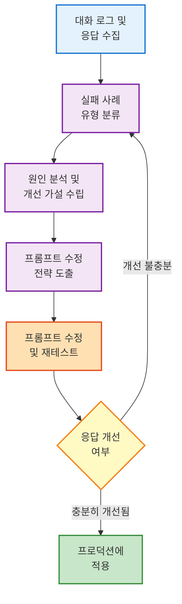

**목표:** 사용자 요구사항이나 이전 대화 로그를 면밀히 분석하여 **프롬프트의 문제점을 찾아내고 개선 방향을 도출**하는 방법을 학습합니다. 이를 통해 강의 없이도 실제 업무에서 프롬프트 성능을 향상시키고, LangChain4j와 같은 프레임워크로 **에이전트의 응답 품질을 개선**할 수 있습니다.

프롬프트 엔지니어링은 한 번에 완벽한 프롬프트를 만드는 일이 아니라, **지속적인 개선(iteration)** 과정입니다. 처음 작성한 프롬프트가 기대한 결과를 주지 못한다면, **무엇이 문제였는지 분석**하고 프롬프트를 수정해나가야 합니다. 이번 장에서는 그 분석 기법으로서 대화 실패 사례를 분류하고, 대표적인 해결 전략인 **Chain-of-Thought(연쇄 사고)** 프롬프트 기법과 **긴 컨텍스트 처리 이슈**(일명 "_Lost in the Middle_")를 다룹니다. 또한 **프롬프트 개선 워크플로우**를 수립하여 실무에 바로 적용할 수 있도록 안내합니다.

## 2.1 프롬프트 실패 사례와 분석의 중요성

LLM(대형 언어 모델)의 응답이 기대에 못 미칠 때, 먼저 **어떤 유형의 실패인지 진단**해야 합니다. 이는 소프트웨어 디버깅과 유사하게, 문제의 원인을 알아야 올바른 해결책을 적용할 수 있기 때문입니다. 몇 가지 **대표적인 실패 유형**을 살펴보겠습니다:

- **추론 오류**: 모델이 논리적으로 맞지 않는 답변을 하거나, 복잡한 문제를 풀지 못하고 엉뚱한 답을 할 때입니다. 예를 들어 수학 문제를 틀리거나, 단계적 이유 없이 결론만 내놓는 경우입니다.
- **정보 누락**: 사용자 프롬프트에 제공된 중요한 정보를 응답에서 놓치는 경우입니다. 특히 프롬프트 길이가 길어서 중간 부분의 맥락을 모델이 활용하지 못했을 때 자주 발생합니다.
- **지시 무시 및 형식 불일치**: 모델이 사용자의 지시사항(예: 특정 출력 형식 요구)을 따르지 않고 다른 형태로 답변하거나, 불필요한 내용을 덧붙이는 경우입니다.

위와 같은 실패 사례를 만났다면, **각 유형에 맞는 개선 기법**을 적용해야 합니다. 실무에서는 먼저 여러 대화 로그를 모아서 실패 패턴을 분류하고, **"실패 유형 → 원인 가설 → 해결 전략"**을 정리하는 것이 도움이 됩니다. 예를 들어 20건의 대화 로그를 검토해보니 상당수가 모델의 잘못된 추론 때문에 발생한 오류라면, 이는 **모델의 추론 과정을 돕는 프롬프트 기법이 부족**했던 것으로 가정할 수 있습니다. 반면 여러 로그에서 특정 정보(특히 지문 중간에 제시된 단서)를 자주 놓쳤다면, **긴 컨텍스트에서 정보가 묻힌 문제**를 의심해야 합니다.

이렇게 **문제를 진단**한 뒤에는, 각 원인에 대응하는 **프롬프트 개선책**을 실험해볼 차례입니다. 다음 섹션들에서 두 가지 핵심 개선 기법인 **Chain-of-Thought**와 **컨텍스트 재구성** 전략을 살펴보겠습니다.

## 2.2 Chain-of-Thought (연쇄 사고) 프롬프트 기법

**Chain-of-Thought(CoT)**은 모델에게 답을 곧바로 요구하는 대신, **생각하는 과정을 글로 풀어보도록 유도하는 프롬프트 기법**입니다. 사람으로 비유하면, 머릿속으로만 계산하지 말고 종이에 풀이 과정을 쓰면서 문제를 풀게 하는 셈입니다. 이 기법의 배경이 된 연구에 따르면, 연쇄 사고 프롬프트는 충분히 **대규모**인 언어 모델의 **복잡한 추론 능력을 크게 향상**시키는 것으로 나타났습니다. 예컨대 PaLM 540억 매개변수 모델에 몇 가지 예시와 함께 "차근차근 생각해보자"는 식의 프롬프트를 주었더니, 수학 문제 벤치마크에서 **기존보다 월등히 높은 정확도**를 달성했습니다. 이는 모델에게 단순히 정답만 요구할 때보다, **중간 추론 단계를 나타내도록 유도**하면 더 나은 결과를 얻을 수 있다는 것을 의미합니다.

**왜 CoT 기법이 효과적일까요?** 모델의 내부 **추론 과정을 가시화**하면 다음과 같은 이점이 있습니다:

- 문제를 여러 단계로 쪼개어 접근함으로써 **복잡한 문제를 구조화**할 수 있습니다. 한 번에 어려운 문제를 풀기 어려워도, 중간 단계로 나누면 해결 가능성이 높아집니다.
- 모델의 응답에 **추론 과정이 드러나기 때문에 해석 가능성**이 높아집니다. 결과만 있을 때보다, 어떻게 그런 결과에 도달했는지 알 수 있어 검증과 디버깅이 쉬워집니다.
- 응답 단계에서 **오류가 발생하면 어느 단계에서 잘못되었는지** 추적할 수 있습니다. 예를 들어 계산 문제라면, 중간 계산 단계 어디서 실수했는지 발견하고 프롬프트를 조정할 수 있습니다.

**한계와 주의점:** CoT 프롬프트의 효과는 **모델의 크기와 능력에 크게 의존**합니다. 연구에 따르면 파라미터 규모가 작은 모델은 단계별 추론을 시켜도 **일관성 없는 잘못된 추론**을 내놓기 쉽습니다. 다시 말해, CoT 기법은 GPT-3.5나 GPT-4 같은 대규모 모델에서는 유용하지만, 소규모 LLM이나 과거의 작은 언어모델에서는 크게 효과를 못 볼 수 있습니다. 다행히도 실무에서는 보통 OpenAI API 등의 강력한 모델을 활용하거나, 규모가 큰 사내 모델을 사용하는 경우가 많으므로 CoT의 이점을 살릴 수 있습니다. 그래도 항상 정답을 보장하는 것은 아니므로, **모델이 출력한 추론 과정 자체도 검증**이 필요합니다. 모델이 그럴듯한 이유를 대면서도 실제로는 틀린 답을 내놓는 경우도 있기 때문입니다.

### CoT의 두 가지 방식

CoT 프롬프트는 크게 **Zero-shot**과 **Few-shot** 방식으로 구분됩니다.

#### Zero-shot CoT (제로샷 연쇄 사고)

가장 간단한 방법으로, 예시 없이 직접적인 지시만으로 추론을 유도합니다. 사용자 질문에 "단계별로 생각해보세요" 또는 "차근차근 풀어보세요"와 같은 문구를 추가하는 것만으로도 효과를 볼 수 있습니다.

**예시:**

```
질문: 카페에 사람이 23명 있었는데 5명이 나가고 8명이 들어왔습니다. 지금 몇 명인가요?

기본 프롬프트: "질문에 답하세요."

Zero-shot CoT 프롬프트: "질문에 답하기 전에 필요한 경우 단계별로 사고 과정을 자세히 설명하고 마지막에 최종 답을 제시하세요."
```

**개선된 Zero-shot CoT 프롬프트:**

```
다음 단계를 따라 답변해주세요:
1. 문제를 분석하고 필요한 정보를 파악하세요
2. 단계별로 사고 과정을 자세히 설명하세요
3. 마지막에 '최종 답변:'이라고 쓰고 결론을 제시하세요
```

이처럼 **"단계별로 생각하고 풀이 과정을 보여줘"**라는 식의 문장을 프롬프트에 포함하면, 모델은 답을 산출하기 전에 필요한 추론 단계를 글로 나열합니다.

#### Few-shot CoT (퓨샷 연쇄 사고)

모델에게 몇 가지 간단한 Q&A 예시를 제공하되, **답변 부분에 항상 생각하는 과정을 거쳐 답을 도출하는 예시**를 보여주는 방식입니다. 이를 통해 모델은 패턴을 학습하고 비슷한 방식으로 답변하게 됩니다.

**예시:**

```
Q: 어린이는 모두 몇 명 있나요? (상황: 어른 2명이 아이 3명씩 데리고 공원에 왔다.)
A: 먼저 어른 수와 상관없이 아이는 각 어른당 3명이니까 총 아이는 2 × 3 = 6명입니다. 따라서 6명이 있습니다.

Q: 다음 수열의 10번째 항은 무엇인가요? (수열: 2, 4, 6, 8, ...)
A: 이 수열은 2부터 시작해서 매 항마다 2씩 증가합니다. 1번째 항이 2이고, 2번째 항이 4입니다. n번째 항은 2n입니다. 따라서 10번째 항은 2 × 10 = 20입니다. 
최종 답변: 20입니다.

Q: (사용자 질문)
A: (여기서부터 모델이 단계별 추론 후 답변)
```

위처럼 **few-shot**으로 보여준 예시들 덕분에, 모델은 사용자의 실제 질문에 답할 때도 **자연스럽게 체계적인 풀이 과정을 거쳐서 답변**하게 됩니다.

### LangChain4j에서 CoT 구현 예시

LangChain4j를 이용한다면 `PromptTemplate`을 사용해 이러한 예시들을 손쉽게 프롬프트에 포함시킬 수 있습니다.

```java
// Zero-shot CoT 프롬프트 템플릿
PromptTemplate cotTemplate = PromptTemplate.from("""
    질문: {{question}}
    
    위 질문에 답하기 전에 단계별로 사고 과정을 설명하고,
    마지막에 '최종 답변:'으로 시작하는 결론을 제시하세요.
    """);

// Few-shot CoT 프롬프트 템플릿
String fewShotExamples = """
    Q: 사과 3개와 바나나 5개가 있습니다. 과일은 총 몇 개인가요?
    A: 사과 개수를 확인하면 3개입니다. 바나나 개수는 5개입니다.
       따라서 전체 과일은 3 + 5 = 8개입니다.
       최종 답변: 8개
    
    Q: 책 한 권이 15,000원이고 3권을 사면 10% 할인됩니다. 3권의 가격은?
    A: 먼저 정상 가격을 계산하면 15,000 × 3 = 45,000원입니다.
       10% 할인 금액은 45,000 × 0.1 = 4,500원입니다.
       할인 후 가격은 45,000 - 4,500 = 40,500원입니다.
       최종 답변: 40,500원
    
    Q: {{question}}
    A: 
    """;

PromptTemplate fewShotTemplate = PromptTemplate.from(fewShotExamples);
```

n8n과 같은 워크플로우 도구에서도, 프롬프트 문자열에 위 예시들을 넣거나, **별도의 노드**를 만들어 단계별 추론을 먼저 수행하게 한 뒤 최종 답을 구성하는 방식으로 응용할 수 있습니다.

### Self-Consistency: CoT의 고급 활용

CoT를 여러 번 실행하여 가장 일관된 답을 선택하는 기법입니다. 이는 단일 추론의 한계를 보완하고 정확도를 높이는 데 효과적입니다.

**작동 방식:**

1. 동일한 질문에 대해 CoT를 여러 번(예: 5~10회) 실행
2. 각 실행에서 서로 다른 추론 경로 생성 (temperature > 0 설정)
3. 가장 많이 나온 최종 답변을 선택 (다수결 방식)

**장점:**

- 단일 추론보다 정확도 향상 (수학 문제에서 특히 효과적)
- 모델의 무작위성을 활용하여 다양한 관점 확보
- 추론 오류의 영향을 완화

**단점:**

- API 호출 비용 증가 (5~10배)
- 응답 시간 증가
- 모든 추론이 잘못된 경우 효과 없음

**적용 시나리오:**

- 고위험 의사결정 (금융, 의료, 법률 자문)
- 복잡한 수학/논리 문제
- 일관성이 중요한 분석 작업
- 정확도가 최우선인 경우

**구현 예시:**

```python
# Self-Consistency 구현 (Python 의사코드)
def self_consistency(question, n=5):
    answers = []
    for i in range(n):
        prompt = f"단계별로 생각해보세요: {question}"
        response = llm.generate(prompt, temperature=0.7)
        final_answer = extract_final_answer(response)
        answers.append(final_answer)
    
    # 다수결로 최종 답 선택
    return most_common(answers)
```

### 💡 Tip: CoT 출력 제어

만약 최종 사용자에게 **추론 과정 자체를 숨기고** 정답만 보여주고 싶다면, 다음과 같은 기법을 쓸 수 있습니다.

**방법 1: 프롬프트에 역할 부여**

```
당신은 수학 교사입니다. 풀이 과정을 내부적으로 생각하되, 학생에게는 최종 답만 간결하게 말하세요.
```

이렇게 지시하면, 모델이 내부적으로 사고하지만 응답은 정답만 주도록 유도할 수 있습니다.

**방법 2: 후처리**

모델이 출력한 답변을 받아서, 프로그래밍적으로 최종 답만 추려내는 방법입니다.

```java
// LangChain4j 후처리 예시
String response = chatModel.generate(prompt);

// "최종 답변:" 이후 내용만 추출
Pattern pattern = Pattern.compile("최종 답변:\\s*(.+)");
Matcher matcher = pattern.matcher(response);
if (matcher.find()) {
    String finalAnswer = matcher.group(1).trim();
    return finalAnswer;
}
```

이러한 방법으로 CoT의 장점은 살리면서도, 필요에 따라 사용자가 보는 응답은 간결하게 유지할 수 있습니다.

다음에는 CoT와 더불어 자주 문제가 되는 **긴 컨텍스트** 상황의 이슈와 해결책을 살펴보겠습니다.

## 2.3 긴 컨텍스트와 "Lost in the Middle" 문제

현대의 LLM들은 수천에서 수만 토큰까지 긴 프롬프트를 입력으로 받을 수 있습니다. LangChain4j를 사용하면 문서 여러 개를 이어붙이거나, 대화 내역을 누적하여 모델에 전달하는 일이 빈번합니다.

### 주요 LLM의 컨텍스트 윈도우 크기 (2025년 기준)

| 모델 | 컨텍스트 윈도우 | 특징 |
|---|---:|---|
| GPT-4 Turbo | 128K 토큰 | 약 96,000 단어 |
| Claude 3 Opus | 200K 토큰 | 약 150,000 단어 |
| Gemini 1.5 Pro | 1M 토큰 | 약 750,000 단어 |
| GPT-3.5 Turbo | 16K 토큰 | 약 12,000 단어 |

**참고:** 토큰 ≈ 0.75 단어 (영어 기준), 한글은 약 0.5~0.6 글자

그러나 **컨텍스트 입력량이 많아질수록 모델이 모든 정보를 고르게 활용하지 못할 수 있다**는 점에 유의해야 합니다. 특히, 최신 연구에서 이른바 **"Lost in the Middle"** 현상이 보고되었습니다:

> *"모델의 입력 컨텍스트 중 **처음과 끝부분에 있는 정보는 잘 활용**되지만, **중간에 위치한 정보는** 모델이 효과적으로 **회수하지 못해 성능이 크게 저하**되는 경우가 관찰되었다"*.

즉, 컨텍스트가 길 때 **모델의 주의(attention)가 처음과 끝에 쏠리고 중간은 흐려지는 경향**이 있다는 뜻입니다. 

**왜 이런 일이 생길까요?** 완전한 원인은 명확하지 않지만, 추측하기로는 현재 많은 LLM들의 **아키텍처 한계**와 **훈련 데이터 편향**이 원인일 수 있습니다. 예를 들어 GPT-4와 같은 모델의 경우도 길이 10,000 토큰이 넘는 입력을 받을 수 있지만, 실제 정밀하게 추론할 때는 **맨 앞부분(시스템/초기 지시)과 최근 부분(사용자 질문이나 마지막 지시)**에 가중치를 많이 두고, 중간 내용은 대략적으로만 파악할 가능성이 있습니다.

### 실무 영향

만약 여러분의 프롬프트나 대화 컨텍스트가 길다면, **중요한 정보나 지시사항이 중간에 묻혀서 모델이 간과**하고 있지 않은지 점검해야 합니다. 

**예시 시나리오:**

고객 지원 챗봇을 만든 상황을 가정해 봅시다. 사용자의 초기 문의 내용이 길게 있고, 그 후 여러 차례의 응답과 추가 질문이 이어져 프롬프트 컨텍스트가 방대해졌습니다. 그런데 **가운데쯤에 명시된 핵심 조건**(예: 환불 가능 기간이라든가 특정 계정 정보)이 최종 답변에서 반영되지 않았다면, 이 _Lost in the Middle_ 문제가 발생했을 수 있습니다.

### 해결 전략

긴 컨텍스트 문제를 완화하기 위해서는 **컨텍스트 설계와 전처리**에 신경 써야 합니다:

#### 1. 중요 정보의 위치 조정

중요한 배경지식이나 필수 조건은 가급적 **프롬프트 앞부분 또는 마지막 부분**에 배치하세요.

**예시:**

```
[시스템 프롬프트 - 앞부분]
당신은 고객 지원 AI입니다. 다음 규칙을 반드시 준수하세요:
- 환불 가능 기간: 구매 후 14일 이내
- 미개봉 상품만 환불 가능
- 배송비는 고객 부담

[중간 부분]
(대화 내역, 제품 정보 등)

[마지막 부분 - 사용자 질문]
이 제품을 10일 전에 샀는데 환불 가능한가요?
```

모델은 앞쪽 내용과 마지막 사용자 질문을 특히 중요하게 여기는 경향이 있으므로, 이 전략이 도움이 됩니다.

#### 2. 컨텍스트 슬라이싱 및 요약

대화 로그가 매우 길어질 경우 모든 내용을 매번 다 넣기보다는, **직전까지의 대화를 요약한 내용을 앞에 추가**하거나 **관련된 내용만 발췌**해서 전달하는 편이 효과적입니다.

**LangChain4j 적용 방법:**

- 이전 대화들을 요약해 저장해두고 필요한 때 불러오기
- **Recency / Relevance 전략**으로 벡터 검색을 통해 관련 내용만 추출 (Retrieval-Augmented Generation)

**n8n 워크플로우 예시:**

```
[노드 1: 대화 이력 요약]
→ [노드 2: 요약문 + 최근 질문 결합]
→ [노드 3: LLM 호출]
```

이렇게 하면 중간 정보 누락 문제를 완화할 수 있습니다.

#### 3. 중간 내용 재확인

부득이하게 중간의 자세한 내용까지 모두 모델이 인식해야 한다면, **질문을 쪼개어 두 번에 나눠 묻는 방법**도 있습니다.

**2단계 질문 전략:**

```
1단계: "위 내용에서 핵심 사실 3개를 꼽아줘"
→ 모델이 중간 내용을 한 번 되짚어보게 강제

2단계: "위에서 추출한 핵심 사실을 바탕으로 다음 질문에 답해줘: [실제 질문]"
→ 핵심 사실이 컨텍스트 앞부분에 위치하게 됨
```

이렇게 하면 모델이 중간 내용을 한 번 되짚어보게 강제할 수 있습니다.

#### 4. 컨텍스트 문제의 징후 파악

실제 로그를 분석할 때 다음 징후를 확인하세요:

- 모델이 **특정 문장이나 단락 이후의 내용을 전혀 언급하지 않음** → _Lost in the Middle_ 의심
- 사용자가 이전에 분명히 알려준 정보를 모델이 잊고 잘못된 답을 함 → 해당 정보의 위치 확인 필요

**대응 전략:**

- 정보가 중간에 있었다면 → 위치 재배치
- 정보량 자체가 너무 많았다면 → 요약/검색 전략 적용

## 2.4 프롬프트 개선을 위한 워크플로우

이제 앞서 소개한 기법들을 **어떻게 통합하여 프롬프트를 개선**하는지, 전체 흐름을 살펴보겠습니다. 프롬프트 개선은 보통 다음과 같은 **순환 과정**(루프)으로 이루어집니다:

### 개선 워크플로우 5단계

1. **사례 수집 및 실패 유형 분류**
   - 실제 대화 사례나 테스트 결과를 모아, 모델 응답의 실패 유형을 분류합니다
   - 예: A로그 - 추론 오류, B로그 - 지시 무시, C로그 - 정보 누락 등

2. **원인 분석 및 가설 수립**
   - 각 실패 사례에 대해 "왜 이런 오류가 발생했는가?"를 고민하여 가설을 세웁니다
   - 예시:
     - 추론 오류 → 복잡한 문제를 한 번에 해결하려다 실수함 (단계별 접근 부족)
     - 지시 무시 → 프롬프트의 지시가 모호하게 작성됨
     - 정보 누락 → 중요한 정보가 컨텍스트 중간에 있어 모델이 간과함

3. **개선 전략 도출**
   - 가설에 따라 적용할 프롬프트 수정 전략을 결정합니다
   - 예시:
     - 추론 오류 → CoT 프롬프트 추가
     - 지시 무시 → 지시문을 강조하고 명확히 재작성 또는 시스템 메시지 활용
     - 정보 누락 → 컨텍스트 재구성 또는 핵심 정보 반복 제시

4. **프롬프트 수정 및 테스트**
   - 수정된 프롬프트를 실제 모델에 적용해 다시 테스트합니다
   - 가능하면 동일한 입력에 대해 **A/B 테스트**를 하여 얼마나 개선되었는지 비교합니다

5. **평가 및 반복**
   - 개선이 충분하지 않다면 1단계로 돌아가 추가 사례를 확인하거나, 가설을 수정하고 다른 전략을 시도합니다
   - 충분히 만족스러운 성능이 나올 때까지 이 과정을 반복합니다

### 워크플로우 다이어그램

위 과정을 도식화하면 다음과 같습니다:



이러한 **품질 개선 루프**를 거치면, 강의를 듣지 않더라도 충분히 프롬프트 성능을 끌어올릴 수 있습니다. 특히 LangChain4j 같은 프레임워크는 프롬프트 템플릿을 버전 관리하고, 여러 실험 버전을 A/B 테스트하기에 용이하므로 개선 과정을 자동화하기에도 좋습니다. (버전 관리와 평가 자동화는 이후 5장과 6장에서 더 자세히 다룰 예정입니다.)

### 실무 예시: QA 챗봇 개선 사례

예를 들어, 사내 지식 기반으로 질문에 답하는 QA 챗봇을 구축했다고 가정해 봅시다. 초기 프롬프트는 단순히 _"다음 질문에 회사 문서를 참고하여 답변해줘."_ 라고 해 두었더니, 테스트 결과 아래와 같은 문제가 발견되었습니다:

#### 사례 1: 정보 누락 문제

**문제 상황:**
- 사용자 질문: "우리 회사 연차 휴가 규정이 어떻게 되나요?"
- 응답 문제: 규정의 일부만 언급하고 중요한 세부사항(예: 연차 이월 규정)을 빼먹음

**원인 가설:**
- 연차 규정 문서가 길고, 이월 규정이 중간 부분에 상세히 쓰여 있었는데 모델이 끝까지 읽지 않고 답한 것 같다 (_Lost in the Middle_ 의심)

**개선 전략:**
- 연차 규정 문서에서 핵심 내용(연차 일수, 이월 여부 등)을 미리 요약해 프롬프트 앞부분에 제시
- 또는 질의 전에 관련 부분을 벡터 검색하여 간추린 정보를 추가 제공하도록 수정

#### 사례 2: 도구 미활용 문제

**문제 상황:**
- 사용자 질문: "내 연말정산 진행 상태 좀 알려줘"
- 응답 문제: _"죄송합니다, 그 정보는 알려드릴 수 없습니다."_ 라며 거부 응답 (사실은 사내 시스템에서 조회 가능한 정보)

**원인 가설:**
- 모델이 직접 알 수 없는 정보라고 판단해 거부한 것으로 보임
- 툴 사용(예: 데이터베이스 조회)을 해야 하는데 프롬프트에서 그 부분이 빠져 있었음

**개선 전략:**
- OpenAI 함수 호출이나 LangChain 도구 사용을 프롬프트에 포함
- 시스템 프롬프트에 *"사용자의 사내 정보는 API를 이용해 조회할 수 있다"*는 문구 추가
- n8n 등으로 해당 API를 호출하는 단계를 추가

> **포인트:** 문제 분석을 통해 **"모델이 필요한 액션을 못해서 실패"**라는 유형을 인식한 뒤 **"도구 사용 프롬프트 추가"**로 개선

#### 사례 3: 형식 불일치 문제

**문제 상황:**
- 사용자 질문: "이 제품 설명을 읽고 3줄 요약해줘" (프롬프트에 제품 설명이 아주 긴 텍스트로 포함됨)
- 응답 문제: 요약은 했으나 중요 포인트를 놓치고 두서없이 3줄을 늘어놓음

**원인 가설:**
- 글이 길어 중간 부분의 특징들을 모델이 반영 못함
- "3줄"이라는 형식 요구를 지키려다 보니 어색하게 작성됨

**개선 전략:**
- 요약 요청 프롬프트를 개선: *"아래 제품 설명의 핵심 특징 3가지를 bullet point로 간결히 써줘"*
- 형태를 명확히 지시하고, 긴 설명 대신 핵심만 뽑도록 지시하는 문구 추가
- 제품 설명이 너무 길 경우 요약-재요약 방식을 사용해 두 단계로 요약

### 개선 사례 추적 표

위 사례들처럼, **각 문제 상황에 맞게 프롬프트를 조금씩 변경**하면 다음 테스트에서는 더 나은 결과를 얻을 수 있습니다. 중요한 것은 이런 과정을 **체계화**하는 것입니다. 

현업에서 프롬프트 엔지니어링을 할 때는, 실패 사례와 개선 아이디어를 기록해 두었다가 프롬프트 버전을 관리하면 향후 비슷한 프로젝트에서 큰 자산이 됩니다. 예를 들어 엑셀 시트나 Notion 문서로 아래와 같은 **리뷰 표**를 만들어 활용하면 좋습니다.

| 사례<br/>번호 | 실패 유형 | 원인 분석 (가설) | 개선된 프롬프트 (요약) | 결과 |
|:---:|:---:|---|---|:---:|
| 1 | 정보 누락 | 중요 정보가 프롬프트 중간에 위치하여 미반영됨 | 핵심 정보 요약을 프롬프트 앞부분에 추가 | ✅ 개선됨 |
| 2 | 도구 미활용 | 외부 시스템 조회 필요하지만 프롬프트에 안내 부족 | "필요 시 `사원정보_API`를 사용" 지시 추가 | ✅ 개선됨 |
| 3 | 추론 오류 | 다단계 문제를 한 번에 해결하려다 계산 실수 | "차근차근 풀이 과정을 고려" CoT 지시 추가 | ✅ 개선됨 |
| 4 | 형식 불일치 | 출력 형식 지시가 모호함 | JSON 스키마를 명시적으로 제공 | ✅ 개선됨 |
| 5 | 지시 무시 | 시스템 메시지가 대화 중간에 묻힘 | 시스템 메시지를 맨 앞과 맨 뒤에 반복 배치 | ✅ 개선됨 |
| ... | ... | ... | ... | ... |

이러한 표를 20건 정도 누적해서 관리하면, **어떤 패턴의 문제가 빈발하는지 한눈에 보이고** 대응책도 체계화할 수 있습니다. 

**분석 인사이트:**
- "정보 누락" 유형이 가장 많다 → 컨텍스트 관리가 주요 과제
- "추론 오류"가 많다 → CoT나 ReAct 같은 기법을 더 도입 필요
- "도구 미활용"이 많다 → 함수 호출 프롬프트 강화 필요

### 프롬프트 개선 체크리스트

효과적인 프롬프트 개선을 위해 다음 체크리스트를 활용하세요:

#### 📊 분석 단계
- [ ] 최소 10~20개의 실패 사례를 수집했는가?
- [ ] 각 사례를 명확한 유형으로 분류했는가?
- [ ] 각 유형별 발생 빈도를 집계했는가?
- [ ] 실패 패턴에서 공통점을 찾았는가?

#### 🔍 가설 수립 단계
- [ ] 각 실패 유형에 대한 구체적 원인 가설을 수립했는가?
- [ ] 가설을 검증할 수 있는 테스트 방법을 계획했는가?
- [ ] 여러 가능한 원인을 고려했는가?

#### 🛠️ 개선 전략 단계
- [ ] CoT가 필요한 경우를 식별했는가?
- [ ] 컨텍스트 문제를 확인했는가?
- [ ] 지시사항이 명확하고 구체적인가?
- [ ] Few-shot 예시가 필요한가?
- [ ] 도구 사용이 필요한 작업인가?

#### ✅ 테스트 단계
- [ ] A/B 테스트를 설계했는가?
- [ ] 정량적 평가 지표를 정의했는가? (정확도, 완전성, 형식 준수율 등)
- [ ] 최소 5~10개의 테스트 케이스를 준비했는가?
- [ ] 엣지 케이스(극단적 상황)도 테스트에 포함했는가?

#### 🚀 배포 단계
- [ ] 프롬프트 버전을 문서화했는가?
- [ ] 롤백 계획이 있는가?
- [ ] 모니터링 지표를 설정했는가?
- [ ] 사용자 피드백 수집 방법을 마련했는가?

## 2.5 마치며: 프롬프트 분석으로 얻는 실무 역량

효과적인 프롬프트 분석 기법을 통해, 우리는 **문제 상황에 맞는 해결책을 빠르게 적용**할 수 있게 됩니다. 이는 곧 **프롬프트 엔지니어링의 생산성 향상**으로 이어집니다. 강의를 듣지 않고도, 앞서 소개한 **CoT**와 **컨텍스트 재구성** 전략, 그리고 **분석-개선 루프**를 숙지하고 있다면, 실무에서 마주치는 거의 모든 프롬프트 문제를 진단하고 해결할 수 있을 것입니다.

특히 LangChain4j와 같은 프레임워크를 사용하는 분들은 이러한 개선 루프를 **프로그램 코드나 파이프라인**으로도 구현할 수 있습니다. 예를 들어:

- 여러 프롬프트 버전을 AB 테스트하는 스크립트를 작성하여 어느 버전이 성능이 좋은지 자동으로 비교
- n8n 워크플로우 상에서 정기적으로 문제 사례를 점검하도록 트리거 설정
- 프롬프트 버전 관리 시스템 구축 (Git + 평가 결과 추적)

이는 5장 **프롬프트 테스트·평가** 부분에서 다룰 내용이지만, **프롬프트 분석 기법**을 제대로 이해한 지금부터 염두에 두고 있으면 큰 도움이 될 것입니다.

### 핵심 요약

이번 장에서 배운 내용을 정리하면:

1. **실패 유형 분류**: 추론 오류, 정보 누락, 지시 무시 등으로 문제를 체계적으로 분류
2. **CoT 기법**: Zero-shot과 Few-shot CoT로 모델의 추론 과정 가시화
3. **Self-Consistency**: 여러 추론 경로를 활용한 정확도 향상
4. **Lost in the Middle 대응**: 중요 정보 위치 조정, 컨텍스트 요약, 2단계 질문
5. **개선 워크플로우**: 분석 → 가설 → 전략 → 테스트 → 평가의 순환 구조

### 마지막 조언

마지막으로 기억할 것은, **어떤 한 가지 기법만으로 만능 해결은 어렵다**는 점입니다. CoT가 뛰어난 효과를 내더라도, 컨텍스트 문제가 해결되지 않으면 또 실패할 수 있고, 반대로 컨텍스트를 잘랐더니 추론이 부족해질 수도 있습니다. 

**여러 접근법을 조합하고, 끊임없이 로그를 모니터링하며 인간의 판단을 더해**야 비로소 견고한 프롬프트를 만들어낼 수 있습니다. 이러한 과정이 쌓이면 강의를 수강하지 않더라도 **강의에 준하는 통찰과 노하우**를 얻게 될 것이며, 결과적으로 더 나은 에이전트를 개발할 수 있을 것입니다.

앞으로의 장에서는 프롬프트 기획(3장), 고급 기법 실습(4장), 평가 체계 구축(5장) 등이 계속되니, 지금까지 다룬 분석 기법을 토대로 확장된 내용을 학습하시기 바랍니다. 실무자의 감각과 연구 기반 지식을 접목하여, **탄탄하고 효과적인 프롬프트**를 만들 수 있기를 기대합니다.