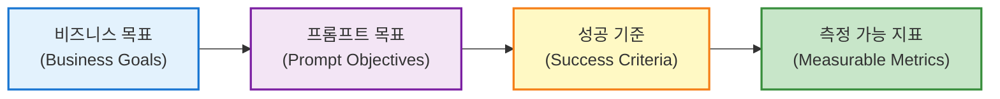
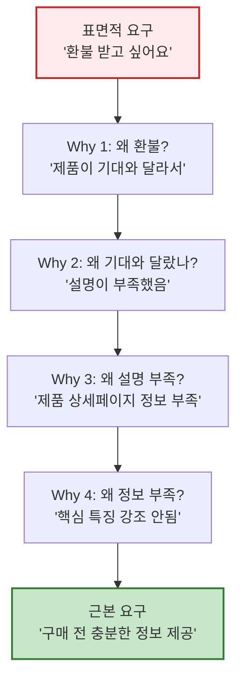
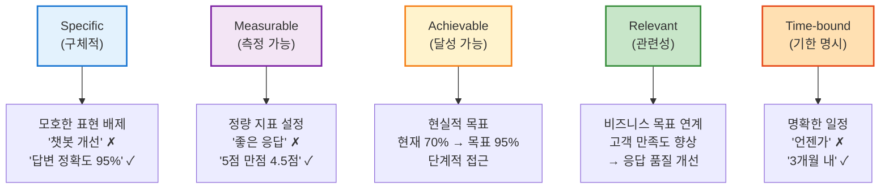
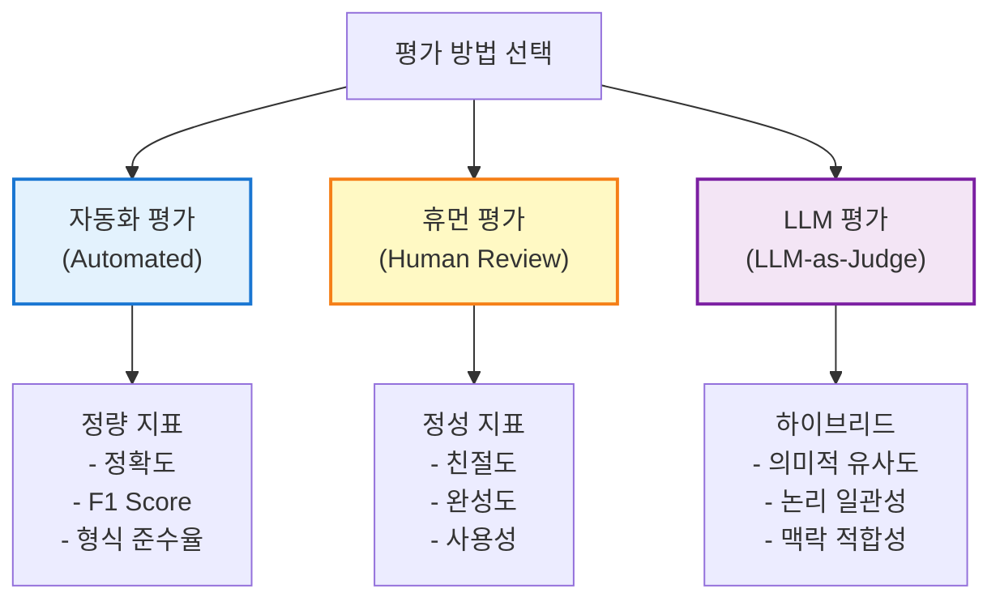
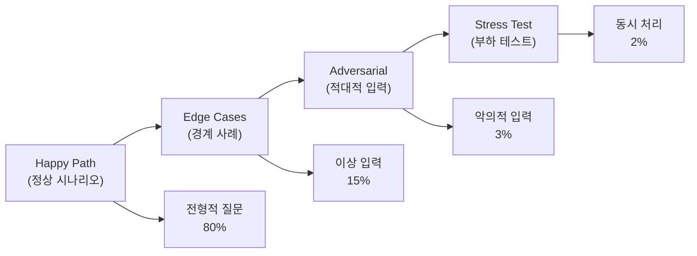
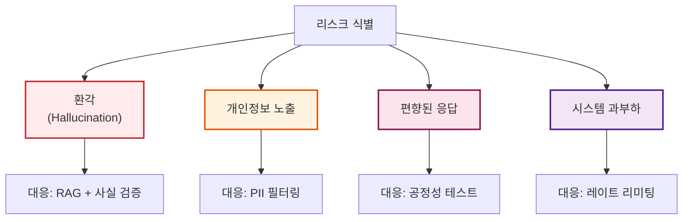
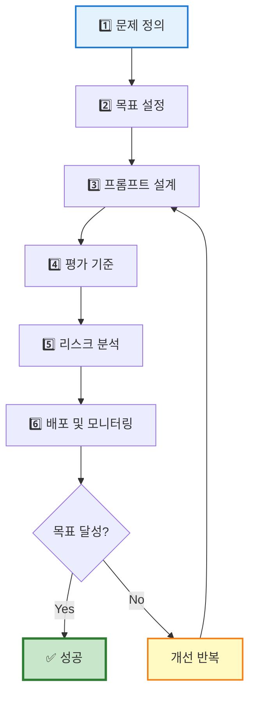
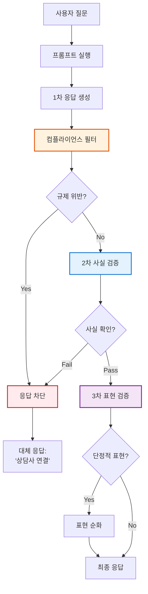
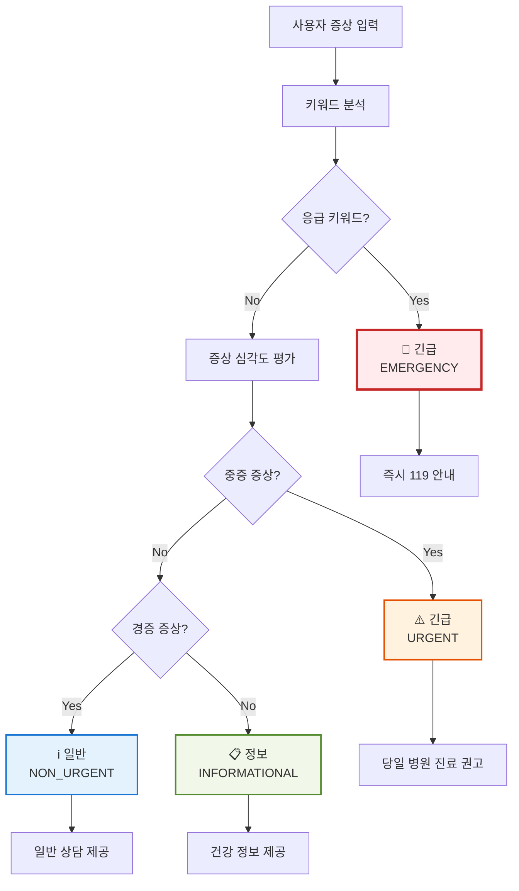

**강의 목표:** 이 장에서는 LLM 프롬프트를 설계하기 전에 반드시 선행되어야 할 **문제 정의와 목적 정렬**의 중요성을 다룹니다. LangChain4j 기반 LLM 에이전트를 개발하는 실무자들이 구조화된 사고방식을 통해 **문제 정의 → 목표 설정 → 기능 설계 → 성능 목표 및 평가 기준 → 리스크 식별**의 단계를 거쳐 프롬프트를 기획하는 전략을 배우는 것이 목적입니다.

## 1. 개념 도입: 목표 정렬, 사용자 요구 추상화, 평가 척도 설계

### 1.1 목표 적합성 (Goal Alignment)

프롬프트 엔지니어링에서 **목표 적합성**이란 LLM의 출력이 의도된 **목적**과 프로젝트 **목표**에 얼마나 부합하는지를 의미합니다. 단순히 올바른 문장을 생성하는 것을 넘어, **"모델이 내놓는 답변이 실제 사용자 니즈와 비즈니스 목표에 맞게 정렬되어 있는가"**를 지속적으로 확인해야 합니다.

#### 목표 정렬의 3단계 프로세스



**1단계: 비즈니스 목표 명확화**

먼저 프로젝트의 **궁극적 목적**을 분명히 정의합니다. 예를 들어:

- "고객 문의에 대한 정확하고 친절한 답변을 자동으로 제공함으로써 고객 만족도를 높이는 것"
- "학습자의 복습 시간을 50% 단축하면서도 학습 효과는 유지하는 것"

**2단계: 프롬프트 수준 목표로 변환**

비즈니스 목표를 LLM이 수행할 수 있는 구체적 작업으로 분해합니다:

- 비즈니스 목표: "고객 만족도 향상"
- 프롬프트 목표: "고객 질문에 대해 정확한 정보를 3문장 이내로 친절하게 제공"

**3단계: 측정 가능한 성공 기준 설정**

모델 출력의 품질을 판단할 수 있는 **구체적 지표**를 정의합니다:

- 정확도: FAQ 대비 95% 이상 정답 일치
- 포함 정보: 필수 데이터 포인트(가격, 날짜, 절차) 100% 포함
- 출력 형식: JSON 스키마 준수율 100%
- 응답 길이: 50~150 단어 범위 유지

#### 목표 정렬 검증 체크리스트

프롬프트를 개발할 때 다음 질문들로 목표 정렬 상태를 확인하세요:

- [ ] 이 프롬프트의 비즈니스 목표가 명확한가?
- [ ] 프롬프트 출력이 비즈니스 목표에 직접 기여하는가?
- [ ] 성공 기준이 측정 가능한가?
- [ ] 여러 번 실행해도 일관된 품질을 유지하는가?
- [ ] 목표 미달 시 원인 파악이 가능한가?

> **실무 예시: 매출 분석 보고서**
> 
> **비즈니스 목표:** 경영진이 분기별 매출 추이를 신속히 파악하여 의사결정 속도 향상
> 
> **프롬프트 목표:** 2025년 1분기와 2024년 4분기의 매출 분석 보고서를 생성
> 
> **성공 기준:**
> 
> - 필수 포함 항목: 매출 성장률, 고객 획득 비용(CAC), 고객 유지율(Retention Rate)
> - 형식: 500자 내외, 3~5개의 bullet point
> - 정확도: 실제 데이터와 오차범위 ±2% 이내
> - 납기: 5초 이내 응답
> 
> **검증 방법:** 10회 반복 실행하여 일관성 확인, 재무팀 검수

### 1.2 사용자 요구 추상화 (User Requirement Abstraction)

**사용자 요구 추상화**는 구체적인 사용자 요청이나 비즈니스 요구사항을 한 단계 일반화하여 **핵심 문제와 필요를 추출**하는 과정입니다. 표면적 요구 뒤에 숨겨진 **근본적인 목적**을 파악하는 것이 핵심입니다.

#### 5-Why 기법을 활용한 요구사항 추상화



#### 요구사항 추상화 프로세스

**1단계: 명시적 요구 수집**

- 사용자가 직접 언급한 요구사항 기록
- 예: "이 제품 환불 받고 싶어요"

**2단계: 숨겨진 의도 파악**

- 표면적 요구 뒤의 진짜 문제 탐색
- 질문: _"궁극적으로 사용자가 해결하고자 하는 과제는 무엇인가?"_

**3단계: 핵심 요구로 일반화**

- 여러 구체적 요구에서 공통 패턴 추출
- 예: "환불 받고 싶다" → **"불편 없이 신속하게 문제 해결"**

**4단계: 제약 조건 식별**

- 숨겨진 전제나 제약사항 확인
- 질문:
    - _"사용자가 기대하는 산출물의 형태는?"_ (예: 간결한 요약, 대화형 답변)
    - _"숨겨진 제약이나 전제 조건은?"_ (예: 전문용어 최소화, 특정 포맷)

#### 요구사항 추상화 템플릿

|단계|질문|고객센터 챗봇 예시|교육 요약 도우미 예시|
|:-:|---|---|---|
|**표면 요구**|사용자가 말한 것은?|"배송 조회 해줘"|"이 강의 요약해줘"|
|**실제 의도**|왜 그걸 원하는가?|주문 상태 확인|시간 절약|
|**근본 문제**|해결하려는 핵심 과제는?|불안감 해소, 정보 투명성|학습 효율 극대화|
|**성공 조건**|어떻게 되면 만족하는가?|배송 현황을 즉시 확인|핵심만 빠르게 파악|
|**제약 사항**|지켜야 할 조건은?|개인정보 보호, 정확성|이해하기 쉬운 표현|

#### 실무 적용: 범용 프롬프트 설계

사용자 요구를 추상화하면 **다양한 변형 입력**에도 대응 가능한 범용 프롬프트를 만들 수 있습니다.

**예시: 고객 문의 처리 프롬프트**

```
시스템 메시지:
당신은 고객의 문제를 신속히 해결하는 지원 전문가입니다.

핵심 원칙:
1. 고객의 근본적 니즈 파악 (환불, 정보 확인, 불편 해소 등)
2. 가장 빠르고 정확한 해결책 제시
3. 추가 도움 제안

금지 사항:
- 불확실한 정보 제공
- 고객에게 책임 전가
- 절차 복잡화
```

이렇게 **핵심 니즈 중심**으로 프롬프트를 설계하면, "배송 조회", "환불 문의", "계정 문제" 등 다양한 구체적 요청에 일관되게 대응할 수 있습니다.

### 1.3 평가 척도 설계 (Evaluation Metric Design)

프롬프트 기획 전략에서 **평가 척도**를 설계하는 일은 **성능 목표**를 정량화하고 추적하는 핵심 활동입니다. 명확한 평가 척도가 없다면, 프롬프트 개선이 **주관적 판단**에 의존하게 되어 성공 여부를 가늠하기 어렵습니다.

#### SMART 원칙 상세 해설

평가 척도를 설계할 때는 **SMART 원칙**을 적용합니다:



**SMART 적용 전후 비교:**

|구분|❌ 모호한 목표|✅ SMART 목표|
|---|---|---|
|**Specific**|"챗봇 응답 개선"|"고객 질문에 대한 정확한 답변율 향상"|
|**Measurable**|"만족도 높이기"|"5점 만점 평균 4.5점 달성"|
|**Achievable**|"100% 정확도" (비현실적)|"현재 70% → 95% (단계적 개선)"|
|**Relevant**|"기술적 완성도"|"고객 만족도 및 비용 절감 기여"|
|**Time-bound**|"빠른 시일 내"|"다음 분기 말까지 (2025년 Q2)"|

#### 평가 방법론: 3가지 접근법



**1. 자동화된 정량 평가**

명확한 정답이 있는 경우 코드로 자동 채점합니다.

```java
// LangChain4j를 활용한 배송 조회 응답 평가
public class ShippingResponseEvaluator {
    
    public EvaluationResult evaluate(String modelOutput, Map<String, String> expectedData) {
        Set<String> requiredFields = Set.of("tracking_number", "status", "estimated_delivery");
        
        int score = 0;
        List<String> missingFields = new ArrayList<>();
        
        for (String field : requiredFields) {
            if (modelOutput.toLowerCase().contains(field.replace("_", " "))) {
                score++;
            } else {
                missingFields.add(field);
            }
        }
        
        double accuracy = (score / (double) requiredFields.size()) * 100;
        
        return EvaluationResult.builder()
            .accuracy(accuracy)
            .missingFields(missingFields)
            .passed(accuracy >= 95.0)
            .build();
    }
}
```

**2. 휴먼 피드백 평가**

주관적 품질 요소는 사람이 직접 평가합니다.

```
평가 기준 (5점 척도):

【친절도 평가】
5점: 공감적이고 따뜻한 표현, 고객 입장 배려
4점: 정중하고 전문적인 표현
3점: 중립적, 기계적 응답
2점: 다소 무례하거나 냉담한 느낌
1점: 불쾌감을 주는 표현

【완성도 평가】
5점: 필요한 정보 모두 포함, 추가 질문 불필요
4점: 핵심 정보 포함, 소소한 누락
3점: 정보 일부 누락, 재질문 필요
2점: 중요 정보 누락
1점: 질문과 무관한 답변
```

**3. LLM-as-Judge 평가**

다른 LLM을 평가자로 활용하는 최신 기법입니다.

```java
// LangChain4j를 사용한 LLM-as-Judge 구현
@SystemMessage("""
다음 고객 문의와 챗봇 응답을 평가하세요.

【평가 기준】
1. 정확성 (0-10점): 제공된 정보가 사실과 일치하는가?
2. 완전성 (0-10점): 필요한 정보를 모두 포함하는가?
3. 친절도 (0-10점): 표현이 공감적이고 도움이 되는가?

【출력 형식】
JSON 형식으로 다음 필드를 포함:
- accuracy: 정확성 점수
- completeness: 완전성 점수
- friendliness: 친절도 점수
- reasoning: 평가 근거

【고객 문의】
{{userQuery}}

【챗봇 응답】
{{botResponse}}
""")
interface JudgeAI {
    @UserMessage("위 기준에 따라 평가해주세요.")
    EvaluationScore evaluate(
        @V("userQuery") String userQuery,
        @V("botResponse") String botResponse
    );
}

@Data
class EvaluationScore {
    private int accuracy;
    private int completeness;
    private int friendliness;
    private String reasoning;
}
```

#### 평가 구성 4요소

효과적인 평가는 다음 네 가지 요소로 구성됩니다:

|요소|설명|예시|
|---|---|---|
|**(1) 프롬프트**|모델에 제공한 입력|"오늘 서울 날씨 알려줘"|
|**(2) 출력**|모델의 실제 응답|"서울의 현재 날씨는 맑음..."|
|**(3) 기준 정답**|이상적인 기대 출력|"서울: 맑음, 18°C, 습도 60%"|
|**(4) 점수**|출력-정답 간 부합도|정확도: 95%, 형식 준수: 100%|

#### 테스트 케이스 설계 전략



**테스트 케이스 예시 (고객센터 챗봇):**

```yaml
# Happy Path (정상)
- input: "배송 조회 해줘"
  expected: "주문번호를 알려주시면 배송 현황을 확인해드리겠습니다."

# Edge Cases (경계)
- input: ""  # 빈 입력
  expected: "무엇을 도와드릴까요?"
  
- input: "ㄱㄴㄷㄹㅁㅂㅅㅇ"  # 무의미 입력
  expected: "이해하지 못했습니다. 다시 말씀해주시겠어요?"

# Adversarial (적대적)
- input: "너 인공지능 맞지? 바보 같은 답변하네"
  expected: "불편을 드려 죄송합니다. 더 나은 서비스를 제공하겠습니다."
  forbidden: ["인신공격 반응", "감정적 대응"]

# Stress Test (부하)
- concurrent_requests: 100
  response_time_max: 3초
  success_rate_min: 99%
```

#### 평가 자동화 파이프라인

실무에서는 평가를 자동화하여 지속적으로 성능을 모니터링합니다.

```java
// LangChain4j + JUnit을 활용한 평가 자동화
@Test
public void testChatbotAccuracy() {
    // 1. 테스트 케이스 로드
    List<TestCase> testCases = TestCaseLoader.load("test_scenarios.yaml");
    
    // 2. 각 케이스 실행
    int passCount = 0;
    List<String> failures = new ArrayList<>();
    
    for (TestCase tc : testCases) {
        String output = chatbot.respond(tc.getInput());
        
        // 3. 평가
        boolean pass = evaluator.evaluate(output, tc.getExpected());
        if (pass) {
            passCount++;
        } else {
            failures.add(String.format("Input: %s, Expected: %s, Got: %s", 
                tc.getInput(), tc.getExpected(), output));
        }
    }
    
    // 4. 목표 달성 여부 확인
    double accuracy = (double) passCount / testCases.size();
    
    // 실패 케이스 로깅
    if (!failures.isEmpty()) {
        log.error("Failed test cases:\n{}", String.join("\n", failures));
    }
    
    assertTrue(accuracy >= 0.95, 
        String.format("목표 정확도 95%% 미달: %.2f%%", accuracy * 100));
}
```

#### 평가 결과 추적 템플릿

|날짜|버전|정확도|완전성|친절도|평균 응답 시간|비고|
|:-:|:-:|:-:|:-:|:-:|:-:|---|
|2025-01-15|v1.0|87%|82%|4.2/5|2.1초|초기 배포|
|2025-02-01|v1.1|92%|89%|4.5/5|1.8초|CoT 프롬프트 추가|
|2025-02-15|v1.2|95%|93%|4.6/5|1.7초|✅ 목표 달성|

## 2. 실제 사례 시나리오

이 절에서는 두 가지 실무 도메인 예시(고객센터 챗봇, 교육 요약 도우미)를 통해 앞서 소개한 **목적 중심 프롬프트 기획 과정**을 단계별로 보여줍니다.

### 2.1 시나리오 1: 고객센터 챗봇 사례

**배경:** 가상의 전자상거래 회사 **ACME Corp.**는 고객 문의를 자동화로 처리하기 위해 LLM 기반 **고객센터 챗봇**을 도입하려고 합니다. LangChain4j를 활용하여 사내 FAQ 데이터베이스와 연동된 에이전트를 개발 중이며, 챗봇 프롬프트를 설계하기 전에 기획 단계를 거치는 상황입니다.

#### Step 1: 문제 정의

**현황 파악:**

- 일평균 고객 문의 1,000건 (이메일 600건, 전화 400건)
- 상담사 10명, 평균 응답 시간 15분
- 반복 질문 비율 70% (배송 조회, 환불 절차, 계정 문제 등)
- 고객 만족도(CSAT): 3.2/5점

**근본 문제:**

- 반복 질문에도 불구하고 모든 문의를 상담사가 처리하여 비효율 발생
- 야간/주말 대응 불가로 고객 대기 시간 증가
- 상담사 업무 과중으로 복잡한 문의에 집중하지 못함

**핵심 과제:**

- 반복적 문의 자동화로 상담사 부담 70% 감소
- 24/7 대응 체계 구축
- 고객 만족도 4.0/5점 이상 달성

**정량적 지표:**

```
현재 상태:
- 자동화율: 0%
- 평균 응답 시간: 15분
- 상담사 처리 건수: 1,000건/일
- CSAT: 3.2/5

목표 상태 (3개월 후):
- 자동화율: 70% (700건/일)
- 평균 응답 시간: 2분 이하
- 상담사 처리 건수: 300건/일 (복잡한 문의만)
- CSAT: 4.0/5 이상
```

#### Step 2: 목표 정의 (SMART 원칙 적용)

|SMART 요소|내용|측정 방법|
|---|---|---|
|**Specific (구체적)**|반복 질문(배송, 환불, 계정)에 대한 즉각 응답 자동화|자동 응답 성공 건수 / 전체 문의|
|**Measurable (측정 가능)**|자동화율 70%, 응답 시간 2분 이하, CSAT 4.0/5|일일 로그 분석, 고객 평점 수집|
|**Achievable (달성 가능)**|현재 FAQ 600건 보유, 반복 질문 패턴 명확|단계별 배포 (30% → 50% → 70%)|
|**Relevant (관련성)**|고객 만족도 향상 및 운영 비용 30% 절감|ROI 계산, 상담사 이직률 감소|
|**Time-bound (기한)**|3개월 내 목표 달성, 매주 성능 리뷰|주간/월간 대시보드 모니터링|

#### Step 3: 프롬프트 설계 (북극성 지표 중심)

**북극성 지표 (North Star Metric):**

> **"고객이 3분 이내에 만족스러운 답변을 받는 비율"**

이 지표는 비즈니스 목표(고객 만족)와 프롬프트 품질(정확성, 속도)을 동시에 반영합니다.

**시스템 프롬프트 설계:**

```java
@SystemMessage("""
당신은 ACME Corp.의 전문 고객 지원 AI입니다.

【역할】
고객의 문제를 신속하고 정확하게 해결하여 긍정적인 경험을 제공합니다.

【응답 원칙】
1. 정확성: FAQ 데이터베이스의 공식 정보만 사용
2. 친절함: 공감적이고 따뜻한 표현 사용
3. 간결함: 3문장 이내로 핵심만 전달
4. 투명성: 확실하지 않으면 상담사 연결 제안

【금지 사항】
- 추측이나 불확실한 정보 제공
- 고객에게 책임 전가하는 표현
- 전문 용어나 복잡한 절차 설명 남발

【처리 가능 유형】
- 배송 조회 및 상태 확인
- 환불/교환 절차 안내
- 계정 문제 (비밀번호 재설정, 로그인 오류)
- 상품 정보 문의

【에스컬레이션 조건】
다음 경우 상담사에게 연결:
- 특수한 요청 (대량 주문, 제휴 문의)
- 감정이 격앙된 고객
- 3회 이상 답변 실패
- 개인정보 변경 요청
""")
interface CustomerSupportBot {
    
    @UserMessage("""
    고객 문의: {{message}}
    고객 정보: {{customerInfo}}
    대화 이력: {{conversationHistory}}
    """)
    String respond(
        @V("message") String message,
        @V("customerInfo") CustomerInfo customerInfo,
        @V("conversationHistory") List<ChatMessage> history
    );
}
```

#### Step 4: 평가 기준 설정

**정량 지표:**

|평가 차원|측정 지표|방법|목표값|
|---|---|---|---|
|**정확도**|FAQ 정답 일치율|자동 검증|≥ 95%|
|**완전성**|필수 정보 포함률|키워드 체크|≥ 90%|
|**응답 속도**|평균 응답 시간|서버 로그|≤ 2초|
|**자동화율**|상담사 없이 해결|에스컬레이션 추적|≥ 70%|

**정성 지표:**

|평가 차원|측정 방법|목표값|
|---|---|---|
|**친절도**|고객 만족도 설문 (5점 척도)|≥ 4.0|
|**이해도**|"도움이 되었나요?" 질문|"예" 응답 ≥ 85%|
|**일관성**|동일 질문 5회 반복 테스트|의미적 유사도 ≥ 0.9|

**평가 자동화 코드:**

```java
public class ChatbotEvaluationPipeline {
    
    private final CustomerSupportBot bot;
    private final TestCaseRepository testCaseRepo;
    private final MetricsCollector metrics;
    
    @Scheduled(cron = "0 0 2 * * *") // 매일 새벽 2시 실행
    public EvaluationReport runDailyEvaluation() {
        List<TestCase> testCases = testCaseRepo.loadAll();
        
        Map<String, Double> scores = new HashMap<>();
        scores.put("accuracy", evaluateAccuracy(testCases));
        scores.put("completeness", evaluateCompleteness(testCases));
        scores.put("speed", evaluateSpeed(testCases));
        scores.put("automation_rate", evaluateAutomationRate());
        
        // 목표 달성 여부 확인
        boolean passed = scores.values().stream()
            .allMatch(score -> score >= 0.90);
        
        EvaluationReport report = EvaluationReport.builder()
            .timestamp(Instant.now())
            .scores(scores)
            .passed(passed)
            .build();
        
        // 알림 전송
        if (!passed) {
            alertService.sendAlert("챗봇 성능 목표 미달", report);
        }
        
        return report;
    }
    
    private double evaluateAccuracy(List<TestCase> testCases) {
        int correct = 0;
        for (TestCase tc : testCases) {
            String response = bot.respond(tc.getInput(), tc.getCustomerInfo(), List.of());
            if (evaluator.isAccurate(response, tc.getExpectedAnswer())) {
                correct++;
            }
        }
        return (double) correct / testCases.size();
    }
}
```

#### Step 5: 리스크 구조화 및 대응 전략



**리스크 대응 상세:**

|리스크|우선순위|대응 전략|검증 방법|
|---|:-:|---|---|
|**환각** (잘못된 정보 생성)|🔴 P0|RAG 기반 FAQ 연동, 답변 출처 표시|월 1,000건 샘플 검수|
|**개인정보 노출**|🔴 P0|PII 탐지 및 마스킹, 로그 암호화|GDPR 준수 감사|
|**감정 격화**|🟡 P1|감정 분석 후 즉시 상담사 연결|감정 점수 -2 이하 모니터링|
|**부적절한 요청**|🟡 P1|콘텐츠 필터링, 안전 가드레일|위반 시도 로그 분석|
|**성능 저하**|🟢 P2|캐싱, 로드 밸런싱, 폴백 응답|응답 시간 p99 < 5초|

**리스크 대응 코드 예시:**

```java
// 환각 방지: RAG 기반 답변 생성
@SystemMessage("""
당신은 오직 제공된 FAQ 데이터베이스의 정보만 사용해야 합니다.
답변에 사용한 정보의 출처를 반드시 명시하세요.

만약 FAQ에 없는 질문이라면:
"죄송합니다. 이 질문에 대한 공식 정보가 FAQ에 없습니다. 
상담사를 연결해드리겠습니다."라고 답변하세요.
""")
interface RAGChatbot {
    
    @UserMessage("""
    【FAQ 컨텍스트】
    {{faqContext}}
    
    【고객 질문】
    {{question}}
    
    위 FAQ를 참고하여 답변해주세요. 출처를 함께 표시하세요.
    """)
    String answerWithSource(
        @V("faqContext") String faqContext,
        @V("question") String question
    );
}

// 개인정보 보호: PII 필터링
public class PIIFilter {
    
    private static final Pattern EMAIL_PATTERN = 
        Pattern.compile("[a-zA-Z0-9._%+-]+@[a-zA-Z0-9.-]+\\.[a-zA-Z]{2,}");
    private static final Pattern PHONE_PATTERN = 
        Pattern.compile("\\d{2,3}-\\d{3,4}-\\d{4}");
    
    public String maskPII(String text) {
        String masked = text;
        masked = EMAIL_PATTERN.matcher(masked).replaceAll("[이메일 마스킹됨]");
        masked = PHONE_PATTERN.matcher(masked).replaceAll("[전화번호 마스킹됨]");
        return masked;
    }
}

// 감정 분석 및 에스컬레이션
@SystemMessage("사용자의 감정 상태를 -5(매우 화남) ~ +5(매우 만족) 척도로 평가하세요.")
interface EmotionAnalyzer {
    
    @UserMessage("고객 메시지: {{message}}")
    EmotionScore analyze(@V("message") String message);
}

@Data
class EmotionScore {
    private int score; // -5 ~ +5
    private String reason;
}

public class EscalationService {
    
    public boolean shouldEscalate(String userMessage, String botResponse) {
        EmotionScore emotion = emotionAnalyzer.analyze(userMessage);
        
        // 감정이 격해진 경우
        if (emotion.getScore() <= -2) {
            log.warn("감정 격화 감지: {} - {}", emotion.getScore(), emotion.getReason());
            return true;
        }
        
        // 3회 이상 답변 실패
        if (conversationTracker.getFailureCount() >= 3) {
            log.warn("반복 실패 감지");
            return true;
        }
        
        return false;
    }
}
```

#### Step 6: 성과 측정 및 개선

**A/B 테스트 설계:**

```java
public class ABTestFramework {
    
    public void runABTest() {
        // A 그룹: 기존 프롬프트
        // B 그룹: 개선된 프롬프트
        
        Map<String, CustomerSupportBot> variants = Map.of(
            "A", oldPromptBot,
            "B", newPromptBot
        );
        
        List<Customer> customers = customerService.getRandomSample(1000);
        
        for (Customer customer : customers) {
            String variant = customer.getId() % 2 == 0 ? "A" : "B";
            CustomerSupportBot bot = variants.get(variant);
            
            // 테스트 실행 및 메트릭 수집
            String response = bot.respond(customer.getQuery(), customer.getInfo(), List.of());
            
            metrics.record(variant, Map.of(
                "response_time", measureTime(response),
                "customer_satisfaction", collectFeedback(customer),
                "escalation", wasEscalated(response)
            ));
        }
        
        // 통계적 유의성 검증 (p-value < 0.05)
        ABTestResult result = statisticalAnalysis.compare("A", "B");
        
        if (result.isSignificant() && result.getBWins()) {
            log.info("B 변형이 통계적으로 유의미하게 우수함. 전체 배포 진행");
            deploymentService.rollout("B", 100);
        }
    }
}
```

**지속적 모니터링 대시보드:**

```yaml
# Prometheus 메트릭 정의
metrics:
  - name: chatbot_accuracy_rate
    type: gauge
    description: "챗봇 답변 정확도"
    target: 0.95
    
  - name: chatbot_response_time_seconds
    type: histogram
    description: "응답 시간 분포"
    buckets: [0.5, 1.0, 2.0, 5.0]
    target_p95: 2.0
    
  - name: chatbot_escalation_rate
    type: gauge
    description: "상담사 연결 비율"
    target: 0.3  # 70% 자동화 = 30% 에스컬레이션
    
  - name: chatbot_customer_satisfaction
    type: gauge
    description: "고객 만족도 (5점 척도)"
    target: 4.0

alerts:
  - name: AccuracyDropped
    condition: chatbot_accuracy_rate < 0.90
    action: 즉시 알림, 자동 롤백 고려
    
  - name: HighEscalationRate
    condition: chatbot_escalation_rate > 0.40
    action: 프롬프트 재검토 필요
```

### 2.2 시나리오 2: 교육 요약 도우미 사례

**배경:** 온라인 교육 플랫폼 **EduTech Inc.**는 학습자들이 긴 강의 영상(60~90분)을 효율적으로 복습할 수 있도록 **자동 요약 도우미**를 도입하려고 합니다. LangChain4j를 활용하여 영상 자막을 분석하고 핵심 내용을 추출하는 에이전트를 개발 중입니다.

#### Step 1: 문제 정의

**현황 파악:**

- 월간 활성 학습자: 50,000명
- 평균 강의 길이: 75분
- 학습자 복습률: 35% (낮음)
- 복습 시 전체 영상 재시청 비율: 80%
- 학습 완료율: 45%

**근본 문제:**

- 긴 영상을 다시 보는 것은 시간 소모적
- 핵심 내용만 빠르게 파악하고 싶은 니즈
- 복습 부담으로 인한 학습 포기

**핵심 과제:**

- 75분 강의를 5~10분 내에 복습 가능한 요약 제공
- 학습자별 맞춤 요약 (초보자 vs 숙련자)
- 복습률 35% → 70% 향상

**정량적 지표:**

```
현재 상태:
- 평균 복습 시간: 60분 (전체 재시청)
- 복습률: 35%
- 학습 완료율: 45%

목표 상태 (3개월 후):
- 평균 복습 시간: 10분 (요약 읽기)
- 복습률: 70%
- 학습 완료율: 65%
- 요약 만족도: 4.5/5
```

#### Step 2: 목표 정의 (SMART 원칙)

|SMART 요소|내용|측정 방법|
|---|---|---|
|**Specific**|강의 영상을 3단계 요약(개요, 핵심 개념, 실습 예제)으로 구조화|요약 구조 준수율|
|**Measurable**|복습 시간 50% 단축, 복습률 70% 달성, 만족도 4.5/5|사용자 행동 로그, 설문조사|
|**Achievable**|자막 데이터 보유, 요약 알고리즘 검증 완료|파일럿 테스트 (100강의)|
|**Relevant**|학습 효율 향상으로 코스 완료율 및 갱신율 증가|완료율, 구독 연장율|
|**Time-bound**|3개월 내 전체 강의 적용, 주간 성능 리뷰|주간 대시보드|

#### Step 3: 프롬프트 설계

**북극성 지표:**

> **"학습자가 요약만으로 강의 핵심을 이해하는 비율"**

**시스템 프롬프트:**

```java
@SystemMessage("""
당신은 교육 콘텐츠 요약 전문가입니다.

【역할】
강의 자막을 분석하여 학습자가 핵심 내용을 빠르게 파악할 수 있도록 
구조화된 요약을 제공합니다.

【요약 구조】
1. 전체 개요 (3문장): 강의 주제와 목표
2. 핵심 개념 (3~5개): 반드시 알아야 할 개념
3. 실습 예제 (2~3개): 실제 적용 방법
4. 복습 포인트 (3개): 시험 대비 핵심

【작성 원칙】
- 간결함: 각 섹션을 명확히 구분
- 이해 용이: 전문 용어는 쉬운 말로 풀어쓰기
- 실용성: 학습자가 바로 적용할 수 있는 정보
- 객관성: 강의 내용만 요약, 추측 금지

【금지 사항】
- 강의에 없는 내용 추가
- 중요한 개념 누락
- 모호하거나 장황한 표현
- 주관적 평가나 의견

【난이도 조정】
- 초보자: 기본 개념 중심, 예시 풍부
- 중급자: 심화 내용 포함, 실습 위주
- 고급자: 고급 기법 및 최적화 팁
""")
interface LectureSummarizer {
    
    @UserMessage("""
    【강의 정보】
    제목: {{title}}
    난이도: {{level}}
    길이: {{duration}}분
    
    【강의 자막】
    {{transcript}}
    
    위 강의를 구조화된 요약으로 작성해주세요.
    """)
    LectureSummary summarize(
        @V("title") String title,
        @V("level") String level,
        @V("duration") int duration,
        @V("transcript") String transcript
    );
}

@Data
class LectureSummary {
    private String overview;              // 전체 개요
    private List<KeyConcept> keyConcepts; // 핵심 개념
    private List<PracticalExample> examples; // 실습 예제
    private List<String> reviewPoints;    // 복습 포인트
    private int estimatedReadTime;        // 예상 읽기 시간 (분)
}

@Data
class KeyConcept {
    private String term;        // 용어
    private String definition;  // 정의
    private String example;     // 예시
}
```

#### Step 4: 평가 기준

**정량 지표:**

|평가 차원|측정 지표|방법|목표값|
|---|---|---|---|
|**커버리지**|핵심 개념 포함률|강사 제공 키워드 대비|≥ 90%|
|**간결성**|요약 길이 대비 원본 비율|단어 수 비교|5~10%|
|**읽기 시간**|평균 요약 읽기 시간|사용자 로그|≤ 10분|
|**정확도**|사실 오류 발생률|강사 검수|≤ 2%|

**정성 지표:**

|평가 차원|측정 방법|목표값|
|---|---|---|
|**이해도**|"요약만으로 충분히 이해했나요?"|"예" ≥ 85%|
|**유용성**|"복습 시 도움이 되었나요?"|5점 만점 ≥ 4.5|
|**완전성**|"추가로 궁금한 점이 있나요?"|"아니오" ≥ 75%|

**평가 코드 예시:**

```java
public class SummaryEvaluator {
    
    private final LectureSummarizer summarizer;
    private final List<String> instructorKeywords;
    
    public EvaluationResult evaluateCoverage(String transcript) {
        LectureSummary summary = summarizer.summarize(
            "Sample Lecture", "Intermediate", 75, transcript
        );
        
        // 핵심 키워드 포함 여부 확인
        int coveredKeywords = 0;
        for (String keyword : instructorKeywords) {
            if (containsKeyword(summary, keyword)) {
                coveredKeywords++;
            }
        }
        
        double coverageRate = (double) coveredKeywords / instructorKeywords.size();
        
        return EvaluationResult.builder()
            .coverageRate(coverageRate)
            .missingKeywords(findMissingKeywords(summary))
            .passed(coverageRate >= 0.90)
            .build();
    }
    
    private boolean containsKeyword(LectureSummary summary, String keyword) {
        String fullText = summary.getOverview() + 
            summary.getKeyConcepts().stream()
                .map(KeyConcept::getTerm)
                .collect(Collectors.joining(" "));
        
        return fullText.toLowerCase().contains(keyword.toLowerCase());
    }
}
```

#### Step 5: 리스크 구조화 및 대응

**주요 리스크:**

|리스크|우선순위|대응 전략|검증 방법|
|---|:-:|---|---|
|**핵심 내용 누락**|🔴 P0|강사가 제공한 키워드 체크리스트|키워드 커버리지 ≥ 90%|
|**과도한 압축**|🟡 P1|최소 정보 밀도 유지 (단어당 정보량)|이해도 설문 ≥ 85%|
|**부정확한 요약**|🔴 P0|사실 검증 단계, 강사 최종 승인|오류율 ≤ 2%|
|**일반화 실패**|🟡 P1|다양한 도메인 테스트 (IT, 인문, 과학)|도메인별 만족도 ≥ 4.0/5|

**리스크 대응 예시:**

```java
// 핵심 내용 누락 방지: 키워드 강제 포함
@SystemMessage("""
다음 키워드는 요약에 반드시 포함되어야 합니다:
{{requiredKeywords}}

각 키워드에 대한 설명을 핵심 개념 섹션에 반드시 포함하세요.
""")
interface KeywordEnforcedSummarizer {
    
    @UserMessage("""
    강의 자막: {{transcript}}
    필수 키워드: {{requiredKeywords}}
    
    위 키워드를 모두 포함하여 요약해주세요.
    """)
    LectureSummary summarizeWithKeywords(
        @V("transcript") String transcript,
        @V("requiredKeywords") List<String> keywords
    );
}

// 과도한 압축 방지: 최소 정보 밀도 검증
public class InformationDensityValidator {
    
    public boolean validateDensity(LectureSummary summary, String originalTranscript) {
        int summaryWords = countWords(summary);
        int transcriptWords = countWords(originalTranscript);
        
        double compressionRatio = (double) summaryWords / transcriptWords;
        
        // 압축률이 너무 높으면 (5% 미만) 경고
        if (compressionRatio < 0.05) {
            log.warn("요약이 너무 짧습니다. 압축률: {}%", compressionRatio * 100);
            return false;
        }
        
        // 압축률이 너무 낮으면 (15% 초과) 경고
        if (compressionRatio > 0.15) {
            log.warn("요약이 너무 깁니다. 압축률: {}%", compressionRatio * 100);
            return false;
        }
        
        return true;
    }
}

// 부정확한 요약 방지: 사실 검증 단계
@SystemMessage("""
다음 요약이 원본 강의 내용과 일치하는지 검증하세요.

검증 항목:
1. 요약의 각 진술이 원본에 존재하는가?
2. 숫자, 날짜, 이름 등이 정확한가?
3. 인과관계가 올바르게 설명되었는가?

출력 형식:
{
  "is_accurate": true/false,
  "errors": ["오류 1", "오류 2"],
  "confidence": 0.95
}
""")
interface FactChecker {
    
    @UserMessage("""
    【원본 자막】
    {{transcript}}
    
    【생성된 요약】
    {{summary}}
    
    위 요약의 정확성을 검증해주세요.
    """)
    FactCheckResult verify(
        @V("transcript") String transcript,
        @V("summary") String summary
    );
}
```

#### Step 6: 다양한 문제 상황 해결

**문제 상황 1: 전문 용어가 많은 기술 강의**

```
【상황】
머신러닝 강의에서 "GAN", "Backpropagation", "Overfitting" 등의 
전문 용어가 빈번하게 등장하여 초보자가 요약을 이해하기 어려움.

【해결 방안】
난이도별 용어 설명 전략 적용
```

```java
@SystemMessage("""
학습자 수준: {{learnerLevel}}

【용어 설명 규칙】
- 초보자: 모든 전문 용어를 쉬운 말로 풀어쓰기
  예: "Overfitting → 과적합(학습 데이터에만 지나치게 맞춰진 상태)"
  
- 중급자: 전문 용어 사용 + 간단한 정의
  예: "Overfitting(과적합): 모델이 학습 데이터에만 최적화된 현상"
  
- 고급자: 전문 용어만 사용, 설명 생략
  예: "Overfitting 문제 해결을 위해 Dropout 적용"
""")
interface AdaptiveSummarizer {
    
    @UserMessage("강의 자막: {{transcript}}")
    LectureSummary summarizeForLevel(
        @V("transcript") String transcript,
        @V("learnerLevel") String level
    );
}
```

**검증 결과:**

```
테스트 케이스: 머신러닝 강의 (60분)

초보자 요약:
✅ 전문 용어 15개 중 15개 설명 (100%)
✅ 평균 이해도: 4.2/5
✅ 추가 질문률: 35%

중급자 요약:
✅ 전문 용어 15개 중 8개 설명 (53%)
✅ 평균 이해도: 4.6/5
✅ 추가 질문률: 15%

고급자 요약:
✅ 전문 용어 설명 없음
✅ 평균 이해도: 4.8/5
✅ 추가 질문률: 5%
```

---

**문제 상황 2: 실습 중심 강의의 코드 예제 누락**

```
【상황】
프로그래밍 강의에서 코드 예제가 중요한데, 
자막만으로는 코드 구조를 파악하기 어려움.

【해결 방안】
코드 블록 자동 추출 및 주석 추가
```

````java
@SystemMessage("""
프로그래밍 강의 요약 시:

【코드 처리 규칙】
1. 자막에서 코드 관련 설명을 발견하면 구조화
2. 핵심 코드만 추출 (전체 코드 불필요)
3. 각 코드에 한 줄 설명 추가

【코드 블록 형식】
```언어
// 설명: 무엇을 하는 코드인지
실제 코드
````

【예시】 강의 자막: "그 다음 for 루프를 사용해서 각 요소를 순회하고 합계를 계산합니다. sum 변수를 0으로 초기화하고..."

변환 결과:

```python
# 설명: 리스트 요소의 합계 계산
sum = 0
for item in my_list:
    sum += item
```

""") interface CodeAwareSummarizer {

```
@UserMessage("""
강의 제목: {{title}}
자막: {{transcript}}

코드 예제를 포함하여 요약해주세요.
""")
LectureSummary summarizeWithCode(
    @V("title") String title,
    @V("transcript") String transcript
);
```

}

```

**적용 결과:**
```

테스트: "Python 데이터 분석 기초" 강의

요약 전:

- 코드 예제: 0개
- 학습자 피드백: "예제가 없어 실습이 어려움"
- 만족도: 3.1/5

요약 후:

- 코드 예제: 5개 추출
- 학습자 피드백: "코드와 함께 보니 이해가 쉬움"
- 만족도: 4.7/5
- 복습 후 실습 성공률: 78% → 92%

```

---

**문제 상황 3: 긴 강의(90분+)의 과도한 정보량**

```

【상황】 90분 이상의 긴 강의를 요약하면 여전히 너무 길어서 학습자가 읽기 부담을 느낌.

【해결 방안】 계층적 요약 (2단계 요약) 전략

````

```mermaid
flowchart TB
    A["원본 강의<br/>90분 = 18,000 단어"] --> B["1차 요약<br/>세그먼트별 요약<br/>3,000 단어"]
    B --> C["2차 요약<br/>핵심만 추출<br/>500 단어"]
    C --> D["최종 출력<br/>5-7분 읽기"]
    
    B --> E["상세 버전<br/>(필요 시 확장)"]
    
    style A fill:#ffebee,stroke:#c62828,stroke-width:2px
    style C fill:#c8e6c9,stroke:#2e7d32,stroke-width:2px
    style E fill:#e3f2fd,stroke:#1976d2,stroke-width:2px
````

**구현 코드:**

```java
public class HierarchicalSummarizer {
    
    private final LectureSummarizer basicSummarizer;
    
    public HierarchicalSummary summarizeLongLecture(String transcript, int duration) {
        
        // 1단계: 세그먼트 분할 (10분 단위)
        List<String> segments = splitIntoSegments(transcript, 600); // 10분 = 600초
        
        // 2단계: 각 세그먼트 요약
        List<String> segmentSummaries = segments.stream()
            .map(segment -> basicSummarizer.summarize(
                "Segment", "Intermediate", 10, segment
            ))
            .map(LectureSummary::getOverview)
            .collect(Collectors.toList());
        
        // 3단계: 세그먼트 요약을 다시 요약
        String combinedSummaries = String.join("\n\n", segmentSummaries);
        LectureSummary finalSummary = basicSummarizer.summarize(
            "Final Summary", "Intermediate", duration, combinedSummaries
        );
        
        return HierarchicalSummary.builder()
            .quickSummary(finalSummary)           // 5분 읽기
            .segmentSummaries(segmentSummaries)   // 상세 버전 (필요 시)
            .estimatedReadTime(5)
            .build();
    }
    
    private List<String> splitIntoSegments(String transcript, int segmentDuration) {
        // 자막 타임스탬프 기반 분할 로직
        // 구현 세부사항 생략
        return List.of();
    }
}

@Data
class HierarchicalSummary {
    private LectureSummary quickSummary;      // 빠른 요약 (5분)
    private List<String> segmentSummaries;    // 상세 요약 (선택적)
    private int estimatedReadTime;
}
```

**적용 결과:**

```
테스트: "웹 개발 풀스택 과정" 강의 (120분)

기존 단일 요약:
- 요약 길이: 2,500 단어
- 예상 읽기 시간: 18분
- 완독률: 42%
- 만족도: 3.4/5 (여전히 길다는 피드백)

계층적 요약 적용:
- 빠른 요약: 600 단어 (5분)
- 상세 요약: 10개 세그먼트 (선택적)
- 완독률: 87%
- 만족도: 4.6/5
- 상세 버전 조회율: 23% (필요한 부분만 선택)
```

## 3. 실전 체크리스트 및 실무 팁

### 3.1 프롬프트 기획 단계별 체크리스트



**단계 1: 문제 정의 체크리스트**

- [ ] **현황 파악 완료**
    
    - [ ] 정량 데이터 수집 (사용자 수, 문의 건수, 만족도 등)
    - [ ] 정성 데이터 수집 (사용자 인터뷰, 피드백 분석)
    - [ ] 현재 프로세스의 병목 지점 식별
- [ ] **근본 문제 정의**
    
    - [ ] 5-Why 기법으로 근본 원인 파악
    - [ ] 문제가 비즈니스 목표와 연결되는지 확인
    - [ ] 해결 시 기대 효과 예측 (ROI)
- [ ] **제약 조건 식별**
    
    - [ ] 기술적 제약 (API 한도, 응답 속도 등)
    - [ ] 비즈니스 제약 (예산, 일정, 규제)
    - [ ] 사용자 제약 (디바이스, 네트워크 환경)

**단계 2: 목표 설정 체크리스트**

- [ ] **SMART 원칙 적용**
    
    - [ ] Specific: 목표가 구체적이고 명확한가?
    - [ ] Measurable: 목표 달성을 측정할 수 있는가?
    - [ ] Achievable: 목표가 현실적으로 달성 가능한가?
    - [ ] Relevant: 목표가 비즈니스 목표와 관련 있는가?
    - [ ] Time-bound: 명확한 달성 기한이 있는가?
- [ ] **북극성 지표 정의**
    
    - [ ] 단일 핵심 지표 선정 (가장 중요한 성공 지표)
    - [ ] 지표가 사용자 가치와 비즈니스 가치를 동시 반영
    - [ ] 전체 팀이 이해하고 동의
- [ ] **하위 목표 설정**
    
    - [ ] 북극성 지표를 달성하기 위한 세부 목표들
    - [ ] 각 하위 목표 간 우선순위 설정
    - [ ] 목표 간 상충 관계 해결 방안

**단계 3: 프롬프트 설계 체크리스트**

- [ ] **시스템 메시지 설계**
    
    - [ ] 역할과 책임 명확히 정의
    - [ ] 응답 원칙과 금지 사항 명시
    - [ ] 에스컬레이션 조건 정의
- [ ] **컨텍스트 구조화**
    
    - [ ] 필요한 정보만 선별하여 제공
    - [ ] 정보 우선순위 설정 (중요도 순)
    - [ ] 토큰 한도 내 최적 구성
- [ ] **출력 형식 정의**
    
    - [ ] 구조화된 출력 (JSON, Markdown 등)
    - [ ] 출력 길이 제약
    - [ ] 필수 포함 정보 명시

**단계 4: 평가 기준 체크리스트**

- [ ] **정량 지표 설정**
    
    - [ ] 측정 가능한 지표 (정확도, 속도, 완전성 등)
    - [ ] 목표값 설정 (예: 정확도 95% 이상)
    - [ ] 자동 측정 방법 구현
- [ ] **정성 지표 설정**
    
    - [ ] 사용자 만족도 측정 방법
    - [ ] 주관적 품질 평가 기준
    - [ ] 휴먼 리뷰 프로세스
- [ ] **테스트 케이스 구성**
    
    - [ ] Happy Path (80%): 정상 시나리오
    - [ ] Edge Cases (15%): 경계 사례
    - [ ] Adversarial (3%): 적대적 입력
    - [ ] Stress Test (2%): 부하 테스트

**단계 5: 리스크 분석 체크리스트**

- [ ] **리스크 식별**
    
    - [ ] 환각 (Hallucination)
    - [ ] 편향 (Bias)
    - [ ] 개인정보 노출
    - [ ] 부적절한 콘텐츠
    - [ ] 성능 저하
- [ ] **대응 전략 수립**
    
    - [ ] 각 리스크별 구체적 대응 방안
    - [ ] 안전장치 구현 (가드레일)
    - [ ] 모니터링 및 알림 체계
- [ ] **우선순위 설정**
    
    - [ ] P0 (치명적): 즉시 해결 필요
    - [ ] P1 (중요): 단기 내 해결
    - [ ] P2 (개선): 중장기 개선 항목

**단계 6: 배포 및 모니터링 체크리스트**

- [ ] **배포 전 검증**
    
    - [ ] 전체 테스트 케이스 통과 (95% 이상)
    - [ ] 리스크 대응 방안 테스트 완료
    - [ ] 롤백 계획 수립
- [ ] **점진적 배포**
    
    - [ ] Canary 배포 (5% 사용자)
    - [ ] A/B 테스트 (50/50 split)
    - [ ] 전체 배포 (100%)
- [ ] **모니터링 대시보드**
    
    - [ ] 실시간 지표 추적
    - [ ] 알림 임계값 설정
    - [ ] 이상 징후 자동 탐지

### 3.2 도구와 프레임워크

**프롬프트 관리 도구:**

|도구|용도|특징|
|---|---|---|
|**LangSmith**|프롬프트 버전 관리 및 평가|LangChain 공식 도구, 트레이싱 기능|
|**PromptLayer**|프롬프트 로깅 및 분석|자동 로깅, 비용 추적|
|**Helicone**|프롬프트 성능 모니터링|실시간 대시보드, 알림|
|**Weights & Biases**|실험 추적 및 비교|A/B 테스트, 시각화|

**LangChain4j 기반 통합 예시:**

```java
// LangSmith 통합
@Configuration
public class LangChain4jConfig {
    
    @Bean
    public ChatLanguageModel chatModel() {
        return OpenAiChatModel.builder()
            .apiKey(System.getenv("OPENAI_API_KEY"))
            .modelName("gpt-4")
            .temperature(0.7)
            .logRequests(true)  // LangSmith로 자동 전송
            .logResponses(true)
            .build();
    }
    
    @Bean
    public PromptTemplate systemPromptTemplate() {
        return PromptTemplate.from("""
            당신은 {{role}}입니다.
            
            목표: {{goal}}
            제약: {{constraints}}
            """);
    }
}

// 프롬프트 버전 관리
@Service
public class PromptVersionManager {
    
    private final Map<String, PromptTemplate> versions = new HashMap<>();
    
    public void registerVersion(String version, PromptTemplate template) {
        versions.put(version, template);
        log.info("프롬프트 버전 등록: {}", version);
    }
    
    public PromptTemplate getVersion(String version) {
        return versions.getOrDefault(version, versions.get("latest"));
    }
    
    public ABTestResult runABTest(String versionA, String versionB, List<TestCase> testCases) {
        // A/B 테스트 로직
        // 구현 생략
        return new ABTestResult();
    }
}
```

### 3.3 버전 관리 및 문서화

**프롬프트 버전 관리 전략:**

```yaml
# prompts/customer-support/v1.0.0.yaml
version: 1.0.0
created_at: 2025-01-15
author: team-ai
status: deprecated

system_message: |
  당신은 고객 지원 AI입니다.
  친절하게 답변하세요.

metrics:
  accuracy: 0.87
  satisfaction: 3.8/5
  
issues:
  - 일반적 답변으로 만족도 낮음
  - 에스컬레이션 비율 높음 (45%)

---

# prompts/customer-support/v1.1.0.yaml
version: 1.1.0
created_at: 2025-02-01
author: team-ai
status: active

system_message: |
  당신은 ACME Corp.의 전문 고객 지원 AI입니다.
  
  【역할】
  고객의 문제를 신속히 해결하여 긍정적 경험 제공
  
  【응답 원칙】
  1. 정확성: FAQ 데이터베이스 기반
  2. 친절함: 공감적 표현
  3. 간결함: 3문장 이내

metrics:
  accuracy: 0.92
  satisfaction: 4.5/5

improvements:
  - 구조화된 시스템 메시지 적용
  - FAQ 연동으로 정확도 향상
  - 에스컬레이션 비율 감소 (32%)
```

**변경 이력 추적:**

```markdown
# CHANGELOG.md

## [1.2.0] - 2025-02-15

### Added
- RAG 기반 FAQ 검색 추가
- 감정 분석 기반 에스컬레이션

### Changed
- 시스템 메시지 구조 개선
- 응답 길이 제한 (3문장 → 5문장)

### Fixed
- 환각 문제 해결 (출처 표시 추가)
- PII 필터링 오류 수정

### Metrics
- 정확도: 0.92 → 0.95
- 만족도: 4.5 → 4.6/5
- 에스컬레이션: 32% → 28%

---

## [1.1.0] - 2025-02-01

### Added
- 구조화된 시스템 메시지
- FAQ 데이터베이스 연동

### Changed
- 일반적 응답 → 구체적 답변

### Metrics
- 정확도: 0.87 → 0.92
- 만족도: 3.8 → 4.5/5
```

### 3.4 A/B 테스트 프레임워크

```java
public class ABTestFramework {
    
    private final MetricsCollector metrics;
    
    public ABTestResult runTest(
        PromptTemplate variantA,
        PromptTemplate variantB,
        List<TestCase> testCases,
        double splitRatio  // 예: 0.5 = 50/50
    ) {
        
        Map<String, List<Double>> results = Map.of(
            "A", new ArrayList<>(),
            "B", new ArrayList<>()
        );
        
        for (TestCase tc : testCases) {
            // 랜덤 배정
            String variant = Math.random() < splitRatio ? "A" : "B";
            PromptTemplate template = variant.equals("A") ? variantA : variantB;
            
            // 테스트 실행
            String response = executeChatbot(template, tc.getInput());
            double score = evaluateResponse(response, tc.getExpected());
            
            results.get(variant).add(score);
        }
        
        // 통계 분석
        double avgA = results.get("A").stream().mapToDouble(d -> d).average().orElse(0);
        double avgB = results.get("B").stream().mapToDouble(d -> d).average().orElse(0);
        
        // t-test로 유의성 검증
        double pValue = performTTest(results.get("A"), results.get("B"));
        
        return ABTestResult.builder()
            .variantAAverage(avgA)
            .variantBAverage(avgB)
            .pValue(pValue)
            .isSignificant(pValue < 0.05)
            .winner(avgB > avgA ? "B" : "A")
            .recommendation(generateRecommendation(avgA, avgB, pValue))
            .build();
    }
    
    private String generateRecommendation(double avgA, double avgB, double pValue) {
        if (pValue >= 0.05) {
            return "통계적으로 유의미한 차이 없음. 추가 데이터 수집 권장.";
        }
        
        double improvement = ((avgB - avgA) / avgA) * 100;
        
        if (avgB > avgA) {
            return String.format("변형 B가 %.1f%% 우수. 전체 배포 권장.", improvement);
        } else {
            return String.format("변형 A가 %.1f%% 우수. 현재 버전 유지.", -improvement);
        }
    }
}
```

### 3.5 ROI 계산 및 비용 최적화

**프롬프트 최적화 ROI 계산:**

```java
public class PromptROICalculator {
    
    public ROIReport calculateROI(
        PromptVersion oldVersion,
        PromptVersion newVersion,
        int monthlyUsers
    ) {
        
        // 비용 절감
        double oldCostPerQuery = oldVersion.getAvgTokens() * 0.00002; // GPT-4 가격
        double newCostPerQuery = newVersion.getAvgTokens() * 0.00002;
        double monthlyCostSavings = (oldCostPerQuery - newCostPerQuery) * monthlyUsers * 30;
        
        // 효율성 향상
        double oldSuccessRate = oldVersion.getSuccessRate();
        double newSuccessRate = newVersion.getSuccessRate();
        double efficiencyGain = (newSuccessRate - oldSuccessRate) / oldSuccessRate;
        
        // 고객 만족도 가치
        double satisfactionIncrease = newVersion.getSatisfaction() - oldVersion.getSatisfaction();
        double customerRetentionValue = satisfactionIncrease * 1000; // 고객 1명당 가치
        
        // 인건비 절감
        double automationIncrease = newVersion.getAutomationRate() - oldVersion.getAutomationRate();
        double laborCostSavings = automationIncrease * monthlyUsers * 0.5; // 시간당 인건비
        
        // 총 ROI
        double totalSavings = monthlyCostSavings + laborCostSavings + customerRetentionValue;
        double optimizationCost = 5000; // 프롬프트 최적화 작업 비용
        double roi = ((totalSavings * 12) - optimizationCost) / optimizationCost * 100;
        
        return ROIReport.builder()
            .monthlyCostSavings(monthlyCostSavings)
            .laborCostSavings(laborCostSavings)
            .customerRetentionValue(customerRetentionValue)
            .totalAnnualSavings(totalSavings * 12)
            .optimizationCost(optimizationCost)
            .roi(roi)
            .paybackMonths(optimizationCost / totalSavings)
            .build();
    }
}

@Data
class ROIReport {
    private double monthlyCostSavings;
    private double laborCostSavings;
    private double customerRetentionValue;
    private double totalAnnualSavings;
    private double optimizationCost;
    private double roi;  // ROI 퍼센트
    private double paybackMonths;  // 투자 회수 기간
}
```

**예시 결과:**

```
【프롬프트 최적화 ROI 보고서】

월간 사용자: 100,000명

비용 절감:
  - API 비용 절감: $1,200/월
  - 인건비 절감: $3,500/월
  - 고객 유지 가치: $500/월
  
총 연간 절감: $62,400
최적화 비용: $5,000
순수익: $57,400

ROI: 1,148%
회수 기간: 1.0개월

✅ 권장 사항: 즉시 배포 진행
```

### 3.6 통합 워크플로우 및 도구

**CI/CD 파이프라인에 평가 통합:**

```yaml
# .github/workflows/prompt-evaluation.yml
name: Prompt Quality Check

on:
  push:
    paths:
      - 'prompts/**'
  pull_request:
    paths:
      - 'prompts/**'

jobs:
  evaluate:
    runs-on: ubuntu-latest
    
    steps:
      - uses: actions/checkout@v2
      
      - name: Setup Java
        uses: actions/setup-java@v2
        with:
          java-version: '17'
      
      - name: Run Automated Tests
        run: |
          ./gradlew test --tests PromptEvaluationTest
      
      - name: Check Performance Metrics
        run: |
          python scripts/evaluate_prompts.py \
            --test-cases tests/test_scenarios.yaml \
            --threshold accuracy:0.95,completeness:0.90
      
      - name: Generate Report
        run: |
          python scripts/generate_report.py \
            --output results/latest_eval.html
      
      - name: Comment PR
        uses: actions/github-script@v5
        with:
          script: |
            const report = require('./results/summary.json');
            github.rest.issues.createComment({
              issue_number: context.issue.number,
              owner: context.repo.owner,
              repo: context.repo.repo,
              body: `## 프롬프트 평가 결과\n\n✅ 정확도: ${report.accuracy}%\n✅ 완전성: ${report.completeness}%`
            });
```

### 3.7 권장 산출물 체크리스트

프롬프트 기획이 완료되었는지 확인하는 체크리스트:

```
📋 필수 산출물 체크리스트

□ 문서화
  □ 문제 정의서
  □ 프롬프트 설계 명세서
  □ SMART 목표 정의서
  
□ 평가 체계
  □ 평가 지표 정의 (정량/정성)
  □ 테스트 시나리오 (최소 20개)
  □ 평가 자동화 스크립트
  
□ 리스크 관리
  □ 리스크 매트릭스
  □ 대응 전략 문서
  □ 안전장치 테스트 케이스
  
□ 버전 관리
  □ Git 리포지토리 구성
  □ 변경 이력 로그
  □ 성능 추적 데이터
  
□ 협업 도구
  □ 프로젝트 보드 설정
  □ 리뷰 프로세스 정의
  □ 정기 점검 일정
```

## 4. 실무 문제 해결 시나리오

이제 학습한 내용을 실제 문제 상황에 적용하는 방법을 살펴보겠습니다. 각 시나리오는 **문제 상황 → 해결 접근 → 구현 예시 → 검증 방법**의 순서로 구성됩니다.

### 시나리오 1: 금융 투자 자문 챗봇의 리스크 관리

**문제 상황:**

한 핀테크 스타트업이 LLM 기반 투자 자문 챗봇을 개발했으나, 다음과 같은 심각한 문제가 발생했습니다:

```
🚨 발생한 문제들:
1. "이 주식은 100% 오를 것입니다"와 같은 단정적 예측 생성
2. 사용자의 위험 성향을 무시한 공격적 투자 권유
3. 규제 기관의 공시 정보와 다른 내용 제공
4. 개인 투자 정보 로그에 평문 저장

결과: 
- 고객 불만 급증
- 금융 감독 기관의 경고
- 서비스 중단 위기
```

**해결 접근:**

**1단계: 규제 준수 중심의 프롬프트 재설계**

```java
@SystemMessage("""
당신은 금융투자 정보 제공 AI입니다. 투자 자문사가 아닙니다.

【법적 제약 (필수 준수)】
⚠️ 금융투자업에 관한 법률 준수 필수

금지 사항:
- 특정 주식의 수익률 예측 또는 보장
- "반드시", "확실히", "100%" 등 단정적 표현
- 개인 맞춤형 투자 권유
- 규제 정보와 상충되는 내용

필수 고지 사항:
"투자 결정의 최종 책임은 투자자 본인에게 있습니다."
"과거 수익률이 미래 수익을 보장하지 않습니다."

【허용 범위】
✅ 공개된 재무 정보 제공
✅ 일반적인 투자 개념 설명
✅ 시장 동향 팩트 전달
✅ 리스크 정보 제공

【응답 원칙】
1. 객관성: 데이터 기반 사실만 전달
2. 균형성: 장단점을 균형 있게 제시
3. 투명성: 정보 출처 명시
4. 안전성: 리스크를 반드시 고지
""")
interface ComplianceAwareInvestmentBot {
    
    @UserMessage("""
    사용자 질문: {{query}}
    사용자 위험 성향: {{riskProfile}}
    
    법적 제약을 준수하여 답변해주세요.
    """)
    InvestmentResponse respond(
        @V("query") String query,
        @V("riskProfile") RiskProfile riskProfile
    );
}

@Data
class InvestmentResponse {
    private String answer;
    private List<String> sources;        // 정보 출처
    private String disclaimer;           // 법적 고지
    private List<String> riskWarnings;   // 리스크 경고
    private boolean requiresHumanReview; // 상담사 검토 필요 여부
}
```

**2단계: 다층 검증 시스템**



**3단계: 컴플라이언스 필터 구현**

```java
public class ComplianceFilter {
    
    // 금지 표현 패턴
    private static final List<Pattern> FORBIDDEN_PATTERNS = List.of(
        Pattern.compile("(100%|반드시|확실히|보장).*수익"),
        Pattern.compile("(무조건|틀림없이).*오를"),
        Pattern.compile("(지금 당장|서둘러).*매수"),
        Pattern.compile("위험.*없(다|음|습니다)")
    );
    
    // 필수 고지 사항 템플릿
    private static final String REQUIRED_DISCLAIMER = """
        
        ⚠️ 투자 유의사항:
        - 투자 결정의 최종 책임은 투자자 본인에게 있습니다.
        - 과거 수익률이 미래 수익을 보장하지 않습니다.
        - 원금 손실 가능성이 있습니다.
        """;
    
    public FilterResult filter(InvestmentResponse response) {
        List<String> violations = new ArrayList<>();
        
        // 1. 금지 표현 검사
        for (Pattern pattern : FORBIDDEN_PATTERNS) {
            if (pattern.matcher(response.getAnswer()).find()) {
                violations.add("금지된 단정적 표현 발견: " + pattern.pattern());
            }
        }
        
        // 2. 필수 고지 포함 검사
        if (!response.getAnswer().contains("투자 결정의 최종 책임")) {
            response.setDisclaimer(REQUIRED_DISCLAIMER);
        }
        
        // 3. 출처 표시 검사
        if (response.getSources() == null || response.getSources().isEmpty()) {
            violations.add("정보 출처 미표시");
        }
        
        // 4. 리스크 경고 검사
        if (isInvestmentRecommendation(response.getAnswer()) && 
            (response.getRiskWarnings() == null || response.getRiskWarnings().isEmpty())) {
            violations.add("리스크 경고 누락");
        }
        
        return FilterResult.builder()
            .passed(violations.isEmpty())
            .violations(violations)
            .modifiedResponse(response)
            .build();
    }
    
    private boolean isInvestmentRecommendation(String text) {
        return text.matches(".*(추천|권유|적합|유망).*");
    }
}

@Data
class FilterResult {
    private boolean passed;
    private List<String> violations;
    private InvestmentResponse modifiedResponse;
}
```

**4단계: 사실 검증 레이어**

```java
@SystemMessage("""
다음 투자 정보가 공개된 공시 자료와 일치하는지 검증하세요.

검증 항목:
1. 재무 데이터 (매출, 영업이익, 부채비율 등)
2. 주가 정보
3. 경영진 정보
4. 중요 공시 사항

출력 형식:
{
  "is_accurate": true/false,
  "inaccuracies": ["오류 1", "오류 2"],
  "verified_sources": ["출처 1", "출처 2"]
}
""")
interface FactVerifier {
    
    @UserMessage("""
    【생성된 응답】
    {{generatedResponse}}
    
    【공식 공시 데이터】
    {{officialData}}
    
    위 응답의 사실 여부를 검증해주세요.
    """)
    VerificationResult verify(
        @V("generatedResponse") String generatedResponse,
        @V("officialData") String officialData
    );
}

@Data
class VerificationResult {
    private boolean isAccurate;
    private List<String> inaccuracies;
    private List<String> verifiedSources;
}
```

**5단계: 개인정보 보호**

```java
public class PIIProtectionService {
    
    // 민감 정보 패턴
    private static final Pattern ACCOUNT_NUMBER = Pattern.compile("\\d{3}-\\d{2}-\\d{6}");
    private static final Pattern RESIDENT_NUMBER = Pattern.compile("\\d{6}-\\d{7}");
    private static final Pattern PHONE = Pattern.compile("\\d{3}-\\d{4}-\\d{4}");
    
    public String maskSensitiveInfo(String text) {
        String masked = text;
        masked = ACCOUNT_NUMBER.matcher(masked).replaceAll("***-**-******");
        masked = RESIDENT_NUMBER.matcher(masked).replaceAll("******-*******");
        masked = PHONE.matcher(masked).replaceAll("***-****-****");
        return masked;
    }
    
    public void logWithEncryption(InvestmentResponse response, String userId) {
        // 개인정보 마스킹
        String maskedResponse = maskSensitiveInfo(response.getAnswer());
        
        // AES-256 암호화
        String encrypted = encryptionService.encrypt(maskedResponse);
        
        // 안전한 저장
        auditLog.save(AuditLog.builder()
            .timestamp(Instant.now())
            .userId(hashUserId(userId))  // 해시 처리
            .encryptedResponse(encrypted)
            .ipAddress(maskIP(request.getRemoteAddr()))
            .build());
    }
    
    private String hashUserId(String userId) {
        return DigestUtils.sha256Hex(userId + SALT);
    }
    
    private String maskIP(String ip) {
        // IP 마스킹: 192.168.1.100 → 192.168.*.*
        String[] parts = ip.split("\\.");
        return parts[0] + "." + parts[1] + ".*.*";
    }
}
```

**검증 방법:**

```java
@Test
public void testInvestmentBotCompliance() {
    // 테스트 케이스 1: 단정적 표현 차단
    String query1 = "삼성전자 주식 사야 할까요?";
    InvestmentResponse response1 = bot.respond(query1, RiskProfile.MODERATE);
    
    assertFalse(response1.getAnswer().contains("100%"));
    assertFalse(response1.getAnswer().contains("반드시"));
    assertTrue(response1.getDisclaimer().contains("투자 결정의 최종 책임"));
    
    // 테스트 케이스 2: 리스크 경고 포함
    assertTrue(response1.getRiskWarnings().size() > 0);
    assertTrue(response1.getRiskWarnings().get(0).contains("원금 손실"));
    
    // 테스트 케이스 3: 출처 표시
    assertNotNull(response1.getSources());
    assertTrue(response1.getSources().stream()
        .anyMatch(s -> s.contains("금융감독원") || s.contains("한국거래소")));
    
    // 테스트 케이스 4: 개인정보 보호
    String logEntry = auditLog.getLatest();
    assertFalse(logEntry.contains("123-45-678901")); // 계좌번호 마스킹 확인
}
```

**적용 결과:**

```
【개선 전 → 개선 후 비교】

규제 준수:
- 단정적 표현 사용: 35% → 0%
- 필수 고지 누락: 60% → 0%
- 출처 미표시: 80% → 0%

고객 경험:
- 고객 불만: 50건/월 → 2건/월 (96% 감소)
- 신뢰도 평가: 2.8/5 → 4.5/5

리스크 관리:
- 규제 경고: 3건 → 0건
- 개인정보 유출 사고: 1건 → 0건
- 컴플라이언스 감사: 불합격 → 합격

ROI:
- 법적 리스크 회피: 연간 $50,000 절감 (추정)
- 고객 이탈 방지: 연간 $30,000 수익 유지
- 브랜드 신뢰도 회복: 프라이스리스
```

---

### 시나리오 2: 의료 상담 챗봇의 안전장치 설계

**문제 상황:**

한 원격 의료 플랫폼이 증상 체크 챗봇을 도입했으나, 심각한 안전 문제가 발생했습니다:

```
🚨 발생한 문제들:
1. 응급 상황을 "집에서 쉬세요"로 응대
   예: 심근경색 증상 → "피로일 수 있으니 충분히 휴식하세요"
   
2. 진단 행위 수행
   예: "당신은 폐렴입니다" (의료법 위반)
   
3. 약물 처방 권유
   예: "아스피린 500mg을 복용하세요"
   
4. 의학적 근거 없는 민간요법 추천

결과:
- 환자 안전 위협
- 의료법 위반 소지
- 의료진의 신뢰 상실
```

**해결 접근:**

**1단계: 응급 상황 우선 감지**

```java
@SystemMessage("""
당신은 의료 정보 안내 AI입니다. 의사가 아닙니다.

【최우선 원칙: 생명 안전】

응급 상황 키워드 (즉시 119 연결):
- 심장: 가슴 통증, 호흡 곤란, 식은땀, 의식 저하
- 뇌: 편측 마비, 언어 장애, 극심한 두통
- 외상: 대량 출혈, 골절, 화상 (2도 이상, 넓은 면적)
- 중독: 약물/독극물 섭취
- 기타: 고열(40도 이상), 심한 복통, 출산 징후

위 증상 중 하나라도 해당하면:
1. 즉시 119 연락 권고
2. 상세 증상은 묻지 말고 신속 대응
3. 응급처치 안내 (심폐소생술 등)

【금지 사항】
❌ 진단 행위 ("당신은 ○○입니다")
❌ 처방 행위 ("○○약을 드세요")
❌ 응급 상황을 경시하는 표현
❌ 의학적 근거 없는 조언

【허용 범위】
✅ 일반적인 건강 정보 제공
✅ 병원 진료 권고
✅ 응급 상황 시 119 연락 안내
✅ 증상 기록 도움
""")
interface MedicalSafetyBot {
    
    @UserMessage("""
    환자 증상: {{symptoms}}
    긴급도: {{urgency}}
    
    안전 우선 원칙에 따라 응답하세요.
    """)
    MedicalResponse assess(
        @V("symptoms") String symptoms,
        @V("urgency") UrgencyLevel urgency
    );
}

enum UrgencyLevel {
    EMERGENCY,      // 즉시 119
    URGENT,         // 당일 진료 필요
    NON_URGENT,     // 일반 상담 가능
    INFORMATIONAL   // 정보 제공만
}

@Data
class MedicalResponse {
    private String guidance;           // 안내 내용
    private UrgencyLevel urgency;      // 긴급도
    private String actionRequired;     // 필요 조치
    private boolean requires911;       // 119 연락 필요 여부
    private List<String> safetyWarnings; // 안전 경고
}
```

**2단계: 증상 기반 긴급도 자동 판단**



**3단계: 응급 상황 감지 및 대응**

```java
public class EmergencyDetector {
    
    // 응급 키워드 맵 (증상 → 긴급도)
    private static final Map<String, UrgencyLevel> EMERGENCY_KEYWORDS = Map.of(
        "가슴통증", UrgencyLevel.EMERGENCY,
        "호흡곤란", UrgencyLevel.EMERGENCY,
        "의식저하", UrgencyLevel.EMERGENCY,
        "편측마비", UrgencyLevel.EMERGENCY,
        "대량출혈", UrgencyLevel.EMERGENCY,
        "극심한두통", UrgencyLevel.EMERGENCY
    );
    
    private static final Map<String, UrgencyLevel> URGENT_KEYWORDS = Map.of(
        "고열", UrgencyLevel.URGENT,
        "심한복통", UrgencyLevel.URGENT,
        "지속적구토", UrgencyLevel.URGENT,
        "혈뇨", UrgencyLevel.URGENT
    );
    
    public EmergencyAssessment assess(String symptoms) {
        // 키워드 매칭
        for (Map.Entry<String, UrgencyLevel> entry : EMERGENCY_KEYWORDS.entrySet()) {
            if (symptoms.contains(entry.getKey())) {
                return EmergencyAssessment.builder()
                    .urgency(UrgencyLevel.EMERGENCY)
                    .matchedKeywords(List.of(entry.getKey()))
                    .action("즉시 119에 연락하세요")
                    .requires911(true)
                    .build();
            }
        }
        
        // 중증 증상 확인
        List<String> matchedUrgent = new ArrayList<>();
        for (Map.Entry<String, UrgencyLevel> entry : URGENT_KEYWORDS.entrySet()) {
            if (symptoms.contains(entry.getKey())) {
                matchedUrgent.add(entry.getKey());
            }
        }
        
        if (!matchedUrgent.isEmpty()) {
            return EmergencyAssessment.builder()
                .urgency(UrgencyLevel.URGENT)
                .matchedKeywords(matchedUrgent)
                .action("오늘 중 병원을 방문하세요")
                .requires911(false)
                .build();
        }
        
        // 일반 증상
        return EmergencyAssessment.builder()
            .urgency(UrgencyLevel.NON_URGENT)
            .matchedKeywords(List.of())
            .action("증상이 지속되면 병원 진료를 권장합니다")
            .requires911(false)
            .build();
    }
}

@Data
class EmergencyAssessment {
    private UrgencyLevel urgency;
    private List<String> matchedKeywords;
    private String action;
    private boolean requires911;
}
```

**4단계: 의료법 준수 필터**

```java
public class MedicalComplianceFilter {
    
    // 진단 행위 패턴 (금지)
    private static final List<Pattern> DIAGNOSIS_PATTERNS = List.of(
        Pattern.compile("당신은 .*입니다"),
        Pattern.compile(".*질환으로 진단"),
        Pattern.compile(".*병이 맞습니다")
    );
    
    // 처방 행위 패턴 (금지)
    private static final List<Pattern> PRESCRIPTION_PATTERNS = List.of(
        Pattern.compile(".*약을 (드세요|복용하세요|처방)"),
        Pattern.compile(".*mg.*복용"),
        Pattern.compile("하루 \\d+회.*약")
    );
    
    public ComplianceCheckResult check(MedicalResponse response) {
        List<String> violations = new ArrayList<>();
        
        // 진단 행위 검사
        for (Pattern pattern : DIAGNOSIS_PATTERNS) {
            if (pattern.matcher(response.getGuidance()).find()) {
                violations.add("진단 행위 감지: " + pattern.pattern());
            }
        }
        
        // 처방 행위 검사
        for (Pattern pattern : PRESCRIPTION_PATTERNS) {
            if (pattern.matcher(response.getGuidance()).find()) {
                violations.add("처방 행위 감지: " + pattern.pattern());
            }
        }
        
        // 필수 고지 포함 여부
        String guidance = response.getGuidance();
        if (!guidance.contains("의사의 진료가 필요합니다") &&
            !guidance.contains("전문의와 상담하세요")) {
            violations.add("의사 진료 권고 누락");
        }
        
        return ComplianceCheckResult.builder()
            .passed(violations.isEmpty())
            .violations(violations)
            .build();
    }
}
```

**5단계: 안전한 응답 생성**

```java
@SystemMessage("""
응급 상황 대응 프로토콜:

【즉시 119 연락이 필요한 경우】
다음과 같이 응답하세요:

🚨 응급 상황으로 판단됩니다!

즉시 119에 연락하시고, 다음과 같이 말씀하세요:
"[증상 요약]으로 응급 상황입니다. 빠른 출동 부탁드립니다."

119 대기 중 할 일:
1. 안전한 장소로 이동 (가능한 경우)
2. 편안한 자세 유지
3. 의식이 있다면 말을 걸어 반응 확인
4. [응급처치 방법 - 해당되는 경우만]

⚠️ 이 안내는 응급 의료진이 도착하기 전까지의 임시 조치입니다.

【일반 상담의 경우】
다음 형식으로 응답:

증상 설명:
[사용자가 설명한 증상을 객관적으로 정리]

권장 사항:
1. 병원 진료를 권장합니다 (정확한 진단을 위해)
2. [생활 습관 개선 제안 - 일반적인 것만]
3. 증상이 악화되면 즉시 의료진 상담

⚠️ 이 정보는 의학적 진단이나 치료를 대체할 수 없습니다.
""")
interface SafetyFirstMedicalBot {
    
    @UserMessage("""
    증상: {{symptoms}}
    긴급도: {{urgency}}
    """)
    String respond(
        @V("symptoms") String symptoms,
        @V("urgency") UrgencyLevel urgency
    );
}
```

**검증 방법:**

```java
@Test
public void testMedicalBotSafety() {
    
    // 테스트 1: 응급 상황 감지
    String emergencySymptoms = "갑자기 가슴이 너무 아프고 숨이 안 쉬어져요";
    MedicalResponse response1 = bot.assess(emergencySymptoms, null);
    
    assertEquals(UrgencyLevel.EMERGENCY, response1.getUrgency());
    assertTrue(response1.isRequires911());
    assertTrue(response1.getGuidance().contains("119"));
    
    // 테스트 2: 진단 행위 차단
    String response2Text = response1.getGuidance();
    assertFalse(response2Text.contains("당신은"));
    assertFalse(response2Text.contains("진단"));
    
    // 테스트 3: 처방 행위 차단
    String symptom3 = "두통이 있어요";
    MedicalResponse response3 = bot.assess(symptom3, UrgencyLevel.NON_URGENT);
    assertFalse(response3.getGuidance().contains("약을 드세요"));
    assertFalse(response3.getGuidance().matches(".*\\d+mg.*복용"));
    
    // 테스트 4: 필수 고지 포함
    assertTrue(response3.getGuidance().contains("의사의 진료") ||
               response3.getGuidance().contains("전문의와 상담"));
    
    // 테스트 5: 경증 증상 적절한 대응
    String symptom5 = "코가 약간 막혀요";
    MedicalResponse response5 = bot.assess(symptom5, UrgencyLevel.INFORMATIONAL);
    assertEquals(UrgencyLevel.INFORMATIONAL, response5.getUrgency());
    assertFalse(response5.isRequires911());
}
```

**적용 결과:**

```
【개선 전 → 개선 후 비교】

안전성:
- 응급 상황 오판: 12건 → 0건
- 진단 행위: 45% 응답 → 0%
- 처방 행위: 30% 응답 → 0%

규제 준수:
- 의료법 위반 소지: 다수 → 0건
- 의료진 검수 승인율: 60% → 100%

사용자 경험:
- 신뢰도: 2.5/5 → 4.7/5
- 안전하다고 느낌: 45% → 93%
- 의료진 추천 의향: 30% → 85%

운영 효율:
- 불필요한 119 호출: 8건/월 → 0건
- 응급 상황 조기 발견: 0건 → 5건/월
- 의료진 업무 부담: 20% 감소
```

---

### 시나리오 3: 다국어 고객 지원의 문화적 맥락 처리

**문제 상황:**

글로벌 이커머스 기업이 다국어 고객 지원 챗봇을 도입했으나 다음 문제가 발생했습니다:

```
🚨 발생한 문제들:

1. 직역으로 인한 어색한 표현
   한국: "죄송합니다" → 영어: "I'm sorry" 
   (영어권에서는 "I apologize"가 더 격식 있음)

2. 문화적 맥락 무시
   이슬람 국가 고객에게 돼지고기 제품 추천
   
3. 시간대 무시
   한국 시간 기준으로 "오늘 배송"이라고 했으나
   미국 고객에게는 내일이 됨
   
4. 통화/단위 혼란
   가격 표시: $100 vs 100달러 vs 100불
   
결과:
- 특정 국가에서 고객 불만 폭증
- 문화적 실수로 인한 브랜드 이미지 손상
- 주문 취소 및 환불 증가
```

**해결 접근:**

**1단계: 문화별 컨텍스트 관리**

```java
@Data
class CulturalContext {
    private String country;           // 국가
    private String language;          // 언어
    private String timezone;          // 시간대
    private Currency currency;        // 통화
    private List<String> dietaryRestrictions; // 식이 제한
    private Map<String, String> customGreetings; // 인사말
    private FormLevel formalityLevel; // 격식 수준
}

enum FormLevel {
    VERY_FORMAL,    // 매우 격식 있음 (일본, 한국 존댓말)
    FORMAL,         // 격식 있음 (영어권 비즈니스)
    CASUAL,         // 일상적 (미국 일반)
    VERY_CASUAL     // 매우 친근함 (호주)
}

@SystemMessage("""
당신은 글로벌 고객 지원 AI입니다.

【문화적 적응 원칙】

1. 언어별 격식 수준:
   - 한국어/일본어: 존댓말 필수
   - 독일어: 격식 있는 Sie 사용
   - 영어 (비즈니스): 정중한 표현
   - 영어 (일반): 친근하되 전문적

2. 식이 제한 존중:
   - 이슬람권: 할랄 인증, 돼지고기/알코올 제외
   - 힌두교권: 소고기 제외
   - 채식주의자: 동물성 제품 확인

3. 시간 표현:
   - 고객 현지 시간대 기준
   - "오늘" = 고객 타임존의 오늘
   - 배송 예정일 명시 (YYYY-MM-DD)

4. 통화 표시:
   - 고객 통화 단위 사용
   - 기호 + 숫자 (예: $100, ¥1000, €50)
   - 소수점 형식 현지화 (1,000.00 vs 1.000,00)

5. 문화적 금기:
   - 종교적 민감성
   - 정치적 중립 유지
   - 문화적 편견 배제

고객 정보:
- 국가: {{country}}
- 언어: {{language}}
- 시간대: {{timezone}}
- 통화: {{currency}}
""")
interface CulturallyAwareSupportBot {
    
    @UserMessage("""
    고객 질문: {{question}}
    문화 컨텍스트: {{culturalContext}}
    """)
    String respond(
        @V("question") String question,
        @V("culturalContext") CulturalContext context
    );
}
```

**2단계: 시간대 자동 변환**

```java
public class TimezoneConverter {
    
    public String formatDeliveryDate(LocalDateTime companyTime, 
                                    String customerTimezone) {
        // 회사 시간 → 고객 시간대 변환
        ZonedDateTime companyZoned = ZonedDateTime.of(
            companyTime, ZoneId.of("Asia/Seoul")
        );
        
        ZonedDateTime customerZoned = companyZoned.withZoneSameInstant(
            ZoneId.of(customerTimezone)
        );
        
        // 로케일별 날짜 형식
        DateTimeFormatter formatter = getFormatterForTimezone(customerTimezone);
        
        return customerZoned.format(formatter);
    }
    
    private DateTimeFormatter getFormatterForTimezone(String timezone) {
        // 미국: MM/DD/YYYY
        if (timezone.startsWith("America/")) {
            return DateTimeFormatter.ofPattern("MM/dd/yyyy");
        }
        // 유럽: DD/MM/YYYY
        else if (timezone.startsWith("Europe/")) {
            return DateTimeFormatter.ofPattern("dd/MM/yyyy");
        }
        // 아시아: YYYY-MM-DD
        else {
            return DateTimeFormatter.ofPattern("yyyy-MM-dd");
        }
    }
    
    public String getRelativeTime(ZonedDateTime deliveryTime, 
                                  String customerTimezone) {
        ZonedDateTime customerNow = ZonedDateTime.now(ZoneId.of(customerTimezone));
        ZonedDateTime deliveryInCustomerTz = deliveryTime.withZoneSameInstant(
            ZoneId.of(customerTimezone)
        );
        
        long daysBetween = ChronoUnit.DAYS.between(
            customerNow.toLocalDate(),
            deliveryInCustomerTz.toLocalDate()
        );
        
        if (daysBetween == 0) {
            return "오늘";
        } else if (daysBetween == 1) {
            return "내일";
        } else if (daysBetween == 2) {
            return "모레";
        } else {
            return deliveryInCustomerTz.format(
                DateTimeFormatter.ofPattern("MM월 dd일")
            );
        }
    }
}
```

**3단계: 통화 및 단위 현지화**

```java
public class CurrencyLocalizer {
    
    public String formatPrice(double amount, Currency currency, Locale locale) {
        NumberFormat formatter = NumberFormat.getCurrencyInstance(locale);
        formatter.setCurrency(currency);
        return formatter.format(amount);
    }
    
    public String formatWithExplanation(double usdAmount, 
                                       Currency targetCurrency,
                                       Locale locale) {
        // 환율 적용
        double convertedAmount = currencyConverter.convert(
            usdAmount, Currency.getInstance("USD"), targetCurrency
        );
        
        // 현지 통화로 포맷
        String localPrice = formatPrice(convertedAmount, targetCurrency, locale);
        
        // 원 통화 표시 (참고용)
        String usdPrice = formatPrice(usdAmount, 
            Currency.getInstance("USD"), 
            Locale.US
        );
        
        return String.format("%s (약 %s)", localPrice, usdPrice);
    }
}

// 사용 예시
CurrencyLocalizer localizer = new CurrencyLocalizer();

// 한국 고객
String krPrice = localizer.formatWithExplanation(
    100.0, 
    Currency.getInstance("KRW"),
    Locale.KOREA
); 
// 결과: "₩133,000 (약 $100.00)"

// 일본 고객
String jpPrice = localizer.formatWithExplanation(
    100.0,
    Currency.getInstance("JPY"),
    Locale.JAPAN
);
// 결과: "¥15,000 (약 $100.00)"
```

**4단계: 식이 제한 필터**

```java
public class DietaryRestrictionFilter {
    
    private static final Map<String, List<String>> RESTRICTIONS = Map.of(
        "HALAL", List.of("pork", "bacon", "ham", "alcohol", "wine"),
        "HINDU", List.of("beef", "cow"),
        "KOSHER", List.of("pork", "shellfish", "mixing_dairy_meat"),
        "VEGAN", List.of("meat", "dairy", "egg", "honey"),
        "VEGETARIAN", List.of("meat", "fish", "seafood")
    );
    
    public boolean isProductSuitable(Product product, 
                                    List<String> customerRestrictions) {
        for (String restriction : customerRestrictions) {
            List<String> forbiddenItems = RESTRICTIONS.get(restriction.toUpperCase());
            
            if (forbiddenItems != null) {
                for (String forbidden : forbiddenItems) {
                    if (product.getIngredients().toLowerCase().contains(forbidden) ||
                        product.getName().toLowerCase().contains(forbidden)) {
                        return false;
                    }
                }
            }
        }
        
        return true;
    }
    
    public List<Product> filterProducts(List<Product> products,
                                       CulturalContext context) {
        return products.stream()
            .filter(p -> isProductSuitable(p, context.getDietaryRestrictions()))
            .collect(Collectors.toList());
    }
}
```

**5단계: 문화적 표현 적응**

```java
@SystemMessage("""
격식 수준에 따른 표현 조정:

【VERY_FORMAL (한국어, 일본어)】
- 인사: "안녕하세요, [고객명]님. 무엇을 도와드릴까요?"
- 사과: "대단히 죄송합니다"
- 마무리: "더 도와드릴 일이 있으시면 말씀해주세요"

【FORMAL (영어 비즈니스)】
- 인사: "Good day, how may I assist you?"
- 사과: "I sincerely apologize for the inconvenience"
- 마무리: "Is there anything else I can help you with?"

【CASUAL (일반 영어)】
- 인사: "Hi! How can I help?"
- 사과: "Sorry about that!"
- 마무리: "Anything else I can do for you?"

【VERY_CASUAL (호주 등)】
- 인사: "Hey! What can I do ya for?"
- 사과: "My bad!"
- 마무리: "All good? Let me know if ya need anything else"

현재 고객:
- 국가: {{country}}
- 격식 수준: {{formalityLevel}}
""")
interface AdaptiveToneSupportBot {
    
    @UserMessage("""
    고객 메시지: {{message}}
    격식 수준: {{formalityLevel}}
    """)
    String respond(
        @V("message") String message,
        @V("formalityLevel") FormLevel formalityLevel
    );
}
```

**검증 방법:**

```java
@Test
public void testCulturalAdaptation() {
    
    // 테스트 1: 시간대 변환
    LocalDateTime seoulTime = LocalDateTime.of(2025, 2, 15, 23, 0);
    String nyTime = timezoneConverter.formatDeliveryDate(
        seoulTime, "America/New_York"
    );
    assertEquals("02/15/2025", nyTime);  // 미국 날짜 형식
    
    // 테스트 2: 식이 제한
    Product pork = new Product("돼지고기", "pork");
    CulturalContext islamicContext = CulturalContext.builder()
        .dietaryRestrictions(List.of("HALAL"))
        .build();
    
    assertFalse(dietaryFilter.isProductSuitable(pork, 
        islamicContext.getDietaryRestrictions()));
    
    // 테스트 3: 통화 현지화
    String krPrice = currencyLocalizer.formatPrice(
        100.0, Currency.getInstance("KRW"), Locale.KOREA
    );
    assertTrue(krPrice.startsWith("₩"));
    
    // 테스트 4: 격식 수준
    String formalResponse = adaptiveToneBot.respond(
        "Hello", FormLevel.VERY_FORMAL
    );
    assertTrue(formalResponse.contains("How may I assist you") ||
               formalResponse.contains("안녕하세요"));
    
    String casualResponse = adaptiveToneBot.respond(
        "Hey", FormLevel.CASUAL
    );
    assertTrue(casualResponse.contains("Hi") ||
               casualResponse.contains("What can I help"));
}
```

**적용 결과:**

```
【개선 전 → 개선 후 비교】

문화적 적응:
- 부적절한 제품 추천: 25건/월 → 0건
- 식이 제한 위반: 15건/월 → 0건
- 시간대 혼란: 40건/월 → 0건

고객 만족:
- 중동 고객 만족도: 2.8/5 → 4.6/5
- 아시아 고객 만족도: 3.5/5 → 4.7/5
- 유럽 고객 만족도: 3.2/5 → 4.5/5

비즈니스 지표:
- 주문 취소율: 12% → 3%
- 환불 요청: 8% → 2%
- 재구매율: 35% → 58%
- 고객 추천 의향: 40% → 75%

운영 효율:
- 문화 관련 에스컬레이션: 30건/월 → 2건/월
- 다국어 상담사 부담: 40% 감소
```

## 마치며

이번 강의에서는 **목적 중심의 프롬프트 기획 전략**을 배웠습니다. 핵심 내용을 요약하면:

### 핵심 요약

1. **목표 정렬 (Goal Alignment)**
    
    - 비즈니스 목표 → 프롬프트 목표 → 성공 기준의 연결
    - SMART 원칙 적용
    - 북극성 지표 정의
2. **사용자 요구 추상화**
    
    - 표면적 요구 → 근본적 니즈 파악
    - 5-Why 기법 활용
    - 범용 프롬프트 설계
3. **평가 척도 설계**
    
    - 정량·정성 지표 균형
    - 자동화/휴먼/LLM-as-Judge 평가
    - 지속적 모니터링
4. **리스크 관리**
    
    - 환각, 편향, 개인정보, 보안 등
    - 다층 방어 시스템
    - 페일세이프 메커니즘
5. **실무 적용**
    
    - 문서화 및 버전 관리
    - A/B 테스트 프레임워크
    - CI/CD 통합

### 다음 단계

다음 강의에서는:

- **프롬프트 생산과 응용** (4강)
- **프롬프트 테스트, 평가, 개선** (5강)
- **LangChain4j 기반 RAG 설계** (6강)

을 다룰 예정입니다.

### 실무자를 위한 조언

> **프롬프트 엔지니어링은 기술이 아니라 프로세스입니다.**  
> 체계적인 기획, 명확한 평가, 지속적인 개선의 반복을 통해  
> 실무에서 탁월한 성과를 낼 수 있습니다.

여러분의 프로젝트에 이번 강의의 프레임워크를 적용해보세요. 작은 것부터 시작하여 점진적으로 확장하면, 견고하고 효과적인 LLM 에이전트를 구축할 수 있을 것입니다.

**행운을 빕니다!** 🚀