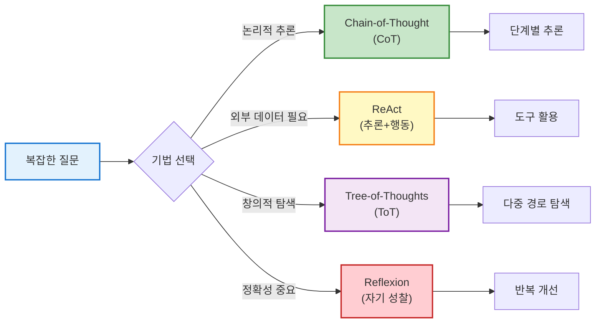
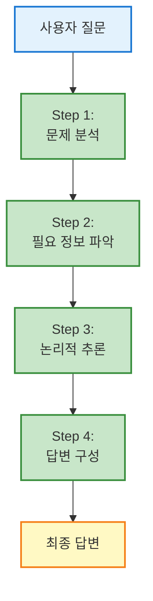
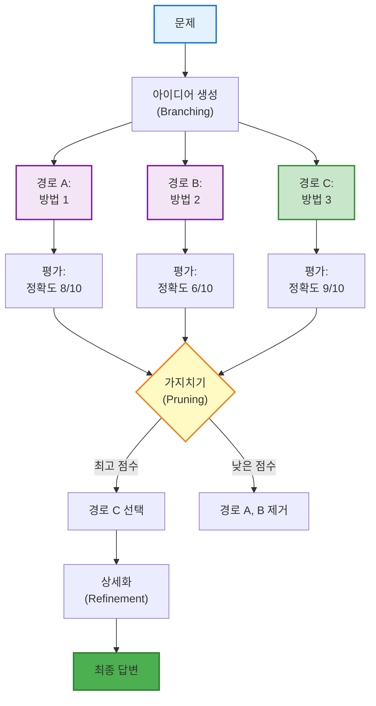
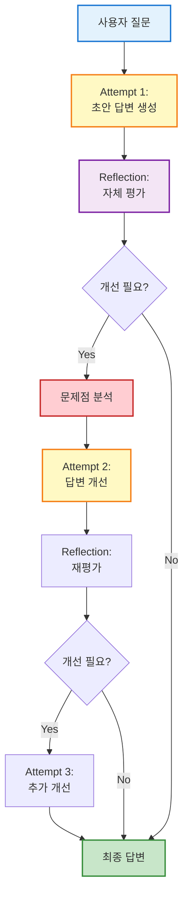
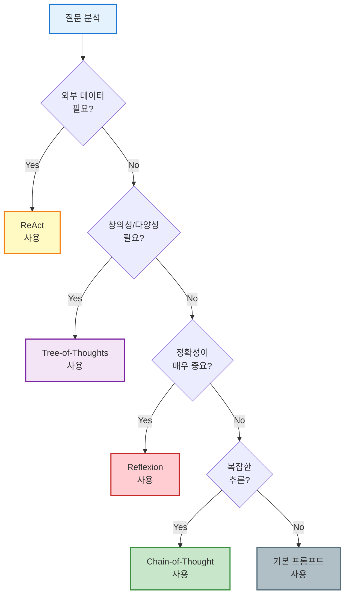

**강의 목표:** 이번 강의에서는 **프롬프트 엔지니어링 고도화 기법 네 가지**를 다룹니다. 실무에서 OpenAI API와 **LangChain4j**를 사용하는 개발자를 대상으로, 복잡한 질문에 대한 답변 품질을 높이는 **Chain-of-Thought (CoT)**, **ReAct**, **Tree-of-Thoughts (ToT)**, **Reflexion** 기법을 소개합니다. 각 기법별로 **사내 고객지원 시나리오**(예: 연차 휴가 문의, 사내 포털 사용법 안내, 정책 요약 등)를 통해 어떤 식으로 접근이 달라지는지 보여줍니다. 코드보다는 **시나리오 기반 예제, 머메이드 시퀀스 다이어그램**, 그리고 **워크플로 중심 설명**에 집중하며, LangChain4j 환경에서의 활용 방법도 함께 설명합니다.

**이 강의를 통해 얻을 수 있는 것:**

- 복잡한 문제를 단계별로 해결하는 CoT 기법 이해
- 외부 도구를 활용하는 ReAct 패턴 구현
- 다양한 해결 경로를 탐색하는 ToT 전략
- 자기 개선 루프를 통한 Reflexion 적용
- 각 기법의 장단점과 선택 기준 파악

## 1. 프롬프트 고도화 기법이 필요한 이유

기본적인 프롬프트로도 챗봇은 답변을 생성할 수 있지만, **복잡하거나 다단계 추론이 필요한 문제**에서는 추가 기법이 효과적입니다. 예를 들어 사용자가 **"제가 남은 연차가 며칠인지 알고 싶어요. 그리고 연차 신청은 어떻게 하나요?"**라고 물어본 상황을 생각해봅시다.

### 기본 프롬프트의 한계

**문제 상황:**

```
사용자: "남은 연차가 며칠인지 알고 싶고, 연차 신청은 어떻게 하나요?"

기본 프롬프트 응답:
"연차는 사내 포털에서 확인하실 수 있습니다. 
신청은 인사시스템에서 가능합니다."

❌ 문제점:
- 구체적인 남은 연차 일수를 알려주지 못함
- 정확한 절차가 누락됨
- 여러 정보를 통합하지 못함
```

### 고도화 기법으로 개선

이런 질문은 회사 규정, 사용자 개인 정보, 포털 사용법 등 **여러 정보를 아우르며**, 단계적인 판단과 검색이 필요합니다. 프롬프트 고도화 기법을 쓰면 AI 모델이 이러한 문제를 **작은 단계로 나누어 해결**하거나 **외부 도구를 활용**하고, **여러 해결 경로를 탐색**하거나 **자신의 답을 검토 및 개선**할 수 있습니다.

### 4가지 기법 비교 개요



> **핵심 요약:** CoT와 ToT는 **내부 추론**에 중점을 두고 (CoT는 선형, ToT는 가지치기), ReAct는 **행동(툴 사용)**을 포함하며, Reflexion은 **반복적 자기 피드백**을 통해 답변을 개선합니다.

아래에서는 각각의 기법을 **동일한 예시 시나리오**에 적용해보면서, 어떤 차이가 있는지 비교해보겠습니다. 시나리오는 "**사내 포털에서 연차를 신청하는 방법**"에 대한 사용자 질문으로 설정합니다.

---

## 2. Chain-of-Thought (연쇄 사고) 기법

### 2.1 개념

**Chain-of-Thought (CoT)**는 복잡한 문제를 풀 때 모델이 **생각의 연쇄**를 따르도록 유도하는 기법입니다. 한 번에 바로 답을 내는 대신 **중간 추론 단계들을 글로 풀어내도록** 프롬프트를 구성합니다.

**핵심 아이디어:**

- 사람이 문제를 풀 때처럼 단계별로 생각
- 각 단계의 추론 과정을 명시적으로 작성
- 복잡한 문제를 작은 문제들로 분해

### 2.2 작동 원리



### 2.3 프롬프트 설계

CoT를 쓰려면 프롬프트에 단계별 사고를 유도하는 문구를 추가합니다.

**Zero-shot CoT (예시 없음):**

```
질문: {사용자 질문}

답변하기 전에 단계별로 생각해봅시다:
1. 먼저 무엇을 해야 하는지 파악합니다
2. 필요한 정보가 무엇인지 확인합니다
3. 각 단계를 논리적으로 연결합니다
4. 최종 답변을 구성합니다

답변:
```

**Few-shot CoT (예시 포함):**

```
예시 1:
Q: 회의실 예약은 어떻게 하나요?
A: 단계별로 생각해보겠습니다.
   1. 회의실 예약 시스템 확인 → 사내 포털 이용
   2. 필요 정보 파악 → 날짜, 시간, 참석자
   3. 예약 절차 → 포털 로그인 > 시설관리 > 회의실 예약
   최종 답변: 사내 포털에 로그인 후...

Q: {실제 질문}
A: 단계별로 생각해보겠습니다.
   1. ...
```

### 2.4 예시 시나리오

**사용자 질문:** "연차를 어떻게 신청하나요?"

**CoT 기법 적용:**

```
🤖 (내부 추론 과정)

단계 1: 문제 분석
- 사용자가 알고 싶은 것: 연차 신청 절차
- 필요한 정보: 포털 접근 방법, 메뉴 위치, 필요 정보

단계 2: 필요한 정보 파악
- 사내 포털 로그인 방법
- 인사관리 메뉴 위치
- 연차 신청 양식 항목
- 결재 프로세스 여부

단계 3: 절차 정리
1. 포털 로그인
2. 인사관리 메뉴 접근
3. 연차/휴가 신청 선택
4. 양식 작성 (날짜, 사유)
5. 결재 제출

단계 4: 답변 구성
- 명확하고 순차적으로 설명
- 각 단계별 구체적 안내

🤖 (최종 답변)
"연차를 신청하시려면 다음 절차를 따르세요:

1. **포털 로그인**: company.com에 접속하여 로그인합니다
2. **메뉴 이동**: 상단 메뉴 > 인사관리 > 연차/휴가 신청
3. **양식 작성**: 
   - 휴가 시작일/종료일 선택
   - 연차 사유 입력 (선택사항)
   - 비상 연락처 입력
4. **결재 제출**: 양식 작성 후 '제출' 버튼 클릭
5. **승인 대기**: 담당자 승인 후 문자로 알림이 갑니다

추가로 궁금한 점이 있으시면 말씀해주세요."
```

### 2.5 LangChain4j 구현

**기본 구현:**

```java
import dev.langchain4j.model.chat.ChatLanguageModel;
import dev.langchain4j.model.openai.OpenAiChatModel;
import dev.langchain4j.data.message.AiMessage;
import dev.langchain4j.data.message.UserMessage;

public class CoTExample {
    
    public static void main(String[] args) {
        // 1. ChatModel 초기화
        ChatLanguageModel model = OpenAiChatModel.builder()
            .apiKey(System.getenv("OPENAI_API_KEY"))
            .modelName("gpt-4")
            .temperature(0.7)
            .build();
        
        // 2. CoT 프롬프트 템플릿
        String cotPrompt = """
            질문: %s
            
            답변하기 전에 단계별로 생각해봅시다:
            1. 먼저 문제를 분석합니다
            2. 필요한 정보를 파악합니다
            3. 각 단계를 논리적으로 연결합니다
            4. 최종 답변을 구성합니다
            
            단계별 생각:
            """;
        
        // 3. 사용자 질문
        String userQuestion = "연차를 어떻게 신청하나요?";
        String fullPrompt = String.format(cotPrompt, userQuestion);
        
        // 4. 모델 실행
        AiMessage response = model.generate(UserMessage.from(fullPrompt));
        
        System.out.println(response.text());
    }
}
```

**고급 구현 (체인 활용):**

```java
import dev.langchain4j.chain.ConversationalChain;
import dev.langchain4j.memory.chat.MessageWindowChatMemory;

public class AdvancedCoTExample {
    
    public static String executeCoTChain(String question) {
        ChatLanguageModel model = OpenAiChatModel.builder()
            .apiKey(System.getenv("OPENAI_API_KEY"))
            .modelName("gpt-4")
            .build();
        
        // 메모리 설정 (이전 추론 과정 기억)
        MessageWindowChatMemory memory = MessageWindowChatMemory.withMaxMessages(10);
        
        // 체인 구성
        ConversationalChain chain = ConversationalChain.builder()
            .chatLanguageModel(model)
            .chatMemory(memory)
            .build();
        
        // 단계별 프롬프트 실행
        // Step 1: 문제 분석
        String step1 = chain.execute(
            "질문: " + question + "\n\n이 질문을 해결하기 위해 필요한 단계들을 나열하세요."
        );
        
        // Step 2: 각 단계 실행
        String step2 = chain.execute(
            "위 단계들을 하나씩 실행하여 답변을 구성하세요."
        );
        
        // Step 3: 최종 답변 정리
        String finalAnswer = chain.execute(
            "위 내용을 바탕으로 사용자에게 명확하고 친절한 최종 답변을 작성하세요."
        );
        
        return finalAnswer;
    }
}
```

### 2.6 장단점

**장점:**

- ✅ 구현이 비교적 간단
- ✅ 추론 과정이 투명하여 디버깅 용이
- ✅ 수학, 논리 문제에 매우 효과적
- ✅ 모델의 실수를 줄임

**단점:**

- ⚠️ 외부 정보가 필요한 경우 한계
- ⚠️ 추론 과정이 길어져 토큰 소비 증가
- ⚠️ 잘못된 추론 경로에 빠질 위험

**적용 시나리오:**

- 복잡한 계산 문제
- 다단계 논리 추론
- 정책 해석 및 적용
- 절차 안내

---

## 3. ReAct (추론+행동) 기법

### 3.1 개념

**ReAct (Reasoning + Acting)**는 **모델이 사고(Reasoning)와 행동(Action)을 번갈아 수행**하도록 하는 프롬프트 패턴입니다. CoT가 오로지 내부 생각에 집중했다면, ReAct는 생각 도중에 **외부 도구를 사용**하는 단계를 포함합니다.

**핵심 아이디어:**

- 생각(Thought) → 행동(Action) → 관찰(Observation) 순환
- 외부 도구(API, DB, 검색 등) 활용
- 동적으로 정보 수집 및 활용

### 3.2 작동 원리

```mermaid
sequenceDiagram
    participant U as 사용자
    participant A as AI 에이전트
    participant T1 as HR DB 툴
    participant T2 as 문서 검색 툴
    
    U->>A: "남은 연차와 신청 방법 알려줘"
    
    activate A
    Note over A: Thought 1:<br/>먼저 남은 연차를 조회해야 함
    A->>T1: Action: query_vacation_days(user_id)
    activate T1
    T1-->>A: Observation: 남은 연차 5일
    deactivate T1
    
    Note over A: Thought 2:<br/>이제 신청 방법을 찾아야 함
    A->>T2: Action: search_docs("연차 신청")
    activate T2
    T2-->>A: Observation: 포털 > 인사관리 > 연차신청
    deactivate T2
    
    Note over A: Thought 3:<br/>두 정보를 합쳐 답변 구성
    A->>U: Answer: "남은 연차 5일입니다.<br/>신청은 포털 > 인사관리에서..."
    deactivate A
    
    style A fill:#fff9c4,stroke:#f57f17,stroke-width:2px
    style T1 fill:#c8e6c9,stroke:#388e3c,stroke-width:2px
    style T2 fill:#c8e6c9,stroke:#388e3c,stroke-width:2px
```

### 3.3 프롬프트 설계

ReAct 프롬프트는 **Thought - Action - Observation** 패턴을 명시합니다.

```
당신은 회사 정보를 제공하는 AI 어시스턴트입니다.

사용 가능한 도구:
1. query_hr_db(query) - 인사 데이터베이스 조회
2. search_docs(keyword) - 사내 문서 검색
3. check_policy(topic) - 회사 정책 확인

답변 형식:
Thought: [무엇을 해야 할지 생각]
Action: [도구명(인자)]
Observation: [도구 실행 결과]
... (필요시 반복)
Answer: [최종 답변]

질문: {사용자 질문}
```

### 3.4 예시 시나리오

**사용자 질문:** "올해 제 남은 연차가 몇 일인가요? 그리고 연차는 어떻게 신청하죠?"

**ReAct 실행 과정:**

```
🤖 Thought 1:
사용자가 두 가지를 묻고 있다:
1. 남은 연차 일수 (개인 정보 조회 필요)
2. 연차 신청 방법 (절차 정보 필요)
먼저 HR 데이터베이스에서 남은 연차를 확인하자.

🤖 Action 1:
query_hr_db("SELECT remaining_vacation_days FROM employees WHERE name='홍길동'")

🤖 Observation 1:
결과: {"remaining_vacation_days": 5}
홍길동님의 남은 연차는 5일입니다.

🤖 Thought 2:
이제 남은 연차 정보를 얻었다. 다음은 연차 신청 절차를 찾아야 한다.
사내 문서를 검색하자.

🤖 Action 2:
search_docs("연차 신청 절차")

🤖 Observation 2:
검색 결과:
제목: "연차 신청 가이드"
내용: "1. 사내 포털 로그인
       2. 인사관리 > 근태관리 > 연차신청
       3. 양식 작성 후 제출
       4. 담당자 승인 대기"

🤖 Thought 3:
이제 두 가지 정보를 모두 얻었다. 
사용자에게 명확하게 답변을 구성하자.

🤖 Answer:
"홍길동님, 현재 남은 연차는 **5일**입니다.

연차를 신청하시려면:
1. 사내 포털(portal.company.com)에 로그인
2. 인사관리 > 근태관리 > 연차신청 메뉴 선택
3. 연차 사용 날짜와 사유 입력
4. 제출 후 담당자 승인 대기 (보통 1영업일 소요)

추가 문의사항이 있으시면 언제든 말씀해주세요!"
```

### 3.5 LangChain4j 구현

**Tool 정의:**

```java
import dev.langchain4j.agent.tool.Tool;

public class HRTools {
    
    @Tool("HR 데이터베이스에서 직원의 남은 연차를 조회합니다")
    public int queryRemainingVacationDays(String employeeName) {
        // 실제로는 DB 조회
        // 예시를 위해 하드코딩
        if (employeeName.equals("홍길동")) {
            return 5;
        }
        return 0;
    }
    
    @Tool("사내 문서를 검색하여 관련 정보를 반환합니다")
    public String searchInternalDocs(String keyword) {
        // 실제로는 문서 검색 시스템 호출
        if (keyword.contains("연차")) {
            return """
                [연차 신청 가이드]
                1. 포털 로그인: portal.company.com
                2. 메뉴: 인사관리 > 근태관리 > 연차신청
                3. 양식 작성: 시작일, 종료일, 사유 입력
                4. 제출 후 승인 대기
                """;
        }
        return "관련 문서를 찾을 수 없습니다.";
    }
}
```

**ReAct 에이전트 구성:**

```java
import dev.langchain4j.service.AiServices;
import dev.langchain4j.memory.chat.MessageWindowChatMemory;

public class ReActAgent {
    
    interface AssistantAgent {
        String chat(String userMessage);
    }
    
    public static void main(String[] args) {
        // 1. 도구 인스턴스 생성
        HRTools hrTools = new HRTools();
        
        // 2. ChatModel 초기화
        ChatLanguageModel model = OpenAiChatModel.builder()
            .apiKey(System.getenv("OPENAI_API_KEY"))
            .modelName("gpt-4")
            .temperature(0.0)  // 일관된 도구 사용을 위해 낮게 설정
            .build();
        
        // 3. 메모리 설정
        MessageWindowChatMemory memory = MessageWindowChatMemory.withMaxMessages(10);
        
        // 4. AI Service 생성 (도구 등록)
        AssistantAgent agent = AiServices.builder(AssistantAgent.class)
            .chatLanguageModel(model)
            .chatMemory(memory)
            .tools(hrTools)  // 도구 등록
            .build();
        
        // 5. 질문 실행
        String question = "홍길동의 남은 연차와 신청 방법을 알려주세요.";
        String answer = agent.chat(question);
        
        System.out.println(answer);
    }
}
```

**고급 구현 (커스텀 ReAct 루프):**

```java
public class CustomReActLoop {
    
    private ChatLanguageModel model;
    private HRTools tools;
    private int maxIterations = 5;
    
    public String execute(String userQuestion) {
        String systemPrompt = """
            당신은 ReAct 패턴을 따르는 AI 어시스턴트입니다.
            
            답변 형식:
            Thought: [다음에 무엇을 해야 할지 생각]
            Action: [사용할 도구와 인자]
            
            최종 답변이 준비되면:
            Answer: [사용자에게 전달할 답변]
            """;
        
        String context = systemPrompt + "\n질문: " + userQuestion;
        
        for (int i = 0; i < maxIterations; i++) {
            AiMessage response = model.generate(UserMessage.from(context));
            String responseText = response.text();
            
            // Thought 추출
            if (responseText.contains("Thought:")) {
                String thought = extractThought(responseText);
                System.out.println("💭 Thought: " + thought);
            }
            
            // Action 실행
            if (responseText.contains("Action:")) {
                String action = extractAction(responseText);
                String observation = executeAction(action);
                System.out.println("🔧 Action: " + action);
                System.out.println("👀 Observation: " + observation);
                
                // 컨텍스트에 Observation 추가
                context += "\nObservation: " + observation;
                continue;
            }
            
            // Answer 도달
            if (responseText.contains("Answer:")) {
                String answer = extractAnswer(responseText);
                return answer;
            }
        }
        
        return "최대 반복 횟수에 도달했습니다.";
    }
    
    private String executeAction(String action) {
        // 도구 실행 로직
        if (action.contains("queryRemainingVacationDays")) {
            String name = extractParameter(action);
            return String.valueOf(tools.queryRemainingVacationDays(name));
        } else if (action.contains("searchInternalDocs")) {
            String keyword = extractParameter(action);
            return tools.searchInternalDocs(keyword);
        }
        return "알 수 없는 액션입니다.";
    }
    
    // 헬퍼 메서드들...
}
```

### 3.6 장단점

**장점:**

- ✅ 실시간 데이터 조회 가능
- ✅ 동적으로 정보 수집
- ✅ 최신 정보 반영
- ✅ 복잡한 작업 자동화

**단점:**

- ⚠️ 도구 설정 및 관리 복잡
- ⚠️ 도구 실행 시간 지연
- ⚠️ 도구 오류 처리 필요
- ⚠️ 비용 증가 (여러 API 호출)

**적용 시나리오:**

- 개인화된 정보 조회
- 실시간 데이터 필요
- 여러 시스템 연동
- 동적 의사결정

---

## 4. Tree-of-Thoughts (사고의 나무) 기법

### 4.1 개념

**Tree-of-Thoughts (ToT)**는 **하나의 문제에 대해 여러 가능한 생각의 경로(branch)를 탐색**하는 방법입니다. CoT가 하나의 직선적인 추론 사슬이라면, ToT는 마치 나무(Tree)처럼 **여러 갈래의 추론을 동시에 전개**합니다.

**핵심 아이디어:**

- 여러 해결 경로 동시 탐색
- 각 경로를 평가하여 가지치기
- 최적의 경로 선택

### 4.2 작동 원리



### 4.3 프롬프트 설계

ToT는 보통 **여러 번의 모델 호출**로 구현됩니다.

**1단계: 아이디어 생성**

```
질문: {사용자 질문}

이 문제를 해결하기 위한 3가지 다른 접근 방법을 제시하세요.
각 접근 방법은 서로 다른 관점을 가져야 합니다.

접근 1:
접근 2:
접근 3:
```

**2단계: 평가**

```
다음 3가지 접근 방법을 평가하세요:

접근 1: {방법1}
접근 2: {방법2}
접근 3: {방법3}

각 접근 방법을:
- 정확성 (1-10점)
- 완전성 (1-10점)
- 실용성 (1-10점)

으로 평가하고, 가장 좋은 방법을 선택하세요.
```

**3단계: 최종 답변**

```
선택된 접근 방법: {최고 점수 방법}

위 방법을 바탕으로 사용자에게 명확하고 완전한 답변을 작성하세요.
```

### 4.4 예시 시나리오

**사용자 질문:** "우리 회사 연차 정책을 한 문장으로 요약해 줄 수 있나요? 추가로, 내년에 남은 연차 이월이 가능한지도 알려주세요."

**ToT 실행 과정:**

```
━━━━━━━━━━━━━━━━━━━━━━━━━━━━━━━━━━━━━━━━
🌳 STEP 1: 아이디어 생성 (Branching)
━━━━━━━━━━━━━━━━━━━━━━━━━━━━━━━━━━━━━━━━

🤖 경로 A: 정책 원문 기반 접근
전략: 회사 규정 문서에서 정확한 문구를 찾아 인용
장점: 가장 정확함
단점: 문서를 찾아야 하고 시간이 걸림

답변 초안:
"당사의 연차 정책에 따르면, '근로기준법에 의거하여 
연차유급휴가는 입사 1년 후 15일을 부여하며, 
미사용 연차는 다음 해로 이월되지 않습니다.'"

━━━━━━━━━━━━━━━━━━━━━━━━━━━━━━━━━━━━━━━━

🤖 경로 B: 간결한 요약 접근
전략: 핵심만 추려서 한 문장으로 압축
장점: 이해하기 쉽고 간결함
단점: 세부 사항 누락 가능

답변 초안:
"입사 1년 후 연차 15일이 부여되며, 
미사용 연차는 이월되지 않습니다."

━━━━━━━━━━━━━━━━━━━━━━━━━━━━━━━━━━━━━━━━

🤖 경로 C: 질문 중심 접근
전략: 사용자가 궁금해하는 핵심(이월 여부)에 집중
장점: 사용자 니즈에 정확히 대응
단점: 전체 정책 설명이 부족할 수 있음

답변 초안:
"당사는 연차를 다음 해로 이월할 수 없으며, 
해당 연도 내에 모두 사용해야 합니다."

━━━━━━━━━━━━━━━━━━━━━━━━━━━━━━━━━━━━━━━━
📊 STEP 2: 평가 (Evaluation)
━━━━━━━━━━━━━━━━━━━━━━━━━━━━━━━━━━━━━━━━

평가 기준:
- 정확성: 정책을 정확히 전달하는가?
- 완전성: 두 질문(요약 + 이월)을 모두 답했는가?
- 명확성: 사용자가 쉽게 이해할 수 있는가?

경로 A 평가:
✅ 정확성: 9/10 (원문 기반)
⚠️ 완전성: 7/10 (이월 관련 명시적 답변 부족)
⚠️ 명확성: 6/10 (형식적이고 길음)
총점: 22/30

경로 B 평가:
✅ 정확성: 8/10
✅ 완전성: 9/10 (두 질문 모두 답함)
✅ 명확성: 9/10 (간결하고 명확)
총점: 26/30 ⭐ 최고 점수

경로 C 평가:
✅ 정확성: 9/10
⚠️ 완전성: 6/10 (전체 정책 설명 부족)
✅ 명확성: 8/10
총점: 23/30

━━━━━━━━━━━━━━━━━━━━━━━━━━━━━━━━━━━━━━━━
🎯 STEP 3: 선택 및 정교화
━━━━━━━━━━━━━━━━━━━━━━━━━━━━━━━━━━━━━━━━

선택된 경로: B (총점 26/30)

경로 B를 기반으로 최종 답변 작성:

🤖 최종 답변:
"우리 회사의 연차 정책을 요약하면:
**'입사 1년 후 연차 15일이 부여되며, 
미사용 연차는 다음 해로 이월되지 않습니다.'**

따라서 내년으로 연차를 이월하실 수는 없으며, 
올해 안에 모두 사용하셔야 합니다. 😊

연차 계획에 도움이 필요하시면 말씀해주세요!"
```

### 4.5 LangChain4j 구현

```java
import dev.langchain4j.model.chat.ChatLanguageModel;
import dev.langchain4j.data.message.AiMessage;
import java.util.*;

public class TreeOfThoughtsExample {
    
    private ChatLanguageModel model;
    
    public String executeToT(String question) {
        // Step 1: 여러 아이디어 생성
        List<String> ideas = generateIdeas(question, 3);
        
        // Step 2: 각 아이디어 평가
        Map<String, Integer> scores = evaluateIdeas(ideas);
        
        // Step 3: 최고 점수 선택
        String bestIdea = selectBestIdea(ideas, scores);
        
        // Step 4: 최종 답변 정교화
        String finalAnswer = refineAnswer(bestIdea, question);
        
        return finalAnswer;
    }
    
    private List<String> generateIdeas(String question, int numIdeas) {
        String prompt = String.format("""
            질문: %s
            
            이 질문에 답하기 위한 %d가지 서로 다른 접근 방법을 제시하세요.
            각 접근은 다른 관점이나 전략을 가져야 합니다.
            
            접근 1:
            접근 2:
            접근 3:
            """, question, numIdeas);
        
        AiMessage response = model.generate(UserMessage.from(prompt));
        String text = response.text();
        
        // 각 접근 방법 파싱
        List<String> ideas = new ArrayList<>();
        String[] lines = text.split("\n");
        StringBuilder currentIdea = new StringBuilder();
        
        for (String line : lines) {
            if (line.startsWith("접근 ")) {
                if (currentIdea.length() > 0) {
                    ideas.add(currentIdea.toString().trim());
                    currentIdea = new StringBuilder();
                }
            }
            currentIdea.append(line).append("\n");
        }
        if (currentIdea.length() > 0) {
            ideas.add(currentIdea.toString().trim());
        }
        
        return ideas;
    }
    
    private Map<String, Integer> evaluateIdeas(List<String> ideas) {
        Map<String, Integer> scores = new HashMap<>();
        
        for (int i = 0; i < ideas.size(); i++) {
            String prompt = String.format("""
                다음 접근 방법을 평가하세요:
                
                %s
                
                평가 기준:
                - 정확성 (1-10)
                - 완전성 (1-10)
                - 명확성 (1-10)
                
                각 항목 점수를 제시하고, 총점을 계산하세요.
                마지막 줄에 "총점: XX/30" 형식으로 작성하세요.
                """, ideas.get(i));
            
            AiMessage response = model.generate(UserMessage.from(prompt));
            String text = response.text();
            
            // 총점 추출
            int score = extractTotalScore(text);
            scores.put(ideas.get(i), score);
        }
        
        return scores;
    }
    
    private String selectBestIdea(List<String> ideas, Map<String, Integer> scores) {
        return ideas.stream()
            .max(Comparator.comparingInt(scores::get))
            .orElse(ideas.get(0));
    }
    
    private String refineAnswer(String bestIdea, String originalQuestion) {
        String prompt = String.format("""
            원래 질문: %s
            
            선택된 최고의 접근 방법:
            %s
            
            위 접근 방법을 바탕으로 사용자에게 명확하고 친절한 
            최종 답변을 작성하세요.
            """, originalQuestion, bestIdea);
        
        AiMessage response = model.generate(UserMessage.from(prompt));
        return response.text();
    }
    
    private int extractTotalScore(String text) {
        // "총점: 26/30" 형태에서 26 추출
        String[] lines = text.split("\n");
        for (String line : lines) {
            if (line.contains("총점:")) {
                String[] parts = line.split(":");
                if (parts.length > 1) {
                    String scorePart = parts[1].trim().split("/")[0];
                    return Integer.parseInt(scorePart);
                }
            }
        }
        return 0;
    }
    
    // 사용 예시
    public static void main(String[] args) {
        TreeOfThoughtsExample tot = new TreeOfThoughtsExample();
        tot.model = OpenAiChatModel.builder()
            .apiKey(System.getenv("OPENAI_API_KEY"))
            .modelName("gpt-4")
            .temperature(0.7)
            .build();
        
        String question = "우리 회사 연차 정책을 요약하고, 이월 가능 여부를 알려주세요.";
        String answer = tot.executeToT(question);
        
        System.out.println(answer);
    }
}
```

### 4.6 장단점

**장점:**

- ✅ 다양한 관점 탐색
- ✅ 창의적 문제 해결
- ✅ 최적의 답변 선택
- ✅ 편향 감소

**단점:**

- ⚠️ 구현 복잡도 높음
- ⚠️ 여러 번 모델 호출 → 비용 증가
- ⚠️ 응답 시간 증가
- ⚠️ 평가 기준 설정 어려움

**적용 시나리오:**

- 창의적 글쓰기
- 전략 수립
- 복잡한 의사결정
- 다양한 해법이 존재하는 문제

---

## 5. Reflexion (자기 성찰) 기법

### 5.1 개념

**Reflexion**은 모델이 **자신의 응답을 반성(reflect)하여 개선**하도록 하는 접근입니다. 한번 답변을 내고 끝내는 대신, **피드백을 받고 스스로 오류를 분석**한 뒤 답변을 수정합니다.

**핵심 아이디어:**

- 초안 답변 생성
- 자체 평가 및 비판
- 개선점 도출
- 수정된 답변 생성

### 5.2 작동 원리



### 5.3 프롬프트 설계

**1단계: 초안 생성**

```
질문: {사용자 질문}

답변을 작성하세요:
```

**2단계: 자체 평가**

```
당신이 방금 작성한 답변:
{초안 답변}

이 답변을 비판적으로 검토하세요:
1. 정확성: 사실 오류가 있는가?
2. 완전성: 누락된 정보가 있는가?
3. 명확성: 이해하기 어려운 부분이 있는가?

문제점:
```

**3단계: 개선**

```
원래 질문: {질문}
초안 답변: {초안}
발견된 문제점: {문제점}

위 문제점을 해결한 개선된 답변을 작성하세요:
```

### 5.4 예시 시나리오

**사용자 질문:** "우리 회사의 연차 이월 규정이 어떻게 되죠?"

**Reflexion 실행 과정:**

```
━━━━━━━━━━━━━━━━━━━━━━━━━━━━━━━━━━━━━━━━
🔄 ATTEMPT 1: 초안 답변
━━━━━━━━━━━━━━━━━━━━━━━━━━━━━━━━━━━━━━━━

🤖 초안:
"연차 이월이 가능합니다. 올해 사용하지 않은 연차는 
내년으로 자동 이월됩니다."

━━━━━━━━━━━━━━━━━━━━━━━━━━━━━━━━━━━━━━━━
🔍 REFLECTION 1: 자체 평가
━━━━━━━━━━━━━━━━━━━━━━━━━━━━━━━━━━━━━━━━

🤔 자기 검토:
"잠깐, 이 답변이 정확한가? 

문제점 분석:
1. 정확성: ❌ 우리 회사 정책상 연차 이월이 **불가능**했던 것 같다
2. 근거: 작년에 연차 소진 독려 메일을 받았던 기억이 있음
3. 확신도: 낮음 (60%)

판단: 회사 정책 문서를 다시 확인해야 함"

━━━━━━━━━━━━━━━━━━━━━━━━━━━━━━━━━━━━━━━━
🔄 ATTEMPT 2: 개선된 답변
━━━━━━━━━━━━━━━━━━━━━━━━━━━━━━━━━━━━━━━━

🤖 수정안:
"죄송합니다, 제가 확인한 바로는 우리 회사는 
**연차 이월이 불가능**합니다. 

즉, 올해 사용하지 않은 연차는 다음 해로 
넘어가지 않으며, 해당 연도 내에 모두 
사용하셔야 합니다.

연차 소진 계획에 도움이 필요하시면 
인사팀(ext. 1234)으로 문의하세요."

━━━━━━━━━━━━━━━━━━━━━━━━━━━━━━━━━━━━━━━━
🔍 REFLECTION 2: 재평가
━━━━━━━━━━━━━━━━━━━━━━━━━━━━━━━━━━━━━━━━

🤔 자기 검토:
"개선된 답변 평가:

1. 정확성: ✅ 회사 정책과 일치
2. 완전성: ✅ 이월 불가 사실 + 추가 안내
3. 명확성: ✅ 명확하고 이해하기 쉬움
4. 친절도: ✅ 사과 + 추가 도움 제안

판단: 이제 충분히 좋은 답변이다. 승인!"

━━━━━━━━━━━━━━━━━━━━━━━━━━━━━━━━━━━━━━━━
✅ FINAL: 최종 답변
━━━━━━━━━━━━━━━━━━━━━━━━━━━━━━━━━━━━━━━━

🤖 최종 답변:
"죄송합니다, 제가 확인한 바로는 우리 회사는 
**연차 이월이 불가능**합니다. 

즉, 올해 사용하지 않은 연차는 다음 해로 
넘어가지 않으며, 해당 연도 내에 모두 
사용하셔야 합니다.

연차 소진 계획에 도움이 필요하시면 
인사팀(ext. 1234)으로 문의하세요."
```

### 5.5 LangChain4j 구현

**기본 구현:**

```java
import dev.langchain4j.model.chat.ChatLanguageModel;
import dev.langchain4j.chain.ConversationalChain;

public class ReflexionExample {
    
    private ChatLanguageModel model;
    private int maxIterations = 3;
    
    public String executeReflexion(String question) {
        String currentAnswer = "";
        
        for (int iteration = 1; iteration <= maxIterations; iteration++) {
            System.out.println("\n━━━━ ATTEMPT " + iteration + " ━━━━");
            
            // Step 1: 답변 생성 (첫 시도 또는 개선)
            if (iteration == 1) {
                currentAnswer = generateInitialAnswer(question);
            } else {
                currentAnswer = improveAnswer(question, currentAnswer, lastReflection);
            }
            
            System.out.println("답변: " + currentAnswer);
            
            // Step 2: 자체 평가
            System.out.println("\n━━━━ REFLECTION " + iteration + " ━━━━");
            String reflection = reflect(currentAnswer, question);
            System.out.println("평가: " + reflection);
            
            // Step 3: 개선 필요 여부 판단
            if (isGoodEnough(reflection)) {
                System.out.println("\n✅ 충분히 좋은 답변입니다!");
                break;
            }
            
            lastReflection = reflection;
        }
        
        return currentAnswer;
    }
    
    private String generateInitialAnswer(String question) {
        String prompt = String.format("""
            질문: %s
            
            위 질문에 답변하세요:
            """, question);
        
        return model.generate(UserMessage.from(prompt)).text();
    }
    
    private String reflect(String answer, String question) {
        String prompt = String.format("""
            원래 질문: %s
            
            작성된 답변:
            %s
            
            이 답변을 비판적으로 검토하세요:
            
            1. 정확성: 사실 오류가 있는가? (Yes/No + 설명)
            2. 완전성: 질문에 충분히 답했는가? (Yes/No + 설명)
            3. 명확성: 이해하기 쉬운가? (Yes/No + 설명)
            
            개선이 필요하면 "NEEDS_IMPROVEMENT"로 시작하고 이유를 설명하세요.
            충분히 좋으면 "APPROVED"로 시작하세요.
            """, question, answer);
        
        return model.generate(UserMessage.from(prompt)).text();
    }
    
    private String improveAnswer(String question, String oldAnswer, String reflection) {
        String prompt = String.format("""
            원래 질문: %s
            
            이전 답변:
            %s
            
            문제점:
            %s
            
            위 문제점을 해결한 개선된 답변을 작성하세요:
            """, question, oldAnswer, reflection);
        
        return model.generate(UserMessage.from(prompt)).text();
    }
    
    private boolean isGoodEnough(String reflection) {
        return reflection.toUpperCase().startsWith("APPROVED");
    }
    
    // 사용 예시
    public static void main(String[] args) {
        ReflexionExample reflexion = new ReflexionExample();
        reflexion.model = OpenAiChatModel.builder()
            .apiKey(System.getenv("OPENAI_API_KEY"))
            .modelName("gpt-4")
            .temperature(0.7)
            .build();
        
        String question = "우리 회사의 연차 이월 규정이 어떻게 되나요?";
        String finalAnswer = reflexion.executeReflexion(question);
        
        System.out.println("\n━━━━ 최종 답변 ━━━━");
        System.out.println(finalAnswer);
    }
}
```

**고급 구현 (별도 평가자 모델):**

```java
public class AdvancedReflexionExample {
    
    private ChatLanguageModel actorModel;   // 답변 생성용
    private ChatLanguageModel criticModel;  // 평가용
    
    public String executeWithSeparateModels(String question) {
        String currentAnswer = actorModel.generate(
            UserMessage.from("질문: " + question + "\n답변:")
        ).text();
        
        for (int i = 0; i < 3; i++) {
            // 평가자 모델로 비평
            String criticism = criticModel.generate(UserMessage.from(
                String.format("""
                    다음 답변을 전문가 입장에서 비평하세요:
                    
                    질문: %s
                    답변: %s
                    
                    문제점과 개선 방향을 구체적으로 제시하세요.
                    """, question, currentAnswer)
            )).text();
            
            if (criticism.contains("문제 없음") || criticism.contains("충분")) {
                break;
            }
            
            // 액터 모델로 개선
            currentAnswer = actorModel.generate(UserMessage.from(
                String.format("""
                    원래 답변: %s
                    평가: %s
                    
                    평가를 반영하여 답변을 개선하세요:
                    """, currentAnswer, criticism)
            )).text();
        }
        
        return currentAnswer;
    }
}
```

### 5.6 장단점

**장점:**

- ✅ 오류 자체 수정
- ✅ 정확도 향상
- ✅ 환각(hallucination) 감소
- ✅ 답변 품질 개선

**단점:**

- ⚠️ 여러 번 모델 호출 → 비용 증가
- ⚠️ 응답 시간 증가 (2~3배)
- ⚠️ 무한 루프 위험
- ⚠️ 과도한 자기 검열 가능

**적용 시나리오:**

- 고위험 의사결정
- 정확성이 매우 중요한 경우
- 법률, 의료, 금융 자문
- 중요 정책 안내

**비용 관리 팁:**

```java
// 중요도에 따라 선택적 적용
public String answerWithPriority(String question, int priority) {
    if (priority >= 8) {
        // 고위험: Reflexion 적용
        return executeReflexion(question);
    } else if (priority >= 5) {
        // 중위험: 1회 검토만
        String answer = generateAnswer(question);
        String reflection = quickReflect(answer);
        return reflection.contains("APPROVED") ? answer : improveOnce(answer);
    } else {
        // 저위험: 일반 답변
        return generateAnswer(question);
    }
}
```

---

## 6. 기법 비교 및 선택 가이드

### 6.1 종합 비교표

|기법|주요 특징|적용 시나리오|구현 난이도|비용|응답 시간|
|:-:|---|---|:-:|:-:|:-:|
|**CoT**|단계별 추론|논리/수학 문제, 절차 안내|⭐ 낮음|💰 낮음|⚡ 빠름|
|**ReAct**|도구 활용|실시간 데이터, 개인화 정보|⭐⭐ 중간|💰💰 중간|⚡⚡ 중간|
|**ToT**|다중 경로 탐색|창의적 문제, 전략 수립|⭐⭐⭐ 높음|💰💰💰 높음|⚡⚡⚡ 느림|
|**Reflexion**|자기 개선|정확성 중요, 고위험 결정|⭐⭐ 중간|💰💰💰 높음|⚡⚡⚡ 느림|

### 6.2 의사결정 트리



### 6.3 기법별 강점 분석

**Chain-of-Thought (CoT)**

```
강점:
✅ 추론 과정 가시화
✅ 구현 간단
✅ 수학/논리 문제에 탁월
✅ 디버깅 용이

약점:
❌ 외부 정보 한계
❌ 단일 경로만 탐색
❌ 오류 자체 수정 불가

최적 사용:
→ 절차 안내 (연차 신청 방법)
→ 정책 해석
→ 계산 문제
```

**ReAct**

```
강점:
✅ 실시간 데이터 활용
✅ 도구 통합
✅ 동적 응답
✅ 최신 정보 반영

약점:
❌ 도구 설정 복잡
❌ 응답 시간 증가
❌ 도구 의존성

최적 사용:
→ 개인 정보 조회 (남은 연차 확인)
→ 데이터베이스 검색
→ 여러 시스템 연동
```

**Tree-of-Thoughts (ToT)**

```
강점:
✅ 다양한 관점
✅ 창의적 해결
✅ 최적 경로 선택
✅ 편향 감소

약점:
❌ 구현 복잡
❌ 비용 증가
❌ 응답 시간 증가
❌ 평가 기준 필요

최적 사용:
→ 전략 수립
→ 창의적 글쓰기
→ 복잡한 의사결정
```

**Reflexion**

```
강점:
✅ 오류 자체 수정
✅ 정확도 향상
✅ 환각 감소
✅ 품질 보장

약점:
❌ 비용 증가
❌ 응답 시간 증가
❌ 무한 루프 위험
❌ 과도한 검열

최적 사용:
→ 고위험 결정
→ 법률/의료/금융 자문
→ 중요 정책 안내
```

### 6.4 하이브리드 접근

기법들을 조합하여 더 강력한 시스템을 만들 수 있습니다.

**예시 1: CoT + ReAct**

```java
public String hybridCoTReAct(String question) {
    // Step 1: CoT로 문제 분해
    String plan = cotPlanning(question);
    // "1. 남은 연차 조회 필요
    //  2. 신청 방법 검색 필요"
    
    // Step 2: ReAct로 각 단계 실행
    String result1 = reactExecute("남은 연차 조회");
    String result2 = reactExecute("신청 방법 검색");
    
    // Step 3: 결과 종합
    return combineResults(result1, result2);
}
```

**예시 2: ToT + Reflexion**

```java
public String hybridToTReflexion(String question) {
    // Step 1: ToT로 여러 답변 생성
    List<String> candidates = treeOfThoughts(question);
    // [답변A, 답변B, 답변C]
    
    // Step 2: Reflexion으로 각 후보 개선
    List<String> improved = new ArrayList<>();
    for (String candidate : candidates) {
        improved.add(reflexion(candidate));
    }
    
    // Step 3: 최종 선택
    return selectBest(improved);
}
```

### 6.5 실무 적용 체크리스트

기법 선택 전에 다음을 확인하세요:

**□ 질문 분석**

- [ ] 질문의 복잡도는? (단순/중간/복잡)
- [ ] 외부 데이터가 필요한가?
- [ ] 실시간 정보가 필요한가?
- [ ] 여러 해법이 존재하는가?

**□ 요구사항 확인**

- [ ] 정확도 요구 수준은? (낮음/중간/높음)
- [ ] 응답 시간 제약은?
- [ ] 비용 예산은?
- [ ] 설명 가능성이 필요한가?

**□ 리소스 확인**

- [ ] 사용 가능한 API/도구는?
- [ ] 개발 시간은 충분한가?
- [ ] 유지보수 리소스는?
- [ ] 모니터링 체계는?

**□ 기법 선택**

- [ ] CoT: 복잡한 추론 + 설명 필요
- [ ] ReAct: 외부 데이터 + 도구 활용
- [ ] ToT: 창의성 + 다양한 관점
- [ ] Reflexion: 정확성 + 고위험

---

## 7. 실습 과제

### 과제 1: 기법 선택 및 설계 (필수)

**과제 설명:**

다음 3가지 시나리오에 대해 가장 적합한 프롬프트 기법을 선택하고, 그 이유를 설명하세요.

**시나리오 A: 복잡한 수학 문제**

```
사용자 질문:
"회사에서 직원 50명에게 복리후생비로 1인당 월 30만원을 
지급합니다. 연간 총 비용은 얼마이고, 이를 분기별로 
균등 배분하면 각 분기당 얼마를 준비해야 하나요? 
또한 10% 증액 시 추가 필요 예산은?"
```

**시나리오 B: 실시간 정보 조회**

```
사용자 질문:
"김철수 팀장님의 이번 주 일정을 확인하고, 
내일 오후 2시에 30분 회의가 가능한지 
알려주세요. 가능하면 바로 회의실도 예약해주세요."
```

**시나리오 C: 정책 요약**

```
사용자 질문:
"우리 회사의 재택근무 정책을 신입사원도 이해하기 쉽게 
요약해주세요. 여러 관점에서 정리하되, 가장 명확하고 
정확한 버전으로 최종 제시해주세요."
```

**제출 형식:**

```markdown
## 시나리오 A 분석

### 선택한 기법
[CoT / ReAct / ToT / Reflexion]

### 선택 이유
1. 질문 특성: [설명]
2. 기법 적합성: [설명]
3. 예상 효과: [설명]

### 프롬프트 설계 (간단히)
```

[프롬프트 예시]

```

### 예상 실행 흐름
1. [단계 1]
2. [단계 2]
3. [최종 답변]

[시나리오 B, C도 동일 형식으로 작성]
```

---

### 과제 2: 프롬프트 구현 (선택)

**과제 설명:**

과제 1에서 선택한 기법 중 하나를 실제로 구현하세요.

**요구사항:**

1. LangChain4j 또는 Python LangChain 사용
2. 실행 가능한 코드 작성
3. 주석으로 각 단계 설명
4. 실행 결과 캡처 포함

**제출 형식:**

```java
// 또는 Python

/**
 * [기법 이름] 구현
 * 시나리오: [A/B/C]
 * 
 * 구현 내용:
 * - [주요 기능 1]
 * - [주요 기능 2]
 */
 
public class PromptTechniqueImplementation {
    // 코드 구현
}
```

---

### 과제 3: 비교 분석 (심화)

**과제 설명:**

동일한 질문에 대해 2가지 이상의 기법을 적용하고, 결과를 비교 분석하세요.

**실험 질문:**

```
"우리 회사 직원이 경조사 휴가를 신청하려면 어떤 절차를 
밟아야 하나요? 필요한 서류와 승인 프로세스도 알려주세요."
```

**요구사항:**

1. 최소 2가지 기법 적용 (예: CoT vs Reflexion)
2. 각 기법의 실행 과정 기록
3. 답변 품질 비교
4. 장단점 분석

**제출 형식:**

```markdown
## 실험 설계

### 테스트 기법
1. [기법 1]
2. [기법 2]

### 평가 기준
- 정확성
- 완전성
- 응답 시간
- 비용

## 실험 결과

### 기법 1: [이름]
[실행 과정 및 결과]

### 기법 2: [이름]
[실행 과정 및 결과]

## 비교 분석

| 기준 | 기법 1 | 기법 2 | 승자 |
|------|--------|--------|------|
| 정확성 | 8/10 | 9/10 | 기법 2 |
| 완전성 | 9/10 | 8/10 | 기법 1 |
| 응답 시간 | 2초 | 5초 | 기법 1 |
| 비용 | $0.05 | $0.12 | 기법 1 |

## 결론 및 권장사항
[종합 분석 및 실무 적용 제안]
```

---

## 8. 평가 기준

### 과제 1 평가 (40점)

|항목|기준|배점|
|---|---|:-:|
|**기법 선택 적절성**|시나리오 특성을 정확히 파악하고 가장 적합한 기법 선택|15점|
|**선택 이유 논리성**|기법 선택 이유가 명확하고 설득력 있음|10점|
|**프롬프트 설계**|선택한 기법의 핵심 요소를 포함한 프롬프트 작성|10점|
|**실행 흐름 이해**|기법의 작동 과정을 정확히 이해하고 설명|5점|

**채점 세부 기준:**

**15점 (만점):**

- 3개 시나리오 모두 최적 기법 선택
- 각 시나리오의 특성 정확히 분석
- 기법 선택 이유 명확

**10-14점:**

- 2개 시나리오 적절한 선택
- 일부 분석 미흡
- 대안 기법 가능

**5-9점:**

- 1개만 적절
- 선택 이유 불명확
- 기법 이해 부족

**0-4점:**

- 부적절한 선택
- 논리 결여

---

### 과제 2 평가 (30점)

|항목|기준|배점|
|---|---|:-:|
|**코드 완성도**|실행 가능하고 오류 없음|10점|
|**기법 구현 정확성**|선택한 기법의 핵심 특징 구현|10점|
|**코드 품질**|주석, 가독성, 구조|5점|
|**실행 결과**|기대한 동작 수행 및 결과 제시|5점|

---

### 과제 3 평가 (30점)

|항목|기준|배점|
|---|---|:-:|
|**실험 설계**|비교 목적이 명확하고 평가 기준 적절|8점|
|**실행 과정 기록**|각 기법의 실행 과정 상세히 기록|8점|
|**비교 분석**|객관적이고 정량적인 비교|8점|
|**결론 및 제안**|실무 적용 가능한 인사이트 도출|6점|

---

## 9. 모범 답안

### 과제 1 모범 답안: 시나리오 A

**시나리오 A: 복잡한 수학 문제**

#### 선택한 기법

**Chain-of-Thought (CoT)**

#### 선택 이유

1. **질문 특성:**
    
    - 다단계 계산 필요 (월급 → 연간 → 분기별 → 증액)
    - 논리적 순서대로 풀어야 함
    - 외부 데이터 불필요 (모든 정보 포함)
2. **기법 적합성:**
    
    - CoT는 수학/논리 문제에 가장 효과적
    - 각 계산 단계를 명시적으로 표현
    - 중간 결과를 활용하여 다음 단계 진행
3. **예상 효과:**
    
    - 계산 오류 감소
    - 추론 과정 투명성
    - 검증 용이

#### 프롬프트 설계

```
질문: 회사에서 직원 50명에게 복리후생비로 1인당 월 30만원을 
지급합니다. 연간 총 비용은 얼마이고, 이를 분기별로 
균등 배분하면 각 분기당 얼마를 준비해야 하나요? 
또한 10% 증액 시 추가 필요 예산은?

답변하기 전에 단계별로 계산해봅시다:

단계 1: 
단계 2:
단계 3:
단계 4:
최종 답변:
```

#### 예상 실행 흐름

```
🤖 단계별 계산:

단계 1: 월간 총 비용 계산
- 직원 수: 50명
- 1인당 월 지급액: 30만원
- 월간 총액 = 50명 × 30만원 = 1,500만원

단계 2: 연간 총 비용 계산
- 월간 총액: 1,500만원
- 연간 = 1,500만원 × 12개월 = 18,000만원 (1억 8천만원)

단계 3: 분기별 배분액 계산
- 연간 총액: 18,000만원
- 분기 수: 4분기
- 분기별 = 18,000만원 ÷ 4 = 4,500만원

단계 4: 10% 증액 시 추가 예산
- 기존 연간 총액: 18,000만원
- 10% 증액 = 18,000만원 × 0.1 = 1,800만원

최종 답변:
1. 연간 총 비용: 1억 8천만원
2. 분기별 준비 금액: 4,500만원
3. 10% 증액 시 추가 필요 예산: 1,800만원
```

---

### 시나리오 B 모범 답안

#### 선택한 기법

**ReAct**

#### 선택 이유

1. **질문 특성:**
    
    - 실시간 일정 조회 필요
    - 회의실 예약 액션 필요
    - 여러 시스템 연동 (일정, 회의실)
2. **기법 적합성:**
    
    - 외부 도구 활용 필수
    - 동적 정보 수집
    - 조건부 액션 실행
3. **예상 효과:**
    
    - 정확한 일정 확인
    - 자동 회의실 예약
    - 실시간 가용성 반영

#### 실행 흐름

```
🤖 Thought 1:
김철수 팀장의 일정을 먼저 확인해야 함

🤖 Action 1:
calendar_api.get_schedule(user="김철수", date_range="this_week")

🤖 Observation 1:
{
  "tomorrow_14:00": "available",
  "tomorrow_14:30": "available",
  ...
}

🤖 Thought 2:
내일 오후 2시 30분 가능 확인. 이제 회의실을 찾아야 함

🤖 Action 2:
meeting_room_api.check_availability(date="tomorrow", time="14:00")

🤖 Observation 2:
{
  "available_rooms": ["회의실A", "회의실B"],
  ...
}

🤖 Thought 3:
회의실A 예약하자

🤖 Action 3:
meeting_room_api.book(room="회의실A", date="tomorrow", time="14:00", duration=30)

🤖 Observation 3:
{
  "status": "success",
  "confirmation_id": "MTG-2025-001"
}

🤖 Answer:
"김철수 팀장님은 내일 오후 2시에 30분 회의가 가능합니다. 
회의실A를 예약 완료했습니다. (예약번호: MTG-2025-001)"
```

---

### 시나리오 C 모범 답안

#### 선택한 기법

**Reflexion (또는 ToT + Reflexion 하이브리드)**

#### 선택 이유

1. **질문 특성:**
    
    - 여러 관점 요구 → ToT
    - 정확성 중요 (정책) → Reflexion
    - 명확성 필수 (신입사원 대상)
2. **기법 적합성:**
    
    - 다양한 요약 버전 생성 후 선택
    - 자체 검토로 정확성 보장
    - 반복 개선으로 명확성 확보
3. **예상 효과:**
    
    - 최적의 요약 버전 도출
    - 오해 소지 제거
    - 신입사원 눈높이 맞춤

#### 실행 흐름 (ToT + Reflexion)

```
━━━━━━━━━━━━━━━━━━━━━━━━━━━━━━━━━
🌳 STEP 1: 다양한 요약 생성 (ToT)
━━━━━━━━━━━━━━━━━━━━━━━━━━━━━━━━━

버전 A: 형식적 요약
"재택근무 정책: 주 2회 이내 가능, 사전 승인 필요, 
 업무 성과 평가 기준 동일 적용"

버전 B: 친근한 설명
"재택근무는 주 2회까지 가능해요! 팀장님께 미리 
 말씀드리면 되고, 회사에서 일하든 집에서 일하든 
 평가는 똑같이 받아요."

버전 C: 상세 설명
"재택근무 정책을 소개합니다:
 1. 신청: 팀장 승인 필요
 2. 횟수: 주 2회 제한
 3. 조건: 업무 성과 기준 충족
 4. 평가: 출근 근무와 동일"

━━━━━━━━━━━━━━━━━━━━━━━━━━━━━━━━━
🔍 STEP 2: 평가 및 선택
━━━━━━━━━━━━━━━━━━━━━━━━━━━━━━━━━

버전 A: 정확하나 딱딱함 (7/10)
버전 B: 친근하나 정확성 부족 (6/10)
버전 C: 균형적 (9/10) ← 선택

━━━━━━━━━━━━━━━━━━━━━━━━━━━━━━━━━
🔄 STEP 3: 개선 (Reflexion)
━━━━━━━━━━━━━━━━━━━━━━━━━━━━━━━━━

🤔 자체 검토:
- "업무 성과 기준 충족"이 모호함
- 신입사원에게 구체적 예시 필요

🤖 개선된 최종 버전:
"우리 회사 재택근무 정책을 쉽게 설명드릴게요:

1. **신청 방법**: 팀장님께 전날까지 알려주세요
2. **이용 횟수**: 주 2회까지 가능합니다
3. **주의사항**: 회의나 협업이 많은 날은 피해주세요
4. **성과 평가**: 회사 근무와 똑같은 기준으로 평가돼요

💡 꿀팁: 월요일과 금요일은 신청이 많아요. 
화~목이 승인받기 쉬울 거예요!"
```

---

## 10. 참고 자료 및 심화 학습

### 10.1 핵심 논문

**Chain-of-Thought:**

- Wei et al. (2022) "Chain-of-Thought Prompting Elicits Reasoning in Large Language Models"
- Wang et al. (2022) "Self-Consistency Improves Chain of Thought Reasoning"

**ReAct:**

- Yao et al. (2022) "ReAct: Synergizing Reasoning and Acting in Language Models"

**Tree-of-Thoughts:**

- Yao et al. (2023) "Tree of Thoughts: Deliberate Problem Solving with Large Language Models"

**Reflexion:**

- Shinn et al. (2023) "Reflexion: Language Agents with Verbal Reinforcement Learning"

### 10.2 실무 리소스

**LangChain4j 문서:**

- 공식 문서: https://docs.langchain4j.dev
- GitHub: https://github.com/langchain4j/langchain4j
- 예제 코드: https://github.com/langchain4j/langchain4j-examples

**프롬프트 엔지니어링 가이드:**

- OpenAI Prompt Engineering: https://platform.openai.com/docs/guides/prompt-engineering
- Anthropic Prompt Library: https://docs.anthropic.com/claude/prompt-library
- PromptingGuide.ai: https://www.promptingguide.ai

### 10.3 커뮤니티 및 포럼

- LangChain Discord: 활발한 질의응답
- Reddit r/PromptEngineering: 사례 공유
- GitHub Discussions: 기술 토론

---

## 11. 마치며

### 핵심 요약

이번 강의에서는 4가지 고급 프롬프트 엔지니어링 기법을 배웠습니다:

1. **Chain-of-Thought (CoT)**
    
    - 단계별 추론으로 복잡한 문제 해결
    - 수학, 논리 문제에 최적
    - 구현 간단, 비용 효율적
2. **ReAct (Reasoning + Acting)**
    
    - 추론과 행동(도구 사용) 결합
    - 실시간 데이터 활용
    - 동적이고 개인화된 응답
3. **Tree-of-Thoughts (ToT)**
    
    - 다양한 해결 경로 탐색
    - 창의적 문제 해결
    - 최적의 답변 선택
4. **Reflexion**
    
    - 자기 평가와 개선 반복
    - 정확성 향상
    - 고위험 결정에 적합

### 실무 적용 원칙

**1. 상황에 맞는 기법 선택**

- 단순 추론 → CoT
- 외부 데이터 → ReAct
- 창의성 필요 → ToT
- 정확성 중요 → Reflexion

**2. 비용과 성능 균형**

- 모든 질문에 고급 기법 불필요
- 중요도에 따라 차등 적용
- 캐싱과 최적화 활용

**3. 점진적 적용**

- 작은 것부터 시작
- 효과 측정 후 확장
- 지속적 개선

### 다음 단계

**5강 예고:**

- 프롬프트 자동 최적화
- DSPy, Prompt Evolution
- 대규모 배포 전략

**학습 팁:**

- 각 기법을 실제 프로젝트에 적용해보기
- 팀 내 사례 공유 및 토론
- 비용과 성능 데이터 수집

### 마지막 조언

프롬프트 엔지니어링은 **과학이자 예술**입니다. 이론을 이해하는 것도 중요하지만, **실제로 적용하고 실험하는 것**이 더 중요합니다. 각 기법의 장단점을 파악하고, 여러분의 프로젝트에 맞는 최적의 조합을 찾아가세요.

**성공적인 프롬프트 엔지니어링 여정을 응원합니다!** 🚀

---

**질문이나 피드백은 언제든 환영합니다!**