## RAG 개념 소개: Retrieval-Augmented Generation이란?

**Retrieval-Augmented Generation (RAG)**은 대형 언어 모델(LLM)에 **외부 지식을 결합하여 응답의 정확성과 근거를 높이는 기법**입니다. 모델이 모든 정보를 기억하도록 요구하는 대신, **필요한 시점에 관련 지식을 검색하여 활용**하는 방식으로 동작합니다. 이를 통해 LLM의 환각(hallucination)을 줄이고 조직의 자체 데이터로 유용한 답변을 만들 수 있습니다.

### RAG의 핵심 동작 원리

RAG는 다음 4단계로 작동합니다:

**1. 지식 임베딩(Vectorization)**

사내 문서나 FAQ와 같은 지식 베이스 자료를 벡터로 변환해 **벡터 데이터베이스**(임베딩 스토어)에 저장합니다. 이때 문서를 **여러 청크(chunk)**로 분할하여 각 청크의 의미를 벡터로 임베딩합니다.

**2. 질의 임베딩 및 검색**

사용자가 질문을 하면 해당 질의를 같은 임베딩 방법으로 벡터화한 후, **벡터 데이터베이스에서 질의 벡터와 가장 유사한 문서 조각(벡터)을 검색**합니다. 이를 통해 질의 의미와 **유사한 의미를 가진 문서 청크들을 Top-N으로 획득**합니다.

**3. 프롬프트 구성**

검색된 상위 N개의 **관련 문서 청크를 프롬프트의 컨텍스트**로 추가하고, **사용자 질문과 결합된 프롬프트**를 생성합니다.

예를 들어, 시스템 프롬프트에 다음과 같은 지시를 넣습니다:

> "다음 정보를 참고하여 질문에 답하세요. 정보에 없는 내용은 추측하지 말고 '모르겠습니다'라고 답하세요."

그 아래에 검색된 문서 내용들을 첨부한 후 마지막에 사용자 질문을 배치합니다.

**4. LLM 응답 생성**

OpenAI GPT-4 등의 **언어 모델에 구성된 프롬프트를 전달하여 답변을 생성**합니다. 언어 모델은 제공된 문맥을 바탕으로 **근거 있는 답변**을 만들어내며, 필요하면 참조한 내용도 함께 언급합니다. 이로써 사용자 질문에 대해 **주어진 지식에 근거한 신뢰도 높은 답변**이 출력됩니다.

### RAG의 실무 활용 시나리오

이러한 과정을 통해 RAG는 LLM이 훈련 데이터에 없던 기업 내부 문서 기반 질문에도 정확히 답변하도록 합니다. 특히, 다음과 같은 시나리오에서 많이 활용됩니다:

- **내부 고객지원 FAQ 챗봇**: 고객센터 매뉴얼 기반 자동 응답
- **사내 위키 기반 지식 검색**: 기술 문서, 프로세스 가이드 검색
- **IT 지원 챗봇**: 예를 들어, *"VPN 접속 오류를 해결하려면?"*이라는 질문을 받으면, 관련 내부 매뉴얼 조각을 찾아 답변을 생성
- **법률/규정 문서 검색**: 계약서, 정책 문서에서 관련 조항 찾기
- **제품 매뉴얼 기반 기술 지원**: 제품 사용법, 트러블슈팅 가이드

---

## RAG 시스템의 설계 흐름

RAG 시스템은 **오프라인 지식베이스 구축 단계**와 **온라인 질의 응답 단계**의 두 가지 흐름으로 나눌 수 있습니다:

### 1) 지식베이스 구축 흐름 (Document Loading Flow)

우선 회사 내부 문서나 FAQ 데이터셋을 준비합니다. 해당 문서를 **적절한 크기의 청크로 분할**한 뒤, **임베딩 모델**을 사용해 각 청크를 벡터로 변환합니다. 그런 다음 이 **임베딩 벡터들을 벡터 DB에 저장**합니다.

예를 들어, 수백 페이지의 가이드 문서를 섹션별로 나누어 임베딩한 후, Postgres의 pgvector 테이블이나 메모리 기반 벡터 스토어에 저장하는 단계입니다. 이 벡터화된 임베딩은 문서의 **의미론적 내용**을 표현하므로, 추후 유사도 검색을 통해 의미 기반 검색을 가능하게 합니다.

> 💡 **참고**: 이 단계는 보통 배치 작업으로, 새로운 문서가 추가되거나 업데이트될 때 주기적으로 수행됩니다.

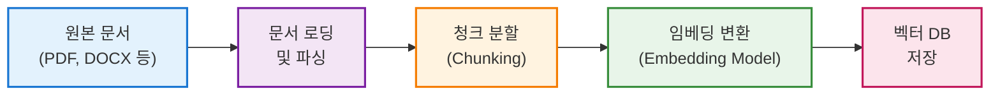

### 2) 질의 응답 흐름 (Chatbot Query Flow)

사용자가 질문을 하면, 실시간으로 **질문을 임베딩하여** 앞서 구축한 **벡터 DB에서 유사도 검색**을 수행합니다. **가장 관련성 높은 문서 청크** 몇 개를 검색한 후, 이들을 **프롬프트 컨텍스트에 추가하여** 언어 모델에 전달합니다. 언어 모델은 문맥으로 제공된 문서 내용을 기반으로 질문에 대한 답을 생성하고, 그 결과를 사용자에게 반환합니다.

아래 시퀀스 다이어그램은 **질의 응답 시퀀스**를 나타낸 것입니다:

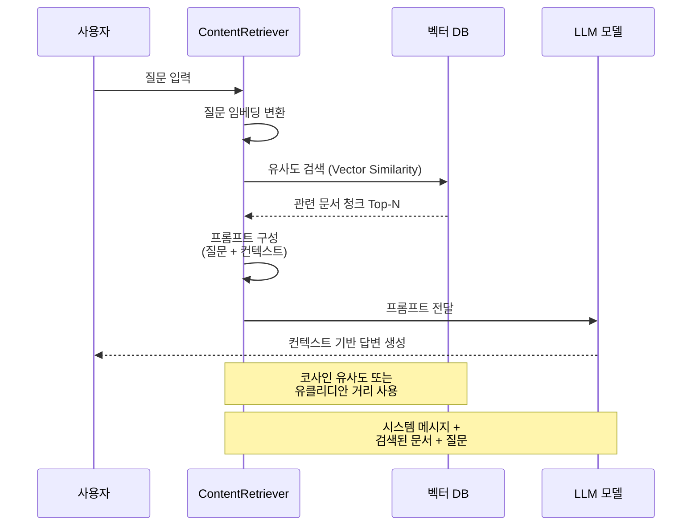

위 다이어그램에서, **ContentRetriever**는 LangChain4j의 구성 요소로서 임베딩 모델을 사용해 사용자의 질문을 벡터화하고 벡터 데이터베이스(**벡터DB**)에서 유사도가 높은 임베딩들을 찾아 줍니다. 검색된 문서 청크들은 LLM에 전달될 프롬프트의 컨텍스트로 사용됩니다.

이후 LLM(예: GPT-4)은 주어진 **질문과 문서 컨텍스트를 함께 읽고 답변을 생성**하며, 그 답을 사용자에게 반환합니다. 이러한 RAG 파이프라인을 통해, LLM은 자체 지식에 없는 질문이라도 **외부 문서에서 찾아온 최신 정보에 기반하여 대답**할 수 있게 됩니다.

---

## 임베딩 모델의 이해

### 임베딩이란?

임베딩(Embedding)은 텍스트를 **고차원 벡터 공간의 점**으로 변환하는 과정입니다. 의미가 유사한 텍스트는 벡터 공간에서 가까운 위치에 배치되며, 이를 통해 **의미 기반 검색**이 가능해집니다.

예를 들어:

- "강아지가 뛰어간다" → [0.2, 0.8, 0.1, ..., 0.5] (768차원)
- "개가 달린다" → [0.19, 0.82, 0.09, ..., 0.48] (768차원)
- "자동차가 출발한다" → [0.6, 0.1, 0.7, ..., 0.3] (768차원)

위 예시에서 첫 번째와 두 번째 문장은 의미가 유사하므로 벡터 공간에서 가까운 거리에 위치합니다.

### 주요 임베딩 모델 비교

|모델|제공자|차원|특징|사용 사례|
|:-:|:-:|:-:|:--|:--|
|**text-embedding-ada-002**|OpenAI|1536|• 범용성 우수<br/>• API 기반 (유료)<br/>• 다국어 지원|대부분의 RAG 시스템|
|**text-embedding-3-small**|OpenAI|1536|• Ada-002 개선 버전<br/>• 비용 효율적<br/>• 성능 향상|비용 민감 프로젝트|
|**text-embedding-3-large**|OpenAI|3072|• 최고 성능<br/>• 고차원 벡터<br/>• 높은 정확도|정확도가 중요한 프로젝트|
|**all-MiniLM-L6-v2**|Sentence Transformers|384|• 로컬 실행 가능<br/>• 빠른 속도<br/>• 경량 모델|오프라인 환경, 개발/테스트|
|**multilingual-e5-large**|Microsoft|1024|• 100개 이상 언어 지원<br/>• 다국어 성능 우수|글로벌 서비스|
|**BGE-M3**|BAAI|1024|• 다국어 지원<br/>• Dense/Sparse 검색<br/>• 다중 기능성|Hybrid Search 구현|

### 임베딩 모델 선택 기준

**1. 서비스 환경**

- **클라우드 API 사용 가능**: OpenAI, Cohere 등 상용 API
- **오프라인/온프레미스**: Sentence Transformers, ONNX 모델

**2. 언어 및 도메인**

- **영어 중심**: OpenAI Ada-002, all-MiniLM
- **다국어**: multilingual-e5, BGE-M3
- **특정 도메인**: 도메인 특화 fine-tuned 모델

**3. 성능 vs 비용**

- **고성능**: text-embedding-3-large (비용 높음)
- **균형**: text-embedding-3-small
- **저비용**: all-MiniLM-L6-v2 (로컬)

**4. 벡터 차원**

- **고차원 (1536+)**: 정확도 높지만 저장/검색 비용 증가
- **저차원 (384~768)**: 빠른 검색, 메모리 효율적

> 💡 **실무 팁**: 프로토타이핑 단계에서는 로컬 모델(all-MiniLM)로 빠르게 검증하고, 프로덕션에서는 OpenAI API나 도메인 특화 모델로 전환하는 것이 일반적입니다.

---

## 벡터 유사도 측정 방법

벡터 검색의 핵심은 **질의 벡터와 문서 벡터 간의 유사도를 측정**하는 것입니다. 주요 측정 방법은 다음과 같습니다:

### 1. 코사인 유사도 (Cosine Similarity)

**가장 널리 사용되는 방법**으로, 두 벡터 사이의 각도를 측정합니다.

**수식:**

```
코사인 유사도 = (A · B) / (||A|| × ||B||)
```

**특징:**

- 값 범위: -1 ~ 1 (일반적으로 0 ~ 1로 정규화)
- 벡터의 방향만 고려, 크기는 무시
- 텍스트 임베딩에서 표준으로 사용
- **장점**: 문서 길이에 영향을 받지 않음
- **단점**: 크기 정보 손실

**예시:**

```java
// LangChain4j에서 코사인 유사도 사용
EmbeddingStoreContentRetriever retriever = EmbeddingStoreContentRetriever.builder()
    .embeddingStore(embeddingStore)  // 기본적으로 코사인 유사도 사용
    .embeddingModel(embeddingModel)
    .maxResults(3)
    .minScore(0.7)  // 코사인 유사도 0.7 이상만 반환
    .build();
```

### 2. 유클리디안 거리 (Euclidean Distance / L2 Distance)

두 벡터 간의 **직선 거리**를 측정합니다.

**수식:**

```
L2 거리 = √(Σ(A_i - B_i)²)
```

**특징:**

- 값 범위: 0 ~ ∞ (작을수록 유사)
- 벡터의 크기와 방향 모두 고려
- **장점**: 직관적이고 이해하기 쉬움
- **단점**: 고차원 공간에서 curse of dimensionality 문제

**사용 케이스:**

- 이미지 임베딩
- 크기 정보가 중요한 경우

### 3. 내적 (Dot Product / Inner Product)

두 벡터를 직접 곱한 값입니다.

**수식:**

```
내적 = A · B = Σ(A_i × B_i)
```

**특징:**

- 값 범위: -∞ ~ ∞
- 벡터가 정규화된 경우 코사인 유사도와 동일
- **장점**: 계산이 가장 빠름
- **단점**: 벡터 크기에 민감

**사용 케이스:**

- 정규화된 임베딩 사용 시
- 성능이 중요한 대규모 시스템

### 유사도 측정 방법 비교표

|방법|계산 복잡도|정규화 필요|장점|단점|권장 사용|
|:-:|:-:|:-:|:--|:--|:--|
|**코사인 유사도**|O(n)|불필요|문서 길이 무관|크기 정보 손실|✅ 텍스트 RAG (기본)|
|**유클리디안 거리**|O(n)|필요|직관적|고차원에서 비효율|이미지, 특수 케이스|
|**내적**|O(n)|필요|가장 빠름|크기 민감|대규모 시스템|

### pgvector에서 유사도 측정 설정

PostgreSQL의 pgvector 확장을 사용할 때 유사도 측정 방법을 선택할 수 있습니다:

```sql
-- 코사인 유사도 인덱스 생성
CREATE INDEX ON documents USING ivfflat (embedding vector_cosine_ops);

-- L2 거리 인덱스 생성
CREATE INDEX ON documents USING ivfflat (embedding vector_l2_ops);

-- 내적 인덱스 생성
CREATE INDEX ON documents USING ivfflat (embedding vector_ip_ops);

-- 코사인 유사도로 검색
SELECT * FROM documents
ORDER BY embedding <=> query_vector
LIMIT 5;

-- L2 거리로 검색
SELECT * FROM documents
ORDER BY embedding <-> query_vector
LIMIT 5;

-- 내적으로 검색
SELECT * FROM documents
ORDER BY embedding <#> query_vector
LIMIT 5;
```

> 💡 **실무 팁**: 텍스트 RAG 시스템에서는 **코사인 유사도**를 기본으로 사용하는 것이 표준입니다. OpenAI의 임베딩 모델도 코사인 유사도에 최적화되어 있습니다.

---

## 벡터 데이터베이스 선택: 인메모리 vs PostgreSQL (pgvector)

**벡터 스토어(Vector Store)**는 임베딩된 문서들을 보관하고 유사도 검색을 제공하는 핵심 인프라입니다. LangChain4j에서는 **메모리 기반 임베딩 스토어**와 **데이터베이스 연동 스토어**를 모두 활용할 수 있습니다.

### 인메모리 벡터 스토어

개발 환경이나 소규모 데이터셋의 경우, 메모리 내에 벡터들을 저장해 검색할 수 있습니다. 예컨대 LangChain4j는 `InMemoryEmbeddingStore` 등을 통해 빠르게 시작할 수 있도록 지원합니다.

**장점:**

- ✅ 설정이 간단함
- ✅ 속도가 매우 빠름
- ✅ 외부 의존성 없음

**단점:**

- ❌ 영속성이 없음 (재시작 시 데이터 손실)
- ❌ 메모리 용량 제한
- ❌ 확장성 부족

**사용 예시:**

```java
// 인메모리 벡터 스토어 생성
EmbeddingStore<TextSegment> embeddingStore = new InMemoryEmbeddingStore<>();

// 문서 추가
TextSegment segment = TextSegment.from("VPN 접속 방법: 1. 클라이언트 다운로드...");
Embedding embedding = embeddingModel.embed(segment).content();
embeddingStore.add(embedding, segment);
```

### PostgreSQL 기반 벡터 스토어 (pgvector)

운영 환경에서는 **Postgres 데이터베이스에 pgvector 익스텐션을 설치**하여 벡터 DB로 활용할 수 있습니다. **pgvector 확장 모듈을 갖춘 PostgreSQL**은 벡터 임베딩을 테이블에 저장하고, L2 거리나 코사인 유사도 기반으로 **벡터 유사도 검색을 수행**할 수 있습니다.

LangChain4j는 이러한 Postgres 벡터 스토어와의 통합을 제공하며, 예컨대 Quarkus LangChain4j에서는 `quarkus-langchain4j-pgvector` 확장을 통해 **PostgreSQL을 RAG용 벡터 데이터베이스로 활용**할 수 있습니다.

**장점:**

- ✅ 대용량 임베딩의 영속적 저장
- ✅ 동시접근 보장 (트랜잭션 지원)
- ✅ 기존 SQL 인프라 활용
- ✅ 확장성 (수평적 확장 가능)
- ✅ 백업 및 복구 용이

**단점:**

- ❌ 네트워크/디스크 I/O 지연
- ❌ 메모리 대비 조회 속도 느림
- ❌ 설정 복잡도 증가

**사용 예시:**

```java
// PostgreSQL pgvector 설정
@Bean
public EmbeddingStore<TextSegment> embeddingStore(DataSource dataSource) {
    return PgVectorEmbeddingStore.builder()
        .dataSource(dataSource)
        .table("embeddings")
        .dimension(1536)  // OpenAI ada-002 차원
        .build();
}
```

**pgvector 설치 및 설정:**

```sql
-- pgvector 확장 설치
CREATE EXTENSION vector;

-- 임베딩 테이블 생성
CREATE TABLE embeddings (
    id BIGSERIAL PRIMARY KEY,
    content TEXT,
    embedding VECTOR(1536),
    metadata JSONB
);

-- 인덱스 생성 (IVFFlat - 근사 검색)
CREATE INDEX ON embeddings 
USING ivfflat (embedding vector_cosine_ops)
WITH (lists = 100);

-- 또는 HNSW 인덱스 (더 정확하지만 느린 인덱싱)
CREATE INDEX ON embeddings 
USING hnsw (embedding vector_cosine_ops);
```

### 벡터 DB 선택 가이드

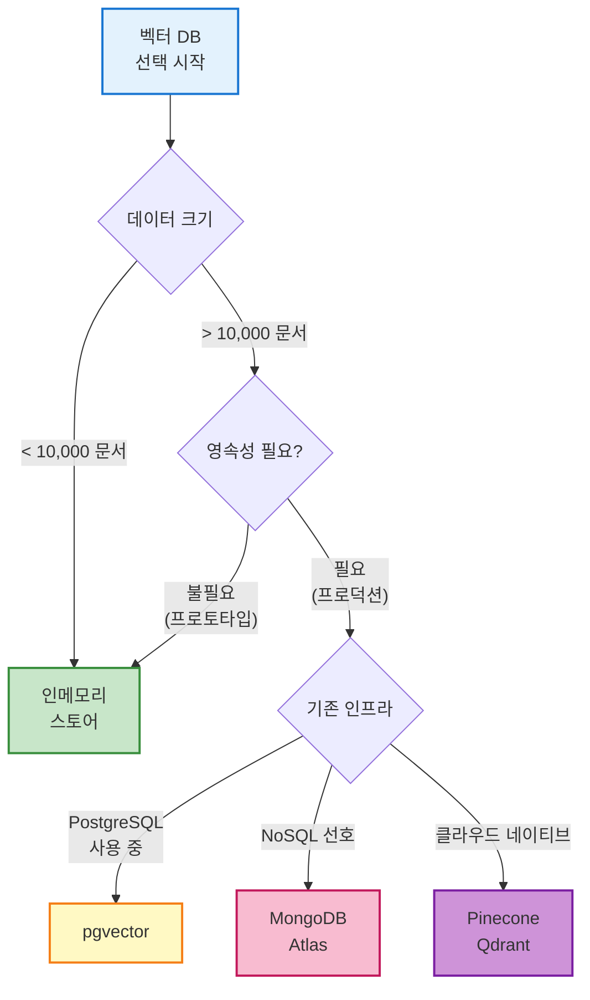

> 💡 **실무 팁**: **개발 및 테스트 단계**에서는 인메모리 벡터 스토어로 빠르게 RAG 프로토타이핑을 하고, **프로덕션 단계**에서는 pgvector가 설치된 Postgres나 벡터 전문 DB(Qdrant, Pinecone 등)로 이전하는 경우가 많습니다. LangChain4j는 Oracle, MongoDB Atlas 등 다양한 벡터 DB와의 통합도 지원하므로, 자신이 익숙한 데이터베이스를 벡터 스토어로 활용할 수 있습니다.

---

## LangChain4j 기반 RAG 구현: Retriever, VectorStore, Runnable 조합

LangChain4j를 사용하면 앞서 설명한 RAG 파이프라인을 **손쉽게 구현**할 수 있습니다. 주된 구성 요소는 **벡터 스토어**, **임베딩 모델**, **리트리버(Retriever)**, 그리고 **LLM 모델**이며, LangChain4j에서는 이들을 유기적으로 연결하는 고수준 API를 제공합니다.

### 핵심 구성 요소

**1. 임베딩 스토어(EmbeddingStore)**

벡터 DB 역할을 하는 컴포넌트입니다. LangChain4j에는 InMemoryEmbeddingStore, PgVectorEmbeddingStore, MongoDbEmbeddingStore 등 다양한 구현이 있으며, 공통 인터페이스로 **add()**, **findSimilar()** 등의 메서드를 제공합니다.

```java
EmbeddingStore<TextSegment> embeddingStore = new InMemoryEmbeddingStore<>();
```

**2. 임베딩 모델(EmbeddingModel)**

텍스트를 벡터로 변환하는 모델입니다. OpenAI의 `text-embedding-ada-002` 같은 API를 쓰거나, 로컬 ONNX 모델(`AllMiniLmL6V2QuantizedEmbeddingModel` 등)을 사용할 수 있습니다.

```java
// OpenAI 임베딩 모델
EmbeddingModel embeddingModel = OpenAiEmbeddingModel.builder()
    .apiKey(System.getenv("OPENAI_API_KEY"))
    .modelName("text-embedding-ada-002")
    .build();

// 또는 로컬 모델
EmbeddingModel embeddingModel = new AllMiniLmL6V2QuantizedEmbeddingModel();
```

**3. 컨텐츠 리트리버(ContentRetriever)**

LangChain4j에서 **질의에 맞는 컨텐츠를 검색**하는 모듈입니다. 내부적으로 임베딩 모델을 사용해 질의를 벡터화하고 임베딩 스토어에서 **유사도 상위 문서**를 찾아줍니다.

```java
ContentRetriever retriever = EmbeddingStoreContentRetriever.builder()
    .embeddingStore(embeddingStore)
    .embeddingModel(embeddingModel)
    .maxResults(2)      // 최대 2개의 문서 조각만 반환
    .minScore(0.5)      // 유사도 점수 0.5 미만은 무시
    .build();
```

위 설정에서:

- `maxResults(2)`: **최대 2개의 문서 조각만 반환**하도록 하여 LLM에 지나치게 많은 컨텍스트가 가지 않도록 제어
- `minScore(0.5)`: **유사도 점수 0.5 미만인 결과는 무시**하여 **관련성이 낮은 정보는 걸러내는 필터** 역할

**4. LLM (ChatLanguageModel)**

OpenAI GPT-4, GPT-3.5, Anthropic Claude 등과 같은 대화형 언어 모델을 호출하는 컴포넌트입니다.

```java
ChatLanguageModel chatModel = OpenAiChatModel.builder()
    .apiKey(System.getenv("OPENAI_API_KEY"))
    .modelName("gpt-4")
    .temperature(0.0)  // 일관된 답변을 위해 낮게 설정
    .build();
```

### AiServices를 통한 RAG 파이프라인 구성

이제 LangChain4j의 **AiServices** 기능을 사용하면 위에서 생성한 **컨텐츠 리트리버와 LLM 모델을 조합하여** 간단하게 질의응답 함수를 구현할 수 있습니다:

```java
public interface KnowledgeAssistant {
    String answer(String question);
}

// ... (빈(Bean) 구성에서)
KnowledgeAssistant assistant = AiServices.builder(KnowledgeAssistant.class)
    .chatLanguageModel(chatModel)
    .contentRetriever(retriever)
    .build();
```

위와 같이 설정하면 `assistant.answer("...")` 메서드를 호출할 때마다 LangChain4j가 **자동으로 RAG 파이프라인을 실행**합니다:

1. **질문 문자열을 임베딩**
2. **벡터스토어에서 문서를 검색**
3. **해당 문서를 컨텍스트로 LLM에 질문을 전달**
4. **최종 답변을 반환**

LangChain4j가 동적 프록시를 통해 이러한 **Runnable 체인**을 구성해주므로, 개발자는 복잡한 프롬프트 조합이나 API 호출 흐름을 일일이 코딩하지 않고도 RAG를 활용할 수 있습니다.

### 실행 예시

```java
String answer = assistant.answer("우리 회사 VPN 설치 방법이 뭐야?");
System.out.println(answer);
// 출력: "VPN 설치 방법은 다음과 같습니다: 1. 공식 웹사이트에서 클라이언트를 다운로드..."
```

내부적으로 다음 과정이 자동으로 실행됩니다:

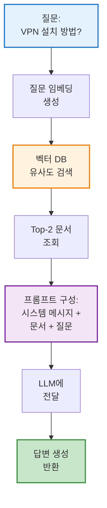

> 💡 **핵심**: LangChain4j의 AiServices는 RAG 파이프라인을 **선언적으로 구성**할 수 있게 해주며, 복잡한 내부 로직을 추상화하여 개발자가 비즈니스 로직에 집중할 수 있도록 합니다.

---

## 문서 청킹(Chunking) 전략

**문서를 어떻게 분할(chunking)하여 저장**했는지가 RAG 성능에 큰 영향을 미칩니다. 청크가 너무 크면 검색에서 **관련 부분만 포함하고도 여분의 문맥이 많아 비효율적**이고, 너무 잘게 쪼개면 **개별 청크에 문맥이 부족**해질 수 있습니다.

### 청킹의 목표

> "하나의 청크가 하나의 독립적인 의미 단위를 포함"하도록 하는 것

### 주요 청킹 전략 비교

|전략|방법|장점|단점|사용 케이스|
|:-:|:--|:--|:--|:--|
|**고정 길이 청킹**|500 토큰씩 분할<br/>(sliding window)|• 구현 간단<br/>• 일관된 크기|• 문맥 손실 위험<br/>• 문장 중간 분할 가능|간단한 문서,<br/>빠른 프로토타이핑|
|**문단 단위 청킹**|문단(paragraph)별 분할|• 논리적 단위 유지<br/>• 문맥 보존|• 길이 불균일<br/>• 너무 긴 문단 문제|블로그 글,<br/>일반 문서|
|**문장 기반 청킹**|N개 문장씩 묶음|• 문법적 완결성<br/>• 유연한 크기 조절|• 문장 구분 오류<br/>• 도메인 의존적|뉴스 기사,<br/>기술 문서|
|**의미 기반 청킹**|임베딩 유사도로<br/>토픽 전환점 분할|• 주제별 분리<br/>• 자기완결적 청크|• 계산 비용 높음<br/>• 구현 복잡|논문, 긴 기술 문서,<br/>법률 문서|
|**계층적 청킹**|문서 → 섹션 → 단락|• 구조 정보 보존<br/>• 다층 검색 가능|• 구현 복잡<br/>• 메타데이터 관리 필요|매뉴얼,<br/>구조화된 문서|

### 1. 고정 길이 청킹 (Fixed-Size Chunking)

**가장 간단한 방법**으로, 문서를 일정한 토큰 수로 분할합니다.

```java
// LangChain4j 고정 길이 청킹
DocumentSplitter splitter = DocumentSplitters.recursive(
    500,    // 최대 청크 크기 (토큰)
    50      // 오버랩 크기 (토큰)
);

List<TextSegment> chunks = splitter.split(document);
```

**오버랩(Overlap) 사용 이유:**

- 청크 경계에서 문맥이 끊기는 것을 방지
- 예: 500 토큰 청크 + 50 토큰 오버랩 = 450 토큰마다 새 청크 시작

### 2. 문단 단위 청킹

```java
// 문단 기준 분할
DocumentSplitter splitter = DocumentSplitters.recursive(
    1000,           // 최대 청크 크기
    0,              // 오버랩 없음
    new DocumentSplitter.SplitOptions("\n\n")  // 문단 구분자
);
```

### 3. 의미 기반 청킹 (Semantic Chunking)

임베딩으로 **연속 문장 간 코사인 유사도**를 계산하여 **토픽이 바뀌는 지점에서 청크를 분리**합니다.

**알고리즘:**

1. 문서를 문장 단위로 분할
2. 각 문장을 임베딩
3. 연속된 문장 간 코사인 유사도 계산
4. 유사도가 임계값 이하로 떨어지면 새 청크 시작

```java
// 의사 코드 (Semantic Chunking)
List<TextSegment> chunks = new ArrayList<>();
TextSegment currentChunk = new TextSegment();
double threshold = 0.7;  // 유사도 임계값

for (int i = 0; i < sentences.size() - 1; i++) {
    currentChunk.add(sentences.get(i));
    
    Embedding emb1 = embeddingModel.embed(sentences.get(i)).content();
    Embedding emb2 = embeddingModel.embed(sentences.get(i + 1)).content();
    
    double similarity = CosineSimilarity.between(emb1, emb2);
    
    if (similarity < threshold) {
        // 토픽이 바뀌는 지점 - 청크 분리
        chunks.add(currentChunk);
        currentChunk = new TextSegment();
    }
}
```

**장점:**

- 각 청크가 **하나의 주제**를 다룸
- 검색 정확도 향상

**단점:**

- 모든 문장을 임베딩해야 하므로 비용이 높음
- 구현이 복잡함

### 4. 계층적 청킹 (Hierarchical Chunking)

문서의 구조를 활용하여 **계층적으로 청크를 생성**합니다.

```
문서
├─ 섹션 1
│  ├─ 단락 1.1
│  ├─ 단락 1.2
│  └─ 단락 1.3
└─ 섹션 2
   ├─ 단락 2.1
   └─ 단락 2.2
```

**메타데이터 추가:**

```java
TextSegment chunk = TextSegment.from(
    "VPN 설치 방법...",
    Metadata.from(
        Map.of(
            "document", "IT 매뉴얼",
            "section", "네트워크",
            "subsection", "VPN",
            "page", "15"
        )
    )
);
```

### 청킹 전략 선택 가이드

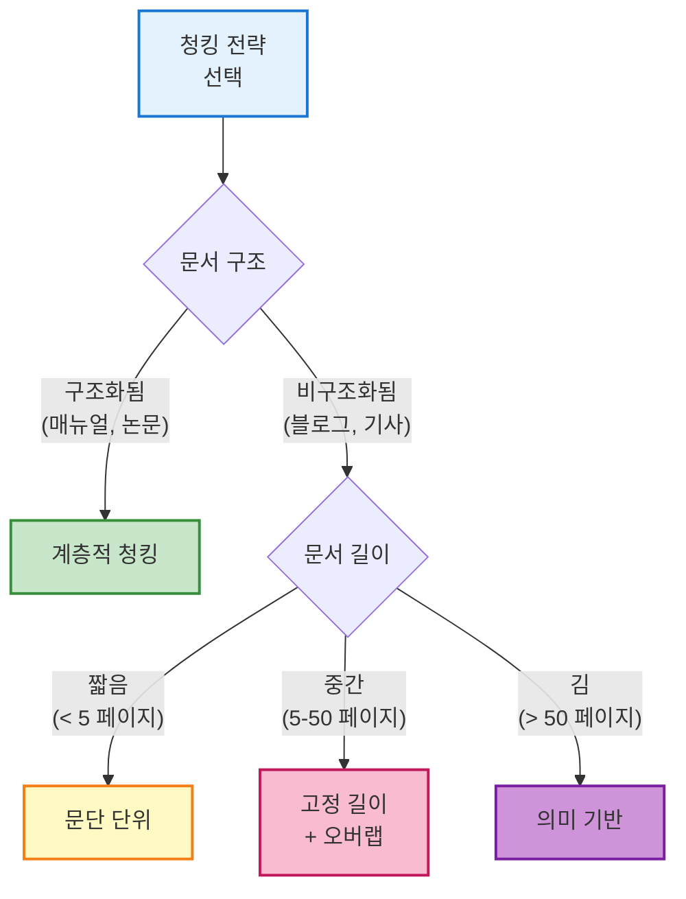

> 💡 **실무 팁**: 대부분의 경우 **고정 길이 청킹 (500-800 토큰) + 오버랩 (50-100 토큰)**으로 시작하여, 검색 성능이 부족할 때 **의미 기반 청킹**으로 전환하는 것이 효율적입니다.

---

## Hybrid Search: BM25 + Vector Search 결합

단순 벡터 검색만으로는 **키워드 매칭**이 약할 수 있습니다. 예를 들어, "VPN-2024-v3.2"와 같은 **정확한 버전 번호**나 **고유명사**는 벡터 검색보다 키워드 검색이 더 효과적입니다.

### Hybrid Search란?

**Hybrid Search**는 다음 두 가지를 결합합니다:

1. **BM25 (키워드 기반 검색)**: 전통적인 정보 검색 알고리즘
2. **Vector Search (의미 기반 검색)**: 임베딩 유사도 검색

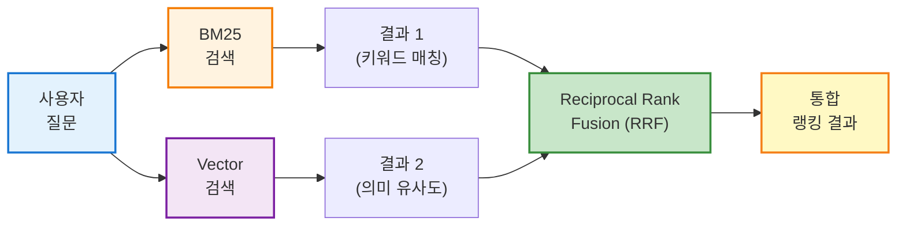

### BM25란?

**BM25 (Best Matching 25)**는 검색 엔진에서 널리 사용되는 랭킹 함수입니다.

**핵심 아이디어:**

- **용어 빈도 (TF)**: 문서에서 검색어가 얼마나 자주 나타나는가
- **역문서 빈도 (IDF)**: 검색어가 전체 문서에서 얼마나 희귀한가
- **문서 길이 정규화**: 긴 문서가 불리하지 않도록 조정

**BM25 점수 공식:**

```
BM25(D, Q) = Σ IDF(qi) × (f(qi, D) × (k1 + 1)) / (f(qi, D) + k1 × (1 - b + b × |D| / avgdl))

여기서:
- D: 문서
- Q: 질의 (검색어 집합)
- f(qi, D): 문서 D에서 qi의 빈도
- |D|: 문서 D의 길이
- avgdl: 평균 문서 길이
- k1, b: 튜닝 파라미터 (일반적으로 k1=1.5, b=0.75)
```

### Hybrid Search 구현 전략

#### 전략 1: 결과 통합 (Reciprocal Rank Fusion)

```java
// 의사 코드: RRF를 통한 Hybrid Search
public List<Document> hybridSearch(String query, int topK) {
    // 1. BM25 검색
    List<ScoredDocument> bm25Results = bm25Index.search(query, topK * 2);
    
    // 2. Vector 검색
    List<ScoredDocument> vectorResults = vectorStore.search(query, topK * 2);
    
    // 3. RRF 점수 계산
    Map<String, Double> rrfScores = new HashMap<>();
    int k = 60;  // RRF 파라미터
    
    for (int i = 0; i < bm25Results.size(); i++) {
        String docId = bm25Results.get(i).getId();
        rrfScores.merge(docId, 1.0 / (k + i + 1), Double::sum);
    }
    
    for (int i = 0; i < vectorResults.size(); i++) {
        String docId = vectorResults.get(i).getId();
        rrfScores.merge(docId, 1.0 / (k + i + 1), Double::sum);
    }
    
    // 4. RRF 점수로 정렬
    return rrfScores.entrySet().stream()
        .sorted(Map.Entry.<String, Double>comparingByValue().reversed())
        .limit(topK)
        .map(e -> getDocument(e.getKey()))
        .collect(Collectors.toList());
}
```

#### 전략 2: 가중 평균

```java
// BM25와 Vector Search 점수를 가중 평균
double finalScore = alpha * bm25Score + (1 - alpha) * vectorScore;

// 일반적으로 alpha = 0.3 ~ 0.5
```

### Elasticsearch를 활용한 Hybrid Search

Elasticsearch는 **BM25와 Vector Search를 모두 지원**합니다:

```json
{
  "query": {
    "hybrid": {
      "queries": [
        {
          "match": {
            "content": "VPN 설치"
          }
        },
        {
          "knn": {
            "field": "content_vector",
            "query_vector": [0.1, 0.2, ...],
            "k": 10,
            "num_candidates": 100
          }
        }
      ]
    }
  }
}
```

### Hybrid Search 사용 시기

|시나리오|권장 전략|이유|
|:--|:--|:--|
|**고유명사, 코드명 검색**|Hybrid (BM25 비중 ↑)|정확한 키워드 매칭 필요|
|**의미 기반 질문**|Vector Search|동의어, 의역 처리 우수|
|**기술 문서 검색**|Hybrid (균등)|키워드 + 의미 모두 중요|
|**FAQ 매칭**|Hybrid (Vector 비중 ↑)|다양한 표현 처리|
|**법률 문서 검색**|Hybrid (BM25 비중 ↑)|정확한 용어 매칭 중요|

> 💡 **실무 팁**: 초기에는 **Vector Search**만으로 시작하고, 정확한 키워드 매칭이 필요한 경우(예: 버전 번호, 제품명)에만 **Hybrid Search**를 추가하는 것이 효율적입니다.

---

## Re-ranking: 검색 결과 품질 향상

초기 검색에서 **Top-N 문서를 가져온 후**, 더 정교한 모델로 **재순위화(re-ranking)**하여 정확도를 높일 수 있습니다.

### Re-ranking이 필요한 이유

1. **속도 vs 정확도 트레이드오프**
    
    - 초기 검색: 빠르지만 덜 정확한 방법 (BM25, 간단한 벡터 검색)
    - Re-ranking: 느리지만 정확한 방법 (Cross-encoder, LLM)
2. **벡터 검색의 한계**
    
    - Bi-encoder (일반 임베딩): 질문과 문서를 독립적으로 인코딩
    - 질문-문서 간 상호작용 부족

### Re-ranking 방법

#### 1. Cross-Encoder Re-ranking

**Cross-Encoder**는 질문과 문서를 **함께** 입력받아 관련성 점수를 직접 계산합니다.

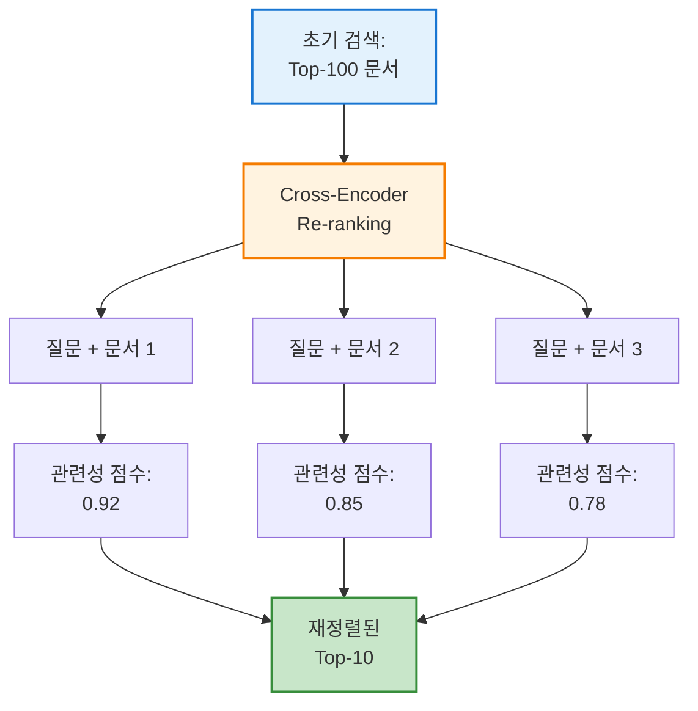

**구현 예시 (Python - LangChain):**

```python
from sentence_transformers import CrossEncoder

# Cross-Encoder 모델 로드
reranker = CrossEncoder('cross-encoder/ms-marco-MiniLM-L-6-v2')

# 초기 검색 결과
query = "VPN 설치 방법"
initial_docs = vector_store.similarity_search(query, k=100)

# Re-ranking
doc_texts = [doc.page_content for doc in initial_docs]
scores = reranker.predict([(query, doc) for doc in doc_texts])

# 점수로 재정렬
ranked_docs = [doc for _, doc in sorted(zip(scores, initial_docs), reverse=True)]
top_docs = ranked_docs[:5]
```

**Java (LangChain4j)에서 구현:**

```java
// 커스텀 Re-ranker 구현
public class CrossEncoderReranker implements ContentAggregator {
    
    private final CrossEncoderClient rerankerClient;
    
    @Override
    public List<Content> aggregate(Query query, List<Content> contents) {
        // 1. 각 문서에 대해 관련성 점수 계산
        List<ScoredContent> scored = contents.stream()
            .map(content -> {
                double score = rerankerClient.score(
                    query.text(),
                    content.textSegment().text()
                );
                return new ScoredContent(content, score);
            })
            .collect(Collectors.toList());
        
        // 2. 점수로 재정렬
        scored.sort(Comparator.comparing(ScoredContent::score).reversed());
        
        // 3. Top-K만 반환
        return scored.stream()
            .limit(5)
            .map(ScoredContent::content)
            .collect(Collectors.toList());
    }
}
```

#### 2. LLM 기반 Re-ranking

LLM을 사용하여 문서의 관련성을 평가합니다.

**프롬프트 예시:**

```
다음 문서가 주어진 질문에 얼마나 관련이 있는지 0-10 점수로 평가하세요.

질문: VPN 설치 방법이 무엇인가요?

문서: 
"""
VPN 클라이언트 설치 가이드
1. 공식 웹사이트에서 설치 파일 다운로드
2. 관리자 권한으로 실행
3. 설치 마법사 따라 진행
"""

점수 (0-10): 9
이유: 문서가 VPN 설치 방법을 단계별로 명확히 설명하고 있음
```

**구현 (의사 코드):**

```java
public List<Content> llmRerank(String query, List<Content> contents) {
    List<ScoredContent> scored = new ArrayList<>();
    
    for (Content content : contents) {
        String prompt = String.format(
            "질문과 문서의 관련성을 0-10으로 평가하세요.\n\n" +
            "질문: %s\n\n문서: %s\n\n점수:",
            query,
            content.textSegment().text()
        );
        
        String response = chatModel.generate(prompt);
        double score = extractScore(response);  // "9" → 9.0
        
        scored.add(new ScoredContent(content, score));
    }
    
    scored.sort(Comparator.comparing(ScoredContent::score).reversed());
    return scored.stream()
        .limit(5)
        .map(ScoredContent::content)
        .collect(Collectors.toList());
}
```

#### 3. Cohere Rerank API

Cohere는 **전문 Re-ranking API**를 제공합니다:

```java
// Cohere Rerank API 사용
CohereRerankRequest request = CohereRerankRequest.builder()
    .query("VPN 설치 방법")
    .documents(documentTexts)
    .topN(5)
    .build();

CohereRerankResponse response = cohereClient.rerank(request);
List<Document> rerankedDocs = response.getResults().stream()
    .map(result -> documents.get(result.getIndex()))
    .collect(Collectors.toList());
```

### Re-ranking 전략 비교

|방법|정확도|속도|비용|사용 시기|
|:-:|:-:|:-:|:-:|:--|
|**Cross-Encoder**|⭐⭐⭐⭐|⭐⭐⭐|$|중간 규모 검색|
|**LLM Re-ranking**|⭐⭐⭐⭐⭐|⭐|$$$|최고 정확도 필요|
|**Cohere Rerank**|⭐⭐⭐⭐⭐|⭐⭐⭐⭐|$$|프로덕션 환경|
|**간단한 점수 결합**|⭐⭐|⭐⭐⭐⭐⭐|$|빠른 응답 필요|

### Re-ranking 파이프라인 예시

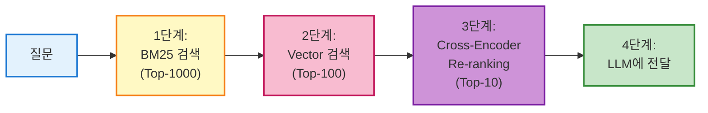

> 💡 **실무 팁**: **2단계 Re-ranking**이 일반적입니다:
> 
> 1. 빠른 초기 검색 (BM25 또는 Vector Search로 Top-100)
> 2. Cross-Encoder로 재정렬 (Top-10)
> 
> LLM Re-ranking은 비용이 높으므로, **매우 중요한 질문**에만 선택적으로 사용합니다.

---

## 프롬프트 엔지니어링 전략: 컨텍스트 제한, 요약, 정보과잉 제어

RAG 시스템에서 **프롬프트 설계**는 매우 중요합니다. 검색된 문서 조각을 LLM에 효과적으로 제공하려면, **모델의 컨텍스트 윈도우 한계**, 반환된 검색 결과의 품질, 문서 청크 구성, 그리고 너무 많은 정보 투입에 따른 문제를 모두 고려해야 합니다.

### 1. 컨텍스트 길이 한계

현재 LLM들은 프롬프트(입력+출력 포함)에 대해 **토큰 수 제한**이 있습니다:

|모델|컨텍스트 윈도우|비고|
|:--|--:|:--|
|GPT-4 Turbo|128,000 토큰|약 96,000 단어|
|GPT-4|8,192 토큰|약 6,000 단어|
|GPT-3.5 Turbo|16,384 토큰|약 12,000 단어|
|Claude 3 Opus|200,000 토큰|약 150,000 단어|
|Claude 3 Sonnet|200,000 토큰|약 150,000 단어|
|Gemini 1.5 Pro|2,000,000 토큰|약 1,500,000 단어|

**문제점:**

- 너무 많은 텍스트를 한꺼번에 주면 모델이 일부를 잘라내거나 성능이 저하될 수 있습니다.
- 컨텍스트 윈도우가 크더라도, **"Lost in the Middle"** 현상으로 중간 부분의 정보를 잘 활용하지 못할 수 있습니다.

**해결 방법:**

1. **상위 N개의 관련 문서**만 선택
2. 불필요하게 긴 내용은 **요약**하거나 **발췌**
3. **출력 토큰 길이(max_tokens)** 제한

```java
ChatLanguageModel chatModel = OpenAiChatModel.builder()
    .apiKey(apiKey)
    .modelName("gpt-4")
    .maxTokens(500)      // 출력 제한
    .temperature(0.0)
    .build();
```

### 2. 검색 결과 요약 및 압축

검색 단계에서 가져온 문서 조각들이 너무 긴 경우, **요약(summary)하거나 핵심만 추출하여 압축**하는 전략을 사용합니다.

#### 전략 1: Map-Reduce 요약

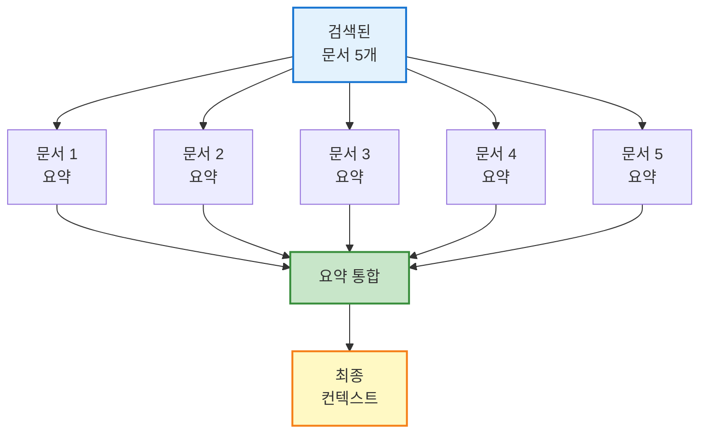

**구현:**

```java
public List<String> summarizeDocuments(List<String> documents) {
    return documents.stream()
        .map(doc -> {
            String prompt = String.format(
                "다음 문서에서 핵심 내용만 2-3문장으로 요약하세요:\n\n%s",
                doc
            );
            return chatModel.generate(prompt);
        })
        .collect(Collectors.toList());
}
```

#### 전략 2: Contextual Compression

**질문과 관련된 부분만 추출**하여 컨텍스트 크기를 줄입니다.

```java
public String compressDocument(String query, String document) {
    String prompt = String.format(
        "다음 문서에서 '%s'와 관련된 문장만 추출하세요:\n\n%s",
        query,
        document
    );
    return chatModel.generate(prompt);
}
```

#### 전략 3: MMR (Maximal Marginal Relevance)

**중복을 제거**하여 다양한 정보를 제공합니다.

**MMR 알고리즘:**

1. 가장 관련성 높은 문서 선택
2. 다음 문서 선택 시:
    - 질의 관련성 (λ)
    - 이미 선택된 문서와의 중복도 (1-λ)
    - 를 균형있게 고려

```
MMR = arg max [λ × Sim(D, Q) - (1-λ) × max Sim(D, D_selected)]
```

### 3. 정보 과잉 제어

컨텍스트로 너무 많은 정보를 제공하면 모델이 혼란을 느끼거나 불필요한 세부사항까지 답변에 포함할 수 있습니다.

**해결 방법:**

**1) 문서 수 제한**

```java
ContentRetriever retriever = EmbeddingStoreContentRetriever.builder()
    .embeddingStore(embeddingStore)
    .embeddingModel(embeddingModel)
    .maxResults(3)      // ✅ 최대 3개만
    .minScore(0.7)      // ✅ 유사도 0.7 이상만
    .build();
```

**2) 프롬프트 지시**

```
시스템: 주어진 컨텍스트 정보만 사용하여 답변하세요.
컨텍스트에 없는 내용은 "모르겠습니다"라고 답하세요.
질문과 무관한 컨텍스트 정보는 무시하세요.
```

**3) 단계별 필터링**

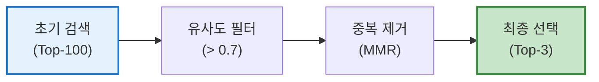

### 4. 모델 지시 및 톤 제어

프롬프트에 적절한 **시스템 메시지**나 지시를 포함해 **모델의 응답 방식**을 통제할 수 있습니다.

**핵심 지시 사항:**

- ✅ 제공된 컨텍스트만 활용
- ✅ 컨텍스트에 없으면 "모르겠습니다" 답변
- ✅ 추측하지 않기
- ✅ 출처 표시 (선택적)

**프롬프트 템플릿 예시:**

```java
String systemMessage = """
당신은 주어진 회사 내부 문서를 기반으로 질문에 답하는 지원 담당 AI입니다.

**규칙:**
1. 다음의 '컨텍스트' 정보만을 활용하여 답변하세요.
2. 컨텍스트에 답이 없으면 "죄송합니다. 제공된 문서에서 해당 정보를 찾을 수 없습니다."라고 답하세요.
3. 절대 추측으로 지어내지 마세요.
4. 답변은 명확하고 간결하게 작성하세요.
5. 가능한 경우 어떤 문서에서 정보를 가져왔는지 언급하세요.

**컨텍스트:**

%s

---

**질문:** %s
""";

String context = retrievedDocuments.stream()
    .map(doc -> "- " + doc.getText())
    .collect(Collectors.joining("\n\n"));

String prompt = String.format(systemMessage, context, userQuestion);
```

### 프롬프트 구성 Best Practices

|요소|권장 사항|예시|
|:--|:--|:--|
|**시스템 역할**|명확한 역할 정의|"당신은 IT 지원 전문가입니다"|
|**제약 조건**|컨텍스트만 사용 명시|"주어진 정보만 사용하세요"|
|**출력 형식**|원하는 형식 지정|"불릿 포인트로 답변하세요"|
|**답변 길이**|길이 제한|"3-5문장으로 요약하세요"|
|**톤**|어조 지정|"친근하고 전문적인 톤 사용"|
|**예외 처리**|모를 때 대응|"모르면 '모르겠습니다' 답변"|

> 💡 **핵심**: 프롬프트 엔지니어링의 목표는 **제한된 컨텍스트 예산 내에서 최대한 관련성 높은 정보를 압축하여 제공하고, 모델에게 그 범위 내에서만 답하도록 명확히 지시하는 것**입니다.

---

## LangChain4j 기반 RAG의 평가 및 테스트 전략

RAG 파이프라인을 구축한 이후에는 **시스템이 잘 작동하는지 평가(evaluation)**하는 단계가 중요합니다. RAG는 단순 질의응답보다 구성 요소가 많아, **어느 단계에서 성능 저하나 오류가 발생하는지 분석**해야 합니다.

### RAG 평가의 두 가지 축

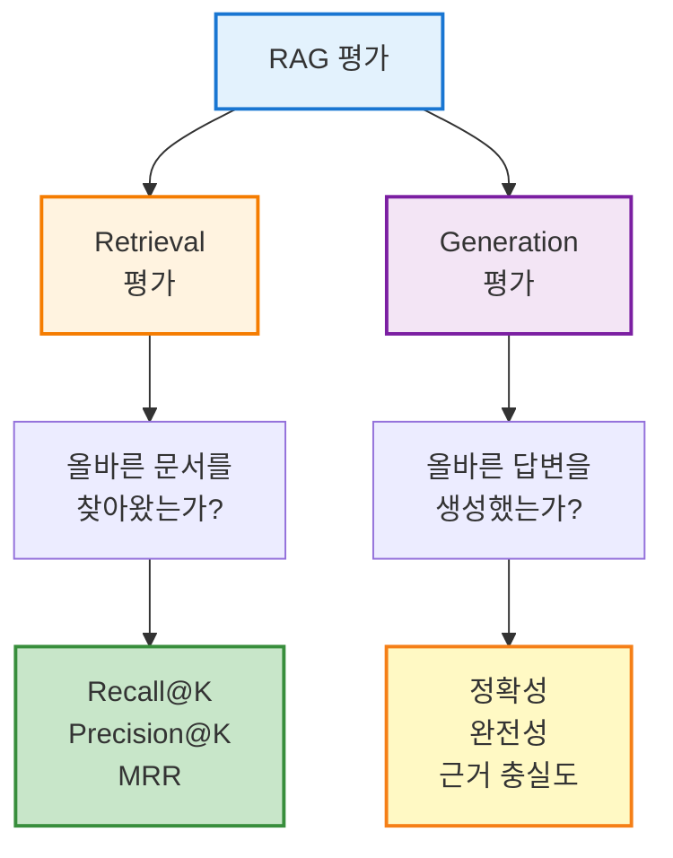

### 1. 테스트 질문 세트 구축

먼저 도메인에 대한 **평가용 질문-답변 데이터셋**을 만듭니다.

**예시 테스트 세트:**

```json
{
  "test_cases": [
    {
      "question": "VPN 접속이 안 될 때 해결 방법은?",
      "expected_answer": "1. 인터넷 연결 확인 2. VPN 클라이언트 재시작 3. 인증 정보 재입력",
      "relevant_documents": ["vpn_guide.pdf", "troubleshooting.pdf"],
      "category": "IT지원"
    },
    {
      "question": "연차 신청 절차가 어떻게 되나요?",
      "expected_answer": "인사포털 로그인 → 휴가 신청 → 승인 대기",
      "relevant_documents": ["hr_manual.pdf"],
      "category": "HR"
    }
  ]
}
```

### 2. Retrieval 단계 평가

각 테스트 질문에 대해 **컨텐츠 리트리버가 올바른 문서 조각을 찾아왔는지** 평가합니다.

#### 주요 지표

**1) Recall@K (재현율)**

Top-K 결과에 **정답 문서가 포함되었는가**?

```
Recall@K = (검색된 관련 문서 수) / (전체 관련 문서 수)
```

**예시:**

- 정답 문서: [doc1, doc2]
- 검색 결과 Top-5: [doc1, doc3, doc5, doc7, doc9]
- Recall@5 = 1/2 = 0.5 (doc1만 찾음)

**2) Precision@K (정밀도)**

Top-K 결과 중 **실제로 관련 있는 문서의 비율**

```
Precision@K = (검색된 관련 문서 수) / K
```

**예시:**

- 검색 결과 Top-5 중 관련 문서 2개
- Precision@5 = 2/5 = 0.4

**3) MRR (Mean Reciprocal Rank)**

**첫 번째 관련 문서의 순위**를 고려

```
MRR = 1 / (첫 관련 문서의 순위)
```

**예시:**

- 첫 번째 관련 문서가 3번째 위치
- MRR = 1/3 = 0.333

#### 평가 코드 예시

```java
public class RetrievalEvaluator {
    
    public double evaluateRecall(
        ContentRetriever retriever,
        String query,
        Set<String> relevantDocIds,
        int k
    ) {
        List<Content> retrieved = retriever.retrieve(Query.from(query));
        
        Set<String> retrievedIds = retrieved.stream()
            .limit(k)
            .map(content -> content.metadata().getString("docId"))
            .collect(Collectors.toSet());
        
        long foundCount = relevantDocIds.stream()
            .filter(retrievedIds::contains)
            .count();
        
        return (double) foundCount / relevantDocIds.size();
    }
    
    public double evaluatePrecision(
        ContentRetriever retriever,
        String query,
        Set<String> relevantDocIds,
        int k
    ) {
        List<Content> retrieved = retriever.retrieve(Query.from(query));
        
        long relevantCount = retrieved.stream()
            .limit(k)
            .filter(content -> {
                String docId = content.metadata().getString("docId");
                return relevantDocIds.contains(docId);
            })
            .count();
        
        return (double) relevantCount / k;
    }
}
```

### 3. Generation 단계 평가

LLM이 최종 생성한 **답변의 정확성, 완전성, 근거 충실도**를 평가합니다.

#### 평가 기준

**1) 정확성 (Correctness)**

답변이 **정답과 일치**하는가?

**2) 완전성 (Completeness)**

모든 **필수 정보**를 포함하는가?

**3) 근거 충실도 (Groundedness)**

답변이 **제공된 컨텍스트에 근거**하는가?

**4) 관련성 (Relevance)**

답변이 **질문에 직접 대응**하는가?

#### LLM-as-a-Judge 평가

GPT-4를 사용하여 **자동 평가**를 수행합니다.

**평가 프롬프트:**

```java
String evaluationPrompt = """
다음 답변을 평가하세요:

**질문:** %s

**제공된 컨텍스트:**
%s

**생성된 답변:**
%s

**평가 기준:**
1. 정확성 (0-10): 답변이 사실적으로 정확한가?
2. 완전성 (0-10): 모든 필요한 정보를 포함하는가?
3. 근거 충실도 (0-10): 답변이 컨텍스트에 기반하는가?
4. 관련성 (0-10): 답변이 질문에 직접 대응하는가?

JSON 형식으로 점수를 반환하세요:
{
  "correctness": 8,
  "completeness": 7,
  "groundedness": 9,
  "relevance": 10,
  "overall": 8.5,
  "feedback": "답변은 정확하고 관련성이 높으나, 일부 세부사항이 누락됨"
}
""";
```

#### 자동 평가 시스템 구현

```java
public class RAGEvaluator {
    
    private final ChatLanguageModel judgeModel;
    
    public EvaluationResult evaluate(
        String question,
        String context,
        String generatedAnswer,
        String expectedAnswer
    ) {
        String prompt = String.format(
            evaluationPrompt,
            question,
            context,
            generatedAnswer
        );
        
        String jsonResponse = judgeModel.generate(prompt);
        return parseEvaluationResult(jsonResponse);
    }
    
    public AggregatedMetrics evaluateTestSet(List<TestCase> testCases) {
        List<EvaluationResult> results = new ArrayList<>();
        
        for (TestCase testCase : testCases) {
            // RAG 실행
            String answer = ragSystem.answer(testCase.getQuestion());
            
            // 평가
            EvaluationResult result = evaluate(
                testCase.getQuestion(),
                testCase.getContext(),
                answer,
                testCase.getExpectedAnswer()
            );
            
            results.add(result);
        }
        
        return aggregateMetrics(results);
    }
}
```

### 4. 평가 지표 및 모니터링

최종적으로 RAG 시스템의 성능을 요약하는 **지표(KPI)**를 정의합니다.

#### 핵심 KPI 예시

|지표|목표|현재|상태|
|:--|--:|--:|:-:|
|Retrieval Recall@5|> 0.90|0.92|✅|
|Retrieval Precision@5|> 0.80|0.75|⚠️|
|Answer Accuracy|> 0.85|0.88|✅|
|Answer Groundedness|> 0.90|0.95|✅|
|Avg Response Time|< 3s|2.1s|✅|
|User Satisfaction|> 4.0/5|4.2|✅|

#### 모니터링 대시보드

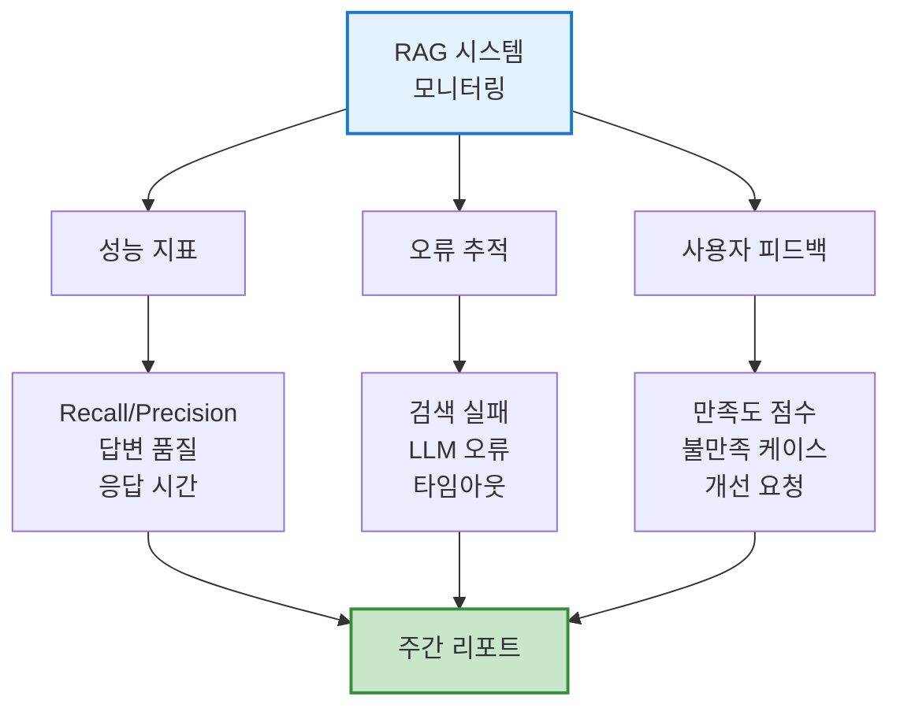

### 5. 지속적 개선 프로세스

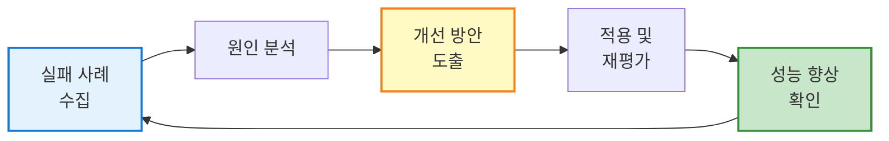

**개선 사이클:**

1. **실패 사례 분석**: 답변 못한 질문, 잘못된 답변 수집
2. **원인 진단**: 검색 실패 vs 생성 오류
3. **대응 방안**:
    - 검색 실패 → 문서 추가, 청킹 전략 변경, 임베딩 모델 교체
    - 생성 오류 → 프롬프트 개선, LLM 모델 업그레이드
4. **재평가**: 개선 후 성능 측정
5. **반복**: 지속적인 품질 향상

> 💡 **실무 팁**: 초기에는 **수동 평가**(10-20개 샘플)로 시작하고, 점차 **자동 평가 시스템**으로 확장합니다. 주요 실패 케이스는 별도로 관리하여 **회귀 테스트**에 포함시킵니다.

---

## 실전 문제 상황 및 해결 예제

이제 실무에서 자주 발생하는 **구체적인 문제 상황**과 **해결 방법**을 살펴보겠습니다.

---

### 문제 1: 검색 정확도가 낮을 때

#### 상황 설명

```
사용자 질문: "우리 회사 VPN 비밀번호 재설정 방법은?"
검색 결과: 
1. "WiFi 비밀번호 변경 방법" (관련도: 0.72) ❌
2. "계정 잠금 해제 절차" (관련도: 0.68) ❌
3. "이메일 비밀번호 재설정" (관련도: 0.65) ❌

정작 필요한 문서: "VPN 접속 가이드 - 5장. 비밀번호 관리" (검색 결과에 없음)
```

**문제**: 의미는 유사하지만 **정확한 문서를 찾지 못함**

#### 해결 방법 1: Query Expansion (질의 확장)

원래 질문을 **여러 방식으로 재구성**하여 검색 범위를 넓힙니다.

```java
public List<Content> expandedSearch(String originalQuery) {
    // 1. LLM으로 질의 확장
    String expansionPrompt = String.format("""
        다음 질문을 3가지 다른 방식으로 다시 작성하세요:
        
        원본 질문: %s
        
        1. 더 구체적인 버전:
        2. 더 일반적인 버전:
        3. 동의어를 사용한 버전:
        """, originalQuery);
    
    String expandedQueries = chatModel.generate(expansionPrompt);
    List<String> queries = parseQueries(expandedQueries);
    
    // 2. 각 질의로 검색 수행
    Set<Content> allResults = new HashSet<>();
    for (String query : queries) {
        List<Content> results = retriever.retrieve(Query.from(query));
        allResults.addAll(results);
    }
    
    // 3. 중복 제거 및 재랭킹
    return rerankResults(allResults, originalQuery);
}
```

**확장된 질의 예시:**

```
원본: "VPN 비밀번호 재설정 방법은?"

확장 버전:
1. 구체적: "VPN 클라이언트에서 비밀번호를 잊어버렸을 때 초기화하는 절차"
2. 일반적: "VPN 접속 인증 정보 변경"
3. 동의어: "VPN 패스워드 리셋 프로세스"
```

#### 해결 방법 2: HyDE (Hypothetical Document Embeddings)

**가상의 이상적인 답변**을 생성한 후, 이를 검색 쿼리로 사용합니다.

```java
public List<Content> hydeSearch(String question) {
    // 1. 가상의 답변 생성
    String hydePrompt = String.format("""
        다음 질문에 대한 이상적인 답변을 작성하세요.
        실제 정보를 모르더라도 그럴듯한 답변을 만들어주세요.
        
        질문: %s
        
        답변:
        """, question);
    
    String hypotheticalAnswer = chatModel.generate(hydePrompt);
    
    // 2. 가상 답변으로 검색 (답변과 유사한 문서 찾기)
    List<Content> results = retriever.retrieve(
        Query.from(hypotheticalAnswer)
    );
    
    return results;
}
```

**HyDE 예시:**

```
질문: "VPN 비밀번호 재설정 방법은?"

가상 답변:
"VPN 비밀번호를 재설정하려면 다음 단계를 따르세요:
1. VPN 클라이언트를 열고 '비밀번호 찾기' 링크를 클릭합니다.
2. 등록된 이메일로 인증 코드가 전송됩니다.
3. 코드를 입력하고 새 비밀번호를 설정합니다.
4. 새 비밀번호로 다시 로그인합니다."

→ 이 가상 답변과 유사한 실제 문서를 검색
```

#### 해결 방법 3: Hybrid Search 적용

키워드와 의미 검색을 결합합니다.

```java
public List<Content> hybridSearchSolution(String query) {
    // 1. BM25 키워드 검색
    List<ScoredContent> bm25Results = bm25Index.search(query, 20);
    
    // 2. Vector 의미 검색
    List<Content> vectorResults = retriever.retrieve(Query.from(query));
    
    // 3. RRF로 결합
    Map<String, Double> rrfScores = new HashMap<>();
    int k = 60;
    
    for (int i = 0; i < bm25Results.size(); i++) {
        String docId = bm25Results.get(i).getDocId();
        rrfScores.merge(docId, 1.0 / (k + i + 1), Double::sum);
    }
    
    for (int i = 0; i < vectorResults.size(); i++) {
        String docId = vectorResults.get(i).metadata().getString("docId");
        rrfScores.merge(docId, 1.0 / (k + i + 1), Double::sum);
    }
    
    // 4. 최종 정렬
    return rrfScores.entrySet().stream()
        .sorted(Map.Entry.<String, Double>comparingByValue().reversed())
        .limit(5)
        .map(e -> getContentById(e.getKey()))
        .collect(Collectors.toList());
}
```

#### 해결 방법 4: 메타데이터 필터링

문서에 메타데이터를 추가하여 **정확한 범위**에서 검색합니다.

```java
// 문서 저장 시 메타데이터 추가
TextSegment segment = TextSegment.from(
    "VPN 비밀번호 재설정 방법: ...",
    Metadata.from(Map.of(
        "category", "IT",
        "subcategory", "VPN",
        "topic", "비밀번호관리",
        "department", "인프라팀"
    ))
);

// 검색 시 필터 적용
ContentRetriever retriever = EmbeddingStoreContentRetriever.builder()
    .embeddingStore(embeddingStore)
    .embeddingModel(embeddingModel)
    .filter(metadata -> 
        "VPN".equals(metadata.getString("subcategory"))
    )
    .maxResults(5)
    .build();
```

#### 비교 다이어그램

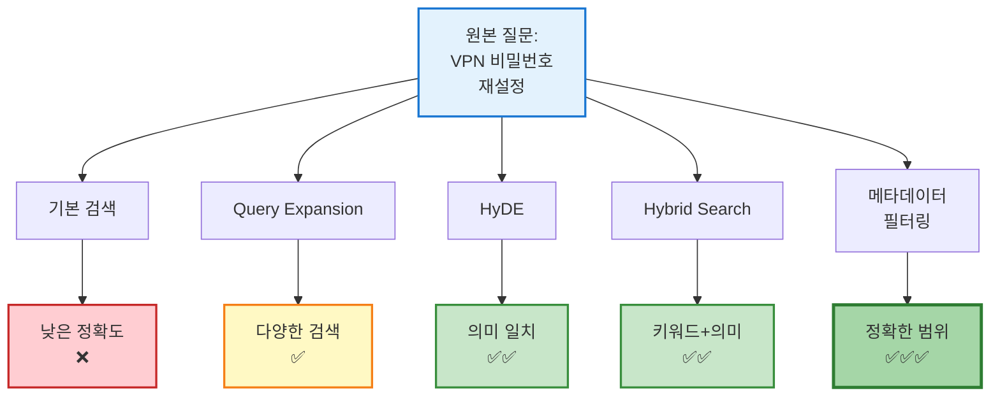

---

### 문제 2: 컨텍스트 윈도우 초과

#### 상황 설명

```
검색된 문서: 5개
각 문서 크기: 2,000 토큰
총 컨텍스트: 10,000 토큰

GPT-4 (8k 모델) 사용 중
→ 컨텍스트 초과로 오류 발생
```

**오류 메시지:**

```
OpenAIException: This model's maximum context length is 8192 tokens. 
However, your messages resulted in 10,500 tokens.
```

#### 해결 방법 1: Map-Reduce 전략

문서를 **개별적으로 요약**한 후 통합합니다.

```java
public String mapReduceSummarize(List<String> documents, String question) {
    // Map 단계: 각 문서 요약
    List<String> summaries = documents.stream()
        .map(doc -> {
            String prompt = String.format("""
                다음 문서에서 '%s'와 관련된 내용만 200 토큰 이내로 요약하세요:
                
                문서:
                %s
                
                요약:
                """, question, doc);
            
            return chatModel.generate(prompt);
        })
        .collect(Collectors.toList());
    
    // Reduce 단계: 요약 통합하여 최종 답변
    String combinedSummaries = String.join("\n\n", summaries);
    String finalPrompt = String.format("""
        다음 요약들을 바탕으로 질문에 답변하세요:
        
        %s
        
        질문: %s
        
        답변:
        """, combinedSummaries, question);
    
    return chatModel.generate(finalPrompt);
}
```

**프로세스 다이어그램:**

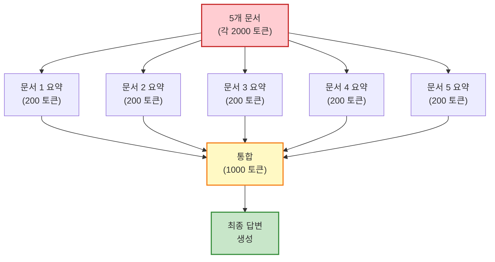

#### 해결 방법 2: Refine 전략

문서를 **순차적으로 처리**하며 답변을 개선해갑니다.

```java
public String refineAnswer(List<String> documents, String question) {
    String currentAnswer = "답변 없음";
    
    for (String doc : documents) {
        String prompt = String.format("""
            현재 답변: %s
            
            추가 정보:
            %s
            
            질문: %s
            
            위 추가 정보를 고려하여 답변을 개선하거나 보완하세요.
            추가 정보가 관련 없으면 현재 답변을 유지하세요.
            
            개선된 답변:
            """, currentAnswer, doc, question);
        
        currentAnswer = chatModel.generate(prompt);
    }
    
    return currentAnswer;
}
```

**프로세스:**

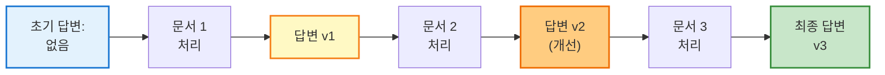

#### 해결 방법 3: Stuff with Compression

문서를 **압축**하여 하나의 프롬프트에 넣습니다.

```java
public String compressAndStuff(List<String> documents, String question) {
    // 1. 질문과 관련된 문장만 추출
    List<String> relevantSentences = documents.stream()
        .flatMap(doc -> Arrays.stream(doc.split("\\. ")))
        .filter(sentence -> isRelevant(sentence, question))
        .collect(Collectors.toList());
    
    // 2. 중복 제거
    Set<String> uniqueSentences = new LinkedHashSet<>(relevantSentences);
    
    // 3. 최대 토큰 수까지만 선택
    String compressedContext = selectUpToMaxTokens(
        uniqueSentences, 
        4000  // 최대 컨텍스트 토큰
    );
    
    // 4. 최종 프롬프트
    String prompt = String.format("""
        컨텍스트:
        %s
        
        질문: %s
        
        답변:
        """, compressedContext, question);
    
    return chatModel.generate(prompt);
}

private boolean isRelevant(String sentence, String question) {
    // LLM 또는 임베딩으로 관련성 판단
    Embedding sentenceEmb = embeddingModel.embed(sentence).content();
    Embedding questionEmb = embeddingModel.embed(question).content();
    
    double similarity = CosineSimilarity.between(sentenceEmb, questionEmb);
    return similarity > 0.7;
}
```

#### 해결 방법 4: 더 큰 컨텍스트 윈도우 모델 사용

```java
// GPT-4 Turbo (128k 컨텍스트)
ChatLanguageModel largeChatModel = OpenAiChatModel.builder()
    .apiKey(apiKey)
    .modelName("gpt-4-turbo-preview")  // 128k 컨텍스트
    .build();

// 또는 Claude 3 (200k 컨텍스트)
ChatLanguageModel claudeModel = AnthropicChatModel.builder()
    .apiKey(apiKey)
    .modelName("claude-3-opus-20240229")  // 200k 컨텍스트
    .build();
```

**모델별 컨텍스트 비교:**

|모델|컨텍스트 윈도우|비용 (상대적)|사용 시기|
|:--|--:|:-:|:--|
|GPT-4 (8k)|8,192|$|일반적인 경우|
|GPT-4 Turbo|128,000|$$|긴 문서 처리|
|Claude 3 Opus|200,000|$$$|매우 긴 문서|
|Gemini 1.5 Pro|2,000,000|$$$$|전체 책 분석|

---

### 문제 3: 문서 업데이트 및 동기화

#### 상황 설명

```
시나리오:
- 매뉴얼 문서가 주 1회 업데이트됨
- 벡터 DB에는 구버전이 저장되어 있음
- 사용자가 최신 정보를 요청했지만 구버전 정보 반환

문제: 문서 버전 불일치
```

**잘못된 답변 예시:**

```
사용자: "현재 VPN 서버 주소는?"
시스템: "vpn.company.com:1194 입니다."  ❌ (구버전)
실제: vpn2.company.com:443 (신버전)
```

#### 해결 방법 1: 증분 업데이트 (Incremental Update)

변경된 문서만 재처리합니다.

```java
public class IncrementalDocumentUpdater {
    
    private final EmbeddingStore<TextSegment> embeddingStore;
    private final EmbeddingModel embeddingModel;
    private final Map<String, String> documentHashes;  // 문서 ID → Hash
    
    public void updateDocuments(List<Document> documents) {
        for (Document doc : documents) {
            String docId = doc.getId();
            String currentHash = calculateHash(doc.getContent());
            String previousHash = documentHashes.get(docId);
            
            if (!currentHash.equals(previousHash)) {
                // 변경 감지 → 업데이트
                System.out.println("문서 변경 감지: " + docId);
                
                // 1. 기존 임베딩 삭제
                embeddingStore.removeAll(
                    Filter.metadataKey("docId").isEqualTo(docId)
                );
                
                // 2. 새 버전 임베딩 추가
                List<TextSegment> chunks = splitDocument(doc);
                for (TextSegment chunk : chunks) {
                    Embedding embedding = embeddingModel.embed(chunk).content();
                    embeddingStore.add(embedding, chunk);
                }
                
                // 3. 해시 업데이트
                documentHashes.put(docId, currentHash);
            }
        }
    }
    
    private String calculateHash(String content) {
        // SHA-256 해시 계산
        return DigestUtils.sha256Hex(content);
    }
}
```

#### 해결 방법 2: 버전 메타데이터 추가

문서에 **버전 정보**를 포함시킵니다.

```java
// 문서 저장 시 버전 정보 추가
TextSegment segment = TextSegment.from(
    "VPN 서버 주소: vpn2.company.com:443",
    Metadata.from(Map.of(
        "docId", "vpn-guide",
        "version", "2.1",
        "lastUpdated", "2024-10-27",
        "category", "IT"
    ))
);

// 검색 시 최신 버전만 조회
ContentRetriever retriever = EmbeddingStoreContentRetriever.builder()
    .embeddingStore(embeddingStore)
    .embeddingModel(embeddingModel)
    .filter(metadata -> {
        // 최신 버전만 필터링
        String version = metadata.getString("version");
        return isLatestVersion(version);
    })
    .build();
```

#### 해결 방법 3: 타임스탬프 기반 자동 재색인

```java
@Scheduled(cron = "0 0 2 * * ?")  // 매일 새벽 2시
public void reindexDocuments() {
    System.out.println("문서 재색인 시작...");
    
    // 1. 문서 저장소에서 최신 문서 로드
    List<Document> latestDocs = documentRepository.findAll();
    
    // 2. 기존 임베딩 전체 삭제
    embeddingStore.removeAll();
    
    // 3. 새로 임베딩 생성
    for (Document doc : latestDocs) {
        List<TextSegment> chunks = documentSplitter.split(doc);
        
        for (TextSegment chunk : chunks) {
            Embedding embedding = embeddingModel.embed(chunk).content();
            embeddingStore.add(embedding, chunk);
        }
    }
    
    System.out.println("재색인 완료: " + latestDocs.size() + "개 문서");
}
```

#### 해결 방법 4: 실시간 문서 Watch

파일 시스템을 모니터링하여 변경 시 자동 업데이트합니다.

```java
public class DocumentWatcher {
    
    private final WatchService watchService;
    private final Path documentDirectory;
    
    public void startWatching() throws IOException {
        watchService = FileSystems.getDefault().newWatchService();
        documentDirectory.register(
            watchService,
            StandardWatchEventKinds.ENTRY_CREATE,
            StandardWatchEventKinds.ENTRY_MODIFY,
            StandardWatchEventKinds.ENTRY_DELETE
        );
        
        while (true) {
            WatchKey key = watchService.take();
            
            for (WatchEvent<?> event : key.pollEvents()) {
                WatchEvent.Kind<?> kind = event.kind();
                Path filename = (Path) event.context();
                
                if (kind == StandardWatchEventKinds.ENTRY_MODIFY) {
                    System.out.println("문서 수정 감지: " + filename);
                    reindexDocument(filename);
                }
            }
            
            key.reset();
        }
    }
    
    private void reindexDocument(Path filename) {
        // 해당 문서만 재색인
        Document doc = loadDocument(filename);
        updateDocumentInVectorStore(doc);
    }
}
```

**업데이트 전략 비교:**

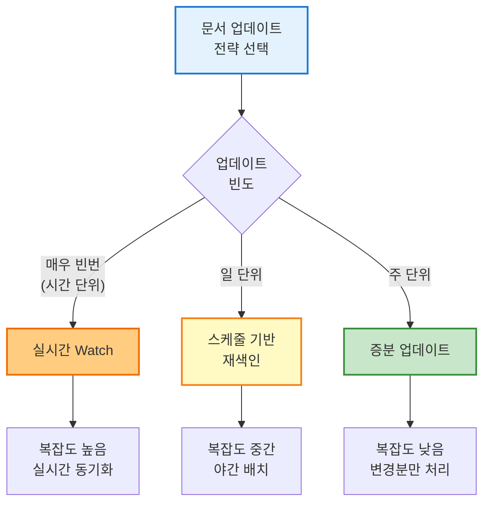

---

### 문제 4: 다국어 지원

#### 상황 설명

```
요구사항:
- 한국어, 영어, 일본어 문서 혼재
- 사용자가 한국어로 질문하면 영어 문서도 검색 가능해야 함

문제: 언어별 임베딩 공간이 달라 검색 실패
```

**예시:**

```
질문 (한국어): "VPN 설치 방법"
문서 (영어): "VPN Installation Guide"
→ 임베딩 거리가 멀어 검색 실패 ❌
```

#### 해결 방법 1: 다국어 임베딩 모델 사용

**multilingual-e5** 또는 **BGE-M3** 같은 다국어 모델을 사용합니다.

```java
// 다국어 임베딩 모델 설정
EmbeddingModel multilingualModel = HuggingFaceEmbeddingModel.builder()
    .modelId("intfloat/multilingual-e5-large")
    .build();

// 또는 OpenAI의 다국어 모델
EmbeddingModel openAiModel = OpenAiEmbeddingModel.builder()
    .apiKey(apiKey)
    .modelName("text-embedding-3-large")  // 다국어 지원
    .build();
```

**다국어 모델 비교:**

|모델|지원 언어|차원|장점|단점|
|:--|:-:|:-:|:--|:--|
|multilingual-e5-large|100+|1024|무료, 로컬 실행|성능 중간|
|BGE-M3|100+|1024|Dense+Sparse 검색|설정 복잡|
|text-embedding-3-large|90+|3072|최고 성능|API 비용|

#### 해결 방법 2: 번역 후 검색

질문을 **여러 언어로 번역**하여 검색합니다.

```java
public List<Content> multilingualSearch(String query, String sourceLang) {
    Set<Content> allResults = new HashSet<>();
    
    // 지원 언어 목록
    List<String> targetLanguages = List.of("en", "ko", "ja");
    
    for (String targetLang : targetLanguages) {
        if (targetLang.equals(sourceLang)) {
            // 원본 언어로 검색
            allResults.addAll(
                retriever.retrieve(Query.from(query))
            );
        } else {
            // 번역 후 검색
            String translatedQuery = translateQuery(query, sourceLang, targetLang);
            allResults.addAll(
                retriever.retrieve(Query.from(translatedQuery))
            );
        }
    }
    
    // 중복 제거 및 재랭킹
    return dedupAndRerank(allResults, query);
}

private String translateQuery(String query, String from, String to) {
    String prompt = String.format(
        "Translate the following text from %s to %s:\n\n%s",
        from, to, query
    );
    return chatModel.generate(prompt);
}
```

**프로세스:**

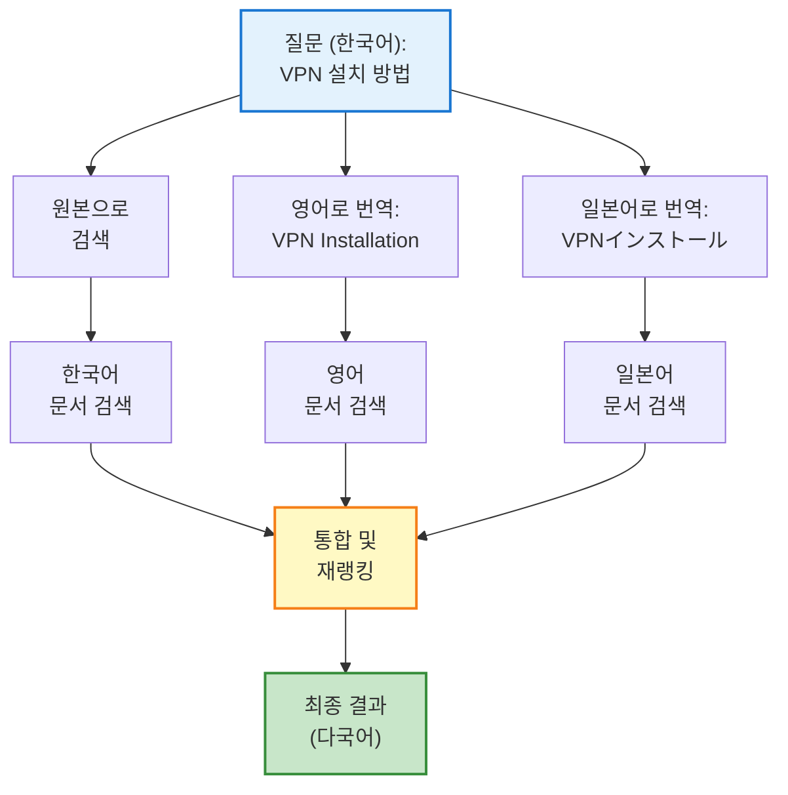

#### 해결 방법 3: 언어별 임베딩 스토어 분리

각 언어마다 **별도의 벡터 스토어**를 유지합니다.

```java
public class MultilingualRAGSystem {
    
    private final Map<String, EmbeddingStore<TextSegment>> storeByLanguage;
    private final Map<String, EmbeddingModel> modelByLanguage;
    
    public MultilingualRAGSystem() {
        storeByLanguage = Map.of(
            "ko", new InMemoryEmbeddingStore<>(),
            "en", new InMemoryEmbeddingStore<>(),
            "ja", new InMemoryEmbeddingStore<>()
        );
        
        // 언어별 최적화된 모델 (선택적)
        modelByLanguage = Map.of(
            "ko", new KoreanEmbeddingModel(),
            "en", new EnglishEmbeddingModel(),
            "ja", new JapaneseEmbeddingModel()
        );
    }
    
    public List<Content> search(String query, String language) {
        // 해당 언어의 스토어에서 검색
        EmbeddingStore<TextSegment> store = storeByLanguage.get(language);
        EmbeddingModel model = modelByLanguage.get(language);
        
        ContentRetriever retriever = EmbeddingStoreContentRetriever.builder()
            .embeddingStore(store)
            .embeddingModel(model)
            .build();
        
        return retriever.retrieve(Query.from(query));
    }
}
```

#### 해결 방법 4: 메타데이터 기반 언어 필터링

```java
// 문서 저장 시 언어 정보 추가
TextSegment koSegment = TextSegment.from(
    "VPN 설치 방법: ...",
    Metadata.from(Map.of("language", "ko"))
);

TextSegment enSegment = TextSegment.from(
    "VPN Installation Guide: ...",
    Metadata.from(Map.of("language", "en"))
);

// 검색 시 사용자 언어에 맞춰 필터링 (또는 다국어 포함)
ContentRetriever retriever = EmbeddingStoreContentRetriever.builder()
    .embeddingStore(embeddingStore)
    .embeddingModel(multilingualModel)
    .filter(metadata -> {
        String lang = metadata.getString("language");
        return userLanguages.contains(lang);  // 사용자 선호 언어
    })
    .build();
```

---

### 문제 5: 성능 최적화

#### 상황 설명

```
현재 상태:
- 사용자 질문 → 답변까지 평균 5초 소요
- 병목 구간:
  1. 임베딩 생성: 0.5초
  2. 벡터 검색: 2초
  3. LLM 응답: 2.5초

목표: 3초 이내로 단축
```

#### 해결 방법 1: 캐싱 전략

**자주 묻는 질문(FAQ)**을 캐시합니다.

```java
@Service
public class CachedRAGService {
    
    private final LoadingCache<String, String> answerCache;
    private final RAGSystem ragSystem;
    
    public CachedRAGService(RAGSystem ragSystem) {
        this.ragSystem = ragSystem;
        this.answerCache = Caffeine.newBuilder()
            .maximumSize(1000)
            .expireAfterWrite(1, TimeUnit.HOURS)
            .build(key -> ragSystem.answer(key));
    }
    
    public String answer(String question) {
        // 1. 질문 정규화 (대소문자, 띄어쓰기 통일)
        String normalizedQuestion = normalize(question);
        
        // 2. 캐시 조회 (유사 질문 포함)
        String cachedAnswer = findSimilarInCache(normalizedQuestion);
        if (cachedAnswer != null) {
            System.out.println("캐시 히트!");
            return cachedAnswer;
        }
        
        // 3. 캐시 미스 → RAG 실행
        return answerCache.get(normalizedQuestion);
    }
    
    private String findSimilarInCache(String question) {
        // 캐시에서 유사 질문 찾기 (임베딩 유사도 > 0.95)
        for (String cachedKey : answerCache.asMap().keySet()) {
            double similarity = calculateSimilarity(question, cachedKey);
            if (similarity > 0.95) {
                return answerCache.get(cachedKey);
            }
        }
        return null;
    }
}
```

**캐시 효과:**

```
캐시 히트율: 40%
평균 응답 시간:
- 캐시 히트: 0.1초 (50배 빠름) ✅
- 캐시 미스: 5초 (그대로)
→ 전체 평균: 0.4×0.1 + 0.6×5 = 3.04초
```

#### 해결 방법 2: 벡터 인덱스 최적화

**HNSW 또는 IVF 인덱스** 사용으로 검색 속도 향상

```sql
-- PostgreSQL pgvector에서 HNSW 인덱스 사용
CREATE INDEX ON embeddings 
USING hnsw (embedding vector_cosine_ops)
WITH (m = 16, ef_construction = 64);

-- 검색 시 ef_search 파라미터 조정
SET hnsw.ef_search = 40;

SELECT * FROM embeddings
ORDER BY embedding <=> query_vector
LIMIT 5;
```

**HNSW 파라미터 튜닝:**

|파라미터|값|효과|트레이드오프|
|:--|:-:|:--|:--|
|`m`|16|각 노드의 연결 수|높을수록 정확하지만 메모리 증가|
|`ef_construction`|64|인덱스 구축 품질|높을수록 인덱스 생성 느림|
|`ef_search`|40|검색 시 탐색 범위|높을수록 정확하지만 느림|

**성능 비교:**

|인덱스 타입|검색 시간|정확도|메모리|
|:--|--:|--:|--:|
|순차 검색 (No Index)|2000ms|100%|Low|
|IVFFlat|200ms|95%|Medium|
|HNSW|50ms|98%|High|

#### 해결 방법 3: 비동기 처리

검색과 LLM 호출을 **병렬**로 처리합니다.

```java
@Service
public class AsyncRAGService {
    
    @Async
    public CompletableFuture<List<Content>> retrieveAsync(String query) {
        List<Content> contents = retriever.retrieve(Query.from(query));
        return CompletableFuture.completedFuture(contents);
    }
    
    @Async
    public CompletableFuture<String> generateAsync(String prompt) {
        String response = chatModel.generate(prompt);
        return CompletableFuture.completedFuture(response);
    }
    
    public String answerWithParallel(String question) throws Exception {
        // 1. 검색 시작 (비동기)
        CompletableFuture<List<Content>> retrievalFuture = 
            retrieveAsync(question);
        
        // 2. 프롬프트 템플릿 준비 (병렬 작업)
        String systemMessage = prepareSystemMessage();
        
        // 3. 검색 완료 대기
        List<Content> contents = retrievalFuture.get();
        
        // 4. 프롬프트 구성
        String context = formatContext(contents);
        String fullPrompt = String.format(
            "%s\n\n컨텍스트:\n%s\n\n질문: %s",
            systemMessage, context, question
        );
        
        // 5. LLM 생성 (비동기)
        CompletableFuture<String> generationFuture = 
            generateAsync(fullPrompt);
        
        return generationFuture.get();
    }
}
```

#### 해결 방법 4: 임베딩 배치 처리

여러 질문을 **한 번에 임베딩**합니다 (배치 API 활용).

```java
public Map<String, String> answerBatch(List<String> questions) {
    // 1. 모든 질문을 한 번에 임베딩
    List<Embedding> queryEmbeddings = embeddingModel.embedAll(questions)
        .content();
    
    // 2. 각 임베딩으로 검색
    Map<String, List<Content>> retrievedByQuestion = new HashMap<>();
    for (int i = 0; i < questions.size(); i++) {
        List<Content> contents = embeddingStore.findRelevant(
            queryEmbeddings.get(i),
            5  // maxResults
        );
        retrievedByQuestion.put(questions.get(i), contents);
    }
    
    // 3. LLM으로 답변 생성 (배치 가능 시)
    return generateAnswersBatch(retrievedByQuestion);
}
```

**배치 처리 효과:**

```
단일 처리: 질문 10개 × 0.5초 = 5초
배치 처리: 질문 10개 × 0.1초 = 1초 (5배 빠름) ✅
```

#### 해결 방법 5: Streaming 응답

사용자에게 **점진적으로 답변**을 보여줍니다.

```java
public void answerWithStreaming(
    String question,
    Consumer<String> onChunk
) {
    // 1. 검색 (동기)
    List<Content> contents = retriever.retrieve(Query.from(question));
    String context = formatContext(contents);
    
    // 2. 프롬프트 구성
    String prompt = String.format(
        "컨텍스트:\n%s\n\n질문: %s\n\n답변:",
        context, question
    );
    
    // 3. Streaming 응답
    chatModel.generate(
        prompt,
        new StreamingResponseHandler<AiMessage>() {
            @Override
            public void onNext(String token) {
                onChunk.accept(token);  // 각 토큰마다 호출
            }
            
            @Override
            public void onComplete(Response<AiMessage> response) {
                System.out.println("스트리밍 완료");
            }
        }
    );
}

// 사용 예시
ragService.answerWithStreaming(
    "VPN 설치 방법은?",
    token -> System.out.print(token)  // "V", "P", "N", " ", "설", ...
);
```

**사용자 경험 개선:**

```
일반 응답: 5초 대기 → 전체 답변 출력
Streaming: 1초 대기 → 점진적 출력 (체감 속도 5배 빠름) ✅
```

#### 성능 최적화 종합

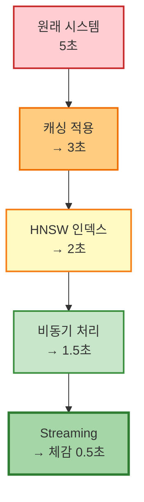

**최적화 우선순위:**

1. ✅ **캐싱** (구현 쉬움, 효과 큼)
2. ✅ **Streaming** (사용자 경험 개선)
3. ✅ **벡터 인덱스** (검색 속도 향상)
4. ⚠️ **비동기 처리** (구현 복잡도 증가)
5. ⚠️ **배치 처리** (특정 시나리오에만 유용)

---

## 핵심 요약

이번 강의에서 다룬 **LangChain4j 기반 RAG 설계**의 핵심 내용을 정리하면 다음과 같습니다:

### 1. RAG 기본 개념

- **Retrieval-Augmented Generation**은 LLM에 외부 지식을 결합하여 환각을 줄이고 정확성을 높이는 기법
- **4단계 프로세스**: 임베딩 → 검색 → 프롬프트 구성 → 답변 생성

### 2. 임베딩과 벡터 검색

- **임베딩 모델 선택**: 다국어/도메인/비용 고려
- **유사도 측정**: 코사인 유사도 (텍스트 RAG 표준)
- **벡터 DB**: 개발 시 인메모리, 프로덕션 시 pgvector

### 3. 문서 청킹 전략

- **고정 길이 청킹**: 간단하지만 문맥 손실 위험
- **의미 기반 청킹**: 정확하지만 비용 높음
- **계층적 청킹**: 구조화된 문서에 효과적

### 4. 고급 검색 기법

- **Hybrid Search**: BM25 + Vector Search 결합
- **Re-ranking**: Cross-Encoder로 정확도 향상
- **Query Expansion & HyDE**: 검색 범위 확대

### 5. 프롬프트 엔지니어링

- **컨텍스트 제한**: 관련 정보만 압축 제공
- **모델 지시**: 추측 금지, 출처 표시
- **Map-Reduce & Refine**: 긴 문서 처리 전략

### 6. 평가 및 테스트

- **Retrieval 평가**: Recall@K, Precision@K, MRR
- **Generation 평가**: 정확성, 완전성, 근거 충실도
- **LLM-as-a-Judge**: 자동 평가 시스템

### 7. 실전 문제 해결

- **검색 정확도**: Query Expansion, HyDE, Hybrid Search
- **컨텍스트 초과**: Map-Reduce, Refine, 큰 모델 사용
- **문서 업데이트**: 증분 업데이트, 버전 관리
- **다국어 지원**: 다국어 모델, 번역 후 검색
- **성능 최적화**: 캐싱, HNSW 인덱스, Streaming

---

## 마치며

실무에서는 이러한 원칙들을 적용하여 **작은 프로토타입**부터 시작하고 점진적으로 시스템을 고도화하게 됩니다.

**권장 학습 경로:**

1. **기본 RAG 구현** (인메모리 + 기본 검색)
2. **프롬프트 튜닝** (컨텍스트 제한, 지시 개선)
3. **검색 개선** (Hybrid Search, Re-ranking)
4. **평가 시스템 구축** (테스트 세트, 자동 평가)
5. **성능 최적화** (캐싱, 인덱싱, Streaming)

여러분도 본 강의의 내용을 바탕으로 **자신만의 LangChain4j RAG 챗봇**을 설계해보고, 도메인 지식에 강하고 신뢰할 수 있는 AI 비서를 만들어보시기 바랍니다.

---

## 참고 자료

### 공식 문서

- [LangChain4j 공식 문서](https://docs.langchain4j.dev/)
- [OpenAI Embeddings](https://platform.openai.com/docs/guides/embeddings)
- [PostgreSQL pgvector](https://github.com/pgvector/pgvector)

### 논문 및 블로그

- ["Retrieval-Augmented Generation for Knowledge-Intensive NLP Tasks"](https://arxiv.org/abs/2005.11401) - RAG 원본 논문
- ["Lost in the Middle: How Language Models Use Long Contexts"](https://arxiv.org/abs/2307.03172)
- ["HyDE: Precise Zero-Shot Dense Retrieval"](https://arxiv.org/abs/2212.10496)

### 도구 및 라이브러리

- [Sentence Transformers](https://www.sbert.net/)
- [Cohere Rerank API](https://docs.cohere.com/reference/rerank-1)
- [RAGAS (RAG Assessment)](https://github.com/explodinggradients/ragas) - Python 평가 프레임워크