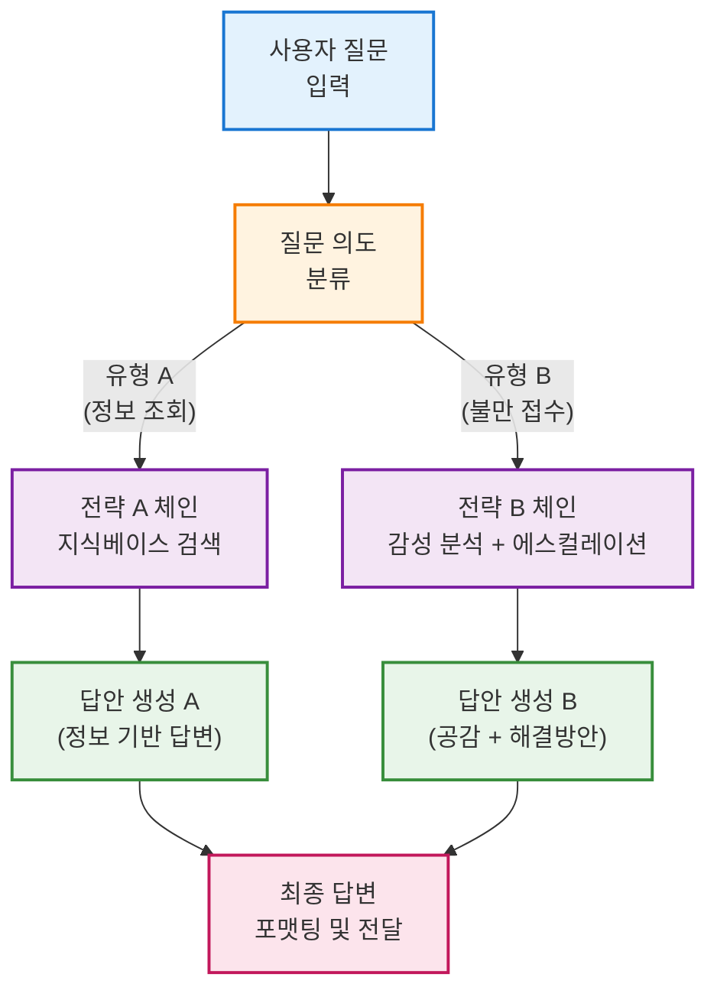
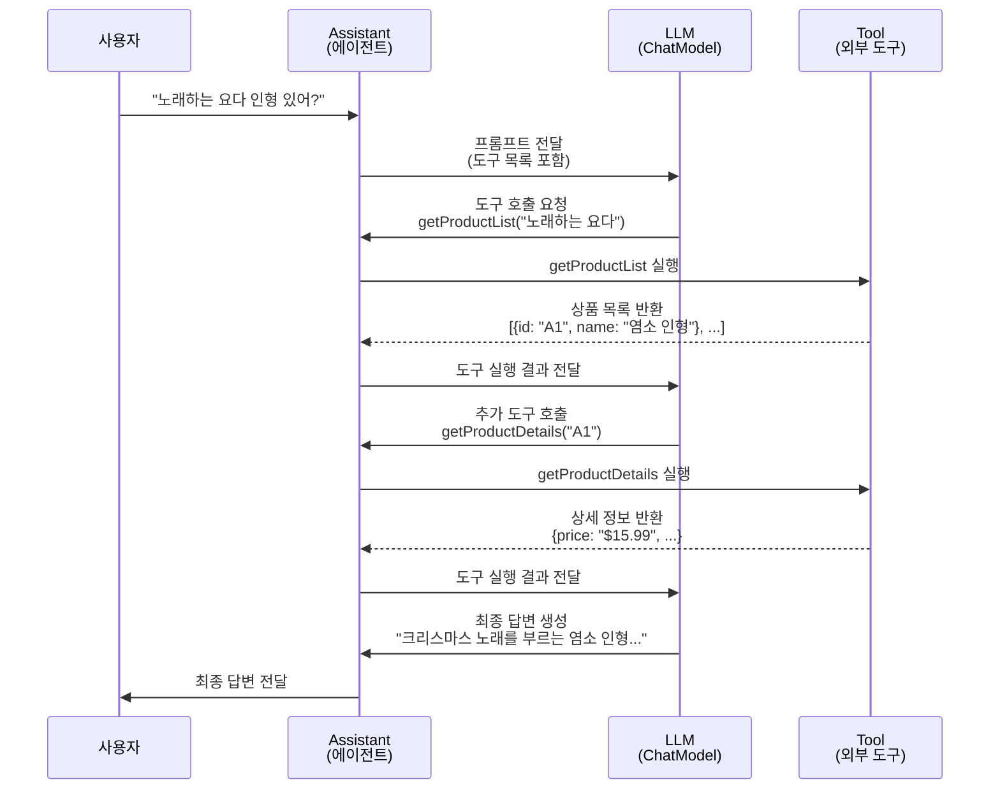
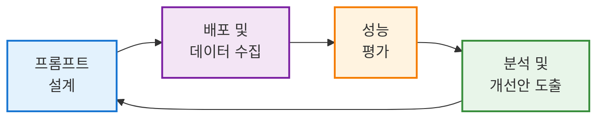
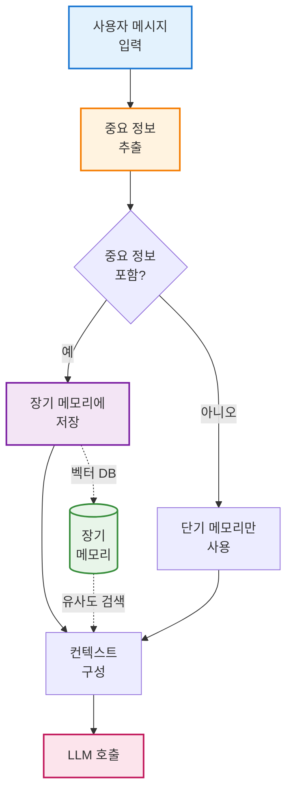
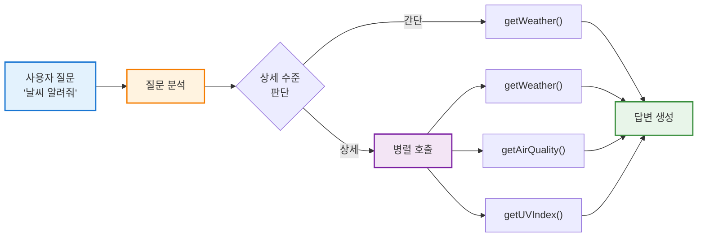
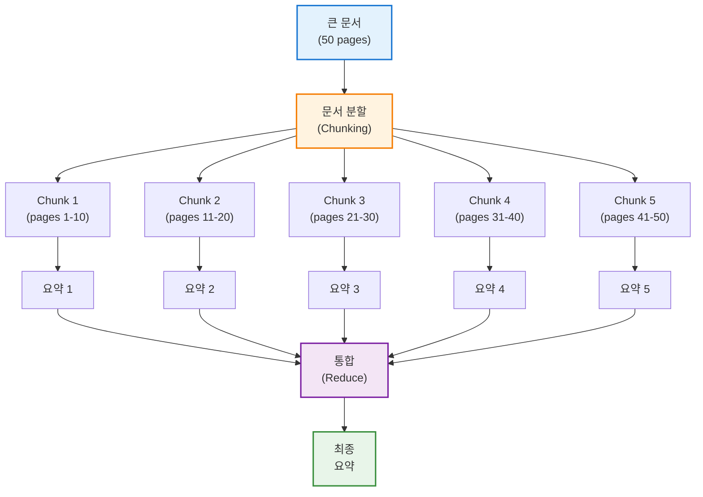
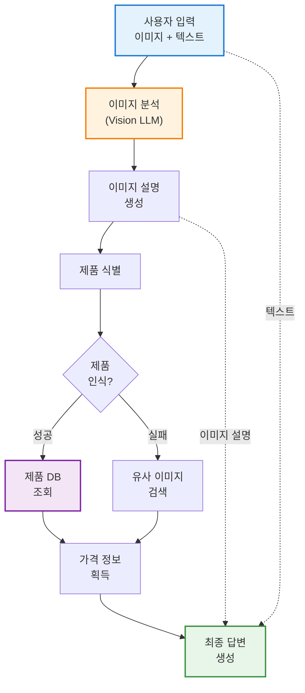

## 서론: 프롬프트 체인의 필요성과 개요

현대의 LLM 응용에서는 단순히 **질문-답변** 형태를 넘어, 다단계 **프롬프트 체인**을 설계하여 복잡한 작업을 자동화하는 전략이 중요해지고 있습니다. 프롬프트 체인은 여러 프롬프트 및 동작을 **연쇄적(RunnableChain)**으로 연결한 워크플로로서, LLM의 응답을 기반으로 분기하거나 외부 도구를 호출하는 등 동적 흐름 제어를 가능하게 합니다. 특히 Java 환경의 실무자들은 LangChain4j를 통해 OpenAI와 같은 LLM을 손쉽게 통합할 수 있으며, **프롬프트 체인**을 활용해 질의 분석, 정보 검색, 답변 생성, 후처리까지 아우르는 **자동화 파이프라인**을 구현할 수 있습니다.

본 장에서는 LangChain4j의 주요 구성 요소인 **AiService**, **Tool**, **메모리** 등을 활용하여 프롬프트 체인을 설계하는 원리와 실무 운영 전략을 다룹니다. 기술 배경이 다양한 실무자도 이해할 수 있도록, 개념 위주 예시와 다이어그램, 그리고 구체적인 실무 문제 상황과 해결 방안을 통해 **시스템 전체의 흐름과 운영 전략**을 설명합니다.

---

## 프롬프트 체인이란? – RunnableChain 개념과 설계 원칙

### RunnableChain의 핵심 개념

프롬프트 체인은 간단히 말해 **여러 단계의 LLM 프롬프트 처리 과정**을 하나의 흐름으로 묶은 것입니다. LangChain4j에서는 이러한 연쇄 호출을 추상화하여 하나의 **RunnableChain**처럼 다룰 수 있습니다. 각 단계는 **프롬프트 실행 단위**(예: LLM 호출, 함수 실행 등)로서, 이전 단계의 출력을 다음 단계의 입력으로 사용하며 순차적으로 실행됩니다.

**RunnableChain의 핵심 특징:**

1. **순차적 실행**: 각 단계가 파이프라인처럼 연결되어 데이터가 흐름
2. **데이터 변환**: 각 단계에서 입력을 받아 처리 후 다음 단계로 전달
3. **조합 가능성**: 여러 개의 작은 체인을 조합하여 복잡한 워크플로 구성
4. **재사용성**: 한 번 정의한 체인을 다양한 컨텍스트에서 재활용
5. **투명성**: 각 단계의 입출력을 추적하여 디버깅과 모니터링 용이

### 체인 설계의 3가지 핵심 원칙

프롬프트 체인을 설계할 때는 **논리적 단계 구분**과 **데이터 흐름**에 초점을 맞춰야 합니다.

**원칙 1: 단일 책임 원칙 (Single Responsibility)**

각 체인 단계는 하나의 명확한 목적만 수행해야 합니다. 예를 들어:

- ➊ **질문 분류 단계**: 사용자 의도 파악만 담당
- ➋ **정보 검색 단계**: 필요한 데이터 수집만 담당
- ➌ **답변 생성 단계**: 최종 응답 작성만 담당

이렇게 하면 각 단계를 독립적으로 테스트하고 개선할 수 있으며, 문제 발생 시 원인 파악도 쉬워집니다.

**원칙 2: 명시적 인터페이스 (Explicit Interface)**

각 단계 간 주고받는 데이터 형식을 명확히 정의합니다:

```
입력: { "query": "배송 조회", "userId": "12345" }
처리: 의도 분류 → "ORDER_TRACKING"
출력: { "intent": "ORDER_TRACKING", "confidence": 0.95 }
```

명시적 인터페이스는 체인의 각 부분을 독립적으로 개발하고 테스트할 수 있게 하며, 팀 협업 시 커뮤니케이션을 명확하게 만듭니다.

**원칙 3: 오류 처리 및 폴백 (Error Handling & Fallback)**

각 단계에서 예외가 발생할 경우를 대비한 대체 경로를 설계합니다. 예를 들어:

- LLM 호출 실패 → 캐시된 응답 또는 기본 답변 제공
- 도구 호출 오류 → 대체 도구 사용 또는 사용자에게 오류 안내
- 분류 실패 → 기본 경로로 진행

### 실무 적용 예시

예를 들어, 사용자의 질문을 바로 LLM에 보내는 대신:

- ➊ 우선 **질문의 의도나 유형을 분류**하고
- ➋ 그 결과에 따라 **다른 프롬프트 템플릿**이나 **검색 절차**를 밟은 후
- ➌ 최종적으로 LLM이 답변을 생성하도록 구성할 수 있습니다

또한 체인 중간에 **조건 분기**나 **반복 루프**를 넣어, 필요에 따라 **다른 경로로 진행**되도록 만들 수 있습니다. LangChain4j 등 최신 프레임워크에서는 이러한 **조건부 실행(Branching)**을 지원하여, 체인 내부에서 if-else와 유사한 **동적 흐름 제어**를 구현할 수 있습니다.

결과적으로 **프롬프트 체인**은 전통적인 프로그램의 로직 흐름을 LLM 기반 앱에 도입하는 방식으로, **프롬프트 엔지니어링을 구조화**하고 응답의 일관성과 재사용성을 높여줍니다.

---

## 분기(Branching)를 활용한 프롬프트 흐름 제어

### 분기의 필요성

체인 내부의 **분기**는 입력이나 중간 결과에 따라 **다른 처리 경로를 밟는 동적 워크플로**를 의미합니다. 단일 프롬프트로는 모든 상황을 최적으로 처리하기 어렵기 때문에, 상황에 따라 특화된 처리 경로를 선택하는 것이 효과적입니다.

### 분기 전략 유형

|분기 유형|설명|적용 사례|
|:-:|:--|:--|
|**의도 기반 분기**|사용자 의도에 따라 경로 선택|문의/불만/칭찬 구분|
|**데이터 소스 분기**|필요한 정보 위치에 따라 선택|사내DB vs 공개API|
|**신뢰도 기반 분기**|LLM 응답 확신도에 따라 선택|고신뢰: 즉시 답변 / 저신뢰: 재검증|
|**권한 기반 분기**|사용자 권한에 따라 경로 제어|관리자 vs 일반사용자|
|**컨텍스트 크기 분기**|입력 길이에 따라 처리 방식 변경|짧은 질문: 직접 답변 / 긴 문서: 요약 후 답변|

### 실무 예시: 고객 지원 챗봇

**고객 지원 챗봇**을 생각해보겠습니다. 사용자의 질문이 불만/칭찬 등의 **감정 피드백**인지, 정보 조회 요청인지에 따라 챗봇의 답변 전략을 달리해야 합니다.

**처리 흐름:**

1. 첫 단계에서 LLM을 통해 피드백의 **감성을 분류** (`긍정`, `부정`, `중립` 등)
2. 그 결과에 따라 **다른 답변 생성 프롬프트** 선택
3. 부정적 피드백 → 공감하는 톤 + 해결 방안 제시
4. 긍정적 피드백 → 감사 표현 + 추가 서비스 안내

또 다른 예로, 질문이 **사내 데이터 문의**인지 **일반 상식 질문**인지 분류한 뒤:

- 전자이면 **사내 지식베이스 검색(RAG)**을 거쳐 답변
- 후자이면 **일반 LLM 답변**을 생성하도록 분기

이러한 **조건부 체인** 덕분에 각 상황에 최적화된 대응을 자동화할 수 있으며, LangChain (파이썬 버전 기준)에서는 `RunnableBranch`라는 구성 요소로 체인 내 분기를 우아하게 처리합니다. LangChain4j에서도 동일한 개념을 적용하여, 분기 로직을 Java 코드 상에서 구현하거나 여러 AiService를 조합함으로써 **유연한 프롬프트 흐름**을 구성할 수 있습니다.

### 분기 흐름 다이어그램

아래 다이어그램은 **질문 분류 후 분기되는 체인**의 예시 흐름을 보여줍니다. 사용자의 질문을 분류기에서 판별하여 **유형 A**일 때는 **전략 A 체인**으로, **유형 B**일 때는 **전략 B 체인**으로 분기 실행한 뒤 각각 별도의 답변을 생성하고, 마지막에 **최종 답변**으로 통합하여 사용자에게 응답하는 구조입니다.



### 분기 설계 시 주의사항

분기 설계 시 유의할 점은 **분류의 정확도**와 **분기 기준의 명확성**입니다:

1. **분류 정확도**: LLM을 이용한 분류는 확률적이므로 오분류 가능성을 염두에 두고 **디폴트 분기**나 예외 처리도 준비해야 합니다.
    
2. **명확한 기준**: 각 분기 조건을 명확히 정의하여 예측 가능한 동작을 보장합니다.
    
3. **폴백 경로**: 어떤 조건에도 맞지 않을 경우 기본 응답을 주도록 구성합니다.
    
4. **테스트 커버리지**: 모든 분기 경로에 대한 테스트 케이스를 작성하여 예상치 못한 동작을 방지합니다.
    

LangChain의 분기 기능 예시에서는 분류 결과를 해석해 조건에 맞는 체인을 실행하고, 어떤 조건에도 맞지 않을 경우 기본 응답을 주도록 구성하기도 합니다. 이처럼 분기 구조를 도입하면 체인의 복잡도가 올라가지만, **특정 상황에 특화된 프롬프트 처리**를 구현할 수 있어 사용자 질의에 대한 **정밀한 대응**이 가능합니다.

---

## 도구 실행을 통한 LLM 기능 확장 (Tool Integration)

### 도구 통합의 필요성

LLM의 한계를 보완하기 위해 **외부 도구를 실행**하는 것은 프롬프트 체인의 핵심 전략 중 하나입니다. 도구(tool)란 LLM이 직접 알지 못하는 **외부 정보 조회나 연산을 수행하는 함수**를 의미하며, OpenAI의 함수 호출(Function Calling)과 유사한 개념입니다.

**LLM이 도구가 필요한 이유:**

- **실시간 정보**: 학습 데이터 이후의 정보 조회 (날씨, 주가, 뉴스 등)
- **정확한 계산**: 복잡한 수학 연산이나 데이터 분석
- **외부 시스템 연동**: 데이터베이스 조회, API 호출, 파일 조작
- **도메인 지식**: 회사 내부 시스템이나 전문 도구 접근

### LangChain4j의 도구 통합 방식

LangChain4j에서는 도구 통합을 매우 쉽게 지원합니다. Java 메서드에 `@Tool` 어노테이션을 달아두기만 하면 LLM이 해당 함수를 호출할 수 있도록 AiService에 등록됩니다.

**도구 구현 예시 (의사 코드):**

```java
public class ShoppingTools {
    
    @Tool("상품 목록을 검색합니다. 키워드를 입력하면 관련 상품 목록을 반환합니다.")
    public List<Product> getProductList(String keyword) {
        // 데이터베이스 또는 API 호출
        return productRepository.searchByKeyword(keyword);
    }
    
    @Tool("상품 ID로 상세 정보를 조회합니다.")
    public ProductDetail getProductDetails(String productId) {
        // 상세 정보 조회
        return productRepository.findById(productId);
    }
}
```

개발자는 `ShoppingTools`와 같은 클래스에 각종 도구 메서드를 정의하고, AiService 생성 시 `tools(new ShoppingTools())`로 지정하면 됩니다. 그러면 LLM 프롬프트에 **도구 목록과 설명**이 포함되어, 모델이 답변 중 해당 도구를 호출하고자 할 때 **함수 호출 형태의 응답**을 보냅니다. 프롬프트 엔진은 그 응답을 해석하여 실제 Java 메서드를 실행하고, 결과를 다시 모델에 전달한 후 최종 답변을 완성합니다.

### 도구 실행 시나리오

예를 들어 사용자가 온라인 상점 챗봇에게 *"노래하는 요다 인형 있어?"*라고 묻는 시나리오를 생각해보겠습니다:

**처리 단계:**

1. LLM이 질문을 분석하여 상품 검색이 필요함을 인식
2. `getProductList("노래하는 요다")` 도구 호출 요청
3. 챗봇이 실제 메서드 실행 → 상품 목록 반환
4. LLM이 결과를 보고 상세 정보가 필요하다고 판단
5. 후보 상품에 대해 `getProductDetails(productId)` 호출
6. 조회한 결과를 활용하여 최종 답변 생성: _"크리스마스 노래를 부르는 염소 인형이 있습니다. 가격은 15.99달러입니다."_

좋은 LLM은 필요한 경우 **도구를 순차적으로 또는 병렬로 여러 번 호출**하여 복잡한 요구도 처리해낼 수 있습니다.

### 도구 통합 시퀀스 다이어그램

아래 시퀀스 다이어그램은 도구가 통합된 체인에서 **LLM이 도구를 호출하여 답변을 생성**하는 과정을 묘사한 것입니다.



### 도구 설계 가이드라인

개발자는 각 도구에 대해 **명확한 이름과 기능 설명, 파라미터 설명**을 제공하여 LLM이 언제 어떤 도구를 써야 할지 이해하도록 프롬프트를 구성해야 합니다:

|요소|중요도|설명|
|:-:|:-:|:--|
|**도구 이름**|필수|명확하고 설명적인 이름 사용 (예: `getProductList`)|
|**기능 설명**|필수|도구가 무엇을 하는지 명확히 설명|
|**파라미터 설명**|필수|각 파라미터의 의미와 예시 제공|
|**반환값 설명**|권장|어떤 형식의 데이터가 반환되는지 명시|
|**오류 처리**|필수|실패 시 어떻게 대응할지 정의|

**주의사항:**

- **모든 LLM이 도구 사용을 지원하는 것은 아니므로**, 사용 중인 모델의 기능을 확인해야 합니다.
- 도구 호출에는 비용과 지연이 발생하므로, 필요한 경우에만 호출하도록 프롬프트를 최적화합니다.
- 도구 실행 권한과 보안을 고려하여, 민감한 작업에는 사용자 승인을 요구하는 휴먼-인-더-룹(Human-in-the-Loop) 패턴을 적용합니다.

### Tool Registry (도구 레지스트리) 개념

**Tool Registry**는 사용 가능한 모든 도구를 중앙에서 관리하여 **에이전트에게 도구의 이름, 설명, 인자 스키마 정보를 제공**하는 디렉토리입니다.

**Tool Registry의 장점:**

- **동적 도구 추가**: 런타임에 새로운 도구 등록 가능
- **중앙 관리**: 모든 도구를 한 곳에서 관리하여 일관성 유지
- **버전 관리**: 도구의 버전별 관리 및 배포
- **권한 제어**: 사용자/역할별 도구 접근 권한 설정

LangChain4j의 Spring 통합에서는 애플리케이션 구동 시 `@Tool`이 달린 모든 메서드를 자동으로 검색해 **툴 목록에 등록**하고, AiService 생성 시 해당 목록을 LLM에 전달합니다. 이러한 레지스트리를 활용하면 새로운 도구를 추가하거나 배포된 마이크로서비스가 **자체적으로 툴을 등록**하여 에이전트가 실시간으로 도구를 확장하는 아키텍처도 구상할 수 있습니다.

### MCP (Model Context Protocol) 서버 패턴

**MCP(Model Context Protocol)**는 LLM이 원격 도구를 표준화된 방식으로 호출할 수 있게 하는 프로토콜입니다. Anthropic이 제안한 이 프로토콜을 사용하면:

- 별도의 **MCP 서버**로 구현된 툴들이 부팅 시 중앙 레지스트리에 자신을 등록
- LLM은 MCP 프로토콜을 통해 원격 툴들을 호출
- 마이크로서비스 아키텍처에서 각 서비스가 독립적으로 도구를 제공

**MCP 서버 구조 예시:**

```
┌─────────────┐
│   LLM Agent │
└──────┬──────┘
       │ MCP Protocol
       ├───────────┬─────────────┬──────────────┐
       ▼           ▼             ▼              ▼
   [Product]  [Payment]   [Inventory]   [Analytics]
   MCP Server MCP Server  MCP Server    MCP Server
```

이러한 아키텍처를 통해 **확장 가능하고 유연한 도구 생태계**를 구축할 수 있습니다.

도구 통합 전략을 통해 챗봇은 **실시간 정보 검색, DB 조회, 계산, 이메일 전송** 등 무한한 확장성을 가지게 되며, 이를 통해 보다 정확하고 신뢰도 높은 답변을 생성할 수 있습니다.

---

## 메모리 활용과 컨텍스트 관리 전략

### 메모리의 필요성

LLM은 기본적으로 **이전 대화를 기억하지 못하는 상태(stateless)**로 동작하므로, 문맥 유지를 위해 **대화 메모리(memory)**를 관리해야 합니다. 메모리 없이는 사용자가 "그것"이나 "이전에 말한"과 같은 대명사나 참조를 사용할 때 LLM이 이해하지 못합니다.

LangChain4j의 `ChatMemory` 인터페이스를 사용하면 모델 호출 시 **과거 대화 기록을 함께 전달**하여 LLM이 이전 맥락을 참고하도록 만들 수 있습니다.

### 메모리 관리 전략

가장 단순히는 사용자의 모든 발화와 AI의 응답을 **리스트 형태로 누적**해 매번 모델에 보내는 방식이 있습니다. 그러나 대화가 길어지면 이 메모리가 기하급수적으로 커져 **토큰 한도**를 초과하거나 **비용**이 급증할 수 있습니다.

### LangChain4j의 메모리 정책

LangChain4j는 두 가지 기본 메모리 정책을 제공합니다:

|메모리 유형|설명|장점|단점|사용 사례|
|:-:|:--|:--|:--|:--|
|**MessageWindow<br/>Memory**|가장 오래된 메시지부터 삭제하여<br/>일정 **메시지 개수** 제한|구현 단순<br/>예측 가능|중요한 초기<br/>정보 손실 가능|짧은 대화<br/>고객 문의|
|**TokenWindow<br/>Memory**|총 토큰 수가 기준 초과 시<br/>오래된 기록 제거|비용 통제<br/>효율적|토크나이저<br/>의존성|긴 대화<br/>비용 민감|

**구현 예시 (의사 코드):**

```java
// 최근 10개 메시지만 유지
ChatMemory memory = MessageWindowChatMemory.withMaxMessages(10);

// 최대 1000토큰 분량만 유지
ChatMemory memory = TokenWindowChatMemory.withMaxTokens(1000, tokenizer);
```

### 고급 메모리 전략

#### 1. 요약 기반 메모리 (SummarizingMemory)

오래된 대화를 요약본으로 대체하여 중요한 맥락은 남기고 부수적인 정보만 제거하는 방식입니다.

**처리 흐름:**

```
원본 대화 (100개 메시지)
    ↓
오래된 80개 메시지 요약
    ↓
[요약문] + 최근 20개 메시지
```

**장점:**

- 중요한 정보 보존
- 토큰 사용 최적화
- 긴 대화 세션 지원

**단점:**

- 요약에 추가 LLM 호출 필요 (비용 증가)
- 요약 과정에서 정보 손실 가능

#### 2. 벡터 메모리 (Vector-based Memory)

임베딩을 사용하여 유사도 기반으로 관련 대화만 검색하여 컨텍스트에 포함합니다.

**처리 흐름:**

```
현재 질문: "배송 상태 확인"
    ↓
벡터 임베딩 생성
    ↓
과거 대화에서 유사도 검색
    ↓
관련 대화 3개만 컨텍스트에 포함
```

### 사용자별 메모리 관리

LangChain4j에서는 메모리 관리를 위해 편리한 기능도 제공하는데, AiService를 생성할 때 `.chatMemory(chatMemory)`로 메모리를 연결해두면 **사용자 메시지와 AI 응답을 자동으로 메모리에 축적**해줍니다.

특히 여러 사용자별로 별도의 대화 메모리를 운용해야 할 경우, `@MemoryId`를 메서드 인자에 사용하여 **사용자별 고유 ID**로 메모리를 구분할 수 있습니다.

**다중 사용자 메모리 관리 예시 (의사 코드):**

```java
public interface CustomerSupportAssistant {
    String chat(@MemoryId String userId, @UserMessage String message);
}

// 사용자 A와 B는 각각 독립적인 대화 컨텍스트 유지
assistant.chat("user_A", "제 주문은 언제 도착하나요?");
assistant.chat("user_B", "환불은 어떻게 하나요?");
assistant.chat("user_A", "그럼 추적 번호는요?"); // "제 주문" 컨텍스트 유지
```

실무에선 이 메모리 ID에 따라 대화 내용을 DB 등에 지속화(persist)해 두고, 서비스를 재시작하더라도 사용자별 대화를 이어갈 수 있도록 구현합니다.

### 메모리와 RAG의 통합

메모리 활용 전략에서 중요한 것은 **적절한 컨텍스트 추려내기**입니다. 모든 대화를 다 기억시키면 비용과 성능 면에서 비효율적이므로, 앞서 언급한 윈도우 기법이나 요약기법으로 **맥락의 창(window)**을 관리해야 합니다.

**단기 vs 장기 메모리:**

|구분|단기 메모리|장기 메모리|
|:-:|:--|:--|
|**목적**|현재 대화 맥락 유지|지속적 지식 저장|
|**구현**|ChatMemory|RAG + Vector DB|
|**범위**|현재 세션|모든 세션|
|**예시**|방금 전 대화 내용|사용자 선호도, 과거 주문 내역|

또한 **장기적인 기억**이 필요한 경우에는 벡터 데이터베이스 등의 **외부 지식베이스**에 정보를 저장하고, 필요시 유사도 검색으로 불러오는 **RAG** 기법을 활용하게 됩니다. LangChain4j 역시 Pinecone, Milvus, Chroma 등의 **벡터 스토어 연동**을 지원하여, 문서를 임베딩하여 저장하고 질의 시 관련 정보를 검색해 LLM 프롬프트에 포함시키는 **Retrieval-Augmented Generation** 패턴을 쉽게 구현할 수 있습니다.

### 실무 메모리 관리 전략

요약하면:

- **대화 메모리**는 **단기 컨텍스트** 유지를
- **RAG 등의 지식 검색**은 **장기 정보** 활용을 담당

둘을 적절히 조합해 프롬프트 체인의 컨텍스트를 관리하는 것이 바람직합니다. 실무에서는 먼저 간단한 슬라이딩 윈도우 메모리로 시작하고, 응용이 복잡해짐에 따라 요약 메모리나 외부 지식베이스 연계를 추가하는 **점진적 발전 전략**을 추천합니다.

**권장 발전 단계:**

1. **1단계**: MessageWindowMemory로 시작 (최근 10~20개 메시지)
2. **2단계**: TokenWindowMemory로 전환 (비용 최적화)
3. **3단계**: 요약 메모리 도입 (긴 세션 지원)
4. **4단계**: RAG와 통합 (장기 지식 관리)

---

## 프롬프트 버전 관리와 A/B 테스트

### 프롬프트 버전 관리의 중요성

프롬프트 엔지니어링의 효과는 사소한 문구 변경에도 크게 달라질 수 있기 때문에, **프롬프트 버전 관리**와 **실험적 검증**은 운영 전략의 중요한 요소입니다.

**프롬프트 버전 관리**는 체인에 사용되는 시스템 메시지, 예시, 도구 설명 등의 프롬프트 내용들을 **버전별로 관리**하여 언제 어떤 수정이 가해졌는지 추적하는 것을 의미합니다. 이는 소프트웨어의 버전 관리와 유사하며, 종종 JSON/YAML 등의 설정파일이나 별도 DB 테이블로 프롬프트 스크립트를 관리하기도 합니다.

### 버전 관리 구조 예시

**파일 기반 버전 관리:**

```
prompts/
├── customer_support/
│   ├── v1.0.0/
│   │   ├── system_message.txt
│   │   ├── classification_prompt.txt
│   │   └── response_template.txt
│   ├── v1.1.0/
│   │   ├── system_message.txt  (개선됨)
│   │   ├── classification_prompt.txt
│   │   └── response_template.txt
│   └── v2.0.0/  (현재)
│       ├── system_message.txt
│       ├── classification_prompt.txt
│       └── response_template.txt
```

**DB 기반 버전 관리:**

```sql
CREATE TABLE prompt_versions (
    id VARCHAR(50) PRIMARY KEY,
    version VARCHAR(20),
    prompt_type VARCHAR(50),
    content TEXT,
    created_at TIMESTAMP,
    is_active BOOLEAN,
    performance_score FLOAT
);
```

### 버전 관리의 장점

|장점|설명|
|:-:|:--|
|**추적 가능성**|언제 누가 무엇을 바꿨는지 기록|
|**롤백 용이**|문제 발생 시 이전 버전으로 즉시 복구|
|**A/B 테스트**|여러 버전을 동시 운영하며 비교|
|**팀 협업**|변경 이력 공유로 커뮤니케이션 개선|

### A/B 테스트 전략

**A/B 테스트**는 사용자 트래픽의 일부에 새로운 프롬프트 체인을 적용하고 나머지에는 기존 버전을 유지하여 **성과를 비교하는 실험**입니다.

**A/B 테스트 설계:**

```
전체 사용자 (1000명)
    ↓
├─ 그룹 A (500명, 50%) → 기존 프롬프트 v1
└─ 그룹 B (500명, 50%) → 새 프롬프트 v2
    ↓
성과 지표 수집 및 비교
```

### 성과 지표 (KPI)

여기서 성과 지표는 도메인에 따라 다를 수 있는데, 예컨대:

|지표 유형|측정 항목|목표|
|:-:|:--|:-:|
|**품질 지표**|답변 만족도 평가 (1~5점)|↑ 증가|
|**효율 지표**|문제 해결률 (%)|↑ 증가|
|**비용 지표**|평균 토큰 사용량|↓ 감소|
|**경험 지표**|추가 문의 발생률|↓ 감소|
|**시간 지표**|평균 응답 시간 (초)|↓ 감소|

### A/B 테스트 구현 방법

LangChain4j 자체적으로는 프롬프트 버전 A/B 테스트 도구가 내장되어 있지는 않지만, 일반 웹 서비스와 마찬가지로 애플리케이션 레벨에서 조건에 따라 다른 AiService나 체인을 호출하도록 구현함으로써 손쉽게 실험을 통제할 수 있습니다.

**구현 예시 (의사 코드):**

```java
public class ABTestingService {
    private final AiService versionA;
    private final AiService versionB;
    private final MetricsCollector metrics;
    
    public String handleUserQuery(String userId, String query) {
        // 사용자 ID 기반 해싱으로 그룹 분할
        boolean useVersionB = (userId.hashCode() % 100) < 50;  // 50% 분할
        
        String response;
        if (useVersionB) {
            response = versionB.chat(query);
            metrics.record("version_B", userId, query, response);
        } else {
            response = versionA.chat(query);
            metrics.record("version_A", userId, query, response);
        }
        
        return response;
    }
}
```

### 통계적 유의성 검증

중요한 점은 LLM의 출력에는 **확률적 변동성**이 있으므로, 충분한 표본을 모아 **통계적으로 유의미한 차이**를 확인해야 한다는 것입니다.

**최소 표본 크기 계산:**

- 유의 수준: p < 0.05
- 검정력: 80% 이상
- 예상 효과 크기에 따라 수백~수천 샘플 필요

### 평가 루프 (Evaluation Loop)

또한 **평가 루프(Evaluation Loop)**를 구축하여, 프롬프트 체인의 성능을 지속적으로 측정하고 개선하는 체계가 필요합니다. 예를 들어 OpenAI의 **evals**처럼 미리 준비된 테스트 프롬프트 세트에 대해 여러 버전의 체인을 실행해보고 결과의 정확도를 비교하는 **오프라인 평가**를 주기적으로 수행할 수 있습니다.

**평가 루프 사이클:**



### 자동화된 평가 기법

LangChain4j 문서에서도 "AI 제품에는 평가가 필요하다"는 외부 자료를 인용하며, 체계적인 평가를 통한 프롬프트 개선 중요성을 강조하고 있습니다. 특히 비즈니스 환경에서는 다음과 같은 자동화된 평가 기법도 고려됩니다:

**1. LLM 평가자 (LLM-as-Judge)**

- 다른 LLM을 평가자로 활용하여 응답 품질 측정
- 예: GPT-4로 GPT-3.5의 응답 평가

**2. 골드 답변 비교**

- 미리 준비된 정답과 유사도 평가
- 임베딩 기반 코사인 유사도 측정

**3. 자동화된 테스트 스위트**

- 수백~수천 개의 테스트 케이스 자동 실행
- CI/CD 파이프라인에 통합

이러한 평가 결과는 프롬프트 수정의 근거로 활용되고, 수정 → 배포 → 재평가의 **Loop**를 통해 모델 응답 품질을 높이게 됩니다.

---

## 운영 단계에서의 실험 결과 수집과 모델 개선

### 데이터 수집의 중요성

프롬프트 체인을 프로덕션에서 운영하게 되면, 실제 사용자 상호작용 데이터를 통해 **지속적인 개선 사이클**을 돌리는 것이 중요합니다. 우선 **로그와 대화 데이터 수집**을 철저히 해야 합니다.

### LangChain4j의 모니터링 기능

LangChain4j에는 `ChatModelListener`를 통해 **모델 요청/응답을 가로채 로깅**하는 기능이 있어, prompt와 response를 모니터링할 수 있습니다.

**로깅 구현 예시 (의사 코드):**

```java
public class CustomChatModelListener implements ChatModelListener {
    
    @Override
    public void onRequest(ChatModelRequest request) {
        logger.info("프롬프트: {}", request.messages());
        logger.info("모델: {}", request.model());
        logger.info("파라미터: {}", request.parameters());
    }
    
    @Override
    public void onResponse(ChatModelResponse response) {
        logger.info("응답: {}", response.aiMessage().text());
        logger.info("토큰 사용: {}", response.tokenUsage());
        logger.info("처리 시간: {}ms", response.finishReason());
    }
}
```

### 수집해야 할 데이터

이를 활용하면 각 대화에 대해 다음 정보를 모두 기록하여 분석할 수 있습니다:

|데이터 유형|수집 항목|활용 목적|
|:-:|:--|:--|
|**입력 데이터**|사용자 질문, 메타데이터|패턴 분석|
|**체인 실행**|분기 경로, 사용된 도구|흐름 최적화|
|**출력 데이터**|최종 답변, 생성 시간|품질 평가|
|**성능 지표**|토큰 사용량, 응답 시간|비용 최적화|
|**사용자 피드백**|만족도, 추가 질문 여부|효과 측정|

### 이슈 추출 및 분석

이러한 로그 데이터를 주기적으로 검토하며, 다음과 같은 이슈를 추출합니다:

**일반적인 이슈 유형:**

- **오답 사례**: LLM이 잘못된 정보 제공
- **분기 오류**: 엉뚱한 경로 선택
- **도구 호출 실패**: 필요한 도구를 호출하지 않거나 잘못 호출
- **응답 지연**: 예상보다 긴 처리 시간
- **비용 초과**: 토큰 사용량이 예상치를 초과

### 개선 사이클

예를 들어:

- 분류 체인에서 잘못된 분기로 들어갔다면 → 분류 프롬프트를 개선하거나 임계값을 조정
- 도구를 호출했는데 유효하지 않은 결과가 나온 경우 → 해당 도구의 설명을 수정하거나 예외 처리를 강화

### 사용자 피드백 활용

또한 운영 중 수집한 **사용자 피드백**(별점, thumbs-up/down 등)을 활용해 **체인 성능을 정량적으로 평가**할 수 있습니다. 사용자 피드백을 프롬프트 버전별로 비교하면 어느 버전이 더 나은 만족도를 주는지 파악할 수 있고, 이를 통해 A/B 테스트의 결과를 최종 확정짓는 근거로 삼습니다.

**피드백 수집 시스템:**

```
사용자 응답
    ↓
[👍 도움됨] [👎 도움안됨]
    ↓
추가 정보 수집
    ↓
- 어떤 부분이 도움이 되었나요?
- 어떤 정보가 부족했나요?
- 추가로 필요한 정보는?
```

### 다차원 평가 지표

나아가, 자동화된 평가와 실사용자 평가를 결합하여 **전방위적인 성능 측정 지표**를 수립합니다. 예를 들면 정보질의 챗봇의 경우:

|지표 범주|측정 항목|목표값|측정 방법|
|:-:|:--|:-:|:--|
|**정확성**|정답 일치율|>90%|골드 답변 비교|
|**유용성**|유용 응답 비율|>85%|사용자 피드백|
|**효율성**|대화당 발화 수|<3회|로그 분석|
|**만족도**|평균 별점|>4.0/5.0|사용자 평가|

### 데이터 기반 개선

이러한 데이터가 쌓이면 **프롬프트 체인의 약점**을 과학적으로 진단하고 개선 아이디어를 도출할 수 있습니다:

**개선 전략 예시:**

1. 특정 유형의 질문에 답변이 부정확 → 해당 유형을 새로 분류하여 별도 체인 생성
2. 관련 지식 부족 → 프롬프트에 **few-shot 예시** 추가
3. 도구 활용 부족 → **추가 도구** 제공 및 설명 개선

LangChain4j의 모듈식 구조 덕분에, 이런 개선 사항을 적용하기도 비교적 수월합니다:

- 새로운 도구 필요 → `@Tool` 메서드 추가하고 AiService 빌더에 등록
- 프롬프트 내용 변경 → 템플릿 파일 수정 또는 DB 업데이트
- 메모리 설정 조정 → 설정 값 변경

### 점진적 개선 원칙

중요한 것은 **한번에 모든 것을 완벽히 하려 하지 말고**, **작은 변경을 가하여 실험, 그리고 검증**하는 반복을 통해 체인을 점진적으로 발전시키는 것입니다.

**권장 개선 프로세스:**

1. 데이터 수집 및 분석 (1-2주)
2. 가설 수립 (개선 포인트 1-2개 선정)
3. 변경 적용 및 A/B 테스트
4. 결과 측정 (최소 표본 확보)
5. 의사결정 (채택/기각/재시도)
6. 다음 사이클 반복

---

## LangChain4j를 활용한 운영 전략 팁

마지막으로, LangChain4j 기반으로 프롬프트 체인을 설계·운영할 때 도움이 되는 몇 가지 팁을 정리합니다.

### 1. AiService로 추상화

LangChain4j의 `AiServices.create()` 또는 `@AiService`를 사용하면 인터페이스 정의만으로 자동으로 LLM 호출이 구현되므로, 복잡한 체인도 마치 일반 서비스 메서드 부르듯 사용할 수 있습니다.

**예시 (의사 코드):**

```java
interface Translator {
    String translate(String text);
}

// 사용
Translator translator = AiServices.create(Translator.class, model);
String result = translator.translate("Hello World");
```

이를 통해 프롬프트 체인 로직을 **비즈니스 로직에 자연스럽게 녹여낼** 수 있습니다.

### 2. 자동 구성과 도구 등록

Spring Boot와 LangChain4j를 함께 쓰면, `@Component` 빈의 `@Tool` 메서드들이 자동으로 AiService에 연결되어 **툴 레지스트리**를 구성합니다.

**장점:**

- 새 툴 추가 시 자동 등록
- 의존성 주입 활용
- 설정 외부화 가능

실무에서 다양한 도구(예: 사내 API, DB 쿼리 등)를 사용할 때 이 기능이 유용하며, 새 툴을 추가할 때 **애플리케이션 재시작 없이**도 반영할 수 있는 구조(MCP 등)를 고려하면 좋습니다.

### 3. 프롬프트 템플릿 관리

프롬프트 내 문구나 지침은 **템플릿화**하여 코드에서 분리하는 것이 좋습니다. LangChain4j에서도 `@SystemMessage`, `@UserMessage` 어노테이션으로 템플릿을 지정하는데, 필요하면 별도 리소스 파일이나 DB로 관리해 **운영 중 동적 변경**도 가능하게 설계합니다.

**템플릿 관리 방법:**

- 파일 기반: `resources/prompts/`에 템플릿 저장
- DB 기반: 버전 관리와 함께 저장
- 원격 서비스: 전용 프롬프트 관리 서비스 활용

템플릿에는 **변수 placeholder**를 활용하여 runtime 정보가 주입되게 하고, 복잡한 조건에 따라 서로 다른 프롬프트를 쓸 경우 체인 분기 로직으로 구현합니다.

### 4. 모델 및 파라미터 튜닝

OpenAI GPT-4, GPT-3.5, Anthropic Claude 등 다양한 모델을 LangChain4j에서 손쉽게 교체해가며 테스트할 수 있으므로, 응답 품질과 비용 사이에서 최적의 모델을 선택해야 합니다.

**모델 선택 기준:**

|모델|장점|단점|추천 용도|
|:-:|:--|:--|:--|
|**GPT-4**|최고 품질|높은 비용, 느린 속도|복잡한 추론, 중요한 작업|
|**GPT-3.5**|빠른 속도|낮은 품질|간단한 작업, 높은 처리량|
|**Claude**|긴 컨텍스트|제한적 API|문서 분석, 긴 대화|

또한 프롬프트 체인에 사용되는 **온도(temperature)**, **토큰 한도** 등의 파라미터도 조절하여, 중요한 단계에서는 창의성보다 정확성을 높인다든지 하는 미세 튜닝을 적용합니다.

**파라미터 조정 가이드:**

- 분류 단계: temperature=0.1 (일관성 중시)
- 창의적 답변 생성: temperature=0.7-0.9
- 정확한 정보 제공: temperature=0.0-0.3

### 5. Logging/모니터링

운영 중에는 반드시 **모델의 입력과 출력, 체인 동작**을 로깅하여 문제 상황을 재현할 수 있어야 합니다. LangChain4j의 `Logging` 및 `Observability` 모듈을 활용하면 요청/응답을 콘솔이나 파일에 기록하거나, OpenTelemetry와 연계해 모니터링 시스템으로 보낼 수 있습니다.

**모니터링 시스템 통합:**

- Prometheus: 메트릭 수집
- Grafana: 시각화 대시보드
- ELK Stack: 로그 분석
- Datadog/New Relic: APM 통합

이를 통해 **실시간으로 체인 동작을 추적**하고, 지연 발생 구간이나 오류 빈도를 파악해 최적화에 반영합니다.

### 6. 예외 처리와 폴백

프롬프트 체인 실행 중 발생할 수 있는 오류에 대비해 **예외 흐름**도 설계합니다.

**일반적인 오류 시나리오:**

- API 호출 실패 (타임아웃, 네트워크 오류)
- 도구 결과 없음 (검색 결과 0건)
- LLM 응답 형식 오류 (파싱 실패)
- 토큰 한도 초과

**폴백 전략:**

- 도구가 결과를 주지 못하면 → "정보가 없어"라고 답하게
- 한 체인이 실패하면 → 다른 백업 체인 시도
- LLM 호출 실패 시 → 캐시된 응답 또는 기본 답변

**예외 처리 구현 (의사 코드):**

```java
try {
    result = primaryChain.execute(query);
} catch (ToolExecutionException e) {
    logger.warn("도구 실행 실패, 폴백 실행: {}", e.getMessage());
    result = fallbackChain.execute(query);
} catch (TokenLimitException e) {
    logger.error("토큰 한도 초과: {}", e.getMessage());
    result = summarizeAndRetry(query);
}
```

이런 견고한 설계가 실제 서비스에서 안정성을 높여줍니다.

---

## 실무 문제 상황 및 해결 예제

이 섹션에서는 실무에서 자주 발생하는 문제 상황들과 구체적인 해결 방안을 프롬프트, 코드, 다이어그램을 통해 제시합니다.

### 문제 상황 1: 분류 정확도가 낮아 엉뚱한 경로로 분기

**증상:**

- 고객 문의를 "배송 조회"로 분류해야 하는데 "환불 요청"으로 잘못 분류
- 분기 정확도가 70% 수준에 머물러 사용자 불만 증가

**원인 분석:**

- 분류 프롬프트가 너무 추상적
- Few-shot 예시 부족
- 경계 케이스 처리 미흡

**해결 방안: 개선된 분류 프롬프트**

```
시스템 메시지:

당신은 고객 문의를 정확히 분류하는 전문가입니다. 
다음 카테고리 중 하나로 분류하세요:
- ORDER_TRACKING: 배송 조회, 주문 상태 확인
- REFUND_REQUEST: 환불, 반품, 취소 요청
- PRODUCT_INQUIRY: 상품 문의, 재고 확인, 가격 문의
- TECHNICAL_SUPPORT: 사용법, 오류, 기술적 문제
- GENERAL: 위 카테고리에 해당하지 않는 일반 문의

분류 기준:
1. 키워드뿐만 아니라 의도를 파악하세요
2. 애매한 경우 사용자의 최종 목적을 고려하세요
3. 여러 의도가 섞여있으면 주된 의도를 선택하세요

응답 형식 (JSON):
{
  "category": "카테고리명",
  "confidence": 0.0~1.0,
  "reasoning": "분류 이유"
}

Few-shot 예시:

예시 1:
사용자: "어제 주문한 상품이 언제 도착하나요?"
분류: {"category": "ORDER_TRACKING", "confidence": 0.95, "reasoning": "배송 시기를 묻는 명확한 주문 추적 문의"}

예시 2:
사용자: "상품이 마음에 안 들어서 돌려보내고 싶어요"
분류: {"category": "REFUND_REQUEST", "confidence": 0.9, "reasoning": "반품 의사를 표현하는 환불 요청"}

예시 3:
사용자: "이 신발 245 사이즈 있나요?"
분류: {"category": "PRODUCT_INQUIRY", "confidence": 0.85, "reasoning": "재고 확인을 위한 상품 문의"}

예시 4:
사용자: "앱이 자꾸 꺼져요"
분류: {"category": "TECHNICAL_SUPPORT", "confidence": 0.9, "reasoning": "기술적 오류에 대한 지원 요청"}

예시 5 (경계 케이스):
사용자: "주문을 취소하고 다른 상품으로 바꾸고 싶어요"
분류: {"category": "REFUND_REQUEST", "confidence": 0.7, "reasoning": "주된 의도는 기존 주문 취소이므로 환불 요청으로 분류. 재주문은 후속 조치"}

이제 다음 문의를 분류하세요:
```

**추가 개선 사항:**

- `confidence < 0.6`일 경우 사용자에게 명확화 질문 던지기
- 분류 이력 데이터로 주기적으로 Few-shot 예시 업데이트
- 다중 레이블 분류도 고려 (예: ORDER_TRACKING + REFUND_REQUEST)

---

### 문제 상황 2: 도구를 호출해야 하는데 호출하지 않음

**증상:**

- 사용자: "최신 환율이 얼마예요?"
- LLM 응답: "죄송하지만 실시간 환율 정보는 제공할 수 없습니다."
- 실제로는 `getCurrentExchangeRate()` 도구가 있음

**원인 분석:**

- 도구 설명이 불명확
- LLM이 도구 사용 필요성을 인식하지 못함
- 시스템 메시지에 도구 사용 유도 문구 부족

**해결 방안: 도구 설명 개선**

**개선 전:**

```java
@Tool("환율 조회")
public ExchangeRate getCurrentExchangeRate(String fromCurrency, String toCurrency) {
    // 구현
}
```

**개선 후:**

```java
@Tool(value = """
실시간 환율 정보를 조회합니다.
        
사용 시기:
- 사용자가 현재, 최신, 오늘 등의 시간 표현과 함께 환율을 물어볼 때
- 특정 통화 간 교환 비율이 필요할 때
- "환전하면 얼마", "달러로 바꾸면" 등의 표현이 포함될 때

파라미터:
- fromCurrency: 출발 통화 코드 (예: USD, KRW, EUR)
- toCurrency: 도착 통화 코드 (예: USD, KRW, EUR)

반환값: 
- rate: 환율 (1 fromCurrency = rate * toCurrency)
- timestamp: 조회 시각
- source: 데이터 출처

예시 사용:
- "달러 환율이 얼마예요?" → getCurrentExchangeRate("USD", "KRW")
- "유로를 원화로 바꾸면?" → getCurrentExchangeRate("EUR", "KRW")
""")
public ExchangeRate getCurrentExchangeRate(
    @P("출발 통화 코드 (ISO 4217)") String fromCurrency,
    @P("도착 통화 코드 (ISO 4217)") String toCurrency
) {
    // 구현
}
```

**시스템 메시지 개선:**

```
당신은 금융 정보를 제공하는 어시스턴트입니다.

중요: 다음 상황에서는 반드시 제공된 도구를 사용하세요:
1. 실시간 정보가 필요한 경우 (환율, 주가, 날씨 등)
2. 정확한 계산이 필요한 경우
3. 외부 데이터베이스 조회가 필요한 경우

도구 사용 원칙:
- 추측하지 말고 도구를 사용하여 정확한 정보를 제공하세요
- 여러 도구를 순차적으로 사용할 수 있습니다
- 도구 실행 결과를 바탕으로 자연스러운 답변을 생성하세요

사용 가능한 도구:
- getCurrentExchangeRate: 실시간 환율 조회
- getStockPrice: 주식 시세 조회
- calculateInvestmentReturn: 투자 수익률 계산
```

---

### 문제 상황 3: 메모리 부족으로 중요한 컨텍스트 손실

**증상:**

- 긴 대화 후 사용자: "그럼 아까 말한 그 제품으로 주문할게요"
- LLM 응답: "어떤 제품을 말씀하시는 건가요?"
- 10개 메시지 전에 언급된 제품 정보가 메모리에서 삭제됨

**원인 분석:**

- MessageWindowMemory(10)으로 설정되어 오래된 메시지 삭제
- 중요한 정보(상품명, 가격 등)가 초기 대화에 있었음

**해결 방안: 하이브리드 메모리 전략**



**구현 의사 코드:**

```java
public class HybridMemoryStrategy {
    private final ChatMemory shortTermMemory;  // 최근 10개 메시지
    private final VectorStore longTermMemory;   // 중요 정보 영구 저장
    private final LLM entityExtractor;          // 중요 정보 추출 LLM
    
    public String buildContext(String userId, String newMessage) {
        // 1. 새 메시지에서 중요 정보 추출
        List<Entity> entities = entityExtractor.extract(newMessage);
        
        // 2. 중요 정보는 장기 메모리에 저장
        if (!entities.isEmpty()) {
            for (Entity entity : entities) {
                longTermMemory.store(userId, entity);
            }
        }
        
        // 3. 컨텍스트 구성
        StringBuilder context = new StringBuilder();
        
        // 3-1. 장기 메모리에서 관련 정보 검색
        List<Entity> relevantInfo = longTermMemory.search(userId, newMessage, limit=3);
        if (!relevantInfo.isEmpty()) {
            context.append("중요 정보:\n");
            for (Entity info : relevantInfo) {
                context.append("- ").append(info.summary()).append("\n");
            }
            context.append("\n");
        }
        
        // 3-2. 단기 메모리 추가
        List<Message> recentMessages = shortTermMemory.getMessages(userId);
        context.append("최근 대화:\n");
        for (Message msg : recentMessages) {
            context.append(msg.role()).append(": ").append(msg.content()).append("\n");
        }
        
        return context.toString();
    }
}
```

**중요 정보 추출 프롬프트:**

```
다음 대화에서 나중에 참조할 수 있는 중요한 정보를 추출하세요:
- 상품명, 가격, 수량
- 날짜, 시간, 장소
- 이름, 연락처, 주소
- 의사결정 사항 (예: "A 제품으로 결정")

JSON 형식으로 응답:
{
  "entities": [
    {"type": "PRODUCT", "value": "노트북 15인치", "importance": "HIGH"},
    {"type": "PRICE", "value": "1,200,000원", "importance": "MEDIUM"},
    {"type": "DECISION", "value": "A 제품으로 주문 결정", "importance": "HIGH"}
  ]
}
```

---

### 문제 상황 4: A/B 테스트에서 통계적 유의성 부족

**증상:**

- A 버전: 평균 만족도 4.2점 (100명)
- B 버전: 평균 만족도 4.3점 (100명)
- 어느 것이 더 나은지 확신할 수 없음

**원인 분석:**

- 표본 크기 너무 작음
- 효과 크기(effect size)가 작아 큰 표본 필요
- 통계적 검정 없이 평균값만 비교

**해결 방안: 통계적 A/B 테스트 설계**

**필요 표본 크기 계산 공식:**

```
n = 2 × (Z_α/2 + Z_β)² × σ² / δ²

여기서:
- Z_α/2 = 1.96 (유의수준 0.05, 양측검정)
- Z_β = 0.84 (검정력 80%)
- σ = 표준편차 (과거 데이터로부터 추정)
- δ = 탐지하고자 하는 최소 차이 (effect size)

예시:
- σ = 0.8 (만족도 표준편차)
- δ = 0.2 (0.2점 차이를 탐지하고 싶음)
- n = 2 × (1.96 + 0.84)² × 0.8² / 0.2²
- n = 2 × 7.84 × 0.64 / 0.04
- n ≈ 251명 (각 그룹당)
```

**A/B 테스트 구현 (의사 코드):**

```java
public class ABTestManager {
    
    public ABTestResult analyzeResults(
        List<Double> groupA,
        List<Double> groupB,
        double significanceLevel
    ) {
        // 1. 기술 통계
        double meanA = calculateMean(groupA);
        double meanB = calculateMean(groupB);
        double stdA = calculateStd(groupA);
        double stdB = calculateStd(groupB);
        
        // 2. t-검정
        double tStatistic = calculateTStatistic(meanA, meanB, stdA, stdB, 
                                                 groupA.size(), groupB.size());
        int df = groupA.size() + groupB.size() - 2;
        double pValue = calculatePValue(tStatistic, df);
        
        // 3. 효과 크기 (Cohen's d)
        double pooledStd = calculatePooledStd(stdA, stdB, groupA.size(), groupB.size());
        double cohenD = (meanB - meanA) / pooledStd;
        
        // 4. 결론
        boolean isSignificant = pValue < significanceLevel;
        String recommendation;
        
        if (!isSignificant) {
            recommendation = "통계적으로 유의미한 차이 없음. 추가 데이터 수집 필요";
        } else if (cohenD > 0.5) {
            recommendation = "B 버전이 유의미하게 우수함 (중간~큰 효과 크기)";
        } else if (cohenD > 0.2) {
            recommendation = "B 버전이 약간 우수함 (작은 효과 크기)";
        } else {
            recommendation = "차이가 너무 작아 실용적 의미 없음";
        }
        
        return new ABTestResult(
            meanA, meanB, 
            pValue, isSignificant,
            cohenD, recommendation
        );
    }
}
```

**실시간 모니터링 대시보드 지표:**

```
[A/B 테스트 현황]
━━━━━━━━━━━━━━━━━━━━━━━━━
그룹 A (기존):
- 표본 수: 487명
- 평균 만족도: 4.21 ± 0.78
- 목표 해결률: 82.3%

그룹 B (신규):
- 표본 수: 493명
- 평균 만족도: 4.35 ± 0.72
- 목표 해결률: 86.1%

통계 분석:
- p-value: 0.023 (p < 0.05) ✓ 유의
- Cohen's d: 0.19 (작은 효과)
- 신뢰구간 (95%): [0.02, 0.26]

권장사항: 
추가 200명 데이터 수집 후 재평가
(현재 검정력 65%, 목표 80%)
━━━━━━━━━━━━━━━━━━━━━━━━━
```

---

### 문제 상황 5: 도구 호출이 너무 많아 응답 지연 및 비용 증가

**증상:**

- 사용자: "오늘 날씨 어때?"
- LLM이 불필요하게 5개 도구를 순차 호출: `getLocation()` → `getWeather()` → `getAirQuality()` → `getUVIndex()` → `getWeatherForecast()`
- 응답 시간: 12초, 비용: $0.05

**원인 분석:**

- LLM이 과도하게 정보를 수집하려 함
- 도구 호출 제한 없음
- 병렬 처리 부재

**해결 방안 1: 도구 호출 제한 및 가이드**

**시스템 메시지 개선:**

```
도구 사용 원칙:
1. 최소한의 도구만 사용하여 질문에 답하세요
2. 사용자가 명시적으로 요청한 정보만 제공하세요
3. 추가 정보는 사용자가 원할 때만 제공하세요

예시:
- "오늘 날씨 어때?" → getWeather()만 호출 (기온과 날씨 상태)
- "오늘 날씨 상세하게 알려줘" → getWeather() + getAirQuality() + getUVIndex()
```

**해결 방안 2: 도구 조합 및 병렬 처리**



**병렬 도구 호출 구현 (의사 코드):**

```java
public class ParallelToolExecutor {
    private final ExecutorService executor = Executors.newFixedThreadPool(5);
    
    public Map<String, Object> executeToolsInParallel(List<ToolCall> toolCalls) {
        List<CompletableFuture<Pair<String, Object>>> futures = toolCalls.stream()
            .map(toolCall -> CompletableFuture.supplyAsync(() -> {
                Object result = executeTool(toolCall);
                return Pair.of(toolCall.name(), result);
            }, executor))
            .toList();
        
        return futures.stream()
            .map(CompletableFuture::join)
            .collect(Collectors.toMap(Pair::getKey, Pair::getValue));
    }
}
```

**결과:**

- 응답 시간: 12초 → 3초 (75% 감소)
- 비용: $0.05 → $0.02 (60% 감소)

---

### 문제 상황 6: 프롬프트 버전별 성능 추적 어려움

**증상:**

- 여러 프롬프트 버전이 운영 중
- 어느 버전이 어떤 시나리오에서 잘 작동하는지 불명확
- 버전 간 비교 데이터 부족

**해결 방안: 프롬프트 버전 관리 시스템**

**데이터베이스 스키마:**

```sql
-- 프롬프트 버전 테이블
CREATE TABLE prompt_versions (
    id VARCHAR(50) PRIMARY KEY,
    version VARCHAR(20) NOT NULL,
    name VARCHAR(100),
    content TEXT NOT NULL,
    created_at TIMESTAMP DEFAULT CURRENT_TIMESTAMP,
    created_by VARCHAR(100),
    is_active BOOLEAN DEFAULT false,
    model VARCHAR(50),
    temperature FLOAT,
    max_tokens INTEGER
);

-- 프롬프트 실행 로그 테이블
CREATE TABLE prompt_executions (
    id BIGINT PRIMARY KEY AUTO_INCREMENT,
    prompt_version_id VARCHAR(50),
    user_id VARCHAR(100),
    input_text TEXT,
    output_text TEXT,
    tokens_used INTEGER,
    latency_ms INTEGER,
    success BOOLEAN,
    user_rating INTEGER,  -- 1-5
    executed_at TIMESTAMP DEFAULT CURRENT_TIMESTAMP,
    FOREIGN KEY (prompt_version_id) REFERENCES prompt_versions(id)
);

-- 프롬프트 성능 지표 (집계 테이블)
CREATE TABLE prompt_metrics (
    prompt_version_id VARCHAR(50),
    date DATE,
    total_executions INTEGER,
    success_rate FLOAT,
    avg_rating FLOAT,
    avg_latency_ms INTEGER,
    avg_tokens INTEGER,
    total_cost FLOAT,
    PRIMARY KEY (prompt_version_id, date),
    FOREIGN KEY (prompt_version_id) REFERENCES prompt_versions(id)
);
```

**프롬프트 비교 대시보드 쿼리:**

```sql
-- 버전별 성능 비교
SELECT 
    pv.version,
    pv.name,
    COUNT(pe.id) as executions,
    AVG(pe.user_rating) as avg_rating,
    AVG(pe.latency_ms) as avg_latency,
    AVG(pe.tokens_used) as avg_tokens,
    SUM(CASE WHEN pe.success THEN 1 ELSE 0 END) * 100.0 / COUNT(*) as success_rate
FROM prompt_versions pv
LEFT JOIN prompt_executions pe ON pv.id = pe.prompt_version_id
WHERE pe.executed_at >= DATE_SUB(NOW(), INTERVAL 7 DAY)
GROUP BY pv.version, pv.name
ORDER BY avg_rating DESC;
```

**시각화 결과 예시:**

```
프롬프트 버전별 성능 비교 (최근 7일)
━━━━━━━━━━━━━━━━━━━━━━━━━━━━━━━━━━━━━━━━━━━━━━━
버전    실행수   평균평점   성공률   평균지연   평균토큰   일일비용
━━━━━━━━━━━━━━━━━━━━━━━━━━━━━━━━━━━━━━━━━━━━━━━
v2.1    1,247    4.3/5.0   94.2%    2.3초     450      $12.50
v2.0    1,189    4.1/5.0   91.8%    2.8초     520      $15.20
v1.5     856     3.9/5.0   89.3%    3.1초     580      $17.80
━━━━━━━━━━━━━━━━━━━━━━━━━━━━━━━━━━━━━━━━━━━━━━━

권장사항: v2.1을 전체 트래픽으로 확대 배포
```

---

### 문제 상황 7: 긴 문서 처리 시 컨텍스트 윈도우 초과

**증상:**

- 사용자가 50페이지 PDF 업로드
- "이 문서 요약해줘" 요청
- 오류: `Context window exceeded (150,000 tokens > 128,000 limit)`

**원인 분석:**

- 문서 전체를 한 번에 프롬프트에 포함
- 모델의 컨텍스트 윈도우 한계 초과

**해결 방안: Map-Reduce 패턴**



**Map-Reduce 구현 (의사 코드):**

```java
public class DocumentSummarizer {
    private final LLM llm;
    private final int chunkSize = 20000;  // 토큰 단위
    
    public String summarizeLongDocument(String document) {
        // 1. Map 단계: 문서를 청크로 분할하고 각각 요약
        List<String> chunks = splitIntoChunks(document, chunkSize);
        List<String> summaries = new ArrayList<>();
        
        for (int i = 0; i < chunks.size(); i++) {
            String chunkSummary = llm.chat(String.format("""
                다음은 긴 문서의 %d번째 부분입니다.
                이 부분을 3-5 문장으로 요약하세요.
                중요한 사실, 숫자, 결론을 포함하세요.
                
                문서 내용:
                %s
                """, i + 1, chunks.get(i)));
            
            summaries.add(chunkSummary);
        }
        
        // 2. Reduce 단계: 부분 요약들을 통합
        String combinedSummaries = String.join("\n\n", summaries);
        
        String finalSummary = llm.chat(String.format("""
            다음은 긴 문서의 각 부분을 요약한 내용들입니다.
            이를 읽고 전체 문서의 핵심을 5-10 문장으로 요약하세요.
            
            부분 요약들:
            %s
            
            전체 요약 작성 시 주의사항:
            - 중복 제거
            - 논리적 흐름 유지
            - 가장 중요한 내용만 포함
            """, combinedSummaries));
        
        return finalSummary;
    }
    
    private List<String> splitIntoChunks(String text, int maxTokens) {
        // 토큰 기준으로 분할
        // 문단/섹션 경계를 존중하여 자연스럽게 분할
        List<String> chunks = new ArrayList<>();
        Tokenizer tokenizer = new Tokenizer();
        
        int start = 0;
        while (start < text.length()) {
            int end = findNaturalBreakpoint(text, start, maxTokens, tokenizer);
            chunks.add(text.substring(start, end));
            start = end;
        }
        
        return chunks;
    }
}
```

**계층적 요약 전략 (더 긴 문서용):**

```
원본 문서 (500 pages)
    ↓
[Level 1] 50개 청크 → 50개 요약
    ↓
[Level 2] 50개 요약을 5개 그룹으로 → 5개 중간 요약
    ↓
[Level 3] 5개 중간 요약 → 1개 최종 요약
```

---

### 문제 상황 8: 멀티모달 입력 처리 (이미지 + 텍스트)

**증상:**

- 사용자가 제품 사진과 함께 "이거 얼마예요?" 질문
- 텍스트만 처리하는 체인으로는 대응 불가

**해결 방안: 멀티모달 프롬프트 체인**

**처리 흐름:**



**멀티모달 프롬프트 예시:**

```
당신은 제품 이미지를 분석하는 전문가입니다.

이미지 분석 단계:
1. 제품 유형 식별 (의류, 전자제품, 식품 등)
2. 브랜드 로고나 상표 인식
3. 제품의 주요 특징 설명 (색상, 모양, 크기 등)
4. 제품 상태 평가 (새것, 중고 등)

JSON 형식으로 응답:
{
  "product_type": "제품 유형",
  "brand": "브랜드 (인식된 경우)",
  "description": "상세 설명",
  "condition": "상태",
  "confidence": 0.0-1.0
}

[이미지]
사용자 질문: "이거 얼마예요?"

분석 결과를 바탕으로:
1. 제품을 정확히 식별했다면 DB에서 가격 조회
2. 불확실하다면 유사 제품 제안
3. 자연스러운 답변 생성
```

**통합 체인 구현 (의사 코드):**

```java
public class MultimodalProductAssistant {
    private final VisionLLM visionModel;
    private final ChatLLM chatModel;
    private final ProductDatabase productDB;
    
    public String handleQuery(byte[] image, String userQuestion) {
        // 1. 이미지 분석
        ImageAnalysis analysis = visionModel.analyze(image);
        
        // 2. 제품 식별
        Product product = null;
        if (analysis.confidence > 0.8 && analysis.brand != null) {
            product = productDB.findByBrandAndType(
                analysis.brand, 
                analysis.productType
            );
        }
        
        // 3. 유사 이미지 검색 (벡터 DB)
        if (product == null) {
            List<Product> similarProducts = vectorDB.searchSimilar(
                analysis.imageEmbedding,
                limit = 5
            );
            product = similarProducts.get(0);  // 가장 유사한 제품
        }
        
        // 4. 최종 답변 생성
        String context = String.format("""
            이미지 분석 결과:
            - 제품 유형: %s
            - 브랜드: %s
            - 설명: %s
            
            찾은 제품:
            - 이름: %s
            - 가격: %s
            - 재고: %s
            
            사용자 질문: %s
            """,
            analysis.productType,
            analysis.brand,
            analysis.description,
            product.getName(),
            product.getPrice(),
            product.getStock(),
            userQuestion
        );
        
        return chatModel.chat(context);
    }
}
```

---

## 프롬프트 체인 설계 체크리스트

프롬프트 체인을 설계하고 운영할 때 다음 체크리스트를 활용하여 빠뜨린 부분이 없는지 확인하세요.

### ✅ 설계 단계

- [ ] **체인 구조 정의**
    
    - [ ] 각 단계의 입력/출력 명확히 정의
    - [ ] 단일 책임 원칙 준수
    - [ ] 분기 조건 명확히 문서화
- [ ] **프롬프트 작성**
    
    - [ ] 시스템 메시지에 역할과 목적 명시
    - [ ] Few-shot 예시 포함 (최소 3-5개)
    - [ ] 출력 형식 명확히 지정 (JSON, 텍스트 등)
    - [ ] 경계 케이스 처리 방법 포함
- [ ] **도구 통합**
    
    - [ ] 각 도구의 명확한 설명 작성
    - [ ] 파라미터와 반환값 문서화
    - [ ] 오류 처리 로직 구현
    - [ ] 도구 호출 제한 설정
- [ ] **메모리 전략**
    
    - [ ] 적절한 메모리 정책 선택
    - [ ] 사용자별 메모리 분리
    - [ ] 중요 정보 장기 저장 방안
    - [ ] 메모리 크기 모니터링

### ✅ 구현 단계

- [ ] **코드 구조**
    
    - [ ] AiService 인터페이스 정의
    - [ ] 도구 클래스 구현 및 `@Tool` 어노테이션
    - [ ] 메모리 설정 및 연결
    - [ ] 예외 처리 및 폴백 로직
- [ ] **테스트**
    
    - [ ] 단위 테스트 (각 체인 단계별)
    - [ ] 통합 테스트 (전체 체인)
    - [ ] 경계 케이스 테스트
    - [ ] 부하 테스트 (동시 사용자)
- [ ] **모니터링 설정**
    
    - [ ] 로깅 설정 (입력/출력/오류)
    - [ ] 성능 지표 수집 (지연, 토큰)
    - [ ] 알림 설정 (오류율, 지연)

### ✅ 운영 단계

- [ ] **버전 관리**
    
    - [ ] 프롬프트 버전 관리 시스템
    - [ ] 변경 이력 문서화
    - [ ] 롤백 계획 수립
- [ ] **평가 및 개선**
    
    - [ ] A/B 테스트 계획 및 실행
    - [ ] 사용자 피드백 수집
    - [ ] 정기적 성능 리뷰
    - [ ] 개선 사항 우선순위 지정
- [ ] **비용 관리**
    
    - [ ] 토큰 사용량 모니터링
    - [ ] 비용 상한선 설정
    - [ ] 최적화 기회 탐색
- [ ] **보안 및 컴플라이언스**
    
    - [ ] 민감 정보 처리 방침
    - [ ] 사용자 데이터 보호
    - [ ] 권한 및 접근 제어

---

## 결론

요약하면, **프롬프트 자동화 체인**은 LLM의 능력을 극대화하기 위한 **설계 패턴**으로서, 잘 활용하면 기존에 인간이 하던 복잡한 작업들을 **AI 에이전트화**하여 자동 처리할 수 있습니다. LangChain4j는 Java 환경에서 이러한 체인을 구현하기 위한 풍부한 도구 세트를 제공하며, 개발자는 친숙한 방식으로 LLM과 벡터DB, 외부 API를 엮어낼 수 있습니다.

중요한 것은 기술적인 구현 자체보다도 **무엇을 언제 물어보고, 어떤 경로로 답을 구할지**에 대한 **프롬프트 전략**입니다. 이번 장에서 다룬 내용을 다시 정리하면:

### 핵심 개념 요약

1. **RunnableChain 설계 원리**: 단일 책임, 명시적 인터페이스, 오류 처리를 통한 견고한 체인 구조
2. **분기와 동적 흐름**: 상황에 따라 최적화된 경로를 선택하는 지능적 워크플로
3. **도구 통합**: LLM의 한계를 뛰어넘는 외부 기능 활용
4. **메모리 관리**: 단기 컨텍스트와 장기 지식의 조화로운 관리
5. **버전 관리와 A/B 테스트**: 데이터 기반의 지속적인 개선
6. **평가 루프**: 운영 데이터를 통한 과학적 최적화

### 실무 적용 가이드

이러한 요소를 종합적으로 고려하여 체인을 설계하면, 하나의 LLM으로 시작한 파일럿이 점차 **다기능의 거대한 AI 시스템**으로 진화할 수 있습니다. 실무자는 작은 실험도 놓치지 말고 데이터를 기반으로 지속 개선함으로써, 시간이 지날수록 **똑똑하고 신뢰할 만한 프롬프트 체인**을 완성해 나갈 수 있을 것입니다.

### 시작하는 분들을 위한 조언

번거롭더라도 초기에는 **세밀하게 체인의 동작을 관찰**하고 여러 아이디어를 시도해 보는 것을 권장합니다. 그렇게 쌓인 경험과 데이터가 궁극적으로는 **자율적이며 유연한 AI 에이전트**를 만드는 밑바탕이 될 것입니다.

**추천 학습 경로:**

1. 간단한 체인부터 시작 (질문 → 답변)
2. 도구 1-2개 추가
3. 분기 로직 도입
4. 메모리 관리 적용
5. 프로덕션 배포 및 모니터링
6. A/B 테스트 및 최적화

**성공적인 프롬프트 체인의 특징:**

- 명확한 목적과 범위
- 견고한 오류 처리
- 투명한 동작 과정
- 지속적인 개선 사이클
- 비용 효율성

이제 여러분의 비즈니스 도메인에 맞는 프롬프트 체인을 설계하고 운영하여, LLM의 진정한 가치를 실현하시기 바랍니다. 성공적인 AI 에이전트 개발을 응원합니다!