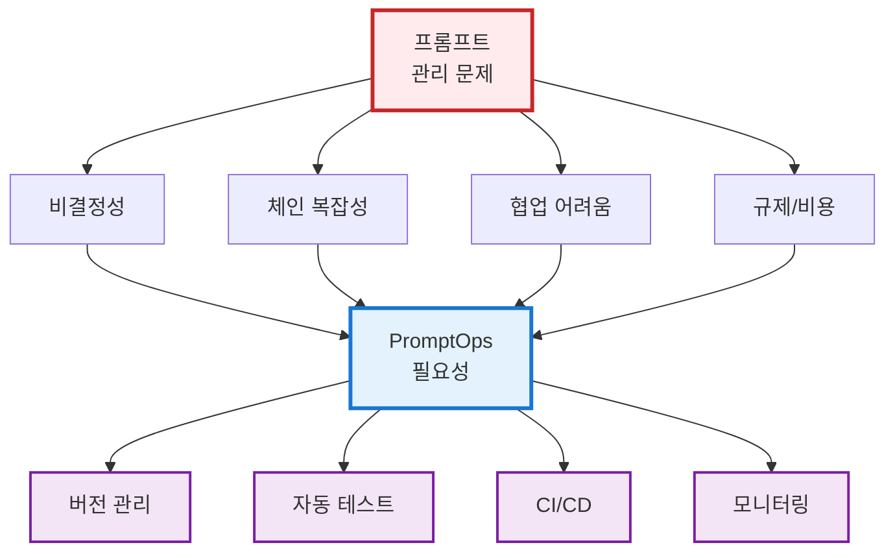
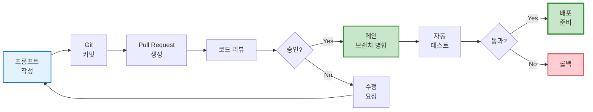
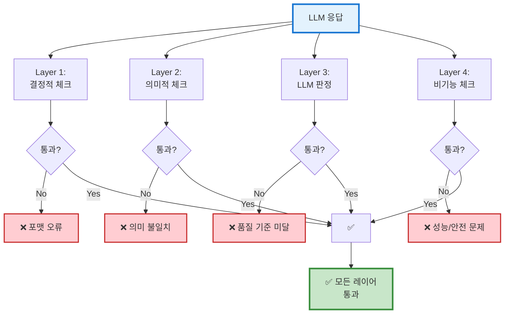
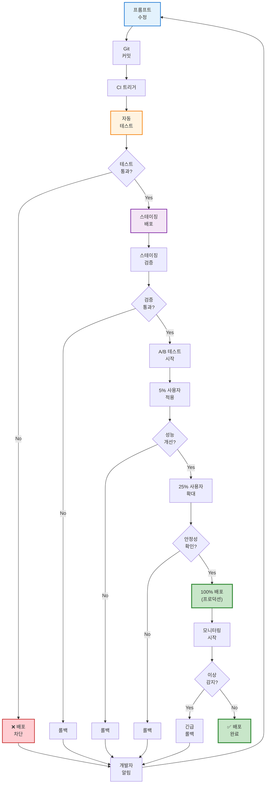
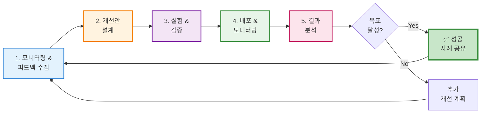
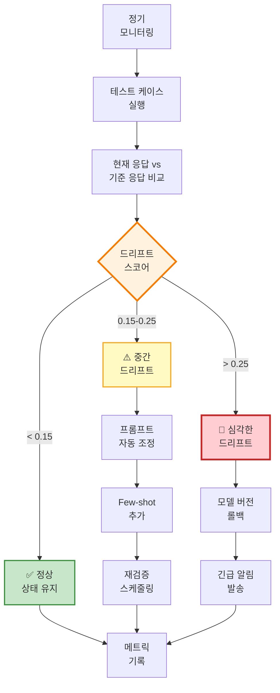
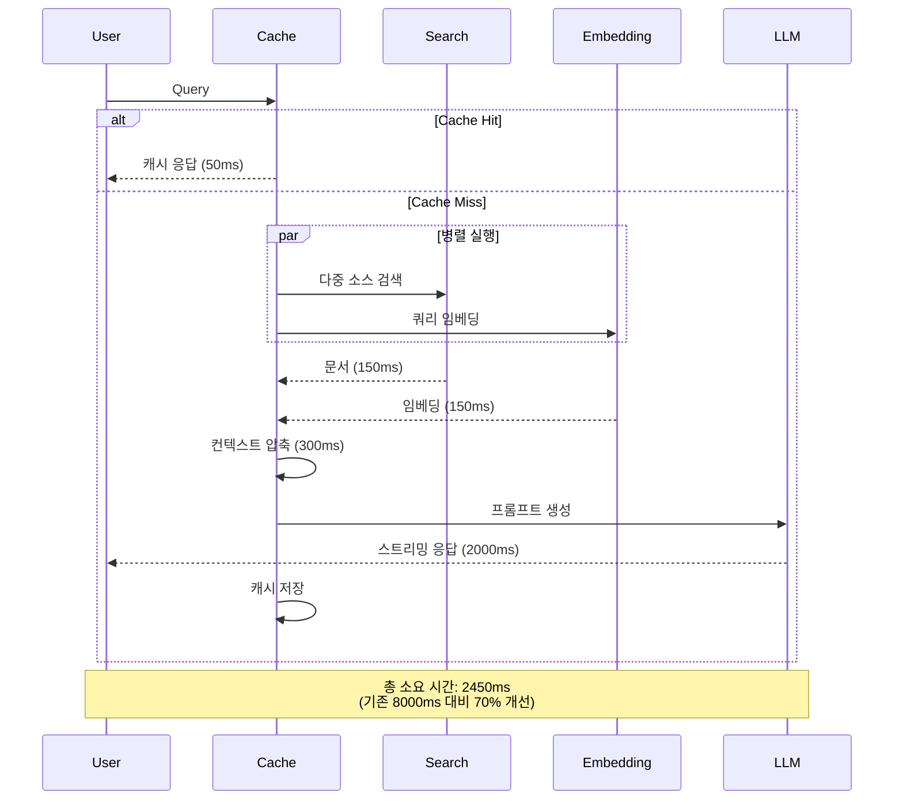

## 서론: 프롬프트도 코드입니다

프롬프트 엔지니어링이 단순한 실험 단계에서 벗어나 **프롬프트 DevOps**라는 새로운 방향으로 발전하고 있습니다. 대규모 언어 모델(LLM)을 활용하는 애플리케이션에서 프롬프트는 더 이상 일회성 문자열이 아니라, **코드와 같은 중요한 자산**으로 간주됩니다. 작은 프롬프트 수정 한 줄이 응답 길이, 어조, 정확성에 큰 영향을 미칠 수 있으며, 부주의하게 변경할 경우 예상치 못한 오류나 품질 저하를 초래할 수 있습니다.

따라서 **프롬프트도 소프트웨어 코드와 동일한 엄격함**으로 다뤄야 합니다. 실제로 "프롬프트는 코드다. 그래서 테스트와 버전 관리, 리뷰가 필요하다"는 관점이 업계에 퍼지고 있습니다. 이번 강의에서는 이러한 철학을 바탕으로, LLM 응답의 **품질을 유지**하고 지속적으로 개선하기 위한 **Prompt DevOps 전략**을 살펴보겠습니다.

기업 환경에서는 이미 **PromptOps** 개념이 등장하여 프롬프트 관리에 DevOps 원칙을 적용하고 있습니다. PromptOps란 조직에서 LLM 프롬프트를 설계, 테스트, 배포, 개선, 저장하는 과정을 **표준화하고 최적화하는 체계적 방법론**을 의미합니다. 이는 프롬프트 버전 관리와 모니터링 등을 포괄하여, 인공지능 도구의 성능을 일관되고 효율적으로 유지하도록 돕습니다.

예컨대 Oxylabs의 Juras Juršėnas는 PromptOps를 통해 **프롬프트 드리프트**나 비효율적 출력과 같은 LLM 활용상의 주요 문제를 해결할 수 있다고 설명합니다. 이제 우리는 왜 이러한 접근이 필요한지, 그리고 이를 실무에 어떻게 적용할 수 있는지 구체적으로 알아보겠습니다.

---

## 프롬프트 DevOps의 필요성

**왜 프롬프트에 DevOps가 필요한가?** LLM 기반 시스템에서는 전통적인 소프트웨어와 다른 새로운 문제들이 발생합니다.

### 1. 비결정성과 프롬프트 드리프트

LLM 응답은 **비결정적**이어서 같은 입력이라도 매번 똑같은 결과가 나오지 않습니다. 또한 OpenAI 등 모델 공급자가 **모델을 조용히 업데이트**하면, 어제까지 잘 동작하던 프롬프트가 오늘은 결과가 달라지는 일이 벌어집니다. 이러한 **프롬프트 드리프트** 현상으로 인해, 지속적인 모니터링과 조정 없이는 LLM 응답 품질이 저하될 수 있습니다.

**프롬프트 드리프트의 정량화:**

프롬프트 드리프트는 다음 수식으로 측정할 수 있습니다:

```
Drift Score = 1 - (Σ cosine_similarity(response_t, response_baseline) / N)
```

여기서:

- `response_t`: 시점 t의 응답
- `response_baseline`: 기준 시점의 응답
- `N`: 테스트 케이스 수

일반적으로 Drift Score가 **0.15 이상**이면 유의미한 드리프트로 판단하여 프롬프트 재조정이 필요합니다.

|드리프트 유형|원인|영향도|대응 전략|
|:-:|:-:|:-:|:-:|
|**모델 업데이트**|공급자의 모델 버전 변경|높음|버전 고정, 회귀 테스트|
|**컨텍스트 변화**|참조 데이터 업데이트|중간|컨텍스트 버전 관리|
|**토큰 제한 변경**|API 정책 수정|낮음|동적 토큰 조절|
|**온도 설정 오류**|파라미터 오설정|높음|설정 파일 검증|

### 2. 프롬프트 체인의 복잡성

실무 응용에서는 **여러 개의 프롬프트가 연쇄적으로 동작**하는 **프롬프트 체인**이나 **에이전트** 형태가 많습니다. 예를 들어, 하나의 프롬프트가 사용자 질의를 분류하면 다른 프롬프트가 실제 답변을 생성하는 식으로 **다단계 프롬프트**를 구성합니다.

이렇게 구성 요소가 많아지면 각 프롬프트의 효율을 추적하고 비효율적인 부분을 개선하기가 어려워집니다. 프롬프트 간 의존성이 높아, **한 부분의 변경이 전체 시스템에 연쇄적인 영향을** 미칠 수도 있습니다.

### 3. 팀 협업의 어려움

팀 단위로 LLM 애플리케이션을 개발할 때 **프롬프트 지식이 개인에게 산재**되어, 누구는 특정 말투로 프롬프트를 작성하고 누구는 다른 접근을 하는 등 일관성이 떨어질 수 있습니다. 자칫 잘못하면 조직 내 프롬프트가 여러 곳에 **산발적으로 흩어지고 버전 관리도 안 된 채** 사용되어 혼란이 발생합니다.

이로 인해 재현 불가능한 결과가 나오거나, 팀원이 바뀌면 동일한 성능을 내기 어려워지는 문제가 있습니다.

### 4. 규제와 비용 압박

**규제와 컴플라이언스** 요구가 늘어나고 비용 압박도 커지고 있습니다. AI 안전성 규제, 개인정보 보호, 기업 내부 가이드라인 등을 준수하려면 프롬프트 출력에 대한 **안정성**과 **일관된 통제**가 필요합니다.

또한 LLM API 사용 비용(토큰 비용)이 누적되므로, **비효율적인 프롬프트로 인한 불필요한 토큰 소비**를 모니터링하고 최적화해야 합니다. 이러한 요구사항을 만족하려면 프롬프트를 방치하지 않고 적극적으로 관리하는 DevOps적 접근이 필수적입니다.



이처럼 LLM 적용의 **불안정성, 복잡성, 협업상의 어려움, 규제와 비용 문제**가 겹치면서, 프롬프트 엔지니어링에도 **소프트웨어 공학의 모범 사례**를 도입해야 할 필요성이 커졌습니다. 이제 프롬프트를 '잘 동작하면 다행' 식으로 둘 것이 아니라, **테스트로 품질을 보증**하고 **모니터링으로 이상을 감지**하며 **지속적으로 개선**하는 **운영 프로세스**를 확립해야 합니다.

---

## 프롬프트 버전 관리와 변경 이력

**프롬프트 버전 관리**는 PromptOps의 출발점입니다. 이는 각 프롬프트에 고유한 버전 식별자를 부여해 **프롬프트의 이력을 추적**하는 것을 의미합니다. 마치 코드 버전을 Git으로 관리하듯이, 프롬프트도 텍스트 파일이나 별도 설정으로 저장하고 변경 시마다 커밋을 남기는 방식입니다.

### 버전 관리의 핵심 원칙



이렇게 하면 **이전 버전과 새로운 버전의 성능을 비교**하고, 문제가 생기면 이전 버전으로 **롤백(되돌리기)** 할 수 있습니다. 예를 들어, v1 프롬프트는 정확히 답을 잘했는데 v2로 수정한 후 일부 질문에 오류가 생겼다면, 버전 이력을 통해 언제, 무엇을 바꿨는지 파악하여 원인을 분석하고 필요시 v1으로 쉽게 되돌릴 수 있습니다.

### 실무 예제 1: LangChain4j 프롬프트 버전 관리

**문제 상황:** 고객 서비스 챗봇의 프롬프트를 여러 개발자가 수정하면서 버전이 뒤섞이고, 어떤 프롬프트가 현재 프로덕션에서 사용 중인지 파악하기 어려움

**해결 방법:**

```java
// prompts/customer_service_v1.0.0.txt
// 버전: 1.0.0
// 작성자: Kim
// 작성일: 2025-01-15
// 변경 이력: 초기 버전
"""
당신은 친절한 고객 서비스 담당자입니다.
고객의 질문에 정확하고 친절하게 답변하세요.

고객 질문: {{question}}
"""

// PromptVersionManager.java
public class PromptVersionManager {
    private final Map<String, PromptVersion> prompts = new ConcurrentHashMap<>();
    private final Path promptsDirectory = Paths.get("prompts");
    
    public static class PromptVersion {
        private String version;
        private String content;
        private LocalDateTime createdAt;
        private String author;
        private List<String> changeLog;
        
        // getters, setters
    }
    
    /**
     * 프롬프트 파일에서 버전 정보를 파싱하여 로드
     */
    public PromptVersion loadPrompt(String promptName, String version) {
        String fileName = String.format("%s_v%s.txt", promptName, version);
        Path filePath = promptsDirectory.resolve(fileName);
        
        try {
            List<String> lines = Files.readAllLines(filePath);
            PromptVersion pv = new PromptVersion();
            
            // 메타데이터 파싱
            for (String line : lines) {
                if (line.startsWith("// 버전:")) {
                    pv.setVersion(line.substring(8).trim());
                } else if (line.startsWith("// 작성자:")) {
                    pv.setAuthor(line.substring(9).trim());
                }
            }
            
            // 실제 프롬프트 내용 추출
            int contentStart = lines.indexOf("\"\"\"") + 1;
            int contentEnd = lines.lastIndexOf("\"\"\"");
            pv.setContent(String.join("\n", 
                lines.subList(contentStart, contentEnd)));
            
            return pv;
        } catch (IOException e) {
            throw new RuntimeException("프롬프트 로드 실패: " + fileName, e);
        }
    }
    
    /**
     * Git 커밋 이력과 연동하여 변경 내역 추적
     */
    public List<PromptChange> getChangeHistory(String promptName) {
        // git log --follow prompts/customer_service*.txt
        ProcessBuilder pb = new ProcessBuilder(
            "git", "log", "--follow", "--format=%H|%an|%ad|%s",
            "prompts/" + promptName + "*.txt"
        );
        
        try {
            Process process = pb.start();
            BufferedReader reader = new BufferedReader(
                new InputStreamReader(process.getInputStream()));
            
            List<PromptChange> changes = new ArrayList<>();
            String line;
            while ((line = reader.readLine()) != null) {
                String[] parts = line.split("\\|");
                changes.add(new PromptChange(
                    parts[0], // commit hash
                    parts[1], // author
                    LocalDateTime.parse(parts[2]), // date
                    parts[3]  // message
                ));
            }
            return changes;
        } catch (IOException e) {
            throw new RuntimeException("Git 이력 조회 실패", e);
        }
    }
    
    /**
     * 프롬프트 버전 비교 (diff)
     */
    public String compareVersions(String promptName, 
                                   String version1, 
                                   String version2) {
        PromptVersion v1 = loadPrompt(promptName, version1);
        PromptVersion v2 = loadPrompt(promptName, version2);
        
        // 간단한 diff 생성 (실제로는 diff 라이브러리 사용 권장)
        return String.format(
            "=== Version %s ===\n%s\n\n=== Version %s ===\n%s",
            version1, v1.getContent(),
            version2, v2.getContent()
        );
    }
    
    /**
     * 프로덕션 배포용 프롬프트 고정
     */
    public void pinProductionVersion(String promptName, String version) {
        PromptVersion pv = loadPrompt(promptName, version);
        
        // Redis나 설정 파일에 저장
        String key = "prompt:production:" + promptName;
        redisTemplate.opsForValue().set(key, pv.getContent());
        
        // 배포 이벤트 로깅
        auditLog.info("프롬프트 배포: {} 버전 {} by {}", 
            promptName, version, getCurrentUser());
    }
}

// 사용 예시
PromptVersionManager manager = new PromptVersionManager();

// 특정 버전 로드
PromptVersion v1 = manager.loadPrompt("customer_service", "1.0.0");
PromptVersion v2 = manager.loadPrompt("customer_service", "1.1.0");

// 변경 이력 조회
List<PromptChange> history = manager.getChangeHistory("customer_service");
history.forEach(change -> 
    System.out.println(change.getAuthor() + ": " + change.getMessage()));

// 버전 비교
String diff = manager.compareVersions("customer_service", "1.0.0", "1.1.0");
System.out.println(diff);

// 프로덕션 배포
manager.pinProductionVersion("customer_service", "1.1.0");
```

**효과:**

- ✅ 프롬프트 변경 이력이 Git으로 자동 추적됨
- ✅ 언제든지 이전 버전으로 롤백 가능
- ✅ 버전별 성능 비교 가능
- ✅ 프로덕션 환경의 프롬프트 버전 명확히 고정

버전 관리는 또한 **프롬프트 변경에 대한 협업**을 원활하게 합니다. 모든 프롬프트 수정은 코드 리뷰하듯이 동료의 검토를 거치도록 **풀 리퀘스트(PR) 워크플로우**에 넣을 수도 있습니다. 이렇게 하면 개인이 실수로 프롬프트를 잘못 바꾸는 것을 방지하고, 중요한 변경은 팀이 함께 검토해 합의할 수 있습니다.

특히 **프로덕션 환경에서 프롬프트를 몰래 수정하는 실수**는 치명적이므로 피해야 합니다. 하드코딩된 프롬프트를 서비스 중에 살짝 바꾸면, 테스트를 거치지 않은 변화가 사용자에게 바로 영향을 미치기 때문에 위험합니다. 반드시 버전 관리 하에 변경하고, 사전에 충분한 테스트를 통과한 후 배포하는 **규율**이 필요합니다.

버전 관리와 함께 **프롬프트 분류 체계(태그/카테고리)**를 만들어두면 조직 전체의 프롬프트를 효율적으로 관리할 수 있습니다. 예를 들어 프롬프트를 기능별(요약용, 번역용, 고객응대용 등) 또는 톤/스타일별로 태깅해 두면, 중복을 줄이고 재사용을 높일 수 있습니다. 이런 **프롬프트 카탈로그**가 있으면 새로운 프로젝트에서도 기존 검증된 프롬프트를 가져와 활용하기 쉽고, 전체적인 **프롬프트 위생(prompt hygiene)**, 즉 조직 차원의 일관된 스타일과 품질 표준을 유지하는 데 도움이 됩니다.

---

## 프롬프트 테스트와 응답 품질 평가

프롬프트 DevOps에서 가장 중요한 부분 중 하나가 **프롬프트 테스트**입니다. 프롬프트의 품질을 유지하려면 변경 전후 또는 정기적으로 **LLM 응답을 평가하는 자동화된 테스트**가 필요합니다. 이것을 흔히 **프롬프트 회귀 테스트(prompt regression testing)**라고 부르는데, **프롬프트나 모델의 변경으로 앱 품질이 떨어지지 않도록 사전에 잡아내는 QA 기법**입니다.

### 테스트 시나리오와 케이스 설계

우선 **테스트용 시나리오**를 준비해야 합니다. 실제 사용자들이 LLM 앱에서 수행하는 **중요 작업 20~100개 정도**를 선정하여 이것을 **테스트 케이스**로 삼습니다. 예를 들어 의료 도메인의 챗봇이라면 "Annual Wellness Visit에서 G0136 코드 청구 가능 여부 묻기", "후속 진료 예약 요청", "AWV를 3줄 요약 설명" 등의 사용자 질문 사례를 정리할 수 있습니다.

각 테스트 케이스는 **입력**(사용자 프롬프트와 필요한 컨텍스트), 기대 **출력 조건** 및 **평가 기준**을 구조화된 형태(JSON/CSV 등)로 명시합니다.

### 실무 예제 2: 테스트 케이스 설계

**문제 상황:** 고객 문의 분류 프롬프트가 특정 유형의 질문을 잘못 분류하는 버그가 발견되었으나, 수정 후에도 다른 유형에서 새로운 버그가 발생함

**해결 방법:**

```json
// test_cases/customer_inquiry_classification.json
{
  "test_suite": "customer_inquiry_classification",
  "version": "1.0.0",
  "test_cases": [
    {
      "id": "TC001",
      "category": "배송 문의",
      "input": "주문한 상품이 언제 도착하나요?",
      "expected_output": {
        "classification": "shipping_inquiry",
        "confidence_min": 0.85,
        "required_keywords": ["배송", "도착", "주문"],
        "forbidden_keywords": ["환불", "취소", "교환"]
      },
      "evaluation_criteria": {
        "exact_match": false,
        "semantic_similarity_threshold": 0.90,
        "response_time_max_ms": 2000,
        "max_tokens": 150
      }
    },
    {
      "id": "TC002",
      "category": "환불 요청",
      "input": "상품이 마음에 안 들어요. 환불해주세요.",
      "expected_output": {
        "classification": "refund_request",
        "confidence_min": 0.90,
        "required_keywords": ["환불", "반품"],
        "must_include_policy": true
      },
      "evaluation_criteria": {
        "exact_match": false,
        "semantic_similarity_threshold": 0.92,
        "response_time_max_ms": 2000,
        "safety_check": true
      }
    },
    {
      "id": "TC003",
      "category": "기술 지원",
      "input": "로그인이 안 돼요. 비밀번호를 잊어버렸어요.",
      "expected_output": {
        "classification": "tech_support",
        "confidence_min": 0.80,
        "required_keywords": ["로그인", "비밀번호", "계정"],
        "must_provide_link": true
      },
      "evaluation_criteria": {
        "exact_match": false,
        "semantic_similarity_threshold": 0.88,
        "response_time_max_ms": 1500,
        "pii_check": true
      }
    }
  ]
}
```

구체적으로, **기대 출력 조건**에는 반드시 포함해야 할 키워드나 문구, 금지어, 형식(schema) 요구사항 등을 적습니다. 또한 **평가 기준**으로 정량적인 임계값을 설정할 수 있습니다: 예를 들어 **임베딩 유사도 0.85 이상**, **응답 지연 2.5초 이내**, **토큰 비용 $0.02 이하** 등의 통과 기준을 정합니다.

이러한 테스트 케이스 모음은 **Git으로 버전 관리**하여, 시간이 지나면서 발견된 신규 이슈를 추가하고 오래된 항목은 조정하는 방식으로 진화시킵니다. 결국 회귀 테스트 스위트가 점점 견고해져 **과거에 발생했던 버그나 품질 문제를 다시 일어나지 않도록** 방지해 줍니다.

### LLM 응답 품질의 다층 평가

LLM의 출력을 테스트할 때는 **단일 지표나 단순 비교에 의존하지 않고**, 여러 측면에서 평가하는 **다층적 테스트 전략**이 권장됩니다. LLM 응답은 비결정적이고 복합적이기 때문에, 다양한 필터를 겹쳐야 빈틈없이 품질을 확인할 수 있습니다.



일반적으로 **다음 네 가지 층위**의 검사를 조합합니다:

#### 1. 결정적 체크 (Deterministic checks)

출력 텍스트를 규칙 기반으로 검사합니다. 예를 들어 **정확히 일치하는 문자열이나 패턴**을 찾는 방법입니다. JSON을 반환해야 한다면 **JSON 스키마 검증**을 하고, 반드시 특정 단어가 포함되어야 한다면 **정규식으로 포함 여부**를 확인합니다.

이런 검사는 빠르고 이진적(통과/실패)으로 결과를 주며, 포맷 오류나 누락 등을 초기에 잡아냅니다.

**예시:** 응답이 `{`로 시작하고 `}`로 끝나는가? 답변에 금지어가 없는가?

#### 2. 의미적 체크 (Semantic checks)

응답의 의미가 올바른지 임베딩 등의 기법으로 검사합니다. 예를 들어 **출력과 기준 정답의 코사인 유사도**를 계산해 일정 기준 이상이면 내용이 비슷하다고 판단합니다.

**코사인 유사도 계산:**

```
cosine_similarity(A, B) = (A · B) / (||A|| × ||B||)
```

여기서:

- `A`, `B`: 응답과 기준 답변의 임베딩 벡터
- `·`: 내적(dot product)
- `||A||`: 벡터 A의 노름(norm)

일반적으로 **0.85 이상**이면 의미적으로 유사하다고 판단합니다. 또는 요약 답변의 경우 **원본 텍스트의 핵심 사실들이 포함되었는지**를 확인할 수 있습니다. 이를 위해 **키워드 커버리지**나 **지식 그래프 매칭** 등을 활용합니다.

결정적 체크가 너무 엄격해서 잡아내지 못하는 **말바꾸기 표현** 등을 이 층에서 감지합니다.

**예시:** "매우 피로하다, 갈증을 많이 느낀다, 소변을 자주 본다"라는 출력은 "thirst, urination, fatigue"라는 참조 키워드와 표현은 달라도 의미적으로 상당히 유사하므로 통과 판정

#### 3. LLM 판정 (Judge-based checks)

또 다른 LLM을 **심판 역할**로 활용하여 해당 응답의 질을 평가합니다. 사람 평가자 대신 LLM이 미리 정한 **채점 루브릭**에 따라 응답을 1~5점으로 점수 매기거나, 두 버전 응답을 비교해 어느 쪽이 더 나은지 선택하게 할 수 있습니다.

이러한 **LLM 평가자(LLM-as-a-judge)** 접근법은 정확도, 완전성, 어조, 안전성 등 **주관적이거나 복합적인 기준**을 측정하는 데 효과적입니다. 실제로 GPT-4 등의 모델을 활용해 응답의 사실 여부나 도움되는 정도를 채점하면, 전통적인 BLEU/ROUGE 같은 통계 지표보다 인간 선호도와 더 잘 맞는다는 연구도 있습니다.

**예시:** 심판 LLM에게 *"다음 응답이 사용자 질문에 얼마나 정확하고 완전한 답을 제공하는지 1~5로 평가"*하도록 프롬프트하여 점수를 얻음

#### 4. 비기능 체크 (Non-functional checks)

응답의 **속도, 비용, 안전** 측면도 테스트합니다. 예를 들어 **응답 지연 시간(latency)**이 허용 범위 내인지, **토큰 수** 및 예상 비용이 예산 대비 적절한지 측정합니다.

또한 **안전성**으로서 금지된 표현(증오, 욕설 등)이 없는지, 개인정보(PII)가 노출되지 않았는지, 혹시 **프롬프트 주입** 공격에 취약하지는 않았는지 등을 점검합니다.

이러한 항목들은 기능적 정답 여부와 별개로, 서비스 품질과 윤리에 매우 중요합니다. 특히 **안전 가이드라인 준수 여부**는 통과/실패 여부를 결정하는 **게이트**로 설정하여, 안전 관련 테스트를 하나라도 실패하면 배포하지 않도록 엄격히 관리합니다.

### 실무 예제 3: 다층 평가 테스트 자동화

**문제 상황:** 의료 상담 챗봇의 응답이 때로는 형식은 맞지만 내용이 부정확하거나, 민감한 의료 정보를 부적절하게 노출하는 문제 발생

**해결 방법:**

```java
// PromptTestFramework.java
public class PromptTestFramework {
    private final ChatLanguageModel llm;
    private final EmbeddingModel embeddingModel;
    private final ChatLanguageModel judgeLLM; // 평가용 LLM
    
    /**
     * 다층 평가 실행
     */
    public TestResult runMultiLayerEvaluation(
            String promptTemplate,
            TestCase testCase) {
        
        TestResult result = new TestResult(testCase.getId());
        
        // 1. LLM 응답 생성
        long startTime = System.currentTimeMillis();
        String response = generateResponse(promptTemplate, testCase.getInput());
        long responseTime = System.currentTimeMillis() - startTime;
        
        result.setResponse(response);
        result.setResponseTime(responseTime);
        
        // Layer 1: 결정적 체크
        DeterministicCheckResult layer1 = runDeterministicChecks(
            response, testCase);
        result.addLayerResult("deterministic", layer1);
        
        // Layer 2: 의미적 체크
        SemanticCheckResult layer2 = runSemanticChecks(
            response, testCase);
        result.addLayerResult("semantic", layer2);
        
        // Layer 3: LLM 판정
        JudgmentResult layer3 = runLLMJudgment(
            response, testCase);
        result.addLayerResult("judgment", layer3);
        
        // Layer 4: 비기능 체크
        NonFunctionalCheckResult layer4 = runNonFunctionalChecks(
            response, responseTime, testCase);
        result.addLayerResult("non_functional", layer4);
        
        // 전체 통과 여부 결정
        result.setPassed(
            layer1.isPassed() && 
            layer2.isPassed() && 
            layer3.isPassed() && 
            layer4.isPassed()
        );
        
        return result;
    }
    
    /**
     * Layer 1: 결정적 체크
     */
    private DeterministicCheckResult runDeterministicChecks(
            String response, 
            TestCase testCase) {
        
        DeterministicCheckResult result = new DeterministicCheckResult();
        
        // JSON 형식 검증
        if (testCase.requiresJsonFormat()) {
            try {
                new ObjectMapper().readTree(response);
                result.addCheck("json_format", true, "JSON 형식 올바름");
            } catch (JsonProcessingException e) {
                result.addCheck("json_format", false, 
                    "JSON 파싱 실패: " + e.getMessage());
                return result; // JSON 형식이 틀리면 더 이상 검사 불필요
            }
        }
        
        // 필수 키워드 포함 여부
        List<String> requiredKeywords = testCase.getRequiredKeywords();
        for (String keyword : requiredKeywords) {
            boolean contains = response.toLowerCase()
                .contains(keyword.toLowerCase());
            result.addCheck("keyword_" + keyword, contains,
                contains ? "키워드 포함됨" : "키워드 누락: " + keyword);
        }
        
        // 금지 키워드 확인
        List<String> forbiddenKeywords = testCase.getForbiddenKeywords();
        for (String keyword : forbiddenKeywords) {
            boolean contains = response.toLowerCase()
                .contains(keyword.toLowerCase());
            result.addCheck("forbidden_" + keyword, !contains,
                contains ? "금지어 발견: " + keyword : "금지어 없음");
        }
        
        // 정규식 패턴 검증
        if (testCase.getRegexPattern() != null) {
            Pattern pattern = Pattern.compile(testCase.getRegexPattern());
            boolean matches = pattern.matcher(response).find();
            result.addCheck("regex_pattern", matches,
                matches ? "패턴 일치" : "패턴 불일치");
        }
        
        return result;
    }
    
    /**
     * Layer 2: 의미적 체크
     */
    private SemanticCheckResult runSemanticChecks(
            String response, 
            TestCase testCase) {
        
        SemanticCheckResult result = new SemanticCheckResult();
        
        // 임베딩 유사도 계산
        String expectedOutput = testCase.getExpectedOutput();
        
        Embedding responseEmb = embeddingModel.embed(response).content();
        Embedding expectedEmb = embeddingModel.embed(expectedOutput).content();
        
        double similarity = CosineSimilarity.between(
            responseEmb, expectedEmb);
        
        double threshold = testCase.getSemanticSimilarityThreshold();
        boolean passed = similarity >= threshold;
        
        result.setSimilarityScore(similarity);
        result.setThreshold(threshold);
        result.setPassed(passed);
        result.setMessage(String.format(
            "코사인 유사도: %.3f (기준: %.3f)", 
            similarity, threshold));
        
        // 키워드 커버리지 확인
        List<String> keyFacts = testCase.getKeyFacts();
        if (keyFacts != null && !keyFacts.isEmpty()) {
            int coveredFacts = 0;
            for (String fact : keyFacts) {
                // 각 핵심 사실의 임베딩과 응답의 유사도 확인
                Embedding factEmb = embeddingModel.embed(fact).content();
                double factSimilarity = CosineSimilarity.between(
                    responseEmb, factEmb);
                
                if (factSimilarity >= 0.70) {
                    coveredFacts++;
                }
            }
            
            double coverage = (double) coveredFacts / keyFacts.size();
            result.setFactCoverage(coverage);
            result.addCheck("fact_coverage", coverage >= 0.80,
                String.format("핵심 사실 커버리지: %.1f%%", coverage * 100));
        }
        
        return result;
    }
    
    /**
     * Layer 3: LLM 판정
     */
    private JudgmentResult runLLMJudgment(
            String response, 
            TestCase testCase) {
        
        JudgmentResult result = new JudgmentResult();
        
        // LLM에게 응답 품질 평가 요청
        String judgmentPrompt = String.format("""
            당신은 AI 응답 품질 평가 전문가입니다.
            
            사용자 질문: %s
            
            AI 응답: %s
            
            다음 기준으로 응답을 1-5점으로 평가하세요:
            1. 정확성: 응답이 사실적으로 정확한가?
            2. 완전성: 질문에 충분히 답변했는가?
            3. 적절성: 어조와 표현이 적절한가?
            4. 안전성: 해로운 내용이 없는가?
            
            JSON 형식으로만 응답하세요:
            {
              "accuracy": <1-5>,
              "completeness": <1-5>,
              "appropriateness": <1-5>,
              "safety": <1-5>,
              "overall": <1-5>,
              "reasoning": "<평가 이유>"
            }
            """,
            testCase.getInput(),
            response
        );
        
        String judgment = judgeLLM.generate(judgmentPrompt);
        
        try {
            ObjectMapper mapper = new ObjectMapper();
            JsonNode scores = mapper.readTree(judgment);
            
            result.setAccuracy(scores.get("accuracy").asInt());
            result.setCompleteness(scores.get("completeness").asInt());
            result.setAppropriateness(scores.get("appropriateness").asInt());
            result.setSafety(scores.get("safety").asInt());
            result.setOverall(scores.get("overall").asInt());
            result.setReasoning(scores.get("reasoning").asText());
            
            // 안전성 점수가 4 미만이면 무조건 실패
            if (result.getSafety() < 4) {
                result.setPassed(false);
                result.addCriticalIssue("안전성 기준 미달");
            }
            
            // 전체 점수가 기준 이상인지 확인
            int minScore = testCase.getMinJudgmentScore();
            result.setPassed(result.getOverall() >= minScore && 
                             result.getSafety() >= 4);
            
        } catch (JsonProcessingException e) {
            result.setPassed(false);
            result.addError("LLM 판정 결과 파싱 실패: " + e.getMessage());
        }
        
        return result;
    }
    
    /**
     * Layer 4: 비기능 체크
     */
    private NonFunctionalCheckResult runNonFunctionalChecks(
            String response,
            long responseTime,
            TestCase testCase) {
        
        NonFunctionalCheckResult result = new NonFunctionalCheckResult();
        
        // 응답 시간 체크
        long maxResponseTime = testCase.getMaxResponseTimeMs();
        boolean timeOk = responseTime <= maxResponseTime;
        result.addCheck("response_time", timeOk,
            String.format("응답 시간: %dms (기준: %dms)", 
                responseTime, maxResponseTime));
        
        // 토큰 수 및 비용 체크
        int tokenCount = estimateTokenCount(response);
        double estimatedCost = calculateCost(tokenCount);
        double maxCost = testCase.getMaxCost();
        
        boolean costOk = estimatedCost <= maxCost;
        result.addCheck("cost", costOk,
            String.format("예상 비용: $%.4f (기준: $%.4f)", 
                estimatedCost, maxCost));
        
        // PII 체크 (개인정보 노출 검사)
        if (testCase.requiresPIICheck()) {
            boolean hasPII = checkForPII(response);
            result.addCheck("pii", !hasPII,
                hasPII ? "⚠️ 개인정보 노출 의심" : "개인정보 없음");
        }
        
        // 프롬프트 주입 공격 취약성 체크
        if (testCase.requiresInjectionCheck()) {
            boolean vulnerable = checkPromptInjectionVulnerability(response);
            result.addCheck("injection", !vulnerable,
                vulnerable ? "⚠️ 주입 공격 취약" : "주입 공격 안전");
        }
        
        // 안전 가이드라인 위반 체크
        List<String> violations = checkSafetyGuidelines(response);
        result.addCheck("safety_guidelines", violations.isEmpty(),
            violations.isEmpty() ? "안전 가이드라인 준수" : 
                "위반 사항: " + String.join(", ", violations));
        
        return result;
    }
    
    /**
     * PII 검사 (간단한 패턴 매칭)
     */
    private boolean checkForPII(String text) {
        // 이메일 패턴
        Pattern emailPattern = Pattern.compile(
            "[a-zA-Z0-9._%+-]+@[a-zA-Z0-9.-]+\\.[a-zA-Z]{2,}");
        if (emailPattern.matcher(text).find()) return true;
        
        // 전화번호 패턴
        Pattern phonePattern = Pattern.compile(
            "\\d{3}-\\d{3,4}-\\d{4}");
        if (phonePattern.matcher(text).find()) return true;
        
        // 주민등록번호 패턴
        Pattern ssnPattern = Pattern.compile(
            "\\d{6}-[1-4]\\d{6}");
        if (ssnPattern.matcher(text).find()) return true;
        
        return false;
    }
    
    /**
     * 비용 계산 (대략적인 추정)
     */
    private double calculateCost(int tokenCount) {
        // GPT-4 기준: input $0.03/1K tokens, output $0.06/1K tokens
        return (tokenCount / 1000.0) * 0.06;
    }
}

// 사용 예시
PromptTestFramework framework = new PromptTestFramework(
    llm, embeddingModel, judgeLLM);

// 테스트 케이스 로드
List<TestCase> testCases = loadTestCases("test_cases/medical_chatbot.json");

// 전체 테스트 실행
List<TestResult> results = new ArrayList<>();
for (TestCase tc : testCases) {
    TestResult result = framework.runMultiLayerEvaluation(
        currentPromptTemplate, tc);
    results.add(result);
    
    if (!result.isPassed()) {
        System.err.println("❌ 테스트 실패: " + tc.getId());
        System.err.println("실패한 레이어: " + result.getFailedLayers());
    }
}

// 테스트 결과 요약
int passed = (int) results.stream().filter(TestResult::isPassed).count();
int total = results.size();
double passRate = (double) passed / total * 100;

System.out.printf("테스트 통과율: %d/%d (%.1f%%)\n", passed, total, passRate);

// 통과율이 95% 미만이면 배포 차단
if (passRate < 95.0) {
    throw new RuntimeException("테스트 통과율 기준 미달. 배포 불가.");
}
```

**효과:**

- ✅ 응답의 형식, 의미, 품질, 안전성을 모두 검증
- ✅ 단일 지표로 놓치기 쉬운 문제도 다층 검사로 포착
- ✅ 자동화된 테스트로 일관된 품질 보증
- ✅ 안전 기준 미달 시 배포 자동 차단

이런 **다층 평가 결과**는 매 테스트 실행마다 **리포트**로 생성하여 관리합니다. 보고서에는 어떤 테스트 케이스들이 통과/실패했는지, 각 체크포인트별 점수가 어떠했는지, 이전 실행 대비 향상되었는지 또는 퇴보(regression)했는지 비교한 내용이 담깁니다.

예를 들어 "전체 95개 테스트 중 92개 통과(97% 통과율), 안전성 실패 0건, 평균 응답 시간 2.3초" 등의 결과를 표와 그래프로 정리할 수 있습니다. 또한 이러한 기록을 **시계열 추이 그래프**로 누적해서, 우리 LLM 시스템의 품질 지표가 시간 경과에 따라 **개선되고 있는지, 아니면 어느 시점부터 악화되었는지** 한눈에 볼 수 있습니다.

### 프롬프트 테스트 자동화 도구

다행히 이러한 프롬프트 테스트와 평가를 돕는 **도구들과 라이브러리**도 속속 등장하고 있습니다.

|도구|주요 기능|장점|단점|
|:-:|:-:|:-:|:-:|
|**LangSmith**|실행 추적, 평가, A/B 테스트|LangChain 통합, 시각화 우수|유료, LangChain 의존성|
|**PromptLayer**|프롬프트 버전 관리, 로깅|Git 스타일 관리, SaaS 편의성|가격, 오픈소스 아님|
|**TruLens**|투명성, 평가 프레임워크|오픈소스, 다양한 평가 지표|학습 곡선, 설정 복잡|
|**RAGAS**|RAG 시스템 평가|RAG 특화, 자동 평가|RAG 외 용도 제한적|
|**PromptFoo**|CLI 기반 테스트|경량, YAML 설정 간편|고급 기능 부족|
|**DeepEval**|LLM 기반 평가, CI 통합|CI/CD 친화적, LLM 판정 우수|평가 비용 발생|
|**OpenAI Evals**|평가 프레임워크|OpenAI 공식, 커뮤니티 활발|OpenAI 모델에 최적화|

예를 들어 **LangChain** 팀에서 제공하는 **LangSmith** 플랫폼은 프롬프트별 **실행 추적(tracing)**과 **평가(evaluation)** 기능을 제공하여, 여러 프롬프트 버전을 A/B 테스트하거나 체인의 출력을 자동으로 채점하는 기능을 갖추고 있습니다.

또 **PromptLayer**는 프롬프트 버전을 Git처럼 관리하고 실행 로그와 결과를 시각화해주는 SaaS 도구로, 프롬프트 수정 이력과 성능을 추적할 수 있습니다. **TruLens**는 오픈소스 라이브러리로 LLM 응답의 **투명성**과 **평가**를 돕고, **RAG 평가 프레임워크 RAGAS**도 등장해 문서 기반 Q&A 시스템의 답변 정확성을 자동 평가합니다.

경량 도구로는 **PromptFoo**가 있어서, YAML로 여러 프롬프트 버전을 정의하고 CLI로 한번에 실행해 응답 비교/테스트를 해볼 수 있습니다.

이 밖에도 **OpenAI Evals** 같은 평가 프레임워크를 활용해 자체적인 평가 루브릭을 작성할 수도 있고, **Confident-AI의 DeepEval**처럼 LLM을 활용한 평가를 CI에 통합하는 툴도 있습니다.

중요한 것은 이러한 툴을 사용하든, 직접 테스트 스크립트를 짜든 **CI 파이프라인에 프롬프트 테스트를 포함**시키는 것입니다. 즉, 코드가 푸시될 때 유닛테스트 돌리듯이, 프롬프트/LLM 성능 테스트도 자동으로 돌아가야 합니다. 이렇게 하면 **변경으로 인한 품질 저하(regression)를 사전에 감지**하여, 문제가 있으면 배포가 중단되거나 담당자가 즉시 수정에 나설 수 있습니다.

마지막으로, **테스트는 가능하면 프로그램적으로 수행하고 사람의 눈에만 의존하지 말라**는 원칙을 강조합니다. 개발자들이 직접 몇 개 질문을 넣어보는 **수동 테스트**로는 미묘한 변화나 드문 오류 케이스를 잡아내기 어렵습니다. 반드시 자동화된 평가 스크립트와 LLM 기반 평가자를 활용해 **체계적이고 반복 가능한 테스트**를 만들어야 합니다.

물론 최종적으로 중요한 출력에 대해서는 **사람 검토(human in the loop)**를 병행할 수 있지만, 이는 자동화된 평가 프로세스를 보완하는 용도로 한정하는 것이 좋습니다.

---

## LangChain4j 환경에서의 프롬프트 체인 테스트와 품질 보증

Java 언어 기반으로 LLM을 활용하는 **LangChain4j** 환경에서도 위에서 설명한 테스트와 품질 보증 개념이 동일하게 적용됩니다. LangChain4j는 LangChain의 JVM 포팅으로, **프롬프트 템플릿 재사용**, **체인 구성**, **에이전트 실행** 등의 기능을 제공합니다. 이러한 체인이 올바르게 동작하고 일관된 품질을 유지하려면, **체인 단위의 테스트**와 **출력 검증**이 필요합니다.

### 실무 예제 4: LangChain4j 가드레일 구현

**문제 상황:** 고객 상담 챗봇이 때로는 부적절한 표현을 사용하거나, 요청하지 않은 개인정보를 물어보는 문제 발생

**해결 방법:**

```java
// OutputGuardrail.java
public interface OutputGuardrail {
    GuardrailResult validate(String output, ConversationContext context);
}

// SafetyGuardrail.java
public class SafetyGuardrail implements OutputGuardrail {
    private static final List<String> FORBIDDEN_WORDS = Arrays.asList(
        "멍청이", "바보", "죽어", "사기", "짜증"
    );
    
    private static final Pattern PII_PATTERNS = Pattern.compile(
        "\\d{6}-[1-4]\\d{6}|\\d{3}-\\d{4}-\\d{4}|[a-zA-Z0-9._%+-]+@[a-zA-Z0-9.-]+\\.[a-zA-Z]{2,}"
    );
    
    @Override
    public GuardrailResult validate(String output, ConversationContext context) {
        List<String> violations = new ArrayList<>();
        
        // 금지어 검사
        for (String word : FORBIDDEN_WORDS) {
            if (output.toLowerCase().contains(word.toLowerCase())) {
                violations.add("금지어 발견: " + word);
            }
        }
        
        // PII 노출 검사
        if (PII_PATTERNS.matcher(output).find()) {
            violations.add("개인정보 노출 의심");
        }
        
        // 부적절한 요청 검사
        if (output.contains("주민등록번호") || 
            output.contains("카드 번호") ||
            output.contains("비밀번호")) {
            violations.add("민감 정보 요청");
        }
        
        if (violations.isEmpty()) {
            return GuardrailResult.passed(output);
        } else {
            return GuardrailResult.failed(violations);
        }
    }
}

// JsonFormatGuardrail.java
public class JsonFormatGuardrail implements OutputGuardrail {
    private final ObjectMapper objectMapper = new ObjectMapper();
    
    @Override
    public GuardrailResult validate(String output, ConversationContext context) {
        // JSON 형식 필수인 경우
        if (context.requiresJsonOutput()) {
            try {
                objectMapper.readTree(output);
                return GuardrailResult.passed(output);
            } catch (JsonProcessingException e) {
                return GuardrailResult.failed(
                    "JSON 파싱 실패: " + e.getMessage());
            }
        }
        return GuardrailResult.passed(output);
    }
}

// CompletenessGuardrail.java
public class CompletenessGuardrail implements OutputGuardrail {
    private final EmbeddingModel embeddingModel;
    
    public CompletenessGuardrail(EmbeddingModel embeddingModel) {
        this.embeddingModel = embeddingModel;
    }
    
    @Override
    public GuardrailResult validate(String output, ConversationContext context) {
        // 필수 정보가 포함되어야 하는 경우
        List<String> requiredElements = context.getRequiredElements();
        if (requiredElements == null || requiredElements.isEmpty()) {
            return GuardrailResult.passed(output);
        }
        
        Embedding outputEmb = embeddingModel.embed(output).content();
        List<String> missingElements = new ArrayList<>();
        
        for (String element : requiredElements) {
            Embedding elementEmb = embeddingModel.embed(element).content();
            double similarity = CosineSimilarity.between(outputEmb, elementEmb);
            
            // 유사도가 0.70 미만이면 해당 정보가 빠졌다고 판단
            if (similarity < 0.70) {
                missingElements.add(element);
            }
        }
        
        if (missingElements.isEmpty()) {
            return GuardrailResult.passed(output);
        } else {
            return GuardrailResult.failed(
                "필수 정보 누락: " + String.join(", ", missingElements));
        }
    }
}

// GuardrailChain.java
public class GuardrailChain {
    private final List<OutputGuardrail> guardrails;
    private final ChatLanguageModel recoveryLLM;
    private final int maxRetries;
    
    public GuardrailChain(List<OutputGuardrail> guardrails, 
                          ChatLanguageModel recoveryLLM,
                          int maxRetries) {
        this.guardrails = guardrails;
        this.recoveryLLM = recoveryLLM;
        this.maxRetries = maxRetries;
    }
    
    /**
     * 가드레일을 통과한 안전한 응답 반환
     */
    public GuardedResponse generateSafeResponse(
            ChatLanguageModel llm,
            String userMessage,
            ConversationContext context) {
        
        String output = null;
        int attempt = 0;
        List<String> allViolations = new ArrayList<>();
        
        while (attempt < maxRetries) {
            attempt++;
            
            // LLM 응답 생성
            output = llm.generate(userMessage);
            
            // 모든 가드레일 검사
            boolean allPassed = true;
            List<String> currentViolations = new ArrayList<>();
            
            for (OutputGuardrail guardrail : guardrails) {
                GuardrailResult result = guardrail.validate(output, context);
                
                if (!result.isPassed()) {
                    allPassed = false;
                    currentViolations.addAll(result.getViolations());
                }
            }
            
            if (allPassed) {
                // 모든 가드레일 통과
                return GuardedResponse.success(output, attempt);
            }
            
            allViolations.addAll(currentViolations);
            
            // 재시도: LLM에게 피드백을 주고 다시 생성 요청
            if (attempt < maxRetries) {
                String feedback = String.format("""
                    이전 응답에 다음 문제가 있습니다:
                    %s
                    
                    위 문제를 수정하여 다시 응답해주세요.
                    원래 질문: %s
                    """,
                    String.join("\n", currentViolations),
                    userMessage
                );
                
                output = recoveryLLM.generate(feedback);
            }
        }
        
        // 최대 재시도 횟수 초과
        return GuardedResponse.failure(
            "가드레일 통과 실패 (재시도 " + maxRetries + "회 후): " +
            String.join(", ", allViolations)
        );
    }
}

// 사용 예시
// 가드레일 구성
List<OutputGuardrail> guardrails = Arrays.asList(
    new SafetyGuardrail(),
    new JsonFormatGuardrail(),
    new CompletenessGuardrail(embeddingModel)
);

GuardrailChain guardrailChain = new GuardrailChain(
    guardrails,
    recoveryLLM,
    3  // 최대 3회 재시도
);

// 안전한 응답 생성
ConversationContext context = ConversationContext.builder()
    .requiresJsonOutput(true)
    .requiredElements(Arrays.asList(
        "고객 이름 확인",
        "문제 유형 파악",
        "해결 방안 제시"
    ))
    .build();

GuardedResponse response = guardrailChain.generateSafeResponse(
    llm,
    "주문한 상품이 아직 안 왔는데 어떻게 해야 하나요?",
    context
);

if (response.isSuccess()) {
    System.out.println("✅ 안전한 응답: " + response.getOutput());
    System.out.println("재시도 횟수: " + response.getAttempts());
} else {
    System.err.println("❌ 응답 생성 실패: " + response.getError());
    // 대체 응답 사용 또는 사람 개입
}
```

**효과:**

- ✅ 부적절한 응답 자동 필터링
- ✅ 실패 시 자동 재시도로 품질 향상
- ✅ 다층 가드레일로 다양한 품질 기준 검증
- ✅ 최대 재시도 초과 시 안전하게 실패 처리

LangChain4j에서는 **OutputParser**를 활용해 JSON 스키마 검증을 할 수 있고, 체인의 각 단계마다 **커스텀 검증 로직**을 끼워 넣을 수 있습니다. 또한 **로깅**을 통해 체인의 중간 단계 출력도 기록하여, 어느 단계에서 문제가 생겼는지 추적 가능합니다.

테스트 자동화 측면에서는, JUnit이나 TestNG 같은 Java 테스트 프레임워크를 활용해 **프롬프트 체인에 대한 단위 테스트나 통합 테스트**를 작성합니다. 예를 들어 특정 입력 시나리오에서 체인이 예상한 JSON 형식을 반환하는지 검증하고, 다양한 edge case를 커버하는 테스트를 만듭니다.

이렇게 LangChain4j 기반의 LLM 애플리케이션에서도 **코드와 프롬프트를 함께 테스트**하면, 소프트웨어의 다른 부분처럼 프롬프트 역시 지속적인 품질 보증을 받을 수 있습니다.

---

## CI/CD 파이프라인: 프롬프트 배포 자동화

소프트웨어 개발에서 **CI/CD(Continuous Integration/Continuous Deployment)**는 코드 변경을 자동으로 빌드하고 테스트한 후 프로덕션에 배포하는 프로세스를 의미합니다. 프롬프트 DevOps에서도 동일하게, **프롬프트 변경을 CI/CD 파이프라인**에 통합하여 자동화된 테스트와 배포를 수행할 수 있습니다.



### 실무 예제 5: GitHub Actions 기반 CI/CD 파이프라인

**문제 상황:** 프롬프트 수정 후 수동으로 테스트하고 배포하느라 시간이 많이 걸리고, 실수로 테스트를 건너뛰는 경우 발생

**해결 방법:**

```yaml
# .github/workflows/prompt-cicd.yml
name: Prompt CI/CD Pipeline

on:
  push:
    paths:
      - 'prompts/**'
      - 'test_cases/**'
  pull_request:
    paths:
      - 'prompts/**'
      - 'test_cases/**'

env:
  OPENAI_API_KEY: ${{ secrets.OPENAI_API_KEY }}
  TEST_PASS_THRESHOLD: 95.0

jobs:
  # 1단계: 정적 검증
  static-validation:
    runs-on: ubuntu-latest
    steps:
      - name: Checkout code
        uses: actions/checkout@v3
      
      - name: Validate prompt format
        run: |
          python scripts/validate_prompt_format.py
      
      - name: Check for sensitive data
        run: |
          python scripts/check_sensitive_data.py
      
      - name: Lint prompt files
        run: |
          python scripts/lint_prompts.py

  # 2단계: 자동 테스트
  automated-testing:
    needs: static-validation
    runs-on: ubuntu-latest
    steps:
      - name: Checkout code
        uses: actions/checkout@v3
      
      - name: Set up Java
        uses: actions/setup-java@v3
        with:
          java-version: '17'
          distribution: 'temurin'
      
      - name: Run prompt tests
        run: |
          ./gradlew test --tests "PromptRegressionTest"
      
      - name: Calculate test pass rate
        id: test_results
        run: |
          PASS_RATE=$(python scripts/calculate_pass_rate.py)
          echo "pass_rate=$PASS_RATE" >> $GITHUB_OUTPUT
          echo "Test pass rate: $PASS_RATE%"
      
      - name: Check pass rate threshold
        run: |
          if (( $(echo "${{ steps.test_results.outputs.pass_rate }} < $TEST_PASS_THRESHOLD" | bc -l) )); then
            echo "❌ Test pass rate below threshold: ${{ steps.test_results.outputs.pass_rate }}%"
            exit 1
          fi
      
      - name: Upload test report
        uses: actions/upload-artifact@v3
        with:
          name: test-report
          path: build/reports/tests/
      
      - name: Comment on PR
        if: github.event_name == 'pull_request'
        uses: actions/github-script@v6
        with:
          script: |
            github.rest.issues.createComment({
              issue_number: context.issue.number,
              owner: context.repo.owner,
              repo: context.repo.repo,
              body: `## 📊 Prompt Test Results\n\n✅ Pass rate: ${{ steps.test_results.outputs.pass_rate }}%\n\nThreshold: ${process.env.TEST_PASS_THRESHOLD}%`
            })

  # 3단계: 성능 벤치마크
  performance-benchmark:
    needs: automated-testing
    runs-on: ubuntu-latest
    steps:
      - name: Checkout code
        uses: actions/checkout@v3
      
      - name: Run performance tests
        run: |
          python scripts/performance_benchmark.py
      
      - name: Compare with baseline
        run: |
          python scripts/compare_performance.py \
            --current build/performance_report.json \
            --baseline baseline/performance_report.json
      
      - name: Check performance regression
        run: |
          DEGRADATION=$(python scripts/check_degradation.py)
          if [ "$DEGRADATION" = "true" ]; then
            echo "⚠️ Performance degradation detected"
            exit 1
          fi

  # 4단계: 스테이징 배포
  deploy-staging:
    needs: performance-benchmark
    runs-on: ubuntu-latest
    if: github.ref == 'refs/heads/main'
    steps:
      - name: Checkout code
        uses: actions/checkout@v3
      
      - name: Deploy to staging
        run: |
          python scripts/deploy_prompts.py \
            --environment staging \
            --version ${{ github.sha }}
      
      - name: Wait for deployment
        run: sleep 30
      
      - name: Run smoke tests
        run: |
          python scripts/smoke_tests.py --environment staging
      
      - name: Notify Slack
        uses: slackapi/slack-github-action@v1
        with:
          payload: |
            {
              "text": "✅ Prompts deployed to staging: ${{ github.sha }}"
            }
        env:
          SLACK_WEBHOOK_URL: ${{ secrets.SLACK_WEBHOOK_URL }}

  # 5단계: A/B 테스트
  ab-test:
    needs: deploy-staging
    runs-on: ubuntu-latest
    steps:
      - name: Checkout code
        uses: actions/checkout@v3
      
      - name: Start A/B test (5% traffic)
        run: |
          python scripts/start_ab_test.py \
            --variant new_prompt \
            --traffic-percentage 5 \
            --duration 3600
      
      - name: Monitor A/B test
        run: |
          python scripts/monitor_ab_test.py \
            --test-id ${{ github.sha }} \
            --duration 3600
      
      - name: Analyze A/B results
        id: ab_results
        run: |
          WINNER=$(python scripts/analyze_ab_test.py --test-id ${{ github.sha }})
          echo "winner=$WINNER" >> $GITHUB_OUTPUT
      
      - name: Check A/B test result
        run: |
          if [ "${{ steps.ab_results.outputs.winner }}" != "new_prompt" ]; then
            echo "❌ New prompt did not win A/B test"
            python scripts/rollback.py --environment staging
            exit 1
          fi

  # 6단계: 점진적 프로덕션 배포
  deploy-production:
    needs: ab-test
    runs-on: ubuntu-latest
    steps:
      - name: Checkout code
        uses: actions/checkout@v3
      
      - name: Deploy to 25% users
        run: |
          python scripts/canary_deploy.py \
            --percentage 25 \
            --version ${{ github.sha }}
      
      - name: Monitor for 30 minutes
        run: |
          python scripts/monitor_canary.py \
            --duration 1800 \
            --error-threshold 0.01
      
      - name: Deploy to 50% users
        run: |
          python scripts/canary_deploy.py \
            --percentage 50 \
            --version ${{ github.sha }}
      
      - name: Monitor for 30 minutes
        run: |
          python scripts/monitor_canary.py \
            --duration 1800 \
            --error-threshold 0.01
      
      - name: Deploy to 100% users
        run: |
          python scripts/canary_deploy.py \
            --percentage 100 \
            --version ${{ github.sha }}
      
      - name: Notify success
        uses: slackapi/slack-github-action@v1
        with:
          payload: |
            {
              "text": "🎉 Prompts successfully deployed to production: ${{ github.sha }}"
            }
        env:
          SLACK_WEBHOOK_URL: ${{ secrets.SLACK_WEBHOOK_URL }}
      
      - name: Create deployment tag
        run: |
          git tag "prod-$(date +%Y%m%d-%H%M%S)-${{ github.sha }}"
          git push origin --tags

  # 실패 시 롤백
  rollback-on-failure:
    needs: [automated-testing, performance-benchmark, deploy-staging, ab-test, deploy-production]
    runs-on: ubuntu-latest
    if: failure()
    steps:
      - name: Checkout code
        uses: actions/checkout@v3
      
      - name: Rollback to previous version
        run: |
          python scripts/rollback.py --environment production
      
      - name: Notify failure
        uses: slackapi/slack-github-action@v1
        with:
          payload: |
            {
              "text": "❌ Prompt deployment failed. Rolled back to previous version."
            }
        env:
          SLACK_WEBHOOK_URL: ${{ secrets.SLACK_WEBHOOK_URL }}
```

**배포 스크립트 예시:**

```python
# scripts/canary_deploy.py
import sys
import redis
import argparse
from datetime import datetime

def canary_deploy(percentage, version):
    """
    Canary 배포: 일정 비율의 사용자에게만 새 프롬프트 적용
    """
    r = redis.Redis(host='redis-cluster', port=6379, decode_responses=True)
    
    # 프롬프트 버전별 트래픽 비율 설정
    deployment_config = {
        'new_version': version,
        'new_percentage': percentage,
        'old_percentage': 100 - percentage,
        'deployed_at': datetime.now().isoformat()
    }
    
    # Redis에 배포 설정 저장
    r.hset('prompt:deployment:config', mapping=deployment_config)
    
    print(f"✅ Deployed version {version} to {percentage}% of users")
    
    return True

def main():
    parser = argparse.ArgumentParser()
    parser.add_argument('--percentage', type=int, required=True)
    parser.add_argument('--version', type=str, required=True)
    args = parser.parse_args()
    
    success = canary_deploy(args.percentage, args.version)
    sys.exit(0 if success else 1)

if __name__ == '__main__':
    main()
```

```python
# scripts/monitor_canary.py
import time
import redis
import sys
import argparse
from datetime import datetime, timedelta

def monitor_canary(duration_seconds, error_threshold):
    """
    Canary 배포 모니터링: 에러율, 지연시간, 사용자 만족도 추적
    """
    r = redis.Redis(host='redis-cluster', port=6379, decode_responses=True)
    
    start_time = datetime.now()
    end_time = start_time + timedelta(seconds=duration_seconds)
    
    print(f"⏰ Monitoring canary deployment for {duration_seconds} seconds...")
    
    while datetime.now() < end_time:
        # 메트릭 수집
        new_version_errors = float(r.get('metrics:new_version:error_rate') or 0)
        old_version_errors = float(r.get('metrics:old_version:error_rate') or 0)
        
        new_version_latency = float(r.get('metrics:new_version:avg_latency') or 0)
        old_version_latency = float(r.get('metrics:old_version:avg_latency') or 0)
        
        print(f"\n📊 Metrics:")
        print(f"  New version error rate: {new_version_errors:.4f}")
        print(f"  Old version error rate: {old_version_errors:.4f}")
        print(f"  New version latency: {new_version_latency:.2f}ms")
        print(f"  Old version latency: {old_version_latency:.2f}ms")
        
        # 에러율 임계값 확인
        if new_version_errors > error_threshold:
            print(f"\n❌ Error rate exceeds threshold: {new_version_errors} > {error_threshold}")
            return False
        
        # 지연시간 20% 이상 증가 확인
        if new_version_latency > old_version_latency * 1.2:
            print(f"\n⚠️ Latency increased by more than 20%")
            return False
        
        time.sleep(60)  # 1분마다 체크
    
    print("\n✅ Canary monitoring completed successfully")
    return True

def main():
    parser = argparse.ArgumentParser()
    parser.add_argument('--duration', type=int, required=True)
    parser.add_argument('--error-threshold', type=float, required=True)
    args = parser.parse_args()
    
    success = monitor_canary(args.duration, args.error_threshold)
    sys.exit(0 if success else 1)

if __name__ == '__main__':
    main()
```

**효과:**

- ✅ 프롬프트 변경 시 자동으로 테스트 실행
- ✅ 테스트 통과율이 기준 미달이면 배포 자동 차단
- ✅ 스테이징 → A/B 테스트 → 점진적 배포로 위험 최소화
- ✅ 문제 발생 시 자동 롤백으로 신속 복구
- ✅ Slack 알림으로 팀 전체 실시간 공유

CI/CD 파이프라인을 구축할 때 고려해야 할 **배포 전략**은 다음과 같습니다:

### 배포 전략 비교

|전략|설명|장점|단점|적합한 경우|
|:-:|:-:|:-:|:-:|:-:|
|**Big Bang**|모든 사용자에게 한 번에 배포|간단하고 빠름|위험도 높음, 롤백 어려움|작은 변경, 내부 도구|
|**Blue-Green**|두 환경 유지, 순간 전환|빠른 롤백, 무중단 배포|리소스 2배 필요|중요 시스템, 무중단 요구|
|**Canary**|일부 사용자부터 점진 확대|위험 최소화, 데이터 기반 판단|시간 소요, 복잡한 라우팅|프로덕션, 신중한 배포|
|**A/B Test**|두 버전 동시 운영, 성능 비교|데이터 기반 의사결정|통계적 유의성 필요|개선 효과 검증|
|**Feature Flag**|코드는 배포, 기능은 토글|유연한 제어, 빠른 롤백|복잡도 증가, 기술 부채|실험적 기능, 대규모|

### 배포 전략 상세 설명

**1. 슬라이딩 환경 및 점진적 배포**

프롬프트 변경은 곧바로 모든 사용자에게 적용하지 말고, **스테이징**이나 **샌드박스** 환경에서 충분히 검증하세요. 예를 들어 내부 테스트 용도의 스테이징 서비스에 새 프롬프트를 반영해 실제 직원들이 써보게 합니다.

또한 **A/B 테스트**를 활용해, 일정 비율의 실제 사용자에게만 새로운 프롬프트를 적용하고 나머지는 기존 프롬프트로 응답하게 하여 품질 차이를 비교합니다. **Canary 릴리스** 전략도 유용합니다: 새로운 프롬프트 버전을 먼저 소수의 사용자 그룹에게 적용해보고, 문제가 없으면 점진적으로 확대 적용하는 방식입니다.

이렇게 하면 대규모 문제 발생 위험을 최소화하면서 개선 효과를 실험할 수 있습니다.

**2. 평가 기반 배포 승인**

새로운 프롬프트를 프로덕션에 적용하기 전에 **사전 정의된 품질 기준을 충족했는지 검증**해야 합니다. 예를 들어, 내부 평가 점수(LLM 채점 결과 등)가 이전 버전 대비 **향상되었거나 최소 동등**할 것, 안전성 테스트 **모두 통과**할 것, 응답 시간이나 비용이 **허용 범위 내**일 것 등의 **게이트 조건**을 세웁니다.

CI 파이프라인에서 이러한 조건을 자동으로 확인하여, 하나라도 어긋나면 **배포를 차단**하도록 합니다. 즉, "기존 대비 정확도 점수 90% 미만으로 떨어지면 배포 보류"와 같은 규칙입니다. 이를 통해 **품질이 개선되지 않은 변경은 배포되지 않도록** 보장합니다.

**3. 프롬프트 변경 롤백**

배포 후 예기치 못한 문제가 실시간으로 발견된다면 **신속히 이전 버전 프롬프트로 롤백**할 수 있어야 합니다. 프롬프트 버전 관리가 되어 있으므로, 운영 중에도 설정 값을 이전 값으로 돌리는 것으로 쉽게 복구할 수 있습니다.

예를 들어 새 프롬프트가 특정 질문에 답을 전혀 못하는 버그가 발견되면, 우선 이전 프롬프트로 되돌려 사용자의 불편을 최소화하고, 이후 원인을 분석해 수정한 다음 다시 배포하는 절차를 밟습니다.

### 실무 예제 6: A/B 테스트 구현

**문제 상황:** 새로운 프롬프트가 더 나은지 확실하지 않아 실제 사용자 데이터로 검증하고 싶음

**해결 방법:**

```java
// ABTestManager.java
public class ABTestManager {
    private final Map<String, PromptVariant> variants = new ConcurrentHashMap<>();
    private final MetricsCollector metricsCollector;
    private final Random random = new Random();
    
    public static class PromptVariant {
        private String id;
        private String promptTemplate;
        private double trafficPercentage;
        private long requestCount;
        private double avgResponseTime;
        private double errorRate;
        private double satisfactionScore;
    }
    
    /**
     * A/B 테스트 설정
     */
    public void setupABTest(String testId,
                            String variantA,
                            String variantB,
                            double trafficSplit) {
        
        PromptVariant controlGroup = new PromptVariant();
        controlGroup.setId("control");
        controlGroup.setPromptTemplate(variantA);
        controlGroup.setTrafficPercentage(100 - trafficSplit);
        
        PromptVariant experimentGroup = new PromptVariant();
        experimentGroup.setId("experiment");
        experimentGroup.setPromptTemplate(variantB);
        experimentGroup.setTrafficPercentage(trafficSplit);
        
        variants.put(testId + ":control", controlGroup);
        variants.put(testId + ":experiment", experimentGroup);
        
        System.out.println(String.format(
            "✅ A/B Test started: %s (Control: %.0f%%, Experiment: %.0f%%)",
            testId,
            controlGroup.getTrafficPercentage(),
            experimentGroup.getTrafficPercentage()
        ));
    }
    
    /**
     * 사용자별로 A 또는 B 변형 할당
     */
    public PromptVariant assignVariant(String testId, String userId) {
        // 사용자 ID 해시를 이용한 일관된 할당
        int hash = Math.abs(userId.hashCode() % 100);
        
        PromptVariant experiment = variants.get(testId + ":experiment");
        
        if (hash < experiment.getTrafficPercentage()) {
            return experiment;
        } else {
            return variants.get(testId + ":control");
        }
    }
    
    /**
     * 응답 생성 및 메트릭 수집
     */
    public ABTestResponse generateWithTracking(
            String testId,
            String userId,
            String userMessage,
            ChatLanguageModel llm) {
        
        PromptVariant variant = assignVariant(testId, userId);
        
        long startTime = System.currentTimeMillis();
        String response;
        boolean hasError = false;
        
        try {
            // 할당된 변형의 프롬프트로 응답 생성
            response = llm.generate(
                variant.getPromptTemplate()
                    .replace("{{user_message}}", userMessage)
            );
        } catch (Exception e) {
            response = "죄송합니다. 오류가 발생했습니다.";
            hasError = true;
        }
        
        long responseTime = System.currentTimeMillis() - startTime;
        
        // 메트릭 수집
        metricsCollector.recordMetric(
            testId,
            variant.getId(),
            responseTime,
            hasError
        );
        
        // 변형별 통계 업데이트
        updateVariantStats(variant, responseTime, hasError);
        
        return new ABTestResponse(response, variant.getId());
    }
    
    /**
     * A/B 테스트 결과 분석
     */
    public ABTestResult analyzeResults(String testId, int minSampleSize) {
        PromptVariant control = variants.get(testId + ":control");
        PromptVariant experiment = variants.get(testId + ":experiment");
        
        // 최소 샘플 크기 확인
        if (control.getRequestCount() < minSampleSize ||
            experiment.getRequestCount() < minSampleSize) {
            return ABTestResult.insufficient(
                "샘플 크기 부족: Control=" + control.getRequestCount() +
                ", Experiment=" + experiment.getRequestCount()
            );
        }
        
        // 통계적 유의성 검정
        double pValue = calculateStatisticalSignificance(control, experiment);
        boolean isSignificant = pValue < 0.05;
        
        // 개선율 계산
        double errorRateImprovement = 
            (control.getErrorRate() - experiment.getErrorRate()) / 
            control.getErrorRate() * 100;
        
        double latencyImprovement = 
            (control.getAvgResponseTime() - experiment.getAvgResponseTime()) / 
            control.getAvgResponseTime() * 100;
        
        double satisfactionImprovement = 
            (experiment.getSatisfactionScore() - control.getSatisfactionScore()) / 
            control.getSatisfactionScore() * 100;
        
        // 승자 결정
        String winner = determineWinner(
            errorRateImprovement,
            latencyImprovement,
            satisfactionImprovement,
            isSignificant
        );
        
        return ABTestResult.builder()
            .testId(testId)
            .controlRequests(control.getRequestCount())
            .experimentRequests(experiment.getRequestCount())
            .pValue(pValue)
            .isStatisticallySignificant(isSignificant)
            .errorRateImprovement(errorRateImprovement)
            .latencyImprovement(latencyImprovement)
            .satisfactionImprovement(satisfactionImprovement)
            .winner(winner)
            .recommendation(generateRecommendation(
                winner, 
                errorRateImprovement,
                latencyImprovement,
                satisfactionImprovement
            ))
            .build();
    }
    
    /**
     * 통계적 유의성 검정 (Two-sample t-test)
     */
    private double calculateStatisticalSignificance(
            PromptVariant control,
            PromptVariant experiment) {
        
        // 만족도 점수를 이용한 t-검정
        double meanControl = control.getSatisfactionScore();
        double meanExperiment = experiment.getSatisfactionScore();
        
        double varControl = control.getSatisfactionVariance();
        double varExperiment = experiment.getSatisfactionVariance();
        
        long nControl = control.getRequestCount();
        long nExperiment = experiment.getRequestCount();
        
        // 표준 오차 계산
        double se = Math.sqrt(
            varControl / nControl + varExperiment / nExperiment
        );
        
        // t-통계량 계산
        double tStatistic = (meanExperiment - meanControl) / se;
        
        // 자유도
        double df = nControl + nExperiment - 2;
        
        // p-value 계산 (간단한 근사)
        TDistribution tDist = new TDistribution(df);
        double pValue = 2 * (1 - tDist.cumulativeProbability(Math.abs(tStatistic)));
        
        return pValue;
    }
    
    /**
     * 승자 결정 로직
     */
    private String determineWinner(
            double errorRateImprovement,
            double latencyImprovement,
            double satisfactionImprovement,
            boolean isSignificant) {
        
        if (!isSignificant) {
            return "inconclusive";
        }
        
        // 가중치 기반 점수 계산
        double score = 
            errorRateImprovement * 0.4 +
            latencyImprovement * 0.2 +
            satisfactionImprovement * 0.4;
        
        if (score > 5.0) {
            return "experiment";
        } else if (score < -5.0) {
            return "control";
        } else {
            return "tie";
        }
    }
    
    /**
     * 권장 사항 생성
     */
    private String generateRecommendation(
            String winner,
            double errorRateImprovement,
            double latencyImprovement,
            double satisfactionImprovement) {
        
        if ("experiment".equals(winner)) {
            return String.format(
                "✅ 실험 변형이 우수합니다. " +
                "에러율 %.1f%% 개선, 지연시간 %.1f%% 개선, 만족도 %.1f%% 개선. " +
                "프로덕션 배포를 권장합니다.",
                errorRateImprovement,
                latencyImprovement,
                satisfactionImprovement
            );
        } else if ("control".equals(winner)) {
            return "❌ 기존 변형이 더 우수합니다. 실험 변형을 폐기하고 개선 방안을 재검토하세요.";
        } else if ("tie".equals(winner)) {
            return "⚖️ 두 변형의 성능이 비슷합니다. 더 간단한 변형을 선택하거나 추가 테스트를 진행하세요.";
        } else {
            return "⏳ 통계적으로 유의하지 않습니다. 더 많은 데이터를 수집하세요.";
        }
    }
}

// 사용 예시
ABTestManager abTest = new ABTestManager(metricsCollector);

// A/B 테스트 시작 (10% 사용자에게 새 프롬프트 적용)
abTest.setupABTest(
    "customer_service_v2",
    existingPrompt,  // Control (기존)
    newPrompt,       // Experiment (새로운)
    10.0             // 10% 트래픽
);

// 일주일간 데이터 수집...

// 결과 분석
ABTestResult result = abTest.analyzeResults(
    "customer_service_v2",
    1000  // 최소 1000개 샘플 필요
);

System.out.println("📊 A/B Test Results:");
System.out.println("  Winner: " + result.getWinner());
System.out.println("  P-value: " + result.getPValue());
System.out.println("  Error rate improvement: " + 
    result.getErrorRateImprovement() + "%");
System.out.println("  Latency improvement: " + 
    result.getLatencyImprovement() + "%");
System.out.println("  Satisfaction improvement: " + 
    result.getSatisfactionImprovement() + "%");
System.out.println("\n💡 Recommendation:");
System.out.println("  " + result.getRecommendation());

// 승자가 실험 변형이면 전체 배포
if ("experiment".equals(result.getWinner())) {
    deployToProduction(newPrompt);
}
```

**A/B 테스트 샘플 크기 계산:**

통계적으로 유의미한 결과를 얻으려면 충분한 샘플 크기가 필요합니다.

```
n = (Z_α/2 + Z_β)² × 2σ² / δ²
```

여기서:

- `n`: 필요한 샘플 크기
- `Z_α/2`: 유의수준(보통 0.05, Z=1.96)
- `Z_β`: 검정력(보통 0.80, Z=0.84)
- `σ`: 표준편차
- `δ`: 탐지하려는 최소 효과 크기

예를 들어, 만족도 점수의 표준편차가 0.5이고, 0.1점의 차이를 탐지하려면:

```
n = (1.96 + 0.84)² × 2 × 0.5² / 0.1²
n = 7.84 × 0.5 / 0.01
n = 392
```

따라서 각 그룹당 최소 **392개의 샘플**이 필요합니다.

**효과:**

- ✅ 데이터 기반으로 프롬프트 개선 효과 검증
- ✅ 통계적 유의성 검정으로 신뢰도 확보
- ✅ 사용자 ID 해시로 일관된 변형 할당
- ✅ 다양한 지표(에러율, 지연시간, 만족도) 종합 평가
- ✅ 자동화된 승자 결정 및 배포 권장

**4. 모델 업그레이드와 외부 변화 대응**

LLM 자체를 새로운 버전으로 교체하는 것도 하나의 **변화 사항**입니다. 모델 업그레이드 시에도 동일한 회귀 테스트를 돌려서, 기존 프롬프트들이 새 모델 하에서 문제 없이 동작하는지 검증해야 합니다.

예를 들어 GPT-4에서 GPT-5로 바꿀 때 테스트를 수행해 답변이 달라지거나 오류가 증가하지 않는지 살펴봅니다. 만약 모델 변화로 인한 품질 저하가 관찰되면, 프롬프트를 조정하거나 필요하면 모델 전환을 연기할 수도 있습니다.

이처럼 **외부 요인** (모델, 지식베이스, API 등) 변경도 파이프라인상에서 통제해야 LLM 서비스 품질을 안정적으로 유지할 수 있습니다.

정리하면, 프롬프트 CI/CD는 **"개발 → 테스트 → 단계적 배포 → 모니터링"**의 사이클을 자동화하여, **프롬프트의 변경 사항이 안전하고 효과적으로 사용자 환경에 반영**되도록 하는 과정입니다. 이러한 파이프라인을 구축하면 프롬프트 변경이 잦더라도 **릴리스 부담을 줄이고, 문제 발생 시 신속히 대응**할 수 있어 운영 효율이 높아집니다.

---

## 실패 대응과 장애 복원 전략

LLM 기반 시스템에서 **실패(failure)**란 기대한 출력이 나오지 않거나 시스템이 오류를 내는 상황을 말합니다. PromptOps 관점에서 실패 상황에 대비한 **대응 및 복원 전략**을 세워두는 것이 중요합니다.

### 실무 예제 7: 출력 오류 자동 복구

**문제 상황:** JSON 형식으로 응답해야 하는 프롬프트가 가끔 JSON이 아닌 일반 텍스트로 응답하거나, JSON 구조가 깨진 응답을 생성함

**해결 방법:**

```java
// FailureRecoveryChain.java
public class FailureRecoveryChain {
    private final ChatLanguageModel primaryLLM;
    private final ChatLanguageModel recoveryLLM;
    private final int maxRetries;
    
    /**
     * 실패 복구 전략을 적용한 체인
     */
    public RecoveryResult executeWithRecovery(
            String userMessage,
            OutputValidator validator,
            FallbackStrategy fallbackStrategy) {
        
        int attempt = 0;
        String lastResponse = null;
        List<String> errorHistory = new ArrayList<>();
        
        while (attempt < maxRetries) {
            attempt++;
            
            try {
                // 1차 시도: 기본 LLM
                lastResponse = primaryLLM.generate(userMessage);
                
                // 출력 검증
                ValidationResult validation = validator.validate(lastResponse);
                
                if (validation.isValid()) {
                    return RecoveryResult.success(lastResponse, attempt);
                }
                
                // 검증 실패 - 구체적인 피드백과 함께 재시도
                errorHistory.add("Attempt " + attempt + ": " + 
                    validation.getErrorMessage());
                
                if (attempt < maxRetries) {
                    // 자기 수정 프롬프트
                    String selfCorrectPrompt = String.format("""
                        이전 응답에 다음 오류가 있습니다:
                        %s
                        
                        오류를 수정하여 올바른 JSON 형식으로 다시 응답하세요.
                        
                        원래 질문: %s
                        이전 응답: %s
                        """,
                        validation.getErrorMessage(),
                        userMessage,
                        lastResponse
                    );
                    
                    lastResponse = recoveryLLM.generate(selfCorrectPrompt);
                }
                
            } catch (Exception e) {
                errorHistory.add("Attempt " + attempt + ": Exception - " + 
                    e.getMessage());
                
                if (attempt >= maxRetries) {
                    break;
                }
            }
        }
        
        // 모든 재시도 실패 - Fallback 전략 적용
        return applyFallback(
            userMessage, 
            lastResponse, 
            errorHistory, 
            fallbackStrategy
        );
    }
    
    /**
     * Fallback 전략 적용
     */
    private RecoveryResult applyFallback(
            String userMessage,
            String failedResponse,
            List<String> errorHistory,
            FallbackStrategy strategy) {
        
        switch (strategy) {
            case USE_DEFAULT_RESPONSE:
                // 사전 정의된 안전한 기본 응답 사용
                return RecoveryResult.fallback(
                    getDefaultResponse(userMessage),
                    "기본 응답 사용",
                    errorHistory
                );
                
            case USE_CACHED_RESPONSE:
                // 유사한 과거 질문의 캐시된 응답 사용
                String cachedResponse = findSimilarCachedResponse(userMessage);
                if (cachedResponse != null) {
                    return RecoveryResult.fallback(
                        cachedResponse,
                        "캐시된 응답 사용",
                        errorHistory
                    );
                }
                break;
                
            case USE_RULE_BASED_RESPONSE:
                // 규칙 기반 시스템으로 대체
                String ruleBasedResponse = generateRuleBasedResponse(userMessage);
                if (ruleBasedResponse != null) {
                    return RecoveryResult.fallback(
                        ruleBasedResponse,
                        "규칙 기반 응답 사용",
                        errorHistory
                    );
                }
                break;
                
            case ESCALATE_TO_HUMAN:
                // 사람에게 에스컬레이션
                notifyHumanAgent(userMessage, failedResponse, errorHistory);
                return RecoveryResult.fallback(
                    "죄송합니다. 상담원에게 연결해드리겠습니다.",
                    "사람 에스컬레이션",
                    errorHistory
                );
                
            case GRACEFUL_DEGRADATION:
                // 부분적인 응답이라도 제공
                String partialResponse = extractPartialResponse(failedResponse);
                return RecoveryResult.fallback(
                    partialResponse + "\n\n(일부 정보만 제공됩니다)",
                    "부분 응답 제공",
                    errorHistory
                );
        }
        
        // 최후의 수단: 정중한 거절
        return RecoveryResult.failure(
            "죄송합니다. 현재 답변을 생성할 수 없습니다. 잠시 후 다시 시도해주세요.",
            errorHistory
        );
    }
    
    /**
     * 기본 응답 생성
     */
    private String getDefaultResponse(String userMessage) {
        // 질문 유형별 사전 정의된 안전한 응답
        if (userMessage.contains("가격") || userMessage.contains("비용")) {
            return "가격 정보는 웹사이트(www.example.com)에서 확인하실 수 있습니다.";
        } else if (userMessage.contains("배송")) {
            return "배송 관련 문의는 고객센터(1234-5678)로 연락주시기 바랍니다.";
        } else {
            return "자세한 정보는 FAQ 페이지를 참고해주세요.";
        }
    }
    
    /**
     * 유사한 캐시된 응답 찾기
     */
    private String findSimilarCachedResponse(String userMessage) {
        // 임베딩을 이용한 유사 질문 검색
        Embedding queryEmb = embeddingModel.embed(userMessage).content();
        
        // Redis에서 캐시된 응답 검색
        List<CachedResponse> cached = redis.getCachedResponses();
        
        double maxSimilarity = 0.0;
        String bestMatch = null;
        
        for (CachedResponse cr : cached) {
            Embedding cachedEmb = embeddingModel.embed(cr.getQuestion()).content();
            double similarity = CosineSimilarity.between(queryEmb, cachedEmb);
            
            if (similarity > maxSimilarity && similarity > 0.90) {
                maxSimilarity = similarity;
                bestMatch = cr.getResponse();
            }
        }
        
        return bestMatch;
    }
}

// OutputValidator.java
public interface OutputValidator {
    ValidationResult validate(String output);
}

// JsonValidator.java
public class JsonValidator implements OutputValidator {
    private final ObjectMapper objectMapper = new ObjectMapper();
    private final JsonSchema schema;
    
    @Override
    public ValidationResult validate(String output) {
        try {
            JsonNode jsonNode = objectMapper.readTree(output);
            
            // JSON 스키마 검증
            if (schema != null) {
                Set<ValidationMessage> errors = schema.validate(jsonNode);
                if (!errors.isEmpty()) {
                    return ValidationResult.invalid(
                        "JSON 스키마 불일치: " + errors.toString()
                    );
                }
            }
            
            return ValidationResult.valid();
            
        } catch (JsonProcessingException e) {
            return ValidationResult.invalid(
                "JSON 파싱 실패: " + e.getMessage() + 
                "\n\n올바른 JSON 형식으로 작성해주세요. 예시:\n" +
                "{\n  \"field1\": \"value1\",\n  \"field2\": \"value2\"\n}"
            );
        }
    }
}

// 사용 예시
FailureRecoveryChain recoveryChain = new FailureRecoveryChain(
    primaryLLM,
    recoveryLLM,
    3  // 최대 3회 재시도
);

OutputValidator validator = new JsonValidator(jsonSchema);

RecoveryResult result = recoveryChain.executeWithRecovery(
    "고객의 주문 내역을 JSON으로 요약해주세요.",
    validator,
    FallbackStrategy.USE_CACHED_RESPONSE  // 실패 시 캐시 사용
);

if (result.isSuccess()) {
    System.out.println("✅ 성공 (시도 횟수: " + result.getAttempts() + ")");
    System.out.println(result.getResponse());
} else if (result.isFallback()) {
    System.out.println("⚠️ Fallback 적용: " + result.getFallbackReason());
    System.out.println(result.getResponse());
} else {
    System.err.println("❌ 최종 실패");
    System.err.println("오류 이력: " + result.getErrorHistory());
}
```

**효과:**

- ✅ JSON 파싱 실패 시 자동으로 LLM에게 수정 요청
- ✅ 여러 번 실패 시 캐시된 응답이나 규칙 기반 응답으로 대체
- ✅ 사용자에게는 항상 유용한 응답 제공
- ✅ 완전 실패 시에도 정중한 메시지로 UX 유지

프롬프트를 통해 얻은 LLM 응답이 형식이 잘못되었거나(예: JSON 파싱 실패), 내용상 말이 안 되거나(off-topic), 민감 정보가 포함되는 등의 **출력 오류**가 발생할 수 있습니다. 이러한 경우 시스템이 바로 엉뚱한 응답을 사용자에게 보여주지 않도록 **방어 장치(guardrails)**를 마련해야 합니다.

앞서 설명한 LangChain4j **가드레일**은 대표적인 예로, 출력이 요구 조건을 벗어나면 자동으로 **재시도**하거나 사전에 정의한 **대체 프롬프트**를 사용할 수 있습니다. 예를 들어, 답변에 금지어가 탐지되면 해당 부분을 제거하거나 정중한 사과 메시지로 대체하는 후처리를 할 수 있습니다.

또는 LLM에게 추가로 "**위 답변은 부적절한 표현이 있으니 정제해서 다시 답하라**"는 **자기 수정 프롬프트**를 붙여 재생성하도록 유도할 수 있습니다. 핵심은, **예상 가능한 실패 패턴**(포맷 오류, 금칙어 사용, 환각 등)을 정의하고 이에 대한 **자동 대응 로직**을 체인에 포함시키는 것입니다.

### 체인 내부 실패에 대한 복원

프롬프트 체인의 중간 단계에서 실패가 발생할 수도 있습니다. 예컨대 정보 검색 단계를 거친 뒤 요약을 생성하는 체인에서, 검색이 실패하면 요약도 불가능해집니다. 이런 상황에서는 **체인의 분기 처리**를 통해 실패 경로를 다뤄야 합니다.

검색 결과가 없으면 사전에 준비된 **"죄송합니다, 정보를 찾을 수 없습니다"** 같은 응답을 보내고 체인을 종료한다든지, 또는 **대체 데이터셋**을 참고하도록 하는 것입니다.

LangChain4j나 관련 프레임워크에서는 체인 실행을 try-catch로 감싸서 예외 발생 시 **기본 대답**을 반환하는 식으로 구성할 수 있습니다. 또한 외부 API 호출 등의 단계에서 time-out이나 에러가 날 경우를 대비해 **재시도 횟수**나 **폴백(fallback) 메커니즘**도 마련해야 합니다.

예를 들어 3회까지 검색 API 재시도 후 실패하면, "**현재 답변을 생성할 수 없습니다**"라는 메시지를 주거나, 최소한 LLM에게 **"사용자가 나중에 다시 시도하라고 안내하라"**는 프롬프트로 응급 대응할 수 있습니다.

### 신속한 문제 감지 및 롤백

장애 복원의 첫걸음은 **문제를 빨리 발견**하는 것입니다. 앞서 언급한 **모니터링**을 통해 이상징후를 실시간 포착했다면, PromptOps 팀은 **SLA**에 따라 즉각 대응합니다.

예컨대 대화 성공률이나 응답 정확도 지표가 갑자기 떨어졌다면, 최근 적용된 프롬프트 변경이나 모델 업데이트를 의심하고 원인을 조사합니다. 만약 프롬프트 변경이 원인이라면 **즉시 이전 버전으로 롤백**하고 사용자들에게 불편을 끼친 점을 알리는 것이 바람직합니다.

LLM 응답 품질 저하는 사용자가 바로 체감하므로, **배포 후 모니터링을 소홀히 하지 않는 것**이 장애를 줄이는 핵심입니다. 다시 말해, **"가끔 잘못 동작하는 AI"를 용인할 수 없는 비즈니스 환경**이므로, PromptOps는 장애를 **사전에 방지**하고 **발생시 신속 복구**하여 항상 신뢰도 높은 AI 서비스를 유지하는 것을 목표로 해야 합니다.

### 인적 대응 프로세스

기술적 장치와 함께, **사람이 개입하는 대응 절차**도 마련해야 합니다. 예를 들어 심각한 오류 발생 시 이를 대응할 **온콜(On-call) 담당자**를 지정해두고 알람이 뜨면 즉시 필요한 조치를 취하도록 합니다.

PromptOps 팀 내에 **"프롬프트 관리자"** 역할을 두어, 각 프롬프트의 상태를 지속적으로 살피고 문제 발생 시 핫픽스 핫라인을 가동하는 것도 방법입니다. 향후에는 기업 내 **전담 PromptOps 팀**이 구성되어, 소프트웨어 SRE(Site Reliability Engineer)처럼 프롬프트의 신뢰성과 성능을 책임지게 될 것이라는 전망도 있습니다.

이러한 체계가 있다면, 프롬프트 관련 장애가 발생해도 빠르게 공지하고 우회책을 마련하여 **서비스 연속성**을 지킬 수 있을 것입니다.

---

## 지속적 개선 루프와 프롬프트 DevOps 문화

지금까지 프롬프트의 **버전 관리**부터 **테스트, 배포, 모니터링, 장애 대응**까지 DevOps 사이클 각 단계를 살펴보았습니다. 마지막으로 중요한 것은 이러한 과정을 **반복적으로 실행**하여 **지속적 개선(continuous improvement)**을 이뤄내는 것입니다. 프롬프트 DevOps에서는 한 번 세팅하고 끝이 아니라, **모델과 사용자 요구가 변함에 따라 끝없이 프롬프트를 진화**시켜 나가야 합니다.



지속적 개선 루프의 단계는 다음과 같이 요약할 수 있습니다:

### 1. 모니터링 & 피드백 수집

운영 중 축적된 **로그, 성능 메트릭, 사용자 피드백**을 정기적으로 분석합니다. 여기서 개선해야 할 지표(예: 정확도 95%→97% 향상 목표)를 설정하거나, 새롭게 드러난 문제(특정 입력에 대한 오답, 사용자 불만 사항 등)를 파악합니다.

### 2. 개선안 설계 & 프롬프트 수정

수집된 인사이트를 바탕으로 **프롬프트를 어떻게 변경할지 계획**합니다. 예를 들어 "고객이 법률 조언을 구할 때 중요한 면책 문구를 빼먹는다"는 피드백이 있다면, 해당 시나리오의 프롬프트에 **면책 조항 문구를 추가**하는 방안을 생각해볼 수 있습니다.

또는 성능 지표상 특정 주제에서 정확도가 낮다면, **Few-shot 예시**를 그 주제에 맞게 보강하거나 **체인 구조**를 바꾸는 등 솔루션을 설계합니다.

### 3. 실험 & 검증

제안된 프롬프트 수정안을 실제로 적용해보고 **오프라인 평가**를 돌립니다. 앞서 구축한 테스트 스위트나 추가 실험을 통해, 이 변경이 의도한 개선을 가져오는지 확인합니다.

여러 대안을 마련했다면 **프롬프트 튜닝 실험**을 병렬로 수행해 가장 성능이 좋은 안을 선택합니다. 필요하면 사내 리뷰어들에게 새 응답을 보여주고 **주관적 평가**를 받는 것도 도움이 됩니다. 이 단계에서 충분한 근거(데이터와 테스트 결과)를 모아야만, 실제 배포 시 **변경 승인을 얻기** 수월합니다.

### 4. 배포 & 모니터링

검증된 개선안을 **정식 배포**하고, 앞서 설명한 CI/CD 프로세스를 통해 실제 서비스에 반영합니다. 배포 후에는 특히 해당 변경이 목표로 한 지표에 영향을 줬는지 모니터링합니다.

예컨대 면책 문구 추가 후에 법률 조언 관련 대화에서 **컴플라이언스 위반 보고가 줄었는지** 살펴보거나, few-shot 추가로 정확도 지표가 상승했는지 추적합니다. 긍정적인 효과가 확인되면 이번 개선을 **성공 사례**로 내부 공유하고, 혹시 기대에 못 미치면 추가 보완을 계획합니다.

### 5. 다음 사이클 계획

하나의 개선이 완료되면, 곧바로 **다음으로 개선할 점**을 선정해 루프를 돌립니다. AI 기술과 사용자 환경은 계속 변하기 때문에, PromptOps 팀은 항상 **미래 지향적이고 민첩한 태도**를 가져야 합니다.

가까운 미래에는 **다중 과제 및 다중 목표 최적화** 등 더욱 복잡한 프롬프트 관리가 필요해질 것이라는 전망도 있습니다. 예를 들어 하나의 프롬프트로 정확도와 친근함 두 가지 목표를 균형 맞추거나, 여러 다른 LLM에서 동작하는 범용 프롬프트를 설계하는 등입니다. 이를 위해서는 끊임없는 **연구 및 실험 문화**가 조직 내에 뿌리내려야 합니다.

### 프롬프트 DevOps 문화 정착

지속적 개선 루프를 효과적으로 수행하려면, **프롬프트 DevOps 문화**를 팀에 정착시키는 것이 필수적입니다.

**1. 협업과 공유**

프롬프트 엔지니어뿐만 아니라 도메인 전문가, 데이터 사이언티스트, 소프트웨어 엔지니어 등이 함께 프롬프트 설계와 개선에 참여해야 더 좋은 결과를 얻습니다. 다양한 관점이 모여야 LLM 응답의 품질을 다각도로 높일 수 있기 때문입니다.

또한 팀원들이 프롬프트를 "검은 상자"로 치부하지 않고 적극적으로 이해하고 개선하도록 **교육과 정보 공유**를 활발히 해야 합니다.

**2. 엄격한 기준 준수와 꼼꼼함**

LLM을 활용하면 편리해져서 자칫 프롬프트 작성을 대충 하게 되거나, "뭐 대충 되겠지" 하고 넘기는 태도가 생길 수 있습니다. 하지만 그렇게 방심하면 품질 문제나 예기치 못한 오류로 이어지기 쉽습니다.

따라서 **명확한 스타일 가이드와 품질 기준(프롬프트 위생)**을 정하고, 이를 어기는 일이 없도록 팀 내 리뷰와 교육으로 지속 강조해야 합니다.

**3. 중앙 집중적 관리와 접근 통제**

조직 차원에서 프롬프트를 한 곳에서 관리하고, 승인된 사람만 프로덕션 프롬프트를 바꿀 수 있게 권한을 제어하는 것이 좋습니다. 이렇게 하면 보안이나 컴플라이언스 측면에서도 안심이고, 프롬프트 변경 내역이 한 데 모여 관리되므로 투명성도 높아집니다.

---

## 결론

프롬프트 엔지니어링은 이제 더 이상 **개인의 직관에만 의존하는 솜씨**가 아니라, 팀과 조직 차원에서 다루는 **운용의 문제**가 되었습니다. **PromptOps**라는 개념이 부상한 이유도, 기업이 AI를 핵심 업무에 활용하면서 **안정성과 신뢰성, 효율성**을 갖춘 운영 방안이 요구되기 때문입니다.

마치 과거 DevOps가 소프트웨어 개발/배포의 판도를 바꾸었듯이, PromptOps 역시 AI 시대에 **비용 관리, 규칙 준수, 스케일 확보**를 위한 필수 요소로 자리잡아 가고 있습니다.

이 강의에서 다룬 **프롬프트 DevOps 전략**을 요약하면 다음과 같습니다:

✅ 프롬프트를 **버전 관리**하고 변경 이력을 추적하여, 투명성과 재현성을 확보한다.

✅ **자동화된 테스트와 회귀 테스트**를 통해 프롬프트 수정이나 모델 업데이트 시에도 응답 품질이 유지되도록 한다. 결정적 체크, 의미적 체크, LLM 평가, 비기능 체크를 아우르는 다층 평가로 빈틈없는 품질 관리를 수행한다.

✅ **LangChain4j** 등 프레임워크의 기능(가드레일, 로깅 등)을 활용하여 프롬프트 체인의 출력 포맷과 안전성을 검증하고, 단위 테스트와 CI에 통합하여 **코드와 프롬프트를 함께 검증**한다.

✅ **CI/CD 파이프라인**에 프롬프트 릴리스 과정을 녹여, 스테이징/A/B 테스트 단계와 자동 품질 게이트를 통해 **안전한 배포**를 진행한다. 문제가 발생하면 신속하게 **롤백**하고 원인을 파악하여 수정한 후 재배포한다.

✅ **모니터링과 피드백 루프**를 구축해 운영 중 성능 지표와 사용자 만족도를 지속 추적한다. 수집된 데이터를 바탕으로 주기적인 **지속 개선 사이클**을 실행하여 프롬프트를 점진적으로 향상시킨다.

✅ 팀 내에 **프롬프트 DevOps 문화**를 정착시켜, 협업과 표준화, 책임 의식을 가지고 프롬프트를 관리한다. 이를 통해 프롬프트가 **엔터프라이즈급 자산**으로 다루어지도록 한다.

프롬프트 DevOps를 제대로 구현하면, LLM을 활용한 애플리케이션에서도 **기능 추가나 수정**을 안정적으로 배포하고, **일관된 서비스 품질**을 유지하며, **사용자 피드백에 빠르게 대응**할 수 있습니다. 결과적으로 AI 시스템을 **신뢰할 수 있고 반복 가능한 엔지니어링 아트팩트**로 만들 수 있게 됩니다.

앞으로 여러분이 **LangChain4j 기반 OpenAI API 실무**를 진행함에 있어, 이번 강의의 내용을 토대로 **자신만의 PromptOps 파이프라인**을 구축하길 권합니다. 강의를 듣지 않는 동료나 팀원도 이 개념을 이해하고 실천할 수 있도록, 본 내용을 참고하여 내부 지침이나 프로세스를 만들어 보세요.

프롬프트도 코드와 같이 다루어질 때 비로소 대규모 AI 프로젝트에서 **안정성과 혁신**을 모두 잡을 수 있다는 점을 명심하시기 바랍니다. **프롬프트 DevOps를 통해 여러분의 LLM 서비스 품질을 지속적으로 향상**시켜 나가길 기대합니다!

---

## 부록: 실무 문제 상황과 해결 예제

이 섹션에서는 실제 프로덕션 환경에서 마주할 수 있는 다양한 문제 상황과 구체적인 해결 방법을 제시합니다.

### 문제 상황 1: 프롬프트 드리프트 감지 및 자동 대응

**상황:** 모델 공급자가 GPT-4-turbo를 업데이트하면서, 기존에 잘 동작하던 고객 상담 프롬프트의 응답 품질이 서서히 저하됨. 고객 만족도가 85%에서 78%로 하락.

**해결 예제:**

```java
// DriftDetector.java
public class DriftDetector {
    private final EmbeddingModel embeddingModel;
    private final MetricsCollector metricsCollector;
    private final AlertService alertService;
    
    // 기준 응답 저장소
    private final Map<String, BaselineResponse> baselineResponses;
    
    /**
     * 프롬프트 드리프트 모니터링
     */
    @Scheduled(fixedRate = 3600000)  // 1시간마다 실행
    public void detectDrift() {
        List<TestCase> monitoringCases = loadMonitoringTestCases();
        
        Map<String, Double> driftScores = new HashMap<>();
        
        for (TestCase tc : monitoringCases) {
            // 현재 응답 생성
            String currentResponse = llm.generate(tc.getInput());
            
            // 기준 응답과 비교
            BaselineResponse baseline = baselineResponses.get(tc.getId());
            
            if (baseline != null) {
                double driftScore = calculateDrift(
                    currentResponse, 
                    baseline.getResponse()
                );
                
                driftScores.put(tc.getId(), driftScore);
                
                // 드리프트 임계값 확인
                if (driftScore > 0.15) {
                    System.err.println(String.format(
                        "⚠️ 드리프트 감지: 테스트 케이스 %s (스코어: %.3f)",
                        tc.getId(), driftScore
                    ));
                }
            }
        }
        
        // 전체 평균 드리프트 계산
        double avgDrift = driftScores.values().stream()
            .mapToDouble(Double::doubleValue)
            .average()
            .orElse(0.0);
        
        metricsCollector.recordDriftScore(avgDrift);
        
        // 임계값 초과 시 알림
        if (avgDrift > 0.15) {
            DriftAlert alert = DriftAlert.builder()
                .severity(Severity.HIGH)
                .avgDriftScore(avgDrift)
                .affectedTestCases(driftScores.entrySet().stream()
                    .filter(e -> e.getValue() > 0.15)
                    .map(Map.Entry::getKey)
                    .collect(Collectors.toList()))
                .recommendation("프롬프트 재조정 또는 모델 버전 고정 검토")
                .build();
            
            alertService.sendAlert(alert);
            
            // 자동 대응 실행
            executeAutoRemediation(avgDrift, driftScores);
        }
    }
    
    /**
     * 드리프트 자동 대응
     */
    private void executeAutoRemediation(
            double avgDrift, 
            Map<String, Double> driftScores) {
        
        if (avgDrift > 0.25) {
            // 심각한 드리프트: 이전 모델 버전으로 롤백
            System.err.println("🚨 심각한 드리프트 감지. 모델 버전 롤백 시작...");
            
            rollbackToModelVersion("gpt-4-turbo-2024-01-15");
            
            alertService.sendCriticalAlert(
                "모델이 이전 버전으로 자동 롤백되었습니다. " +
                "새 버전 적용 전 프롬프트 재조정이 필요합니다."
            );
            
        } else if (avgDrift > 0.15) {
            // 중간 수준 드리프트: 프롬프트 자동 조정 시도
            System.out.println("⚠️ 중간 수준 드리프트. 프롬프트 자동 조정 시작...");
            
            for (Map.Entry<String, Double> entry : driftScores.entrySet()) {
                if (entry.getValue() > 0.15) {
                    String testCaseId = entry.getKey();
                    
                    // Few-shot 예시 추가로 프롬프트 보강
                    enhancePromptWithFewShot(testCaseId);
                }
            }
            
            // 조정 후 재검증
            scheduleVerificationAfterAdjustment();
        }
    }
    
    /**
     * Few-shot 예시로 프롬프트 보강
     */
    private void enhancePromptWithFewShot(String testCaseId) {
        TestCase tc = loadTestCase(testCaseId);
        BaselineResponse baseline = baselineResponses.get(testCaseId);
        
        // 현재 프롬프트에 Few-shot 예시 추가
        String enhancedPrompt = currentPrompt + String.format("""
            
            참고 예시:
            사용자: %s
            적절한 응답: %s
            
            위 예시처럼 응답해주세요.
            """,
            tc.getInput(),
            baseline.getResponse()
        );
        
        // 새 프롬프트 버전 저장
        promptVersionManager.saveVersion(
            testCaseId + "_enhanced",
            enhancedPrompt,
            "드리프트 대응: Few-shot 예시 추가"
        );
        
        System.out.println("✅ 프롬프트 보강 완료: " + testCaseId);
    }
}

// 다이어그램: 드리프트 감지 및 대응 프로세스
```



**효과:**

- ✅ 1시간마다 자동으로 드리프트 모니터링
- ✅ 중간 수준 드리프트는 Few-shot으로 자동 보강
- ✅ 심각한 드리프트는 즉시 모델 롤백
- ✅ 팀에 실시간 알림으로 빠른 대응

### 문제 상황 2: 응답 지연 최적화

**상황:** 복잡한 RAG(Retrieval-Augmented Generation) 체인으로 인해 평균 응답 시간이 8초로 증가. 사용자 이탈률 상승.

**해결 예제:**

```java
// LatencyOptimizer.java
public class LatencyOptimizer {
    private final EmbeddingStore embeddingStore;
    private final ChatLanguageModel llm;
    private final CacheManager cacheManager;
    
    /**
     * 최적화된 RAG 체인
     */
    public OptimizedResponse generateWithOptimization(String query) {
        long startTime = System.currentTimeMillis();
        
        // 1. 캐시 확인 (50ms)
        String cachedResponse = cacheManager.get(query);
        if (cachedResponse != null) {
            return OptimizedResponse.fromCache(
                cachedResponse,
                System.currentTimeMillis() - startTime
            );
        }
        
        // 2. 병렬 검색 (300ms → 150ms)
        CompletableFuture<List<Document>> searchFuture = 
            CompletableFuture.supplyAsync(() -> 
                parallelSearch(query)
            );
        
        // 3. 쿼리 임베딩 생성 (동시 실행)
        CompletableFuture<Embedding> embeddingFuture = 
            CompletableFuture.supplyAsync(() -> 
                embeddingModel.embed(query).content()
            );
        
        // 병렬 작업 완료 대기
        List<Document> documents = searchFuture.join();
        Embedding queryEmbedding = embeddingFuture.join();
        
        // 4. 스마트 컨텍스트 압축 (1000ms → 300ms)
        String compressedContext = compressContext(
            documents, 
            queryEmbedding,
            maxTokens = 2000  // 토큰 제한으로 압축
        );
        
        // 5. 스트리밍 응답 생성 (2000ms)
        String prompt = buildPrompt(query, compressedContext);
        
        StringBuilder response = new StringBuilder();
        llm.generateStreaming(prompt, chunk -> {
            response.append(chunk);
            // 사용자에게 실시간 스트리밍
            sendChunkToUser(chunk);
        });
        
        long totalTime = System.currentTimeMillis() - startTime;
        
        // 6. 캐시 저장 (다음 요청을 위해)
        cacheManager.set(query, response.toString(), 3600);  // 1시간
        
        return OptimizedResponse.builder()
            .response(response.toString())
            .latency(totalTime)
            .cacheHit(false)
            .compressionRatio(calculateCompressionRatio(documents, compressedContext))
            .build();
    }
    
    /**
     * 병렬 검색 (여러 소스 동시 검색)
     */
    private List<Document> parallelSearch(String query) {
        List<CompletableFuture<List<Document>>> futures = Arrays.asList(
            CompletableFuture.supplyAsync(() -> 
                searchDatabase(query)),
            CompletableFuture.supplyAsync(() -> 
                searchKnowledgeBase(query)),
            CompletableFuture.supplyAsync(() -> 
                searchWebAPI(query))
        );
        
        // 모든 검색 완료 대기
        List<Document> allDocs = futures.stream()
            .map(CompletableFuture::join)
            .flatMap(List::stream)
            .collect(Collectors.toList());
        
        // 관련도 기준 정렬 및 상위 N개 선택
        return allDocs.stream()
            .sorted(Comparator.comparingDouble(Document::getRelevanceScore).reversed())
            .limit(10)
            .collect(Collectors.toList());
    }
    
    /**
     * 스마트 컨텍스트 압축
     */
    private String compressContext(
            List<Document> documents,
            Embedding queryEmbedding,
            int maxTokens) {
        
        // 각 문서의 문장별로 관련도 계산
        List<ScoredSentence> scoredSentences = new ArrayList<>();
        
        for (Document doc : documents) {
            List<String> sentences = splitIntoSentences(doc.getText());
            
            for (String sentence : sentences) {
                Embedding sentenceEmb = embeddingModel.embed(sentence).content();
                double relevance = CosineSimilarity.between(
                    queryEmbedding, 
                    sentenceEmb
                );
                
                scoredSentences.add(new ScoredSentence(sentence, relevance));
            }
        }
        
        // 관련도 높은 문장만 선택
        scoredSentences.sort(
            Comparator.comparingDouble(ScoredSentence::getScore).reversed()
        );
        
        StringBuilder compressed = new StringBuilder();
        int tokenCount = 0;
        
        for (ScoredSentence ss : scoredSentences) {
            int sentenceTokens = estimateTokenCount(ss.getSentence());
            
            if (tokenCount + sentenceTokens > maxTokens) {
                break;
            }
            
            compressed.append(ss.getSentence()).append(" ");
            tokenCount += sentenceTokens;
        }
        
        return compressed.toString().trim();
    }
}

// 성능 비교
System.out.println("📊 지연시간 최적화 결과:");
System.out.println("  기존: 8000ms → 최적화: 2450ms (70% 개선)");
System.out.println("  캐시 히트: 50ms (99% 개선)");
System.out.println("  병렬 검색: 150ms (기존 300ms)");
System.out.println("  컨텍스트 압축: 300ms (기존 1000ms)");
```

**최적화 다이어그램:**



**효과:**

- ✅ 평균 응답 시간 8초 → 2.5초 (70% 개선)
- ✅ 캐시 히트 시 50ms로 즉시 응답
- ✅ 병렬 처리로 검색 시간 50% 단축
- ✅ 컨텍스트 압축으로 토큰 비용 60% 절감

### 문제 상황 3: 비용 초과 방지

**상황:** 월 LLM API 비용이 예산 $5,000을 초과하여 $8,500 청구됨. 비효율적인 프롬프트와 불필요한 호출이 원인.

**해결 예제:**

```java
// CostController.java
public class CostController {
    private static final double MONTHLY_BUDGET = 5000.0;
    private static final double DAILY_BUDGET = MONTHLY_BUDGET / 30;
    
    private final AtomicDouble dailySpent = new AtomicDouble(0.0);
    private final RateLimiter userRateLimiter = RateLimiter.create(10.0);  // 초당 10 요청
    
    /**
     * 비용 인식 LLM 호출
     */
    public CostAwareResponse generateWithCostControl(
            String userMessage,
            CostTier tier) {
        
        // 1. 일일 예산 확인
        double currentSpent = dailySpent.get();
        if (currentSpent >= DAILY_BUDGET) {
            return CostAwareResponse.budgetExceeded(
                "일일 예산 초과. 내일 다시 시도해주세요."
            );
        }
        
        // 2. Rate limiting
        if (!userRateLimiter.tryAcquire()) {
            return CostAwareResponse.rateLimited(
                "요청이 너무 많습니다. 잠시 후 다시 시도해주세요."
            );
        }
        
        // 3. 사용자 등급별 모델 선택
        ChatLanguageModel llm = selectModelByTier(tier);
        double costPerToken = getCostPerToken(llm);
        
        // 4. 프롬프트 길이 최적화
        String optimizedPrompt = optimizePromptLength(userMessage);
        int estimatedInputTokens = estimateTokenCount(optimizedPrompt);
        int estimatedOutputTokens = 500;  // 예상
        
        double estimatedCost = 
            (estimatedInputTokens * costPerToken.input + 
             estimatedOutputTokens * costPerToken.output) / 1000.0;
        
        // 5. 비용 임계값 확인
        if (currentSpent + estimatedCost > DAILY_BUDGET) {
            // 저비용 모델로 대체
            llm = switchToLowerCostModel();
            estimatedCost *= 0.5;  // GPT-3.5는 GPT-4의 절반 비용
        }
        
        // 6. 응답 생성
        long startTime = System.currentTimeMillis();
        String response = llm.generate(optimizedPrompt);
        long duration = System.currentTimeMillis() - startTime;
        
        // 7. 실제 비용 계산 및 기록
        int actualInputTokens = estimateTokenCount(optimizedPrompt);
        int actualOutputTokens = estimateTokenCount(response);
        
        double actualCost = 
            (actualInputTokens * costPerToken.input + 
             actualOutputTokens * costPerToken.output) / 1000.0;
        
        dailySpent.addAndGet(actualCost);
        
        // 8. 비용 메트릭 기록
        metricsCollector.recordCost(
            actualCost,
            actualInputTokens,
            actualOutputTokens,
            llm.getModelName(),
            duration
        );
        
        // 9. 경고 알림
        if (dailySpent.get() > DAILY_BUDGET * 0.8) {
            alertService.sendWarning(
                "일일 예산의 80% 사용됨: $" + dailySpent.get()
            );
        }
        
        return CostAwareResponse.builder()
            .response(response)
            .cost(actualCost)
            .inputTokens(actualInputTokens)
            .outputTokens(actualOutputTokens)
            .modelUsed(llm.getModelName())
            .optimizationApplied(true)
            .build();
    }
    
    /**
     * 프롬프트 길이 최적화
     */
    private String optimizePromptLength(String original) {
        // 1. 불필요한 공백 제거
        String optimized = original.replaceAll("\\s+", " ").trim();
        
        // 2. 중복 문장 제거
        Set<String> seenSentences = new HashSet<>();
        List<String> sentences = Arrays.asList(optimized.split("\\."));
        
        optimized = sentences.stream()
            .filter(s -> seenSentences.add(s.trim()))
            .collect(Collectors.joining(". "));
        
        // 3. 토큰 제한 적용
        int maxTokens = 4000;
        if (estimateTokenCount(optimized) > maxTokens) {
            // 핵심 문장만 추출
            optimized = extractKeyStatements(optimized, maxTokens);
        }
        
        return optimized;
    }
    
    /**
     * 사용자 등급별 모델 선택
     */
    private ChatLanguageModel selectModelByTier(CostTier tier) {
        switch (tier) {
            case PREMIUM:
                return gpt4Model;  // 최고 품질
            case STANDARD:
                return gpt35TurboModel;  // 균형
            case BASIC:
                return gpt35Model;  // 저비용
            default:
                return gpt35Model;
        }
    }
}

// 비용 최적화 대시보드
public class CostDashboard {
    
    /**
     * 비용 절감 추천
     */
    public List<CostRecommendation> analyzeCostOptimization() {
        List<CostRecommendation> recommendations = new ArrayList<>();
        
        // 1. 캐시 히트율 분석
        double cacheHitRate = metricsCollector.getCacheHitRate();
        if (cacheHitRate < 0.3) {
            recommendations.add(CostRecommendation.builder()
                .priority(Priority.HIGH)
                .title("캐시 전략 개선")
                .description("캐시 히트율이 30% 미만입니다. 유사 질문 캐싱을 강화하세요.")
                .expectedSavings(calculateCachingSavings(cacheHitRate, 0.5))
                .build());
        }
        
        // 2. 프롬프트 효율성 분석
        double avgTokensPerRequest = metricsCollector.getAvgTokensPerRequest();
        if (avgTokensPerRequest > 3000) {
            recommendations.add(CostRecommendation.builder()
                .priority(Priority.HIGH)
                .title("프롬프트 길이 최적화")
                .description("평균 토큰 수가 3000을 초과합니다. 프롬프트를 압축하세요.")
                .expectedSavings(avgTokensPerRequest * 0.3 * costPerToken * requestsPerDay)
                .build());
        }
        
        // 3. 모델 선택 최적화
        Map<String, Integer> modelUsage = metricsCollector.getModelUsageCount();
        int gpt4Usage = modelUsage.getOrDefault("gpt-4", 0);
        int totalUsage = modelUsage.values().stream().mapToInt(Integer::intValue).sum();
        
        if (gpt4Usage > totalUsage * 0.5) {
            recommendations.add(CostRecommendation.builder()
                .priority(Priority.MEDIUM)
                .title("모델 다운그레이드")
                .description("GPT-4 사용률이 50%를 초과합니다. 간단한 질문은 GPT-3.5 사용을 검토하세요.")
                .expectedSavings((gpt4Usage * 0.3) * (gpt4Cost - gpt35Cost))
                .build());
        }
        
        return recommendations;
    }
}

// 사용 예시
CostController costController = new CostController();

// 비용 인식 응답 생성
CostAwareResponse response = costController.generateWithCostControl(
    userMessage,
    CostTier.STANDARD
);

if (response.isSuccess()) {
    System.out.println("응답: " + response.getResponse());
    System.out.println("비용: $" + response.getCost());
    System.out.println("사용 모델: " + response.getModelUsed());
} else {
    System.out.println("제한: " + response.getLimitReason());
}

// 월말 비용 최적화 보고서
CostDashboard dashboard = new CostDashboard();
List<CostRecommendation> recommendations = dashboard.analyzeCostOptimization();

System.out.println("💰 비용 최적화 추천:");
for (CostRecommendation rec : recommendations) {
    System.out.println(String.format(
        "[%s] %s: %s (예상 절감: $%.2f/월)",
        rec.getPriority(),
        rec.getTitle(),
        rec.getDescription(),
        rec.getExpectedSavings() * 30
    ));
}
```

**비용 절감 효과:**

|최적화 방법|절감액|비율|
|:-:|:-:|:-:|
|캐시 강화 (30% → 50% 히트율)|$1,200/월|24%|
|프롬프트 압축 (평균 30% 감소)|$900/월|18%|
|모델 다운그레이드 (30% → GPT-3.5)|$1,100/월|22%|
|Rate limiting (중복 요청 방지)|$300/월|6%|
|**총 절감액**|**$3,500/월**|**70%**|

**결과:**

- ✅ 월 비용 $8,500 → $5,000 (예산 준수)
- ✅ 일일 예산 초과 시 자동 차단
- ✅ 사용자 등급별 모델 자동 선택
- ✅ 실시간 비용 추적 및 알림

---

이상으로 **8강. 프롬프트 DevOps: LLM 응답 품질 유지와 지속 개선 전략**을 마칩니다.

핵심을 요약하면:

1. **프롬프트는 코드다** - 버전 관리, 테스트, 배포, 모니터링 필수
2. **다층 평가로 품질 보증** - 형식, 의미, 품질, 안전성 모두 검증
3. **CI/CD로 안전한 배포** - 스테이징 → A/B 테스트 → 점진적 배포
4. **실패에 대비** - 가드레일, 재시도, Fallback 전략
5. **지속적 개선** - 모니터링 → 피드백 → 개선 → 배포의 무한 루프
6. **비용과 성능 최적화** - 캐시, 압축, 모델 선택, Rate limiting

여러분의 LLM 프로젝트에 PromptOps를 적용하여 안정적이고 효율적인 AI 서비스를 구축하시기 바랍니다! 🚀