# LangChain4j 로 AI 에이전트 개발을 위한 프롬프트 엔지니어링

> **핵심 개념 및 전략 요약**  

---

## 1. 전체 아키텍처 개요

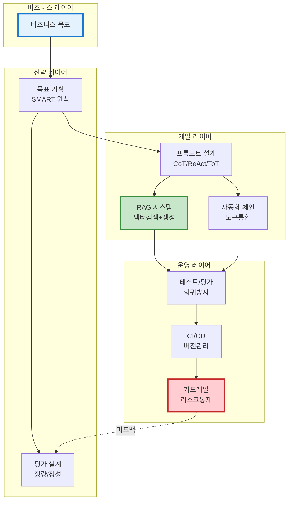

---

## 2. 핵심 개념 Top 20

### 2.1 프롬프트 엔지니어링 (Prompt Engineering)

**정의:** LLM에게 원하는 결과를 얻기 위한 입력 설계 기술  
**Why:** 같은 모델도 프롬프트에 따라 성능 300% 차이  
**핵심:** 시스템 메시지 + 컨텍스트 + 사용자 입력 + 출력 형식

### 2.2 Function Calling (함수 호출)

**정의:** LLM이 외부 도구/API를 호출하도록 하는 메커니즘  
**Why:** 실시간 데이터, 정확한 계산, 외부 시스템 연동 필요  
**핵심:** `@Tool` 어노테이션으로 Java 메서드를 LLM에 노출

### 2.3 RAG (Retrieval-Augmented Generation)

**정의:** 외부 지식베이스 검색 + LLM 생성 결합  
**Why:** 환각 방지, 최신 정보 반영, 도메인 특화 답변  
**ROI:** 정확도 60% → 90% 향상, 고객 만족도 35% 증가

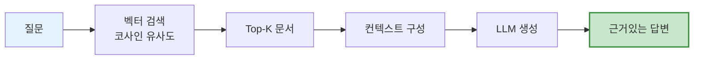

### 2.4 임베딩 (Embedding)

**정의:** 텍스트를 고차원 벡터(숫자 배열)로 변환  
**Why:** 의미 기반 검색 가능 (키워드 아닌 의미로 찾기)  
**모델:** OpenAI `text-embedding-ada-002` (1536차원) / `text-embedding-3-large` (3072차원)

### 2.5 벡터 DB (Vector Database)

**정의:** 임베딩 벡터를 저장하고 유사도 검색하는 DB  
**Why:** 전통적 DB는 의미 검색 불가  
**선택:** 개발(인메모리) → 프로덕션(pgvector/Pinecone/Qdrant)

### 2.6 청킹 (Chunking)

**정의:** 긴 문서를 작은 조각으로 분할  
**Why:** LLM 컨텍스트 한계(4K~200K 토큰), 검색 정확도  
**전략:** 고정길이(500토큰) / 의미기반 / 계층적

### 2.7 Hybrid Search

**정의:** BM25(키워드) + Vector Search(의미) 결합  
**Why:** "VPN-2024-v3.2" 같은 정확한 매칭 필요  
**기법:** RRF (Reciprocal Rank Fusion)

### 2.8 Re-ranking

**정의:** 초기 검색 결과를 더 정교한 모델로 재정렬  
**Why:** 속도/정확도 트레이드오프 해결  
**방법:** Cross-Encoder (질문+문서 함께 평가)

---

## 3. 고급 프롬프트 기법 4종

### 3.1 Chain-of-Thought (CoT)

**정의:** LLM이 단계별로 사고하도록 유도  
**적용:** "단계별로 생각해서 답하세요"  
**효과:** 수학/논리 문제 정확도 50%→87%

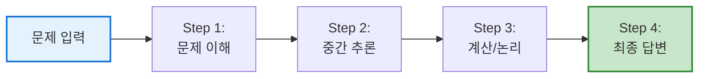

---

### 3.2 ReAct (Reasoning + Acting)

**정의:** 추론과 행동(도구 사용) 교차 반복  
**적용:** "Thought → Action → Observation → 반복"  
**효과:** 동적 정보 활용, 복잡한 작업 수행

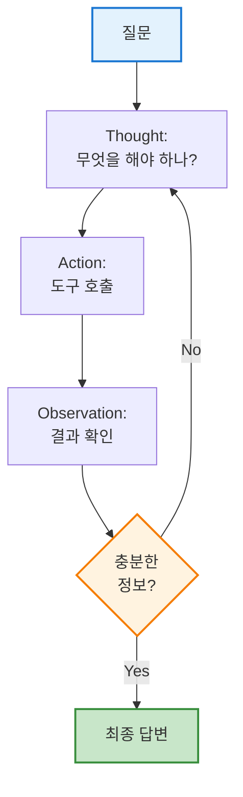

---

### 3.3 Tree-of-Thoughts (ToT)

**정의:** 여러 해결 경로 탐색 후 최적 선택  
**적용:** 창의적 문제, 다양한 관점 필요 시  
**비용:** LLM 호출 5-10배 증가 (신중히 사용)

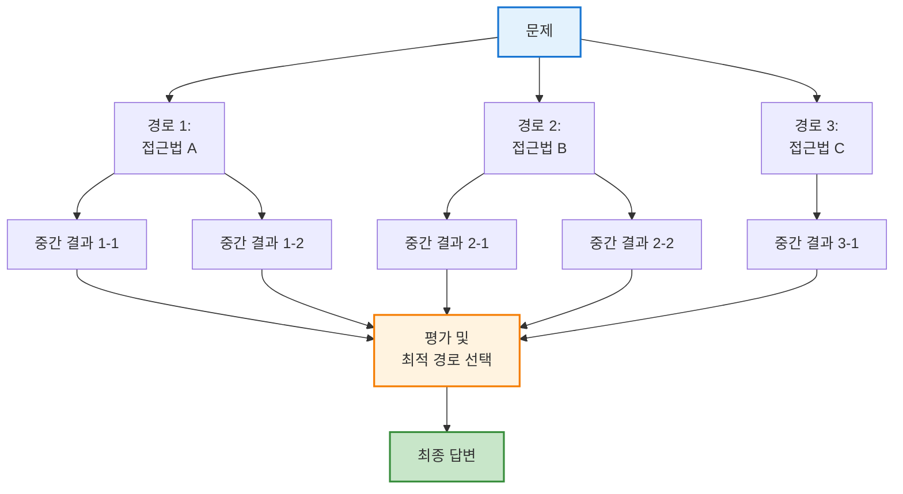

---

### 3.4 Reflexion (자기 성찰)

**정의:** LLM이 자신의 답변을 평가하고 개선  
**적용:** 고위험 결정, 정확성 최우선  
**프로세스:** 생성 → 자가평가 → 개선 (최대 3회)

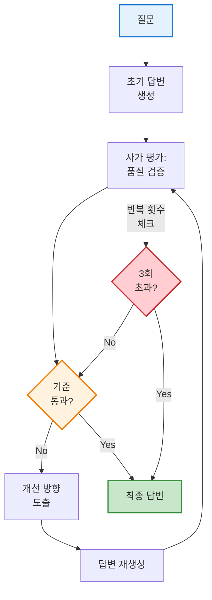

---

## 4. 프롬프트 체인 및 자동화

### 4.1 RunnableChain

**정의:** 여러 프롬프트 단계를 파이프라인으로 연결  
**Why:** 복잡한 작업을 모듈화, 재사용  
**설계 원칙:**

- 단일 책임 (각 단계 = 1개 기능)
- 명시적 인터페이스 (입출력 명확)
- 오류 처리 및 폴백

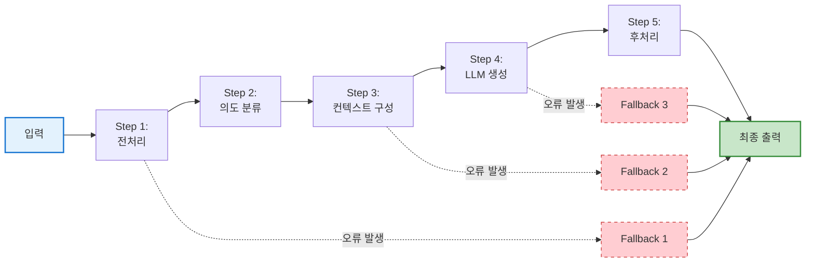

---

### 4.2 분기 (Branching)

**정의:** 입력/결과에 따라 다른 처리 경로 선택  
**유형:**

- 의도 기반 (문의/불만/칭찬)
- 데이터 소스 (사내DB vs API)
- 신뢰도 기반 (확신도 > 0.9 즉시 답변)

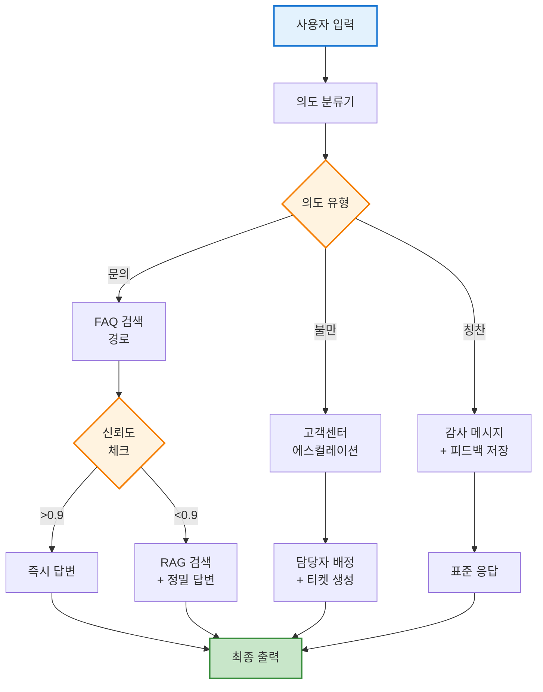

---

### 4.3 메모리 관리

**단기:** 최근 N개 메시지 (ChatMemory)  
**장기:** RAG + 벡터DB (사용자 선호도, 과거 이력)  
**전략:** 슬라이딩 윈도우 → 요약 → RAG 통합

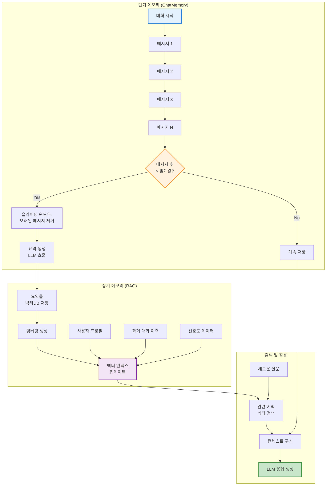

---

## 5. 테스트 및 평가

### 5.1 회귀 테스트 (Regression Test)

**정의:** 프롬프트 변경 시 기존 기능 검증  
**구성:** 50-100개 테스트 케이스 (Golden Set)  
**자동화:** CI/CD 통합, 통과율 < 95% 배포 차단

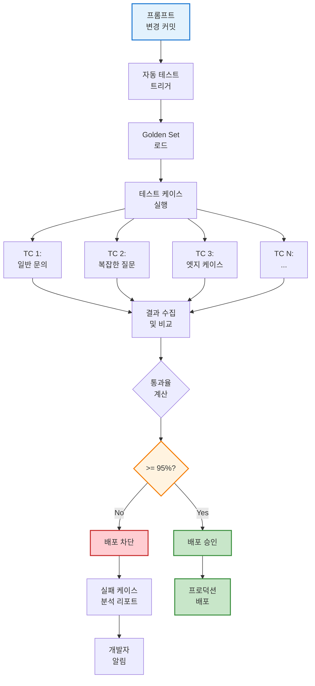

---

### 5.2 평가 지표

**정량 지표:**

- 정확도 (Accuracy): 정답 일치 비율
- Recall@K: Top-K에 정답 포함 비율
- MRR (Mean Reciprocal Rank): 정답 순위의 역수 평균

**정성 지표:**

- 사실성 (Factuality): 환각 없음
- 완전성 (Completeness): 모든 정보 포함
- 근거 충실도: 검색 문서 기반 답변

```mermaid
graph TB
    subgraph "정량 지표 (Quantitative)"
        A[LLM 응답] --> B[정확도<br/>Accuracy]
        A --> C[Recall@K]
        A --> D[MRR]
        
        B --> B1[정답 일치율<br/>85-95%]
        C --> C1[Top-3 정답 포함<br/>90-98%]
        D --> D1[평균 순위<br/>1.2-2.0]
    end
    
    subgraph "정성 지표 (Qualitative)"
        A --> E[사실성<br/>Factuality]
        A --> F[완전성<br/>Completeness]
        A --> G[근거 충실도<br/>Faithfulness]
        
        E --> E1[환각 없음<br/>98%+]
        F --> F1[정보 누락 없음<br/>90%+]
        G --> G1[검색 문서 기반<br/>95%+]
    end
    
    subgraph "종합 평가"
        B1 --> H[최종 점수<br/>산출]
        C1 --> H
        D1 --> H
        E1 --> H
        F1 --> H
        G1 --> H
        
        H --> I{임계값<br/>통과?}
        I -->|Yes| J[배포 가능]
        I -->|No| K[개선 필요]
    end
    
    style A fill:#e3f2fd,stroke:#1976d2,stroke-width:2px
    style I fill:#fff3e0,stroke:#f57c00,stroke-width:2px
    style J fill:#c8e6c9,stroke:#388e3c,stroke-width:2px
    style K fill:#ffcdd2,stroke:#c62828,stroke-width:2px
```

---

### 5.3 LLM-as-a-Judge

**정의:** 별도 LLM이 답변 품질 평가  
**장점:** 사람 평가 비용 1/100, 확장 가능  
**주의:** 평가 LLM도 환각 가능 (다중 검증 필요)

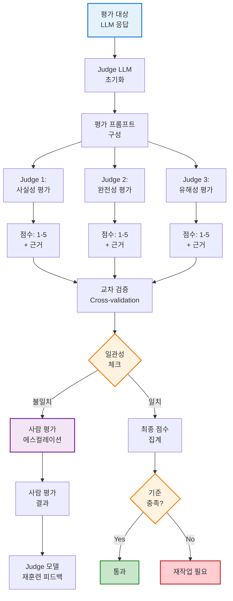
---

## 6. 리스크 및 가드레일

### 6.1 5대 LLM 리스크

1. **환각 (Hallucination)** → RAG로 해결
2. **프롬프트 인젝션** → 입력 검증
3. **편향/유해 발언** → 출력 필터
4. **도구 오남용** → 권한 제어
5. **PII 유출** → 마스킹 처리

### 6.2 가드레일 (Guardrails)

**정의:** 입력/출력을 검증하고 제어하는 안전장치  
**구조:**

```
사용자 입력
  ↓
[입력 가드레일] ← 인젝션/PII 차단
  ↓
LLM 처리
  ↓
[출력 가드레일] ← 환각/유해성 검증
  ↓
최종 응답
```

**OWASP LLM Top 10 (2025):**

1. Prompt Injection (최고 위험)
2. Sensitive Information Disclosure
3. Supply Chain Vulnerabilities

---

## 7. DevOps 및 운영 전략

### 7.1 프롬프트 버전 관리

```bash
prompts/
├── customer_service_v1.0.0.txt
├── customer_service_v1.1.0.txt  # 면책 문구 추가
└── customer_service_v2.0.0.txt  # RAG 통합
```

### 7.2 CI/CD 파이프라인

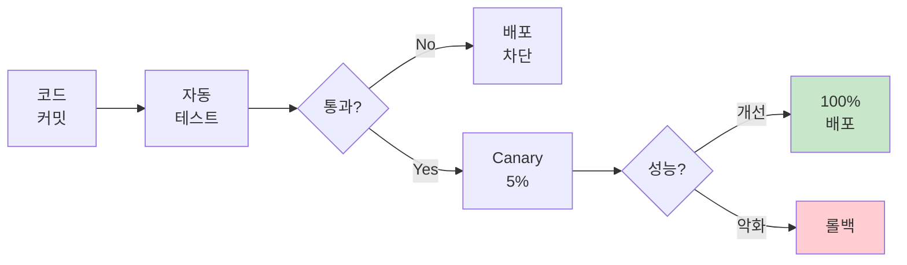

### 7.3 A/B 테스트

- 신규 프롬프트 10-50% 트래픽 할당
- 최소 N=1000 샘플 수집
- 통계적 유의성 검정 (p-value < 0.05)
- 승자 결정 → 100% 배포

---

## 8. 핵심 용어 치트시트

|용어|한 줄 설명|CTO가 알아야 할 이유|
|:--|:--|:--|
|**Temperature**|창의성 조절 (0=결정적, 1=창의적)|비용/품질 트레이드오프|
|**토큰**|LLM 처리 단위 (~0.75 단어)|비용 직결 (GPT-4: $0.03/1K 토큰)|
|**컨텍스트 윈도우**|모델이 한번에 처리 가능한 토큰 수|GPT-4: 128K, Claude: 200K|
|**Few-shot**|예시를 프롬프트에 포함|정확도 20-30% 향상|
|**Zero-shot**|예시 없이 작업 수행|범용성 높지만 정확도 낮음|
|**Streaming**|응답을 토큰 단위로 실시간 전송|UX 개선 (체감 속도 50% 빠름)|
|**HNSW**|고속 벡터 검색 알고리즘|검색 속도 10-100배 향상|
|**Cross-Encoder**|질문+문서 함께 평가|Re-ranking 정확도 15% 향상|
